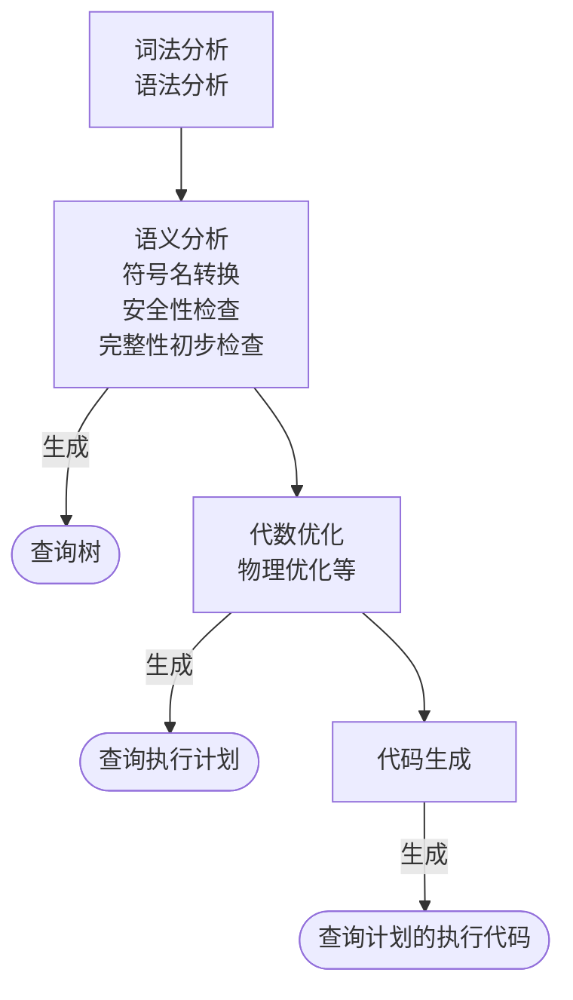

---
tags:
  - 数据库
---

# 查询处理和查询优化

查询是数据库管理系统中使用最频繁、最基本的操作，对系统性能有很大的影响。对于同一个 [[00-笔记/数据库/SQL|SQL]] 查询，通常有多个等价的关系代数表达式，由于存取路径不同，每个关系代数的查询代价和效率也是不同的。

> [!note] 查询处理是 RDBMS 执行查询语句的过程，其任务是把用户提交给 RDBMS 的查询语句转换为高效的查询执行计划。

## 关系数据库系统的查询处理

> [!note] 查询处理流程
> 1. 查询分析：对查询语句进行扫描，词法分析和语法分析，识别出语言符号、判断查询语句是否符合 SQL 语法规则。
> 2. 查询检查：根据数据字典中的内容，检查语句中的数据库对象是否存在且有效。将查询转换为关系代数语法树。
> 	- 如果是对视图的操作，则要用 [[00-笔记/数据库/SQL#视图上的操作|视图消解法]] 转换为对基本表的处理。
> 	- 对用户的存取权限进行检查。
> 	- 进行完整性约束检查。
> 3. 查询优化：选择一个高效执行的查询处理策略。查询优化器生成查询执行计划。
> 	- 代数优化：关系代数表达式的优化。
> 	- 物理优化：存取路径和底层操作算法的选择。可以基于规则、代价、语义等。
> 4. 查询执行：根据查询执行计划，代码生成器生成查询计划的代码，然后加以执行。

> [!note] 查询语句的实现
> 1. 解释方式：DBMS 不保留可执行代码，每一次都重新解释执行查询语句。事务完成后返回查询结果。
> 	- 特点：灵活、应变性强，但是开销大、效率低。主要适用于不重复使用的偶然查询。
> 2. 编译方式：先进行编译处理，生成可执行代码。运行时，直接执行可执行代码。当数据库中某些数据改变，再重新编译。
> 	- 特点：主要优点是执行效率高、系统开销小。

### 执行查询操作的基本算法

#### 选择操作

1. 顺序扫描法：按照关系中元组的物理顺序扫描每一个元组，检查该元组是否满足选择条件，如果满足则输出。
	- 优点：不需要特殊的存取路径，简单、有效，尤其适用于被选中的元组数占有较大比例或元组总数较少的关系。
	- 缺点：对于规模大的表进行顺序扫描，当选择率较低时，该算法的效率很低。
2. 二分查找法：如果选择条件涉及相等比较，并且物理文件时按照选择字段有序组织的，可以使用二分查找法来定位符合选择条件的元组。
	- 优点：非常快。
	- 缺点：需要关系按选择字段有序组织。
3. 索引扫描法：如果选择条件的属性上有索引，可以通过索引先找到满足条件的元组指针，然后通过该指针直接在查询的基本表上找到元组。
	- 优点：当选择率较低时，索引扫描法要优于顺序扫描法。
	- 缺点：但若选择率较高或者要查找的元组均匀的分布在基本表中，此时索引扫描法的性能就不如顺序扫描法。

> [!note] 索引扫描法——复合选择（逻辑合取）
> - 组合索引：如果合取条件中的相等条件包含两个或两个以上的属性，且在组合字段上存在组合索引，可以直接使用该组合索引
> - 单独索引：通过索引找到符合与该属性有关的查询条件的元组，再检查其余查询条件是否满足
> - 多个索引：分别检索满足单个条件的元组指针集，这些指针集的交集就是满足合取条件的元组指针

> [!note] 索引扫描法——复合选择（逻辑析取）
> 对于条件中涉及的属性都具有索引时，分别检索满足单个条件的元组指针集，这些指针集的并集就是满足析取条件的元组指针。
> - 只要任意一个条件涉及的属性没有索引，就只能使用其他方法

#### 连接操作

连接操作是查询处理中最耗时的操作之一，操作本身开销大，并且可能产生很大的中间结果。这里只讨论等值连接的实现。
1. 嵌套循环法：最简单、最直接的连接算法，与选择操作的顺序扫描法类似，不需要特别的存取路径。
	- 对外层循环的每一个元组，检索内层循环中的每一个元组。
	- 检查这两个元组在连接属性上是否相等，如果相等，则拼接或作为结果输出。
	- 循环执行，直到外层循环表中的元组处理完为止。
2. 索引嵌套循环法：在嵌套循环法中，如果两个连接属性中的一个属性上存在索引，可以使用索引扫描替代顺序扫描。
3. 排序合并法：若连接的诸表已经排好序，可以使用排序合并法。该算法使用双指针的思想，所有排序的表都只用扫描一次。
4. 散列连接法：把连接属性作为 hash 码，用同一个 hash 函数把两个表中的元组散列到 hash 表中。
	- 划分阶段/创建阶段：对包含较少元组的表（如 R 表）进行一遍散列处理。把它的元组按 hash 函数分散到 hash 表的桶中
	- 试探阶段/连接阶段：遍历另一个表 S，对每个元组，遍历其散列的 hash 桶中的元素。把这些 S 中的元组与桶中所有来自 R 并与之匹配的元组连接起来。

#### 投影操作

投影操作选取关系的某些列，从垂直的方向减小关系的大小。如果投影属性列包括了关系 R 的主键，操作的结果将与 R 中的元组个数相同且均不重复。否则，可能会出现重复元组，我们需要消除重复元组：
- 排序法：先对操作结果进行排序，对于重复的元组，只保留一个，去掉多余的副本。
- 散列法：把投影结果中的每条元组散列到相应的桶中，然后检查是否与该桶中已存在的元组重复。如果重复，则去掉这个元组，否则把该元组插入桶中。最终所有桶中的元组均为不重复的

#### 集合运算

并、差、交运算的实现常用方法类似排序合并法：
- 首先对参加运算的两个关系分别按照主键属性排序
- 排序后只需同时对两个关系执行一次扫描就可以生成计算结果

笛卡尔积通常使用嵌套循环法，操作代价非常高。

## 查询优化

> [!definition|查询优化] 对于相同的查询请求，存在着多种实现策略，系统执行这些策略的开销有很大区别。为了提高查询效率，在查询处理的过程中，必须从中选择相对高效的执行策略，这个选择的过程就是查询优化。

> [!note] 关系系统的查询优化的优点
> - 用户不必考虑如何最好的表达查询以获得较高的效率
> - 系统可以比用户程序的优化做的更好

查询优化极大地影响 RDBMS 的性能。关系数据语言的级别很高，使得 DBMS 可以从关系表达式中分析查询语义。RDBMS 通过某种代价模型计算出各种查询执行策略的执行代价，然后选择代价最小的执行方案。

> [!tip] 为什么系统可以比用户程序的优化做得更好？
> 1. 优化器可以从数据字典中获取许多统计信息，而用户程序则难以获得这些信息。
> 2. 如果数据库的物理统计信息改变了，系统可以对自动查询重新优化以选择相适应的执行计划。
> 3. 优化器可以考虑数百种不同的执行计划，而程序员一般只能考虑有限的几种可能性。
> 4. 优化器中包括了很多复杂的优化技术，这些优化技术往往只有最好的程序员才能掌握。

查询优化的总目标是**选择有效策略，求得给定关系表达式的值，使查询代价较小**。
- 代数优化：是关系代数表达式的优化。按照一定的规则，改变代数表达式中操作的次序和组合，是查询执行更高效。
- 物理优化：选择高效合理的操作算法或存取路径，求得优化的查询计划：
	- 基于存取路径的优化：基于启发式规则。
	- 基于代价估算的优化：对于多个可选的查询策略，估算执行代价。

> [!note] 开销
> - 集中式数据库：
> 	- 磁盘存取数：IO 代价，在集中式数据库中是最主要的
> 	- 处理机时间：CPU 代价
> 	- 查询的内存开销
> - 分布式数据库：总代价=IO 代价 +CPU 代价 + 内存代价 + 通信代价

## 代数优化

> [!definition|代数优化] 通过对关系代数表达式的等价变换提高查询效率。

> [!note] 表达式等价
关系代数表达式等价是指：用相同的关系代替两个表达式中相应的关系所得到的结果是相同的。若两个关系表达式 $E_1$ 和 $E_2$ 是等价的，可记为 $E_1≡E_2$。

### 关系代数的等价变换规则

1. 连接、笛卡尔积交换律：$E_{1}\times E_{2}=E_{2}\times E_{1},E_{1}\bowtie E_{2}=E_{2}\bowtie E_{1}$
2. 连接、笛卡尔积结合律：$(E_{1}\times E_{2})\times E_{3}=E_{1}\times(E_{2}\times E_{3}),(E_{1}\bowtie E_{2})\bowtie E_{3}=E_{1}\bowtie (E_{2}\bowtie E_{3})$
3. 投影的串接定律：$A\subseteq B\implies \prod\limits_{A}\left( \prod\limits_{B}(E) \right)=\prod\limits_{A}(E)$
	- 对同一个关系代数表达式的多个投影可以转换成其中最小的属性集的投影
4. 选择的串接定律：$\sigma_{F_{1}}(\sigma_{F_{2}}(E))=\sigma_{F_{1}\wedge F_{2}}(E)$
	- 选择条件可以合并，一次选择可以检查所有条件
5. 选择与投影的交换律：
	- 选择条件 $F$ 中只涉及属性 $A_{1},A_{2},\cdots,A_{n}$ 时：$\sigma_{F}\left( \prod\limits_{A_{1},A_{2},\cdots,A_{n}}(E) \right)=\prod\limits_{A_{1},A_{2},\cdots,A_{n}}(\sigma_{F}(E))$
	- 选择条件 $F$ 中涉及其他属性 $B_{1},B_{2},\cdots,B_{n}$ 时：$\prod\limits_{A_{1},A_{2},\cdots,A_{n}}(\sigma_{F}(E))=\prod\limits_{A_{1},A_{2},\cdots,A_{n}}\left( \sigma_{F}\left( \prod\limits_{A_{1},A_{2},\cdots,A_{n},B_{1},B_{2},\cdots,B_{n}}(E) \right) \right)$
	- 投影操作后的选择操作可以转换为选择操作后的投影操作
6. 选择与笛卡尔积的交换律：根据 F 可以将笛卡尔积放在选择操作的外面
7. 选择与并运算的分配律
8. 选择与差运算的分配律
9. 选择对自然连接的分配律
10. 投影与笛卡尔积的分配律
11. 投影与并的分配律

### 代数优化策略

1. 在关系代数表达式中尽可能早地执行**选择**操作。
	- 目的：减小中间关系。在优化策略中这是最重要、最基础的一条。
2. 投影运算和选择运算同时进行。
	- 目的：减少重复扫描关系。若有若干投影和选择运算，并且它们都对同一个关系操作，则可以在扫描此关系的同时完成所有的这些运算。
3. 将投影运算与其前面或后面的双目运算结合。
	- 目的：减少扫描关系的遍数。
4. 把某些选择同在它前面要执行的笛卡尔积结合起来成为一个连接运算。
5. 找出公共子表达式
   - 如果这种重复出现的子表达式的结果不是很大的关系并且从外存中读入这个关系比计算该子表达式的时间少得多，则先计算一次公共子表达式并把结果写入中间文件。
   - 定义视图的表达式就是公共子表达式的情况。

遵循这些启发式规则，应用关系代数等价变换公式来优化关系表达式的算法：

> [!definition|Algorithm] 关系表达式的优化
> - 输入：一个关系表达式的查询树
> - 输出：优化的查询树
> - 方法：
>   1. 利用等价变换规则 4 把形如 $\sigma_{F_1\wedge F_2\dots\wedge F_n}(E)$ 变换为 $\sigma_{F_1}(\sigma_{F_2}(\dots(\sigma_{F_n}(E))\dots))$
>   2. 对每一个选择，利用等价变换规则 4~9 尽可能把它移到树的顶端
>   3. 对每一个投影利用等价变换规则 3，5，10，11 中的一般形式尽可能把它移向树的叶端
> 注：规则 3 使一些投影消失，规则 5 把一个投影分裂成两个，其中一个可能被移向树的叶端
>   4. 利用等价变换规则 3~5 把选择和投影的串接合并称单个选择，单个投影或一个选择后跟一个投影。使多个选择或投影能同时执行，或在一次扫描中全部完成
>   5. 把上述得到的语法树的内节点分组。每一双目运算和它所有的直接祖先为一组
> 如果其后代直到叶子全是单目运算，则也将他们并入该组
> 当双目运算是笛卡尔积，而且后面不是与它组成等值连接的选择时，则不能把选择与这个双目运算组成同一组，而是单独分为一组。

### 物理优化

物理优化就是要选择高效合理的操作算法或存取路径，求得优化的查询计划。

#### 基于存取路径的优化

基于启发式规则，合理选择各种操作的存取路径，考虑数据的物理组织和访问路径、底层的操作算法设计数据文件的组织方式、数据值的分布情况。
1. **选择操作**的启发式规则：
   - 小关系：使用全表顺序扫描 (即使选择列上有索引)。
   - 大关系：
	1. 对于选择条件是“主键=值”的查询，查询结果最多是一个元组，可以选择主键索引。
	2. 对于选择条件是“非主属性=值”的查询，并且选择列上有索引。
		- 估算查询结果的元组数目，如果比例较小 (<10%) 使用索引扫描法。否则，使用全表顺序扫描。
	3. 对于选择条件是属性上的非等值查询或者范围查询,并且选择列上有索引，与 (2) 类似
	4. 用 AND 连接的合取选择条件：
		- 如果有涉及这些属性的组合索引：优先采用组合索引扫描方法；
		- 如果某些属性上有一般的索引：则可以使用相应的索引扫描方法
		- 否则使用全表顺序扫描
	5. 用 OR 连接的析取选择条件，一般使用全表顺序扫描
2. **连接操作**的启发式规则：
	1. 如果两个表都已经按照连接属性排序，选用排序合并法。
	2. 如果一个表在连接属性上有索引，选用索引嵌套循环法。
	3. 如果上面两个规则都不适用，其中一个表较小，使用散列链接法。
	4. 否则，使用循环嵌法，并选择占用存储块数较少的表作为外层循环表。

---
< [[00-笔记/数据库/SQL|SQL]] | [[00-笔记/数据库/数据库的安全性|数据库的安全性]] >
