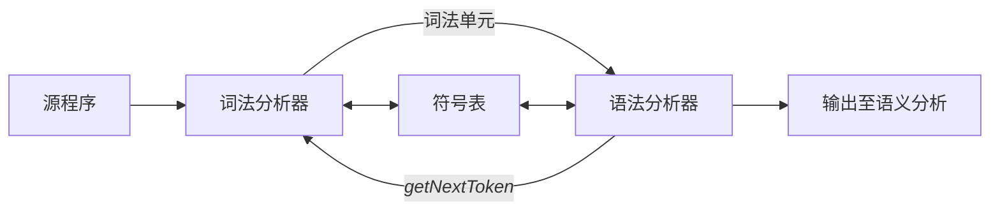

---
tags:
  - 编译原理
---

# 词法分析

词法分析是编译的第一阶段。词法分析器的主要任务是读入源程序的输入字符、将他们组成词素，生成并输出一个词法单元序列，其中每个词法单元对应一个词素。

词法分析器通常要和符号表进行交互，当词法分析器发现了一个标识符的词素时，它要将这个词素添加到符号表中。在某些情况下，词法分析器会从符号表中读取有关标识符的种类信息，以确定向语法分析器中传输哪些单元。

词法分析器与语法分析器的交互过程如下：


词法分析器在编译器中负责读取源程序，因此它还会完成一些额外的任务，包括：
- 过滤掉源程序中的注释和空白 (空格、换行符、制表符以及用于分隔词法单元的其他字符)
- 将编译器生成的错误消息和源程序的位置联系起来
- 宏处理

有时，词法分析器可以分为两个级联的处理阶段：
1. *扫描阶段*主要负责完成一些不需要生成词法单元的简单处理，例如删除注释、将多个连续的空白字符压缩成一个字符
2. *词法分析阶段*是较为复杂的部分，它处理扫描阶段的输出并生成词法单元

## 词法单元、模型和词素

在讨论词法分析时，我们使用三个相关但是有区别的术语：
- *词法单元*由一个词法单元名和一个可选的属性值组成。
	- 词法单元名是一个表示某种词法单位的抽象符号，例如字符序列
- *模式*描述了一个词法单元的词素可能的形式。
	- 当词法是一个关键词时，它的模式就是组成这个关键词的字符序列。对于标识符和其他词法单元，模式是一个更加复杂的结果。
- *词素*是源程序中的一个字符序列，它和某个词法单元的模式匹配，并被词法分析器识别为该词法单元的一个实例。

在程序设计语言中，词法单元一般为：
1. 每个关键词有一个词法单元。一个关键词的模式是该关键词本身
2. 表示运算符的词法单元。可以表示单个运算符，也可以表示一类运算符
3. 一个表示所有标识符的词法单元
4. 一个或者多个表示常量的词法单元。如数字、字面值字符串。
5. 每一个标点符号有一个词法单元。如左右括号、逗号。

### 词法单元的属性

如果多个词素可以和一个模式匹配，那么词法分析器必须向编译器的后续阶段提供有关被匹配词素的附件信息。下面使用两个例子说明：
- 1 和 0 都可以被词法单元**number**匹配，但是对于代码生成器而言，重要的他们的值，即返回的词法单元应该包含值，例如返回\<number, 1\>和\<number, 0\>。
- 对于词法单元 **id** 来说，我们通常会有很多的信息与之关联，这个时候和该标识符的很多信息都会保存在符号表中。此时，该标识符的属性值是一个指向符号表中该标识符对应条目的指针。

## 输入缓冲

在讨论如何识别输入流中的词素之前，我们需要首先讨论几种可以加快源程序读入速度的方法。源程序读入虽然简单，但是很重要。由于我们常常需要查看一个词素之后的若干字符，才能确定是否找到正确的词素，因此这个任务变得有些困难。

这里简单描述了输入缓冲算法的过程。

```cpp
Word nextWord(Buffer buf){
	// lexemeBegin 指向当前词素的开始处，我们正在寻找该词素的结尾
	// forward 指针指向正在判断的字符
	static int forward = 0, lexemeBegin = 0;
	while(true){
		if(check(buf[forward]) == true){
			break;
		}

		forward++;
		if(forward >= buf.size()){
			// 缓冲区遍历完毕，读入新的数据(切换缓冲区)
			buf.read(buf.size() - lexemeBegin);
			lexemeBegin = 0;
			forward = 0;
		}
	}
	return Word(buf.sub(lexemeBegin, forward - lexemeBegin));
}
```

在上面的算法中，每一次移动都需要检查是否到达缓冲区的末尾，若是，就必须加载另一个缓冲区。因此，每读入一个字符，我们都需要进行两次测试，一次是是否到达缓冲区末尾，一次是读入的字符是什么。如果我们拓展缓冲区，在缓冲区的末尾增加一个哨兵元素，那么就可以将这两个判断合二为一。

```cpp
Word nextWord(Buffer buf){
	// lexemeBegin 指向当前词素的开始处，我们正在寻找该词素的结尾
	// forward 指针指向正在判断的字符
	static int forward = 0, lexemeBegin = 0;
	while(true){
		switch(check(buf[forward])){
			case END_OF_WORD: goto RETURN;
			case END_OF_BUF: {
				// 缓冲区遍历完毕，读入新的数据(切换缓冲区)
				buf.read(buf.size() - lexemeBegin);
				lexemeBegin = 0;
				forward = 0;
			}
		} // switch
		forward++;
	}
	return Word(buf.sub(lexemeBegin, forward - lexemeBegin));
}
```

## 词法单元的归约

正则表达式是一种用来描述词素模式的重要表示方法。虽然正则表达式不能表示出所有可能的模式，但是他们可以高效地描述在处理词法单元时需要用到的模式类型。

### 串和语言

*字母表 (alphabet)* 是一个有限的符号集合。符号可以是字符、数位和标点符号等等。这里有一些现实中的例子：
- 集合\{0,1\}称为二进制字母表。
- ASCII 是字母表的一个重要例子。
- Unicode 包含了大约 100000 个来自世界各地的字符。

某个字母表上的一个*串 (string)* 是该字母表中符号的一个有穷序列。串 s 的长度通常记为|s|，指 s 中符号出现的次数。例如，banana 是一个长度为 6 的串。*空串 (empty string)* 是长度为 0 的串，使用 $\in$ 表示。

*语言 (language)* 是某个给定字母表上一个任意的可数的串的集合。根据这个定义，下面的也是语言：
- 空集、只包含空串的集合
- 所有语法正确的 C 程序的集合
- 所有语法正确的英语句子的集合

> 这里是一个与串相关的常用术语：
> 1. 串 s 的前缀 (prefix) 是从 s 的尾部删除 0 个或者多个符号得到的串。
> 2. 串 s 的后缀 (suffix) 是从 s 的开始删除 0 个或者多个符号得到的串。
> 3. 串 s 的子串 (substring) 是删除 s 的某个前缀和某个后缀得到的串。
> 4. 串 s 的真 (true) 前缀、真后缀、真子串分别是 s 的既不等于 $\in$ 也不等于 s 本身的前缀、后缀、子串。
> 5. 串 s 的子序列 (subsequence) 是从 s 中删除 0 个或者多个符合后得到的串。

如果 x 和 y 是串，那么 x 和 y 的连接 (concatenation) xy 是把 y 附加到 x 后面而形成的串。如果把串的连接视为串的“乘积”，那么我们可以定义串的“指数”运算为：
$$
s^1=s,\, s^2=ss,\,s^3=sss
$$

### 语言上的运算

在词法分析中，最重要的语言上的运算是并、连接和闭包运算。下面给出了这几种运算的定义：
- 并：$L\cup M=\{s|s\in L \vee s\in M\}$
- 连接：$LM=\{st|s\in L \wedge t\in M\}$
- Kleene 闭包：$L^*=\bigcup_{i=0}^\infty L^i$
- 正闭包：$L^+=\bigcup_{i=1}^\infty L^i$

### 正则表达式

在处理标识符时，我们可以通过事先给出字母和数位集合的名字，然后使用并、连接和闭包这些运算符来描述标识符。这种处理方式非常有用。

人类常使用一种称为正则表达式的表示方式来描述语言。正则表达式可以描述所有通过对某个字母表上的符号应用这些运算符而得到的语言。在这种表示法中，如果使用 letter_ 来表示任意字母或者下划线，使用 digit_ 来表示数位，那么可以使用下面的正则表达式来描述对应于 C 语言标识符的语言：
<center>letter_ (letter_ | digit)*</center>

上面的竖线表示并运算，括号用于把子表达式组合在一起，星号表示零个或者多个括号中的表达式连接。

正则表达式可以由较小的正则表达式按照如下规则递归的构建：
1. $\in$ 是一个正则表达式，$L(\in)=\{\in\}$，即该语言只包含空串
2. 如果 a 是 $\Sigma$ 上的一个符号，那么 **a** 是一个正则表达式，并且 $L(\mathbf{a})=\{a\}$。也就是说，这个语言仅包含一个长度为 1 的符号串 a。

由小的正则表达式构建较大的正则表达式的步骤有四个部分。假设 r 和 s 都是正则表达式，分别表示语言 $L(r)$ 和 $L(s)$，那么：
1. $(r)|(s)$ 是一个正则表达式，表示语言 $L(r)\cup L(s)$
2. $(r)(s)$ 是一个正则表达式，表示语言 $L(r)L(s)$
3. $(r)^*$ 是一个正则表达式，表示语言 $\left(L(r)\right)^*$
4. $(r)$ 是一个正则表达式，表示语言 $L(r)$

按照上面的定义，正则表达式通常会包含一些不必要的括号。我们采用如下约定：
1. 一元运算符\* 具有最高的优先级，并且是左结合的
2. 连接具有次高的优先级，它也是左结合的
3. |的优先级最低，并且也是左结合的

可以用一个正则表达式定义的语言叫做*正则集合 (regular set)*。如果两个正则表达式 $r$ 和 $s$ 表示同样的语言，则称 $r$ 和 $s$ *等价 (equivalent)*，记为 $r=s$。正则表达式遵守一些代数定律，每个定律都断言两个不同形式的表达式等价。下面给出对于任意 $r$、$s$ 和 $t$ 都成立的代数定律。

|                         定律                         | 描述                 |
| :------------------------------------------------: | ------------------ |
|                $r\vert s=s \vert r$                | \|是可以交换的           |
|       $r\vert (s\vert t)=(r\vert s)\vert t$        | \|是可结合的            |
|                   $r(st)=(rs)t$                    | 连接是可结合的            |
| $r(s\vert t)=rs\vert rt\,\,(s\vert t)r=sr\vert tr$ | 连接对\|是可分配的         |
|              $\epsilon r=r\epsilon=r$              | $\epsilon$ 是连接的单位元 |
|             $r^*=(r\vert \epsilon)^*$              | 闭包中一定包含 $\epsilon$ |
|                    $r^{**}=r^*$                    | 闭包的幂等性             |

### 正则定义

为了方便表示，我们对一些正则表达式命名，并在之后的正则表达式中像使用符号一样使用它们。如果 $\Sigma$ 是基本符号的集合，那么一个正则定义 (regular definition) 是具有如下形式的定义序列：
$$
\begin{aligned}
d_1&\to r_1\\
d_2&\to r_2\\
&\vdots\\
d_n&\to r_n
\end{aligned}
$$
其中
- 每个 $d_i$ 都是一个新符号，它们都不在 $\Sigma$ 中，并且各不相同
- 每个 $r_i$ 都是字母表 $\Sigma\cup \{d_1,d_2,\cdots,d_i-1\}$ 上的正则表达式

我们约定下面的正则定义：
- $letter\_\to A\vert B\vert\cdots\vert Z\vert a\vert\cdots\vert z\vert \_$
- $digit\to 0\vert 1\vert\cdots\vert 9$
- $id\to letter\_ (letter\_ \vert digit)^*$
- $digits\to digits^+$
- $optionalFraction\to .\,digits \vert \epsilon$
- $optionalExponent\to \left(E(+\vert -\vert \epsilon)digits\right)\vert \epsilon$
- $number\to digits\,optionalFraction\,optionalExponent$

在上面的定义中，optionalFraction 要么是空串，要么是小数点后跟一个或者多个数位。optionalExponent 如果不是空串，就是字母 E 后跟随一个可选的正负号，再跟上一个或者多个数位。optionalFraction 后至少有一个数位，因此 number 不匹配 1.，但是和 1.0 匹配。

### 正则表达式扩展

下面介绍几个正则表达式语法的拓展，这些语法在很多的程序中被使用：
1. 一个或者多个实例：$r^+$
2. 另个或者一个实例：$r?$
3. 字符类：$a_1\vert a_2\vert\cdots\vert a_n$ 可以缩写为 $[a_1a_2\cdots a_n]$，当 $a_i$ 形成连续的序列时，可以使用 $a_1-a_n$ 表示。

## 词法单元的识别

之前介绍了如何使用正则表达式来表示一个模式。现在，我们必须学习如何根据各个需要识别的词法单元模型来构造出一段代码。这段代码可以检查输入字符串，并在输入的前缀中找出一个和某个模式匹配的词素。

后面将基于下面这个具体的例子来进行讨论。对于一个分支语法，即：
```pascal
stmt:
	if expr then stmt
	if expr then stmt else stmt
	epsilon
expr:
	term relop term
	term
term:
	id
	number
```
我们可以使用正则表达式来描述其中的模式，即
- $digit$ -> $[0-9]$
- $digits$ -> $digit^+$
- $number$ -> $digits(.digits)?(E[+-]?digits)?$
- $letter$ -> $[A-Za-z]$
- $id$ -> $letter(letter|digit)^*$
- $if$ -> $if$
- $then$ -> $then$
- $else$ -> $else$
- $relop$ -> $<|>|<=|>=|=|<>$
- $ws$ -> $(blank|tab|newline)^+$

### 状态转换图

作为构造词法分析器的一个中间步骤，我们首先将模式转换为具有特定风格的流图，称为**状态转换图**。我们首先需要理解如何手工将正则表达式转换为状态转换图，然后我们可以通过自动化的方式从一个正则表达式的集合中构造出状态转换图。

状态转换图 (transition diagram) 有一组被称为状态的节点或者圆圈。状态转换图具有以下性质：
- 状态图中的边从图的一个状态指向另一个状态。每条边的标号包含了一个或多个符号。如果我们处于状态 s，并且下一个输入符号是 a，我们就会寻找一条从 s 离开并且标号为 a 的边。如果找到了边，则当前状态转变，并将 forward 指针前移一位。
	- 我们假设所有的状态转换都是确定的，这意味这对于任何一个给定状态和任何一个给定符号，最多只有一条从该状态离开的边的标号包含该符号。
- 为了使词法分析器的设计更加容易完成，我们在后续将会放松对确定性的要求，同时提高对实现者的技巧要求。我们现在对状态转换图进行如下约定：
	1. 某些状态称为*接受状态*或*最终状态*。这些状态代表已经找到一个词素，我们使用*双层的圈*来表示一个接受状态。在该状态中，词法分析器进行的动作一般是向语法分析器返回一个词法单元和相关属性值。
	2. 如果需要将 forward 指针回退一个位置，我们将在该接受状态的附近加上一个。一般我们不需要将 forward 指针回退多个位置，但是万一出现这种情况，我们可以在接受状态出附加相应数目的。
	3. 有且只有一个状态被指定为*开始状态*，也称为*初始状态*。该状态由一条没有出发节点、标号为*start*的边指明。在读入任何符号之前，状态转换图总是位于它的开始状态。

例如，在我们前面的例子中，relop 的状态转换图表示如下：
![[Assets/Pasted image 20240322150319.png]]

### 保留字和标识符的识别

识别关键词及标识符时有一个问题需要解决。通常，像 if 或者 then 这样的关键词是被保留的，因此他们不能作为标识符使用。我们通常使用下面这样的状态转换图来表示它们之间的区别。
![[Assets/Pasted image 20240322150343.png]]

我们有两种方式来处理哪些看起来像标识符的保留字：
1. 初始化时就将各个保留字填入符号表中。符号标条目中的某个字段会指明这些串并不是普通的标识符，并指出它们所代表的语法单元。上面的图就是这样做的，当我们找到一个标识符时，如果该标识符尚未出现在符号表中，就会调用 `installID` 将此标识符放入符号标中，并返回一个指针。函数 `getToken` 查看对应于刚找到的词素的符号表条目，并根据符号表中的信息返回该词素所代表的词法单元名，要么是 id，要么是在初始化时就被加入符号标中的关键词法单元。
2. 为每个关键词建立单独的状态转换图。下面是关键词 then 的一个例子：
	```mermaid
	flowchart LR
	start-->A(( ))-->|t|B(( ))-->|h|C(( ))-->|e|D(( ))-->|n|E(( ))-->|nonlet/dig|F(((*)))
	```
	上图的最后一步是“非字母或数字”的测试，也就是检查后面是否为某个不可能称为标识符一部分的字符。有必要检查该标识符是否结束，否则在碰到词素像 thenextvalue 这样以 then 为前缀的 id 词法单元时，我们可能会错误的返回 then。

### 完整的例子

下面我们将完成一个完整的状态转换图。前面我们已经完成了简单的 relop 与 id 的状态转换图。下面是 number 的状态转换图，这是我们迄今为止看到最复杂的一个状态转换图：
![[Assets/Pasted image 20240322150413.png]]
- 从状态 12 开始，如果我们看到一个数位，那么转入状态 13
- 在状态 13，我们可以读入任意数量的其他数位。当我们读入的不是小数点、E 或者其他数字时，说明读到了一个整数形式的数字，如 123。这种情况下，我们在状态 20 返回词法单元 number 及一个指向常量的指针。
- 后续处理类似。

最后一个状态转换图如下所示，用于识别空白符。
![[Assets/Pasted image 20240322150738.png]]
- 在该图中，我们寻找一个或者多个空白字符，在图中使用 delim 表示。典型的空白字符包括空格、制表符、换行符和一些不可能出现在任何词法单元的字符。
- 我们在状态 24 时不向语法分析器返回任何词法单元，而是重启词法分析过程。

### 基于状态转换图的词法分析器的体系结构

有几种方法可以根据一组状态转换图构造出一个词法分析器。不管整体策略是什么，每个状态总是对应一段代码。我们可以想象有一个变量 state 保存了一个状态转换图的当前状态的编号。有一个 switch 语句根据 state 的值将我们转到对应于各个可能状态的相应代码段，我们可以在那里找到该状态需要执行的动作。一个状态的代码本身常常也是一条 switch 语句或者多路分支语句。这个语句读入并检查下一个输入字符，由此确定下一个状态。

这里有几种将一个由 switch 语句实现的状态转换图应用到整个词法分析器中的方法：
1. 让词法分析器顺序的尝试各个词法单元的状态转换图，然后每次调用 `fail()` 方法时，重置 `forward` 指针，尝试下一个状态转换图，直到找到正确的状态转换图。
2. 并行的允许各个装换图，将下一个输入字符提供给所有的状态转换图，使得每个转换图做出应该执行的转换。但是需要特别注意一个转换图已经找到了相应的词素，但是其他转换图还在处理输入的情况。
3. 将所有的状态转换图合并为一个图，允许合并后的状态转换图尽量读取输入，直到不存在下一状态为止。

## 词法生成工具 Lex

在本节中，我们介绍一个名为 Lex 的工具。在最近的实现为 Flex。它支持使用正则表达式来描述各个词法单元的模式，由此给出一个词法分析器的归约。Lex 工具的输入表示方法称为 Lex 语言，而本身称为 Lex 编译器 (Lex compiler)。在这个工具的核心部分，Lex 编译器将输入的模式转换成了一个状态转换图，并生成相应的实现代码，并存放到文件 `lex.yy.c` 中，这些代码模拟了状态转换图。

### Lex 的使用

1. 使用 lex 语言写一个输入文件，描述要生成的词法分析器，这里以 `lex.1` 为例。
2. Lex 编译器将 `lex.1` 转换成 C 语言程序，存放在 `lex.yy.c` 中。
3. 使用 C 编译器，将 `lex.yy.c` 编译为可执行文件，例如输出为 `a.out`
4. 编译后的 C 程序，通常是一个被语法分析器调用的子例程，这个子例程返回一个整数值，代表可能出现的某个词法单元名的编码。而词法单元的属性值，不管它是一个数字编码，还是一个指向符号表的指针，或者什么都没有，都保存在全局变量 `yylval` 中。这个变量由词法分析器与语法分析器共享，这样做可以同时返回一个词法单元名字和一个属性值。

### Lex 程序的结构

一个 Lex 程序具有如下形式：
```lex
声明部分
%%
转换规则
%%
辅助函数
```
- 声明部分：包括*变量*和*明示常量* (manifest constant, 被声明的表示一个常数的标识符，如一个词法单元的名字) 的声明以及正则定义。
- 转换规则：Lex 程序的每个转换规则具有如下形式：
	<center>模式{动作}</center>
	其中，每个模式是一个正则表达式，它可以使用声明部分中给出的正则定义。动作部分是代码片段。
- 辅助函数： Lex 程序的第三部分包含各个动作需要使用的所有辅助函数，还有一种方法是将这些函数单独编译，并与词法分析器的代码一起装载。

接下来是一个具体的例子，我们将之前正则表达式转换为 Lex 程序代码，如下所示：
```flex
%{
	/* defintions of manifest constants
	LT, LE, EQ, NE, GT, GE,
	IF, THEN, ELSE, ID, NUMBER, RELOP */
}%

/* regular definitions */
delim    [\t\n]
ws       {delim}+
letter   [A-Za-z]
digit    [0-9]
id       {letter}({letter}|{digit})*
number   {digit}+(\.{digit}+)?(E[+-]?{digit}+)?

%%

{ws}     {/* no action and no return */}
if       {return(IF);}
then     {return(THEN);}
else     {return(ELSE);}
{id}     {yylval = (int) installID(); return(ID);}
{number} {yylval = (int) installNum(); return(NUMBER);}
"<"      {yylval = LT; return(RELOP);}
"<="     {yylval = LE; return(RELOP);}
"="      {yylval = EQ; return(RELOP);}
"<>"     {yylval = NE; return(RELOP);}
">"      {yylval = GT; return(RELOP);}
">="      {yylval = GE; return(RELOP);}

%%

int installID() {
	/* function to install the lexeme, whose
	first character is pointed to by yytext,
	and whose length is yyleng, into the
	symbol table and return a pointer thereto */
}

int installNum() {
	/* similar to installID, but puts numberical
	constants into a separate table */
}
```

下面是对上面代码的解释：
1. 声明部分的特殊括号 `%{}%`。出现在括号中的内容将被直接复制到文件 ` lex.yy.c ` 中，它们不会被正则定义处理。我们一般将常量定义在括号中，然后利用 C 语言的 ` #define ` 语言来定义一个唯一的整数编码。
2. 在声明部分还包含了一个正则定义的序列。这里的定义使用了正则定义的扩展语法。此外，在后面需要使用到前面定义的内容时，需要使用花括号括起来。
3. 如果我们想使用 lex 中某个元符号本身 (例如括号、+、-、\* 或者?)，我们可以使用转移字符，在这些符号的前面加上反斜杠。
4. 在辅助函数部分，我们可以看到 `installID()` 函数与 `installNum()` 函数。与位于 `%{}%` 中的内容一样，所有出现在辅助函数部分的内容将被直接复制到文件 `lex.yy.c` 中。
6. 如果存在冲突的多个模式，那么 Lex 总是优先选择最长的匹配。如果最长匹配与多个模式匹配，则优先选择最先被列出的模式。
5. 在上面的例子中，当 id 被匹配时，相应的处理动作分为三步：
	1. 调用函数 `installID()` 将找到的词素放入符号表中。
	2. 该函数返回一个指向符号表的指针。这个指针将被放到全局变量 `yylval` 中，并可以被语法分析器或者编码器的某个后续组件使用。需要注意，函数 `installID()` 可以使用以下两个被 Lex 生成的、由词法分析器自动赋值的变量：
		- `yytext` 是一个指向词素开头的指针
		- `yyleng` 存放刚找到的词素的长度
	3. 将词法单元名 ID 返回语法分析器

### 向前看运算符

Lex 自动地向前读入一个字符，它会读取形成被选词素的全部字符之后的那个字符，然后在回退输入，使得只有词素本身从输入中消耗掉。

但有些时候，我们希望仅当词素的后面跟随特定的其他字符时，这个词素才能和某个特定的模式匹配。在这种情况下，我们可以在模式中使用斜线来指明模式中和词素实际匹配的部分的结尾。例如，`IF/\(.*\){letter}` 匹配 `IF(condition)THEN` 但是不匹配 `IF(i, j)=3`。

## 有穷自动机

现在我们可以开始了解 Lex 是如何将输入程序变成一个词法分析器的。现在的转换核心是被称为有穷自动机 (fine automata) 的表示方式。这些自动机在本质上是与状态转换类似的图，但是有几点不同：
1. 有穷自动机是识别机 (recognizer)，它们只能对每个可能的输入串简单的回答是或否。
2. 有穷自动机分为两类：
	- 不确定的有穷自动机，NFA，对其边上的标号没有任何限制。一个符号标记离开同一状态的多条边，并且空串 $\epsilon$ 也可以作为标号。
	- 确定的有穷自动机，DFA，对于每个状态及自动机输入字母表中每个符号，有且只有一条离开该状态、以该符号为标号的边。

确定的和不确定的有穷自动机能识别的语言的集合是相同的。事实上，这些语言的集合正好是能够用正则表达式描述的语言的集合。这个集合中的语言被称为正则语言。

### 不确定的有穷自动机 (NFA)

一个**不确定的有穷自动机** (NFA) 由以下部分组成：
1. 一个有穷的状态集合 $S$
2. 一个输入符号集合 $\Sigma$，即输入字母表。我们假设代表空串的 $\epsilon$ 不是 $\Sigma$ 中的元素。
3. 一个转换函数，它为每个状态和 $\Sigma\cup\{\epsilon\}$ 中的每个符号都给出了相应的后继状态的集合。
4. $S$ 中的一个状态 $s_0$ 被指定为开始状态，或者初始状态。
5. $S$ 的一个子集 $F$ 被指定为接受状态的集合。

不管是 NFA 还是 DFA，我们都可以将其表示为一张转换图。图中的节点是状态，带有标号的边表示自动机的转换函数。从状态 $s$ 到 $t$ 存在一条标号为 $a$ 的边当且仅当状态 $t$ 是状态 $s$ 在输入 $a$ 上的后继状态之一。这个图与状态转换图十分相似，但是：
1. 同一个符号可以标记从同一个状态出发到达多个目标状态的多条边。
2. 一条边的标号不仅可以是输入字母表中的符号，也可以是空符号串。

下面是一个 NFA 的例子：
![[Assets/Pasted image 20240322175005.png]]

### 转换表

我们也可以将一个 NFA 转换为一张转换表 (transition table)，表的各行对应与状态，各列对应于输入符号和 $\epsilon$。对于一个给定状态和给定输入的条目，转换表的值是将 NFA 的转换函数应用与这些参数后得到的值。如果转换函数中没有信息，那么表中的值为 $\emptyset$。

转换表可以很容易的确定一个给定状态和一个输入符号相对应的转换，但是如果输入的字母表很大，转换表需要占用大量的空间。

### 自动机输入字符串的接受

一个 NFA 接受输入字符串 $x$，当且仅当对应的转换图中存在一条从开始状态到某个接受状态的路径，使得该路径上各边的标号组成符号串 $x$。路径中的 $\epsilon$ 将被忽略，因为空串不会影响根据路径构建得到的符号串。

### 确定的有穷自动机 (DFA)

确定的有穷自动机是不确定有穷自动机的一个特例，其中：
1. 没有输入 $\epsilon$ 之上的转换动作
2. 对于每个状态 $s$ 和每个输入符号 $a$，有且只有一条标号为 $a$ 的边离开 $s$。

NFA 抽象的表示了用来识别某个语言的串的算法，而相应的 DFA 则是简单具体的识别串的算法。在构造词法分析器的时候，我们真正实现或模拟的是 DFA。

幸运的是，每个正则表达式和每个 DFA 都可以被转变成为一个接受相同语言的 DFA。

## 从正则表达式到自动机

正则表达非常适合描述词法分析器和其他模式处理软件，但是这些软件的实现需要模拟 DFA 的执行，或者模拟 NFA 的执行。由于 NFA 对于一个输入符号可以选择不同的转换，它还可以执行输入 $\epsilon$ 上的转换，甚至可以选择对 $\epsilon$ 或者对真实输入符号执行转换，因此对 NFA 的模拟不如对 DFA 的模拟直接。于是，我们需要将一个 NFA 转换为一个识别相同语言的 DFA。

这一节我们首先介绍如何将 NFA 转换为 DFA，然后我们可以利用这种称为子集构造法的技术给出一个直接模拟 NFA 的算法。这个算法可以用于那些将 NFA 转换为 DFA 比直接模拟 NFS（非词法分析） 更加耗时的情形。

### 从 NFA 到 DFA 的转换

子集构造法的基本思想是让构造得到的 DFA 的每个状态都对应于 NFA 的一个状态集合。DFA 在读取输入 $a_1a_2\dots a_n$ 之后到达的状态对应于相应的 NFA 从开始状态出发，沿着以 $a_1a_2\dots a_n$ 为标号的路径能够到达的状态集合。

DFA 的状态数有可能是 NFA 状态数的指数，在这种情况下，我们在试图实现 DFA 时会遇到困难，然而，基于自动机的词法分析方法的处理能力部分源于以下事实：对于一个真实的语言，它的 NFA 和 DFA 的状态数量大致相同，状态数量成指数关系的情形尚未在实际中出现过。

在开始正式描述子集构造算法前，我们需要先明确几个术语：
- $\epsilon-closure(s)$：能够从 NFA 的状态 s 开始，只通过 $\epsilon$ 转换到达的 NFA 状态集合。在读入第一个输入符号之前，N 可以位于集合 $\epsilon-closure(s_0)$ 上的任何状态上。
- $\epsilon-closure(T)$：能够从集合 T 中某个 NFA 状态开始，只通过 $\epsilon$ 转换到达的 NFA 状态集合。
- $move(T,a)$：能够从 T 中某个状态 s 出发，通过标号为 $a$ 的转换到达的 NFA 状态集合。

```pseudo
	\begin{algorithm}
	\caption{子集构造算法}
	\begin{algorithmic}
	\Input{一个NFA N}
	\Output{一个接受相同语言的DFA D}
	\State 一开始，$\epsilon-closure(s_0)$是D中的唯一状态，且它未加标记;
	\While{在$D$中有一个没有标记状态T}
	\State 给$T$加上标记;
	\For{每个输入符号$a$}
	\State $U=\epsilon-closure(move(T,a))$;
	\If{$U$不在$D$中}
	\State 将$U$加入到$D$中，且不加标记;
	\EndIf
	\State $D[T,a]=U$;
	\EndFor
	\EndWhile
	\end{algorithmic}
	\end{algorithm}
```
上述算法中，首先初始化 DFA 为 $\epsilon-closure(s_0)$，然后根据可能的输入符号，将其他状态加入 DFA 中，直到得到闭包。D 的开始状态是 $\epsilon-closure(s_0)$，结束状态至少包含了一个 NFA 的结束状态。 ^subsetConstruction

最后，我们只需要说明计算 $\epsilon-closure(T)$ 的算法，就可以得到完整的算法：
```pseudo
	\begin{algorithm}
	\caption{$\epsilon-closure(T)$}
	\begin{algorithmic}
	\Input 一个状态集合$T$
	\Output 与该状态集合等价的集合$\epsilon-closure(T)$
	\State 将$T$的所有状态压入$stack$中;
	\State 将$\epsilon-closure(T)$初始化为空
	\While{$stack$非空}
	\State 将栈顶元素$t$弹出栈中;
	\For{所有从$t$出发有一个标号为$\epsilon$的转换达到状态$u$}
	\If{$u$不在$\epsilon-closure(T)$中}
	\State 将$u$加入到$\epsilon-closure(T)$中;
	\State 将$u$压入栈中;
	\EndIf
	\EndFor
	\EndWhile
	\end{algorithmic}
	\end{algorithm}
```

### NFA 的模拟

许多的文本的编辑程序使用的策略都是根据一个正则表达式构造出相应的 NFA，然后使用类似 on-the-fly 的子集构造法来模拟这个 NFA 的执行。这种执行方法在下面给出。

```pseudo
	\begin{algorithm}
	\caption{NFA的模拟}
	\begin{algorithmic}
	\Input 一个以文件结束符eof结尾的输入串$x$
	\Input 一个NFA N，开始状态为$s_0$，接受状态集为$F$，转换函数为$move$
	\Output 如果N接受$x$则返回True，否则为False
	\State $S=\epsilon-closure(s_0)$;
	\State $c=nextChar()$;
	\While{$c$ != eof}
	\State $S=\epsilon-closure(move(S,c))$;
	\State $c=nextChar()$;
	\EndWhile
	\If{$S\cap F!=\emptyset$}
	\Return True;
	\Else \Return False;
	\EndIf
	\end{algorithmic}
	\end{algorithm}
```
上面的算法很简单，但是如果我们精心的实现，这个算法可以相当高效。下面详细介绍高效的实现方式，我们需要的数据结构包括：
1. 两个堆栈，其中每个堆栈都存放了一个 NFA 状态集合。其中的一个堆栈 $oldStates$ 存放当前状态集合，另一堆栈 $newStates$ 存放下一个状态集合, 在算法的 while 循环中进行转移。
2. 一个以 NFA 状态为下标的布尔数组 $alreadyOn$。它指出哪个状态已经在 $newStates$ 中。虽然这个数组存放的信息和栈中存放的信息相同，但是查询 $alreadyOn[s]$ 要比在栈中查询 $s$ 快很多。
3. 一个二维数组 $move[s,a]$，它保存这个 NFA 的转换表。这个表中的条目是状态的集合，它们使用链表表示。

### 从正则表达式构造 NFA

现在我们给出一个算法，它可以将任何正则表达式转变为接受相同语言的 NFA。这个算法是语法制导的，也就是沿着 [[#正则表达式]] 的语法分析树自底向上递归地进行处理。对于每个子表达式，该算法构造只有一个接受状态的 NFA。

根据正则表达式的定义，我们递归的进行构造。首先，使用基本规则处理不包含运算符的子表达式。对于表达式 $\epsilon$, 构造 NFA 如下：
![[Assets/Pasted image 20240322204503.png]]
对于字母表 $\Sigma$ 中的一个字母 $a$，构造 NFA 如下：
![[Assets/Pasted image 20240322204543.png]]
于是我们根据上面的两个基本规则，归纳定义正则表达式到 NFA 的转换。根据正则表达式的递归定义，有：
- 对于 $r=s|t$，构造新的 NFA 如下图所示：
![[Assets/Pasted image 20240322204817.png]]
- 对于 $r=st$，构造新的 NFA 如下图所示：
![[Assets/Pasted image 20240322204827.png]]
- 对于 $r=s^*$ ，构造新的 NFA 如下图所示：
![[Assets/Pasted image 20240322204840.png]]
- 对于 $r=(s)$，我们可以直接把 $N(s)$ 当做 $N(r)$。
^Thompson

## 词法分析器生成工具的设计

本节中我们将应用前面的技术，讨论如何实现类似 Lex 这样的词法分析工具。这里将讨论两种分别基于 NFA 和 DFA 的方法，后者实际上就是 Lex 的是实现方法。

### 生成的词法分析器的结构

这里暂时不规定使用的自动机的类型。一个词法分析器程序包含：
1. 表示自动机的一个转换表
2. 由 Lex 编译器从 Lex 程序中直接拷贝到输出文件的函数
3. 输入程序定义的动作。这些动作是一些代码片段，将在适合的时候由自动机模拟器调用

在构建自动机时，我们先使用 Thompson 算法 [[#^Thompson]] 将 Lex 程序中的每个正则表达式转换为一个 NFA。

由于我们需要使用一个自动机来识别所有与给定模式向匹配的词素，为此需要将每个 NFA 合并为一个 NFA。合并的方式是引入一个新的开始状态，从这个状态到各个模式对应的开始状态有一个 $\epsilon$ 转换。

### 基于 NFA 的模式匹配

当词法分析器模拟了一个 NFA 时，它就必须从输入中的 `lexemeBegin` 所指的位置开始读取输入。当它在输入中向前移动 `forward` 指针时，他在每个位置上根据 NFA 模拟算法计算状态集。

在 NFA 模拟的过程中，最后会到达一个没有后续状态的输入点。在这个时候，不可能有任何更长的输入前缀使得这个 NFA 到达某个接受状态，此后的状态集将一直为空。于是，我们可以判定某个最长前缀是什么。

我们可以沿着状态集的顺序回头寻找，直到找到一个包含一个或者多个接受状态的集合为止。如果集合中有多个接受状态，我们选择在 Lex 程序中位置靠前的模式相关联的接受状态。然后我们将 `forward` 指针移动到词素末尾，同时指向相关联的动作。

### 词法分析器使用的 DFA

这种体系结构与 Lex 的输出相似，该方法使用了子集构造法 [[#^subsetConstruction]] 将表示所有模式的 NFA 转换为等价的 DFA。在 DFA 的每个状态中，如果该状态包含一个或多个 NFA 的接受状态，那么就要确定哪些模式的接受状态出现在此 DFA 状态中，并找到第一个出现这样的模式。然后将该模式作为这个 DFA 状态的输出。

在词法分析器中，我们使用 DFA 的方法与使用 NFA 的方法很相似。我们模拟这个 DFA 的运行，直到在某个点上没有后续状态为止。然后回头查找我们进入过的状态序列，一旦找到接受状态就执行与该状态相对应的模式的动作。

### 实现向前看运算符

Lex 模式 $r_1/r_2$ 中的 Lex 向前看运算符 $/$ 是必不可少的，因为有时为了正确的识别某个词法单元的实际词素，我们需要指明在这个词法单元的模式 $r_1$ 之后必须跟着模式 $r_2$。在将模式 $r_1/r_2$ 转换为 NFA 时，我们把 $/$ 看作 $\epsilon$，因此我们不需要在输入中查找 $/$。

然而，如果 NFA 发现输入缓冲区中的一个前缀 $xy$ 和这个正则表达式匹配时，这个词素的末尾并不在这个 NFA 进入接受状态的地方。实际上，这个末尾是在 NFA 进入满足如下条件的状态 $s$ 的地方：
1. $s$ 在 $/$ 上有一个 $\epsilon$ 转换
2. 有一条从 NFA 的开始状态到状态 $s$ 的路径 (x)
3. 有一条从状态 $s$ 到 NFA 的接受状态的路径 (y)
4. 在所有满足上述条件的 $xy$ 中，$x$ 尽可能的长

如果在这个 NFA 中只有一个在假想的 $/$ 上的 $\epsilon$ 转换状态，那么词素的末尾出现在最后一次进入该状态的地方。如果 NFA 在假想的 $/$ 上有多个 $\epsilon$ 状态，那么如果寻找正确的状态 $s$ 就会变得十分困难

## 基于 DFA 的模式匹配器的优化

本节中给出三个算法，用于实现和优化根据正则表达式构造得到的模式匹配器。
1. 算法一用于 Lex 编译器，它不需要构造中间的 NFA 就可以根据一个正则表达式直接得到 DFA。同时，得到的 DFA 的状态数也比通过 NFA 构造得到的 DFA 的状态数少。
2. 算法二可以将任何 DFA 中具有相同未来行为的多个状态合并，从而使该 DFA 的状态数量减到最少。这个算法本身相当高效，时间复杂度仅 $O(n\log n)$，其中 $n$ 是被处理的 DFA 的状态数量。
3. 第三个算法可以生成比标准二维表更加紧凑的转换表的表示方式。

### NFA 的重要状态
