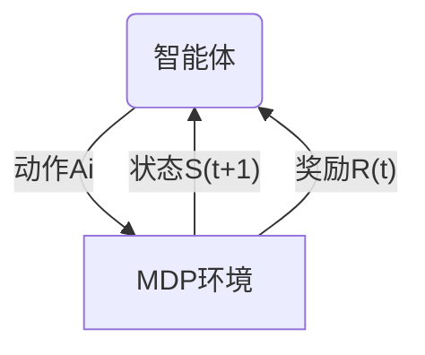

---
tags:
  - 强化学习
---
# 马尔科夫决策过程

马尔科夫决策过程是强化学习中的重要概念。强化学习中的环境一般指的就是一个马尔科夫决策过程。如果要使用强化学习去解决一个实际问题，第一步要做的就是将这个实际问题抽象为一个马尔科夫决策过程，也就是明确马尔科夫决策过程的各个组成要素。

## 马尔科夫过程

### 随机过程

一个随机过程指随机对象随时间变化的过程。通常用 $S_t$ 表示随机现象在时刻 t 的取值，为一个向量[[02_Areas/概率论与数理统计/一维随机变量及其分布|随机变量]]。所有可能的状态集合记为 $\mathcal{S}$。在随机过程中，某时刻 $t$ 的状态 $S_t$ 通常取决于 $t$ 时刻之前的状态，记为 $P(S_{t+1}|S_1,\cdots,S_t)$。

### 马尔科夫性质

马尔科夫性质指时刻 $t$ 的状态 $S_t$ 只取决于上一时刻 $t-1$，即 $P(S_{t+1}|S_t)=P(S_{t+1}|S_1,\cdots,S_t)$。该性质的好处是可以大大简化计算，只要该时刻的状态已知，所有的历史信息就不需要了，利用当前时刻的信息就可以决定未来。

### 马尔科夫过程

马尔科夫过程指具有马尔科夫性质的随机过程，也称为马尔科夫链。通常使用元组 $(\mathcal{S,P})$ 描述一个马尔科夫过程。假设有 n 个状态，此时 $\mathcal{S}=\{s_1,s_2,\cdots,s_n\}$，则可以使用状态转移矩阵描述所有状态转移之间的概率（图的邻接矩阵）：
$$
\mathcal{P}=\begin{bmatrix}P(s_1|s_1)&\cdots&P(s_n|s_1)\\\vdots&&\vdots\\P(s_1|s_n)&\cdots&P(s_n|s_n)\end{bmatrix}
$$
图中的 i 行 j 列 $P(s_j|s_i)$ 表示由状态 i 转移到状态 j 的概率。从某个状态出发，到达其他状态的概率和为 1，因此状态矩阵的每一行和为 1.

给定一个马尔科夫过程，我们从某一个状态出发，根据它的状态转移矩阵可以生成一个状态序列，这个步骤称为采样。

## 马尔科夫奖励过程

在马尔科夫过程的基础上加入奖励函数 $r$ 与折扣系数 $\gamma$，就得到了马尔科夫奖励过程。一个马尔科夫奖励过程（MAT）描述为 $(\mathcal{S},\mathcal{P},r,\gamma)$，其中:
- $\mathcal{S}$ 为状态的集合
- $\mathcal{P}$ 状态转移函数（矩阵）
- $r(s)$ 某个状态的奖励函数
- $\gamma$ 折扣函数，接近 1 的折扣函数更注重远期利益，接近 0 的折扣函数更考虑短期奖励。

### 回报

回报 $G_t$ 定义为从 $t$ 时刻的状态 $S_t$ 开始直到终止状态时，所有的奖励的衰减之和，即：
$$
G_t=R_t+\gamma R_{t+1}+\gamma^2 R_{t+2} \cdots = \sum_{k=0}^{\infty}\gamma^kR_{t+k}
$$
其中 $R_t$ 表示时刻 $t$ 时获得的奖励。

### 价值函数

在马尔科夫奖励过程中，一个状态的期望回报被定义为这个状态的价值，所有状态的价值组成了价值函数，即价值函数的输入为某个状态，输出为这个状态的价值。将价值函数写为 $V(s)=E[G_t|S_t=s]$，展开得到：
$$
\begin{align}V(s)&=E[\,G_t|S_t=s\,]\\&=E[\,R_t+\gamma (R_{t+1}+\gamma R_{t+2} \cdots\,)|S_t=s]\\&=E[\,R_t|S_t=s\,]+\gamma E[\,G_{t+1}|S_t=s\,]\\&=E[\,R_t|S_t=s\,]+\gamma E[\,E[\,G_{t+1}|S_{t+1}\,]|S_t=s\,]\\&=E[\,R_t|S_t=s\,]+\gamma E[\,V(S_{t+1})|S_t=s\,]\\&=r(s)+\gamma\sum_{s'\in\mathcal{S}}P(s'|s)V(s')\end{align}
$$
上式即贝尔曼方程。可以将上式写为矩阵的形式：
$$
\mathcal{V=R+\gamma PV}
$$
于是得到价值函数的解析解为：
$$
\mathcal{V=(I-\gamma P)}^{-1}\mathcal{R}
$$
计算上式的复杂度为 $O(n^3)$（主要在计算逆矩阵上），因此仅适合于较小规模的马尔科夫奖励过程，对于较大规模的马尔科夫奖励过程，可以使用动态规划、蒙特卡洛、时序差分等算法。

## 马尔科夫决策过程

马尔科夫奖励过程中没有进行决策，就好像一个小船随波逐流，我们计算这个小船在每个状态的价值。马尔科夫决策过程（MDP）中，我们引入一个外界刺激来改变这个随机过程，将这个外界称为智能体，外界的刺激即智能体的动作。因此一个马尔科夫决策过程记为 $(\mathcal{S},\mathcal{A},\mathcal{P},r,\gamma)$，其中：
- $\mathcal{S}$ 是状态的集合
- $\mathcal{A}$ 是动作的集合
- $P(s'|s,a)$ 是状态转移函数，表示在状态 $s$ 下执行动作 $a$ 后到达 $s'$ 的概率
- $r(s,a)$ 是奖励函数，可以同时取决于 $s$ 与 $a$
- $\gamma$ 是折扣因子

不同于马尔科夫奖励过程，马尔科夫决策过程通常存在一个智能体来执行动作。一个马尔科夫决策过程是智能体不断与环境交互的过程：
1. 智能体根据当前状态 $S_t$ 选择动作 $A_t$
2. 对于状态 $S_t$ 和动作 $A_t$，MDP 根据奖励函数和状态转移函数得到 $S_{t+1}$ 和 $R_t$ 反馈给智能体
可以描述如下图：

### 策略

智能体的策略通常用 $\pi$ 来表示。策略 $\pi$ 是一个函数 $\pi(a|s)=P(A_t=a|S_t=s)$，表示在输入状态为 $s$ 的情况下采取行动 $a$ 的概率。当一个策略是确定性策略时，$\pi(a|s)=1$，当一个策略时随机性策略时，它在每个状态下输出的是关于动作的概率分布，然后根据该分布采样即可获得一个动作。

### 状态价值函数

我们使用 $V^{\pi}(s)$ 在 MDP 中表示基于策略 $\pi$ 的状态价值函数，它被定义为从状态 s 出发遵循策略 $\pi$ 能获得的期望回报。数学表达式为：
$$
V^{\pi}(s)=E_\pi[\,G_t|S_t=s\,]
$$

### 动作价值函数

不同于 MRP，MDP 中，由于动作的存在，我们额外定义了动作价值函数。我们使用 $Q^{\pi}(s,a)$ 表示在遵循策略 $\pi$ 时，对当前状态 $s$ 执行动作 $a$ 获得的期望回报：
$$
Q^{\pi}(s,a)=E_{\pi}[\,G_t|S_t=s,A_t=a\,]
$$
从定义可以得到，状态价值函数等于动作价值函数乘以该状态下进行该动作求和：
$$
V^{\pi}(s)=\sum_{a\in \mathcal{A}}Q^{\pi}(s,a)\pi(a|s)
$$
根据 [[#价值函数|贝尔曼方程]]，可以得到动作价值函数如下：
$$
Q^{\pi}(s,a)=r(s,a)+\gamma\sum_{s'\in S}P(s'|s,a)V^{\pi}(s')
$$

### 贝尔曼期望方程

根据 [[#状态价值函数]] 与 [[#动作价值函数]] 的定义，经过简单的推导就可以得到贝尔曼期望方程：
$$
\begin{align}Q^{\pi}(s,a)&=r(s,a)+\gamma\sum_{s'\in S}P(s'|s,a)\sum_{a\in \mathcal{A}}Q^{\pi}(s',a')\pi(a'|s')\\[1.5mm]
V^{\pi}(s)&=\sum_{a\in\mathcal{A}}\pi(a|s)\left(r(s,a)+\gamma\sum_{s'\in S}P(s'|s,a)V^{\pi}(s'))\right)\end{align}
$$

该方程为强化学习非常重要的组成部分，需要明确掌握。

### 蒙特卡洛方法

计算 MRP 中的价值函数的解析方式时间复杂度高，在状态动作集较大时不适用。蒙特卡洛方法作为一种统计模拟方法，可以用于计算价值函数。我们在策略 MDP 上采样多条序列，从这个状态出发计算回报，最后再取期望：
$$
V^{\pi}(s)=E_{\pi}[\,G_t|S_t=s\,]\approx\frac{1}{N}\sum_{i=1}^NG_{t}^{(i)}
$$
具体的算法可以总结如下：
1. 使用策略 $\pi$ 采样若干条序列
2. 对每个序列中的每一步时间步 t 的状态 s 进行如下操作：
   - 更新状态 s 的计数器 $N(s)\leftarrow N(s)+1$；
   - 更新状态 s 的总回报 $M(s)\leftarrow M(s)+G$；
3. 每个状态的价值被估计为回报的期望，$V(s)=M(s)/N(s)$

这里也可以使用增量更新的方式，即使用下面的式子：
$$
\begin{align}&N(s)\leftarrow N(s) + 1\\&
V(s)\leftarrow V(s) + \frac{1}{N(s)}(G-V(s))\end{align}
$$

### 占用度量

存在一个事实：不同的策略会使智能体访问到不同的概率分布的状态。这会影响到策略的价值函数。

首先，我们定义 MDP 的初始状态分布 $v_0(s)$，我们使用 $P^{\pi}_t(s)$ 表示采取策略 $\pi$ 时智能体在 $t$ 时刻状态为 $s$ 的概率，所以有 $P_0^{\pi}(s)=v_0(s)$，然后就可以定义一个策略的状态访问分布。
$$
v^{\pi}(s)=(1-\gamma)\sum_{t=0}^{\infty}\gamma^{t}P_{t}^{\pi}(s)
$$
其中，$1-\gamma$ 是用来使概率加和为 1 的归一化因子。状态访问概率表示在一个策略下智能体和 MDP 交互会访问到的状态和分布。状态访问概率具有如下性质：
$$
v^{\pi}(s')=(1-\gamma)v_0(s')+\gamma\int P(s'|s,a)\pi(a|s)v^{\pi}(s)\mathrm ds\mathrm da
$$
同时，我们定义策略的占用度量如下：
$$
\rho^{\pi}(s,a)=(1-\gamma)\sum_{t=0}^\infty\gamma^tP_t^{\pi}(s)\pi(a|s)
$$
其中策略的状态访问分布表示该策略访问每个状态的可能性，状态访问概率越大，则该状态越容易被访问。而策略的占用度量表示状态动作 $(s,a)$ 被访问到的概率。二者的关系如下：
$$
\rho^\pi(s,a)=v^\pi(s)\pi(a|s)
$$
进一步的，我们可以得到下面的两个结论：
**定理一**：智能体分别以策略 $\pi_1$ 和 $\pi_2$ 和同一个 MDP 交互得到的占用度量满足
$$
\rho^{\pi_1}=\rho^{\pi_2}\Leftrightarrow\pi_1=\pi_2
$$
**定理二**：给定一个合法的占用度量 $\rho$，可以生成该占用度量的唯一策略，且该策略为：
$$
\pi_\rho=\frac{\rho(s,a)}{\sum_a\rho(s,a')}
$$
## 最优策略

强化学习的目标通常是找到一个策略，使得智能体从初始状态出发能获得最多的期望回报。因此这里需要先定义策略间的偏序关系：当且仅当对任意状态 $s$ 都有 $V^{\pi}(s)\geqslant V^{\pi}(s)$ 时，记为 $\pi\leqslant \pi'$。于是在有限的 MDP 中，至少存在一个策略比其他所有策略都好或者至少存在一个策略不差于其他所有策略，这个策略就是最优策略，我们将其表示为 $\pi^*(s)$。

最优策略都有相同的状态价值函数，称之为最优状态价值函数，表示为：
$$
V^*(s)=\max_{\pi}V^{\pi}(s),\quad \forall s\in \mathcal{S}
$$
同理，定义最优动作价值函数：
$$
Q^*(s,a)=\max_\pi Q^{\pi}(s,a),\quad \forall s\in\mathcal S,a\in \mathcal A
$$
另一方面，最优状态价值就是此时使得最优动作价值最大的那个动作时的状态价值：
$$
V^*(s)=\max_{a\in \mathcal A}Q^*(s,a)
$$

### 贝尔曼最优方程

根据 $V^*(s)$ 与 $Q^*(s,a)$ 的关系，我们可以得到贝尔曼最优方程：
$$
\begin{align}V^*(s)=\max_{a\in \mathcal A}\left\{r(s,a)+\gamma\sum_{s'\in S}P(s'|s,a)V^*(s')\right\}\\
Q^*(s,a)=r(s,a)+\gamma\sum_{s'\in \mathcal S}P(s'|s,a)\max_{a\in \mathcal A}Q^*(s',a')\end{align}
$$

该方程可以使用动态规划算法得到最优策略。