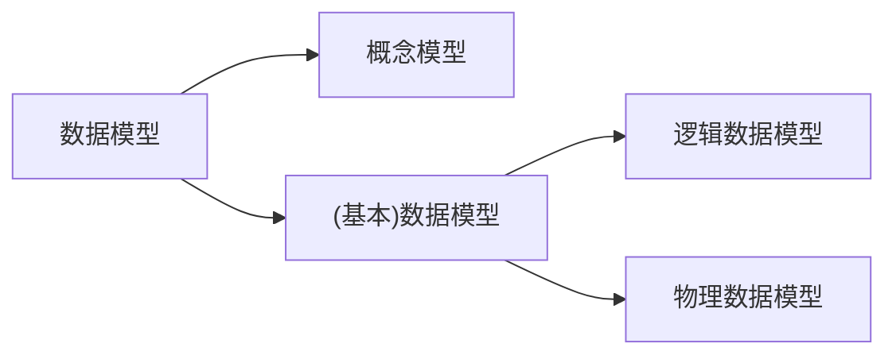
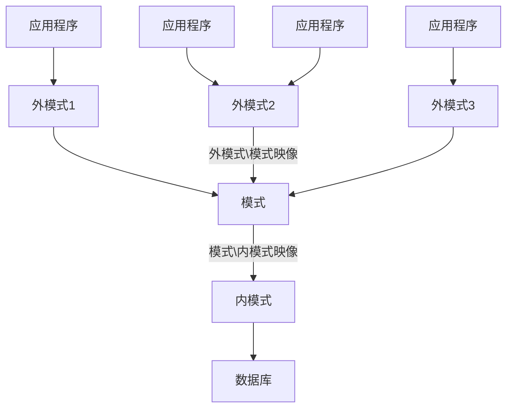

---
tags:
  - 数据库
---

# 数据库系统引论

本节介绍数据库系统涉及的基本概念。

## 数据的概念

所谓数据是表示信息的符号，可以是数组，文字，图像，图形，声音等。

## 数据库系统阶段主要特征

1. 数据结构化
2. 数据独立性高
   1. 物理独立性
   2. 逻辑独立性
3. 减少数据冗余
   1. 数据不再是面向应用，而是面向系统
   2. 数据集中管理
4. 数据共享
   1. 数据共享是数据库发展法主要原因，也是重要特征
5. 统一的数据保护功能

## 什么是数据库

数据库是存放数据的仓库

定义：数据库是长期储存在计算机内，有组织的数据集合，它根据数据间的联系组织在一起，具有较高的数据独立性，较少数据冗余，能够为各种用户共享

数据库需要由一个软件系统统一管理，这个软件系统称为数据管理系统。

总的来说： ***数据库是存放在介质上的相关数据的集合***, 数据库需要 ***数据库管理系统*** 统一管理。

## 数据模型

模型方法是一种抽象表示：把表示事物的只要特征抽象地用一种形式化的描述反映出来，以简化问题，便于处理。

**[[00-笔记/数据库/数据模型|数据模型]]是数据特征的抽象，用来描述数据的一组概念和定义**。包含：
* **数据结构**
  * 对数据静态特性的描述
  * 应用所涉及的对象和对象具有的特征，对象间的联系
* **数据操作**
  * 对数据动态特性的描述
  * 对数据库中对象实例执行的一组操作，检索、插入、删除、修改等
* **数据的完整性约束**
  * 对数据静态和动态特性的约束
  * 反映了数据间的制约和依存关系

### 数据模型的划分

* 概念模型：（不重要）不涉及信息在计算机中如何表示
* 数据模型：是数据特征的抽象，用来描述数据的一组概念和定义
  * 逻辑数据模型：用户所看到的数据模型
  * 物理数据模型：表示数据储存结构和存取方法

严格来讲，**数据模型应该有数据结构，数据操作，数据的完整性约束三部分组成**，但数据模型的结构是区分数据模型最主要的部分，因此，**不同数据模型主要是由数据结构来表征的**。

## 数据库系统结构

**数据库系统是一个对数据提供储存、管理和应用的计算机系统。**

数据库系统结构应该是一个多级结构，包含以下功能：
* 让用户方便的存取数据
* 高效的组织数据，以最佳形式在物理存储器上存放数据

### 数据库系统的三级模式结构

数据库系统的结构一般划分为三个层次：外模型、模式、内模式

#### 1. 模式：也称逻辑模式

是全体数据的逻辑结构和特征的描述，构成了数据库的一个总的框架
* 独立与应用程序和物理存储
* 一个数据库对应一个模式
* 提供模式是描述语言

#### 2. 外模式：也称用户模式

是数据库用户能看见的局部数据的逻辑结构和特征的描述，是与某一应用具体相关的数据的逻辑表示
* 外模式是模式的子集
* 数据库以有多个外模式，反映了不同用户的应用需求
* 对模式中的同一数据，在外模式中的结构、类型、长度、保密级别可以不同
* 用途：可以保证数据库安全性，即每个用户只能看见和访问所对应的外模式中的数据

#### 3. 内模式：也称储存模式

是对数据库的储存结构和存取方式的描述，数据在数据库内部的表示方法
* 规定数据在储存介质上的物理组织方式、记录寻址方式
* 定义物理存储块的大小，溢出处理方法等
* 内模式只能有一个

#### 三级模式结构的二级映像

三级模式结构提供了三种级别的数据抽象，即视图级、概念级和物理级。
* 外模式/模式映像定义局部数据逻辑结构与全局逻辑结构间的对应关系
* 模式/内模式映像定义全局逻辑结构和物理数据储存间的对应关系

## 数据库管理系统

### 数据库的定义功能

1. 模式定义 语言(DDL)：定义数据库全局逻辑结构
2. 外模式定义语言：定义用户的局部逻辑结构，其形式与功能基本与模式DDL语言相同
3. 内模式定义语言：定义物理数据的结构

### 数据库的操纵功能

实现对数据库的操纵，插入、删除、修改、查询

### 数据库的保护功能

* 数据库的安全性
* 数据库的完整性
* 数据库的并发控制
* 数据库的恢复

### 数据库的维护功能

* 转存程序
* 数据装入程序
* 统计分析程序
* 重组程序
* 对无用数据的收集及空间的再分配等程序

### 数据库管理系统的组成

1. 系统主控程序
2. 存取控制程序
3. 并发控制程序
4. 数据有效性检查程序
5. 数据保护程序
6. 查询处理程序
7. 数据更新程序
8. 目录管理程序
9. 通讯程序
