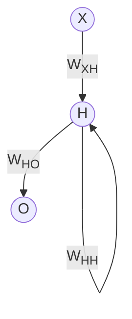

---
tags:
  - 深度学习
---
# 循环神经网络

为了处理表格数据，提出了全连接层构成的全连接神经网络 ([[00_Inbox/深度学习/多层感知机]])，为了处理图像数据，提出了[[00_Inbox/深度学习/卷积神经网络]]架构，到目前为止，我们都默认数据来自某种分布，并且所有的样本都满足独立同分布假设。然而，大多数的数据并非如此，例如，文章的单词是按顺序写的，如果顺序被随机重排，就很难理解文章原本的意思。同样的，视频与语言数据、网上的浏览行为等都是有顺序的。

简单来说，为了更好的处理序列数据，我们提出了循环神经网络 (recurrent neural network, RNN)。如果说卷积神经网络可以有效的处理空间信息，那么循环神经网络可以很好的处理序列信息。循环神经网络通过引入状态变量储存过去的信息和当前的输入，从而可以确定当前的输出。

常见循环神经网络的工作顺序如下：

简单来说，时刻 $t$ 时的隐藏层输出同时由该时刻的输入 $X_t$ 与前一时刻的隐藏层输出 $H_{t-1}$ 有关，通常表示为他们的加权和。

## 序列模型

在现实生活中有很多的事情都不满足独立同分布假设，考虑下面的场景：
1. 语音识别：在语音信号中，相邻时刻的数据通常具有很强的相关性。如果我们假设所有时刻的数据是独立同分布的，则丢失了时域上的信息，会影响识别精度。
2. 机器翻译：在机器翻译任务中，输入和输出的单词序列都存在时间上的依赖关系。如果我们假设所有单词都是独立同分布的，则忽略了单词之间的句法和语义关系，难以准确地理解句子的含义。
3. 时序预测：在时序预测任务中，时刻t的数据通常与前面的数据相关，例如在预测股票价格的任务中，每个时刻的价格可能受前面若干个时刻的价格和其他指标的影响。因此，将数据视为独立同分布的会使得预测结果不准确。
4. 视频分析：在视频中，相邻帧之间存在很强的相关性，而不仅仅是空间方向上的像素相关性，如果将视频帧看作独立同分布的，则会丢失视频时间轴上的信息，难以对视频进行分析和理解。

上述场景是序列模型应用的典型场景，为了建立序列模型，我们需要引入统计学的工具。

> [!note] 前馈神经网络的局限性
> 在前馈神经网络中，信息是单向传递的，这种限制虽然使得网络变得更容易学习，但在一定程度上也减弱了神经网络模型的能力。
> - 输入和输出的维度固定，不能任意改变
> - 难以处理长度不固定的序列数据，比如视频、语音、文本等

### 记忆能力的必要性

前馈神经网络可以看作一个复杂的函数，每次输入都是独立的，即网络的输出只依赖于当前输入。但在很多现实任务中，网络的输入不仅与当前时刻的输入有关，也与其过去一段时间的输出有关。

基于前馈神经网络，我们无法实现一个有限自动状态机或者图灵机，因为他们都需要一个状态/纸带来记录过去的信息。

在可计算问题中，仅有一小部分函数类问题，我们可以通过前馈神经网络实现，但是大部分的其他问题我们都需要模型可以看到以前的输入。前馈神经网络无法解决所有的可计算问题。

### 统计工具

处理序列数据需要统计工具和新的深度神经网络架构。对于一个序列，我们通常使用一个随机过程去描述，我们使用 $t$ 表示一个时间步，在计算机中的序列通常是离散的，我们使用下面的形式来表示预测方式：
$$
x_t\sim P(x_{t}|x_{t-1},\cdots,x_1)
$$

#### 自回归模型

为了实现预测，可以使用回归模型。但是与一般的模型不同，序列数据的输入数据的数量 $x_1,\cdots,x_t$ 因 $t$ 而异，也就是说，随机时间的增加，输入的数据量将会随着我们遇到是数据量而增加。我们需要一个近似计算的方式来简化计算，即如何有效估计 $P(x_t\vert x_{t-1},\cdots,x_1)$。简单的说，可以归结为下面的两种方法：
1. 假设在现实情况下相当长的序列 $x_{t-1},\cdots,x_1$ 可能是不必要的，因为我们只需要满足某个长度为 $\tau$ 的时间跨度，即使用时间序列 $x_{t-1},\cdots,x_{t-\tau}$，这样处理的直接好处就是在 $t>\tau$ 时参数的总量不变，可以训练一个深度神经网络。这种模型被称为自回归模型 (autoregressive model)，因为它们是对自身执行回归的。
2. 还有一种策略是保留一些对过去观测的总结 $h_t$，并且同时更新预测 $\hat x_t$ 和总结 $h_t$，这就产生了基于 $P(x_t|h_t)$ 估计 $x_t$ 以及公式 $h_t=g(h_{t-1},x_{t-1})$ 更新的模型，由于 $h_t$ 从未被观测到，因此这里模型被称为隐变量自回归模型 (latent autoregressive model)。

上面的两种方式都会涉及到如何生成训练数据的问题。一个经典的方式是使用历史观测来预测下一个未来观测。一个常见的假设是虽然特定值 $x_t$ 可能会改变，但是序列本身的动力学不会改变，这样的假设是合理的，因为我们不可能使用过去的数据来预测新的动力学。统计学家将不变的动力学称为平稳的 (stationary)。因此，整个序列的估计值由下面的方式得到：
$$
P(x_1,x_2,\cdots,x_T)=\prod_{t=1}^TP(x_t\vert x_{t-1},\cdots,x_1)
$$

虽然上述假设是针对时间是连续的数字的问题，而当我们处理的是离散的对象 (如单词)，上述的考虑仍然成立，但是我们需要使用分类器而不是回归模型来估计 $P(x_t|x_{t-1},\cdots,x_1)$。

> [!faq]- 什么是自回归模型？
> 自回归模型是基于时间序列的预测模型，当前时刻的值被认为是过去若干个时刻的线性组合。预测数据时，不是用另外的数据，而是用了前面时刻的样本，因此叫做自回归。
> 但是单纯的自回归模型由于没有外部输入，因此不符合自动有限机和图灵机的要求。因此我们在设计神经网络的时候，设计的是有外部输入的非线性自回归模型，该模型在每个时刻都有一个外部输入，并且拥有记忆能力，可以记忆最近的几次外部输入与输出。

#### 马尔科夫模型

在自回归模型中，我们使用 $x_{t-1},\cdots,x_{t-\tau}$ 来代替 $x_{t-1},\cdots,x_{1}$ 来估计 $x_t$，就是建立在马尔科夫条件 (Markov condition) 假设上。特别的，如果 $\tau=1$，我们得到一个一阶马尔科夫模型 (first-oredr Markov model)，$P(x)$ 由下式给出：
$$
P(x_1,\cdots,x_T)=\prod_{t=1}^TP(x_t|x_{t-1})
$$
其中 $P(x_1|x_0)=P(x_1)$，如果 $x_t$ 仅仅是离散值，那么这种模型可以直接通过动态规划沿着马尔科夫链精确计算。动态规划在马尔科夫模型中的应用参考 [[00_Inbox/机器学习/隐马尔可夫模型]] 与 [[00_Inbox/强化学习/动态规划算法|强化学习的动态规划算法]] 。

#### 因果关系

原则上，将 $P(x_1,\cdots,x_T)$ 倒序展开也符合数学上的定义，基于条件概率公式，我们总是有：
$$
P(x_1,\cdots,x_T)=\prod_{i=T}^1P(x_t|x_{t+1},\cdots,x_T)
$$
事实上，如果基于一个马尔科夫模型，我们还可以得到一个反向的条件概率分布。然而，在大多数情况下，数据有一个自然的方向，即在时间上是向前推进的，显然，未来的事件不能影响过去，因此，当我们改变 $x_t$ 时，可能会影响未来的 $x_{t+1}$，但是不能反过来。在这个角度可以导出一个新的学科方向。

## 文本预处理

对于序列数据处理问题，存在着非常多的挑战。这样的数据存在多种形式，文本是最常见的例子之一。例如，一篇文章可以简单的看作一串单词序列，甚至一串字符序列。本节中我们将解析文本的常见预处理步骤，包括：
1. 将文本作为字符串加载到内存中
2. 将字符串拆分为词元（如单词和字符）
3. 建立一个词表，将拆分的词元映射到数字索引
4. 将文本转换为数字索引序列，以方便模型操作

### 数据集处理

常见的文本数据为 txt，可以通过 `re` 库对文本数据进行精细操作，下面是读取文本数据的一个示例：
```python
def read_txt(path):
	with open(path, encoding='utf-8') as f:
		lines = f.readlines()
	return [re.sub('[^A-Za-z]+', ' ', line).strip().lower() for line in lines]
```

### 词元化

词元 (token) 指将单个单词或者字符，词元化就是将文本行列表中每个文本行转换为一个词元列表 (token)，词元是文本的基本单位。最后得到一个由词元列表组成的列表，其中每个词元都是一个字符串。

```python
def tokenize(lines, token='word'):
	if token == 'word':
		return [line.split() for line in lines]
	elif token == 'char':
		return [list(line) for line in lines]
	else:
		print('ERROR: unknown token type '+token)
```

### 词表

词元的类型时字符串，而模型需要的输入时数字，因此字符串类型不方便模型使用，现在，我们构建一个字典，通常也称为词表 (vocabulary)，用来将字符串类型的词元映射到从 0 开始的数字索引中。我们先将训练集中的所有文档合并在一起，并对它们的唯一词进行统计，得到的统计结果称为语料库 (corpus)，然后根据每一个词出现的概率为其分配一个数字索引，很少出现的词元将通常被移除，这样可以降低复杂度。另外，语料库中不存在或者已经被移除的任何词元都将映射到一个特定的未知词元 `'<unk>'` 。我们可以选择添加一个列表，用于保存哪些被保留的词元，例如填充词元 `<pad>`，序列开始词元 `<bos>`，序列结束词元 `<eos>`。

```python
# 词表
class Vocab:
    """文本词表"""
    def __init__(self, tokens = None, min_freq = 0, reserved_tokens = None):
        if tokens is None:
            tokens = []
        if reserved_tokens is None:
            reserved_tokens = []
        # 按出现的频率排序
        counter = count_corpus(tokens)
        self._token_freqs = sorted(counter.items(), key = lambda x: x[1], reverse = True)
        # 未知词元的索引为0
        self.idx_to_token = ['<unk>'] + reserved_tokens
        self.token_to_idx = {token: idx for idx, token in enumerate(self.idx_to_token)}
        for token, freq in self.token_freqs:
            if freq < min_freq:
                break
            if token not in self.token_to_idx:
                self.idx_to_token.append(token)
                self.token_to_idx[token] = len(self.idx_to_token) - 1
                
    def __len__(self):
        return len(self.idx_to_token)

    def __getitem__(self, tokens):
        if not isinstance(tokens, (list, tuple)):
            return self.token_to_idx.get(tokens, self.token_to_idx['<unk>'])
        return [self.__getitem__(token) for token in tokens]

    def to_tokens(self, indics):
        if not isinstance(indics, (list, tuple)):
            return self.idx_to_token[indics]
        return [self.idx_to_token[index] for index in indics]

    @property
    def unk(self):
        return 0

    @property
    def token_freqs(self):
        return self._token_freqs

def count_corpus(tokens):
    """统计词元出现的频率"""
    if len(tokens) == 0 or isinstance(tokens[0], list):
        """将词元展平成一个列表"""
        tokens = [token for line in tokens for token in line]
    return collections.Counter(tokens)
```

## 语言模型和数据集

将文本映射为了词元后，我们可以将这些词元视为一系列离散的观测值，假设长度 $T$ 的文本序列中的词元依次为 $x_1,x_2,\cdots,x_T$，于是，$x_t$ 被认为是文本序列在时间步 $t$ 处的观测值或者标签，给定这样的序列时，语言模型 (language model)的目标是估计序列的联合概率
$$
P(x_1,x_2,\cdots,x_T)
$$
在获得文本时，只需要依次提取一个词元 $x_t\sim P(x_t|x_{t-1},\cdots,x_1)$，一个理想的语言模型就能够基于模型本身生成自然语言。这样，就可以根据前面对话片段的文字生成一段有意义的对话。但是我们显然和这样的模型还非常遥远，因为它需要理解文本，而不是仅仅生成语法上合理的内容。

#### 马尔科夫模型与 n 元语法

之前讨论过将马尔科夫模型用于语言建模，如果 $P(x_{t+1}|x_t,\cdots,x_1)=P(x_{t+1}|x_t)$，则序列上的分布满足一阶马尔科夫性质，阶数越高，对应的依赖关系越长。这种性质可以推导出许多可以应用在序列建模上的公式：
$$
\begin{aligned}
P(x_1,x_2,x_3,x_4)&=P(x_1)P(x_2)P(x_3)P(x_4)\\
P(x_1,x_2,x_3,x_4)&=P(x_1)P(x_2|x_1)P(x_3|x_2)P(x_4|x_3)\\
P(x_1,x_2,x_3,x_4)&=P(x_1)P(x_2|x_1)P(x_3|x_2,x_1)P(x_4|x_3,x_2)
\end{aligned}
$$
通常，设计 1 个、2 个、3 个变量的概率公式分别被称为一元语法 (unigram)、二元语法 (bigram)、三元语法 (trigram)。

#### 学习语言模型

学习语言模型面对的问题是如何对一个文档，甚至是一个词元序列建模。假设在单词级别对文本数据进行词元化，根据：
$$
P(x_1,\cdots,x_T)=\prod_{i=1}^TP(x_t|x_{t-1},\cdots,x_1)
$$
对于一个包含四个单词的文本序列的概率是：
$$
\begin{aligned}
P(&\text{dive,into,deep,learning})=P(\text{deep})P(\text{learning|deep})\\
&P(\text{dive|learning,deep})P(\text{into|dive,learning,deep})
\end{aligned}
$$
为了训练语言模型，我们需要计算每个单词出现的概率，以及前面几个单词出现后每个单词出现的条件概率，这些概率本质上就是语言模型的参数。

假设我们要训练一个大型的文本预料库，训练数据集中的单词的概率可以根据给定单词的相对词频来计算，例如，可以将估计值 $\hat P(\text{deep})$ 计算任何以 $\text{deep}$ 开头的句子出现的概率，一种方式是统计单词 $\text{deep}$ 出现的次数并除以整个语料库中单词的总数，这个方法对于单个单词的效果不错。接下来估计
$$
\hat P(\text{learning|deep})=\frac{n(\text{deep,learning})}{n(\text{deep})}
$$
其中 $n(x)$ 与 $n(x,x')$ 分别是单个单词或者连续单词对出现的次数。这时候由于单词对出现的概率要低得多，想要获得准确估计需要非常大的数据集。当单词对的单词数增加到了三个是，这种情况将更加糟糕。

一种常见的方式是使用拉普拉斯平滑 (Laplace smoothing)，具体就是在计数时添加一个小的常量。用 $n$ 表示训练集中的单词总数，用 $m$ 表示唯一的单词数量，上述解决方法通过下面的式子进行计算：
$$
\begin{aligned}
\hat P(x)&=\frac{n(x)+\epsilon_1/m}{n+\epsilon_1}\\
\hat P(x'|x)&=\frac{n(x,x')+\epsilon_2 \hat P(x')}{n(x)+\epsilon_2}\\
\hat P(x''|x',x)&=\frac{n(x,x',x'')+\epsilon_3\hat P(x'')}{n(x,x')+\epsilon_3}
\end{aligned}
$$
其中 $\epsilon_1,\epsilon_2,\epsilon_3$ 是超参数。

然而，这样的模型很容易变得无效，因为这样的方法需要储存所有的计数，且完全忽略了单词的意思。而且，长单词中大部分一定是新颖的，这种模型的表现效果必然不佳。因此后面我们将使用神经网络作为我们的语言模型。

#### 语句困惑度

如何评估一个语言模型的好坏？一个好的语言模型应当能够用高度准确的词元来预测我们接下来会看到什么。一种方式是通过计算序列的似然概率来度量模型的质量，然而这是一种难以理解、难以比较的数字。另一种方式是使用信息论中的熵来描述。信息熵表示信息含量，一个更好的语言模型应该能让我们更准确的预测下一个词元，因此我们可以通过一个序列中所有 n 个词元的平均交叉熵来衡量：
$$
\frac{1}{n}\sum_{t=1}^n-\log P(x_t|x_{t-1},\cdots,x_1)
$$
其中，$P$ 由语言模型给出，$x_i$ 是时间步 $t$ 从该序列中观测到的实际词元，这使得不同长度的文本的性能有了可比性。由于历史原因，自然语言处理的科学家更喜欢使用一个称为困惑度 (perplexity)的量，为上式的指数运算：
$$
\exp\left(-\frac{1}{n}\sum_{t=1}^n\log P(x_t|x_{t-1},\cdots,x_1)\right)
$$
最困惑度最好的理解是下一个词元的实际选择数的调和平均数。在最好的情况下，模型总是完美的估计标签词元，此时困惑度为 1。在最坏的情况下，模型总是预测标签词元概率为 0，此时困惑度为无穷大。

#### 自然语言统计

在自然语言统计中，单词的频率满足齐普夫定律 (Zipf's law)，即第 i 个最常用的单词的词频 $n_i$ 满足:
$$
n_i\propto \frac{1}{i^\alpha}\Leftrightarrow \log n_i=-\alpha\log i+c
$$
其中 $\alpha$ 是描述分布的指数，$c$ 是常数。实际上，不仅是单个词元遵循齐普夫定律，单词序列也遵循齐普夫定律，越长的单词序列其对应的 $\alpha$ 值越小。且在序列中，单词直接存在结构，所以词表的长度总是远小于其所有 n 元组的总长度。因此建立一个模型是有可能的，由于很多 n 元组出现的概率非常小，使得拉普拉斯平滑很不适合语言建模，作为替代，我们使用基于深度学习的模型。

#### 读取长序列数据

由于序列数据本质上是连续的，我们需要在处理数据时解决这个问题。我们将使用设计网络处理数据，假设模型的输入固定长度的小批量数据，现在的问题是如何随机生成一个小批量数据的特征和标签用于学习。

由于文本可以是任意长度的，于是任意长的序列可以被拆分为具有相同时间步的子序列。当训练神经网络时，这样的小批量数据将被输入模型。假设神经网络一次只能处理具有 $n$ 个时间步的子序列，我们可以采用任意的偏移量来指示不同的初始位置，不同的偏移量将对应不同的序列。由于不同的偏移量得到的数据都是可以接受的，我们将从随机的偏移量开始拆分序列，以同时获得覆盖性 (coverage) 和随机性 (randomness)，即使用随机抽样 (random sampling) 或顺序分区 (sequential partitioning) 策略。

##### 随机抽样

在随机抽样中，每个样本都是在原始长度上任意捕获的子序列。在迭代过程中，来自两个相邻的、随机的、小批量中的子序列不一定在原始序列中相邻。对于语言建模，目标是具有目前为止我们看到的词元来预测下一个词元，因此标签是位移了一个词元的原始序列。

##### 顺序分区

在迭代过程中，除了可以对原始序列随机抽样，我们还可以保证两个相邻的小批量中的子序列在原始序列中也是相邻的。这种策略在基于小批量的迭代过程中保留了拆分子序列的顺序，因此称为顺序分区。

## 循环神经网络

我们可以使用 n 元语法模型，即词元 $x_t$ 的条件概率仅取决于前 $n-1$ 个词元。对于时间步 $t-(n-1)$ 之前的词元，如果我们想要 $x_t$ 受到其影响，只能增大 $n$，随之而来的是词表大小的指数级增长，因为词表需要储存 $|\mathcal V|^n$ 个数字。因此我们将使用隐藏变量模型，使用 $h_t-1$ 代表历史信息，使用：
$$
P(x_t|x_{t-1},\cdots,x_1)\approx P(x_t|h_{t-1})
$$
作为模型，其中 $h_{t-1}$ 称为隐状态 (hidden state)，也称为隐藏变量 (hidden variable)，它储存了到时间步 $t-1$ 的序列信息。通常，我们可以基于当前状态的 $x_t$ 与先前状态的 $h_{t-1}$ 来预测下一状态的 $h_{t}$：
$$
h_{t}=f(x_t,h_{t-1})
$$

### 含有隐状态的神经网络

设小批量输入为 $X$，之前定义的普通神经网络中，变量在全连接层之间通过下面的式子进行传递：
$$
H=\phi(XW+b)
$$
对于有隐状态的神经网络，设时间步 $t$ 时有小批量输入 $X_t$ 与保存的了上一时间步的隐变量 $H_{t-1}$，可以得到这一时间步的隐变量为：
$$
H_t=\phi(X_tW_{xh}+H_{t-1}W_{hh}+b)
$$
相比之下，该网络结构增加了 $H_{t-1}W_{hh}$ 项，该项保留了历史信息，相当于神经网络的记忆，因此这样的变量称为隐状态。由于当前状态中隐状态的计算方式与上一状态时相同，因此上式的计算是循环的 (recurrent) ，我们将该神经网络称为循环神经网络 (recurrent neural network)，在循环神经网络中执行计算的层被称为循环层 (recurrent layer)。

有多种方式定义循环神经网络，上述使用隐状态是非常常见的一种。对于时间步 $t$，神经网络的输出与多层感知机的方式相同：
$$
O_t=H_tW_{hq}+b
$$
因此循环神经网络的计算逻辑可以归纳为：
1. 拼接当前时间步 $t$ 的输入 $X_t$ 与上一时间步 $t$ 的隐状态 $H_{t-1}$
2. 将拼接结果送入带有激活层的全连接层，全连接层的输出是当前时间步的隐状态 $H_t$

下面陈述一个事实：将 $X_t$ 与 $H_{t-1}$ 、$W_{xh}$ 与 $W_{hh}$ 拼接后相乘等价与将 $X_t$ 与 $W_{xh}$、$H_{t-1}$ 与 $W_{hh}$ 相乘后再相加。因此在计算隐状态是直接相加是符合逻辑的。

> [!example] 从数学角度看
> 从数学上将，公式可以看作一个动力系统 (dynamical system)。
> - 动力系统指系统状态按照一定的规律随时间变化的系统，使用一个函数来描述一个给定空间中所有点随时间变化情况。
> - 由于循环神经网络具有短期记忆能力，相当于存储状态，因此其计算能力十分强大，神经网络可以近似任意非线性动态系统。

> [!example] 从计算机角度看
> 所有的图灵机都可以被一个由使用 Sigmoid 型激活函数的神经元构成的全连接循环网络来进行模拟。即 RNN 与图灵机等价，是图灵完备的，可以解决所有可计算问题。

### 基于循环神经网的语言模型

根据 [[#语言模型和数据集]]，我们的目标是使用循环神经网络根据当前和过去的词元预测下一状态的词元。因此我们仅原始序列移位一个词元作为标签。在每一个时间步中，我们将输入层进行 softmax 操作后利用交叉熵损失计算当前模型与目标的误差，作为损失函数。

### 使用 pytorch 实现的循环神经网络

本节介绍 pytorch 中为循环神经网络提供的高级 API。

```python
class RNNModel(nn.Module):
	def __init__(self, input_size, hidden_size, output_size):
		super().__init__()

		self.rnn = nn.RNN(input_size, hidden_size)
		self.linear = nn.Linear(hidden_size, output_size)

	def forward(self, x, state):
		x, state = self.rnn(x, state)
		x = self.linear(x)
		return x, state
```

## 通过时间进行反向传播

这部分推导循环神经网络中的反向传播技术的实现，即通过时间进行反向传播。它是反向传播技术在循环神经网络中的特定的应用，将循环神经网络中的计算图一次展开一个时间步，以获得变量和参数间的依赖关系，然后基于链式法则来计算和储存梯度。

### 循环神经网络的梯度分析

这里从一个简化模型开始，该模型忽略了隐状态及其更新方式的细节，这些细节对推导公式并不重要。设时间步 $t$ 的隐状态表示为 $h_t$，输入表示为 $x_t$，输出表示为 $o_t$。使用 $w_h$ 与 $w_o$ 分别表示隐藏层与输出层的权重。每个时间步的隐状态和输出可以表示为
$$
\begin{aligned}
h_t&=f(x_t,h_{t-1},w_h)\\
o_t&=g(h_t,w_o)
\end{aligned}\tag{1}
$$
我们使用函数 $f$ 与 $g$ 表示隐藏层与输出层的变换。现在我们有一个链 $\{(x_{t},h_{t},o_{t})\}_{t=1,\cdots,T}$ ，它们通过循环计算彼此依赖。前向传播非常简单，一次一个时间步遍历三元组 $(x_t,h_t,o_t)$，然后通过目标函数 $L$ 在所有 $T$ 个时间步内评估输出 $o_t$ 与对应标签 $y_t$ 之间的差距：
$$
L(x_1,\cdots,x_T,y_1,\cdots,y_T,w_h,w_o)=\frac{1}{T}\sum_{t=1}^Tl(y_t,o_t)
$$
而对于反向传播，问题就变得有一些棘手。按照链式法则，我们可以计算
$$
\begin{aligned}
\frac{\partial L}{\partial w_h}&=\frac{1}{T}\sum_{t=1}^T\frac{\partial l(y_t,o_t)}{\partial w_h}\\&=\frac{1}{T}\sum_{t=1}^T\frac{\partial l(y_t,o_t)}{\partial o_t}\cdot\frac{\partial g(h_t,w_o)}{\partial h_t}\cdot\frac{\partial h_t}{\partial w_h}
\end{aligned}\tag{2}
$$
在 $(2)$ 中，乘积的第一项与第二项容易计算，但是第三项 $\partial h_t/\partial w_h$ 就是使问题变得棘手的地方，因为我们需要循环的计算参数 $w_h$ 对 $h_t$ 的影响。根据 $(2)$ 的中的递归计算，$h_t$ 既依赖于 $h_{t-1}$ 又依赖 $w_h$，其中 $h_{t-1}$ 的计算也依赖 $w_h$。因此使用链式法则有
$$
\frac{\partial h_t}{\partial w_h}=\frac{\partial f(x_t,h_{t-1},w_h)}{\partial w_h}+\frac{\partial f(x_t,h_{t-1},w_h)}{\partial h_{t-1}}\cdot\frac{\partial h_{t-1}}{\partial w_h}
$$
为了得到上述梯度，假设我们有三个序列 $\{a_{t}\},\{b_t\},\{c_t\}$，当 $t=1,2,\cdots$ 时，序列满足 $a_0=0$ 且 $a_t=b_t+c_ta_{t-1}$，对于 $t\geqslant1$，很容易得到
$$
a_t=b_t+\sum_{i=1}^{t-1}\left(\prod_{j=i+1}^tc_j\right)b_i
$$
将上面的符号替换，得到
$$
\small\frac{\partial h_t}{\partial w_h}=\frac{\partial f(x_t,h_{t-1},w_h)}{\partial w_h}+\sum_{i=1}^{t-1}\left(\prod_{j=i+1}^t\frac{\partial f(x_j,h_{j-1},w_h)}{\partial h_{j-1}}\right)\frac{\partial f(x_t,h_{t-1},w_h)}{\partial h_{t-1}}
$$
我们可以使用上式递归的计算 $\partial h_t/\partial w_h$，但是当 $t$ 很大的时候，这个链将会变得非常的长，我们需要一些方法来处理这一问题。

> [!note] RNN 训练困难，梯度时大时小，很难通过调整学习率的方式进行计算。

#### 完整计算

显然，我们可以直接计算所有的总和，但是这样计算的速度非常缓慢, 且容易发生梯度爆炸，因为初始条件的微小变化就会对结果产生巨大的影响。这对于我们想要估计的模型是非常不可取的。

#### 截断时间步

或者，我们可以在 $\tau$ 步后截断求和式。这会带来近似的梯度估计，在实践中，这种方法的效果较好，它通常被称为截断的通过时间反向传播。但是这样做会导致模型主要侧重于短期的影响，而不是长期的影响。这在现实中是可取的，因为它会将估计值偏向更加简单和稳定的模型。

#### 随机截断

最后，我们可以使用一个[[02_Areas/概率论与数理统计/一维随机变量及其分布|随机变量]]替换 $\partial h_t/\partial w_h$。该随机变量在预测中是正确的，但是会截断序列。这个随机变量是通过序列 $\xi_t$ 来实现的，序列预定义了 $0\leqslant \pi\leqslant 1$，其中 $P(\xi_t=0)=1-\pi_t$ 且 $P(\xi_t=\pi_t^{-1})=\pi_t$，因此 $E[\xi_t]=1$。我们使用它来替换 $\partial h_t/\partial w_h$，得到
$$
z_t=\frac{\partial f(x_t,h_{t-1},w_h)}{\partial w_h}+\xi_t\frac{\partial f(x_t,h_{t-1},w_h)}{\partial w_h}\frac{\partial h_{t-1}}{\partial w_h}
$$
从 $\xi_t$ 的定义中推导出 $E[z_t]=\partial h_t/\partial w_h$，当 $\xi_t=0$ 时，递归计算终止在 $t$ 这个时间步。这导致不同长度的序列的加权和，其中长序列出现很少，所以适当地增大权重。

遗憾的是，虽然随机截断在理论上更加具有吸引力，但是由于多种因素在实践中其效果可能并不比截断时间步表现得更好。

### 通过时间反向传播的细节

之前讨论的通过时间反向传播的一般性原则，下面讨论一些细节，即推导出神循环神经网络中参数梯度的具体公式。为了保持简单，这里考虑一个没有偏置参数的循环神经网络，其在隐藏层中的激活函数使用恒等函数。对于时间步 $t$，设单个样本的输入及其对应的标签分别为 $x_t\in\mathbb R^d$ 和 $y_t$，计算隐状态 $h_t\in\mathbb R^h$ 和输出 $o_t\in\mathbb R^q$ 的公式为
$$
\begin{aligned}
h_t&=W_{hx}x_t+W_{hh}h_{t-1}\\
o_t&=W_{qh}h_t
\end{aligned}
$$
用 $l(o_t,y_t)$ 表示时间步 $t$ 处的损失函数，则我们的目标函数的总体损失是
$$
L=\frac{1}{T}\sum_{i=1}^Tl(o_t,y_t)
$$
为了在循环神经网络中计算模型变量与参数之间的依赖关系，我们以时间步为 3 的循环神经网络为例，计算图如下
![[Assets/Pasted image 20230702110238.png]]
模型的参数为 $W_{hx},W_{hh},W_{qh}$，我们需要分别对这些参数进行梯度计算，即计算 $\partial L/\partial W_{hx},\partial L/\partial W_{hh},\partial L/\partial W_{qh}$。根据依赖关系，我们可以沿箭头所指的反方向遍历计算图，依次计算和储存梯度。我们使用 $\mathrm{prod}$ 运算符表示经过转置、变形等操作后进行计算。

首先，在任意时间步 $t$，目标函数关于模型输出的微分计算是非常简单的，即
$$
\frac{\partial L}{\partial o_t}=\frac{\partial l(o_t,y_t)}{T\cdot \partial o_t}\in\mathbb R^q
$$
现在，我们计算目标函数对于输出层中参数 $W_{qh}$ 的梯度，基于链式法则有
$$
\frac{\partial L}{\partial W_{qh}}=\sum_{t=1}^T\mathrm{prod}\left(\frac{\partial L}{\partial o_t},\frac{\partial o_t}{\partial W_{qh}}\right)=\sum_{t=1}^T\frac{\partial L}{\partial o_t}h_t^T
$$
接下来，在最后的时间步 $T$ 时，目标函数 $L$ 仅通过 $o_T$ 依赖隐状态 $h_T$。因此，我们通过使用链式法则可以很容易的计算得到梯度 $\partial L/\partial h_T\in \mathbb R^h$
$$
\frac{\partial L}{\partial h_T}=\mathrm{prod}\left(\frac{\partial L}{\partial o_T},\frac{\partial o_T}{\partial h_T}\right)=W_{qh}^T\frac{\partial L}{\partial o_T}
$$
当目标函数 $L$ 通过 $h_{t+1}$ 和 $o_t$ 依赖于 $h_t$ 时，对任意时间步 $t<T$ 来说都变得更加棘手，根据链式法则，隐状态的梯度 $\partial L/\partial h_t\in\mathbb R^h$ 在任何时间步 $t<T$ 时都可以递归地计算为
$$
\small\frac{\partial L}{\partial h_t}=\mathrm{prod}\left(\frac{\partial L}{\partial h_{t+1}},\frac{\partial h_{t+1}}{\partial h_t}\right)+\mathrm{prod}\left(\frac{\partial L}{\partial o_t},\frac{\partial o_t}{\partial h_t}\right)=W_{hh}^T\frac{\partial L}{\partial h_{t+1}}+W_{qt^T}\frac{\partial L}{\partial o_t}
$$
为了方便分析，将其对任意时间步 $1\leqslant t\leqslant T$ 展开递归计算得到
$$
\frac{\partial L}{\partial h_t}=\sum_{i=t}^T(W_{hh}^T)^{T-i}W_{qh}^T\frac{\partial L}{\partial o_{T+t-i}}
$$

通过上式我们可以发现，原来简单的线性例子已经变为了指数问题。当我们在处理长序列问题时，这个指数将会变得非常大，在这个幂中，大于 1 的值将会发散，小于 1 的值将会消失。

使用相同的方法可以推导得到其他两个值为
$$
\begin{aligned}
\frac{\partial L}{\partial W_{hx}}&=\sum_{i=1}^T\mathrm{pord}\left(\frac{\partial L}{\partial h_t},\frac{\partial h_t}{\partial W_{hx}}\right)=\sum_{t=1}^T\frac{\partial L}{\partial h_t}x_i^T\\
\frac{\partial L}{\partial W_{hh}}&=\sum_{i=1}^T
\mathrm{prod}\left(\frac{\partial L}{\partial h_t},\frac{\partial h_t}{\partial W_{hh}}\right)=\sum_{t=1}^T\frac{\partial L}{\partial h_t}h_{t-1}^T\end{aligned}
$$
更加这些算式的共性，我们将在通过时间反向传播依次计算并储存上述梯度，并在计算中反复用到他们。具体而言，储存的中间值将会被重复使用，以避免重复计算，例如存储 $\partial L/\partial h_t$，以便在计算 $\partial L/\partial W_{hx}$ 和 $\partial L/\partial W_{hh}$ 时使用。

> [!note] 改进方法
> 1. 梯度爆炸问题：
> 	- 权重衰减：通过给参数增加正则化项来限制参数的取值范围，可以减少梯度爆炸的发生
> 	- 梯度截断：一种有效的启发方法，当梯度的模大于一定阈值时，就将其截断成为一个较小的数，将其强制限制在这个范围内。
> 2. 梯度消失问题：RNN 面临的主要问题，需要对架构进行修改。