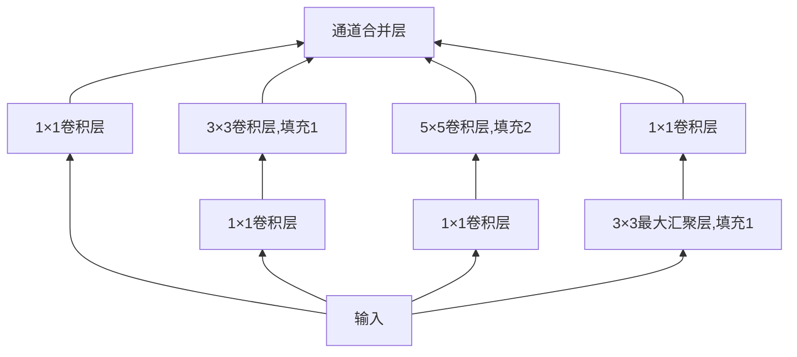

---
tags:
  - 深度学习
---
# 现代卷积神经网络

本节介绍几个著名的[[00_Inbox/深度学习/卷积神经网络]]，其中大部分都是 ImageNet 竞赛的优胜者。ImageNet 比赛是[[00_Inbox/深度学习/计算机视觉|计算机视觉]]领域的一个经典竞赛，由斯坦福大学的李飞飞等人在2010年发起。比赛的主要目标是通过对一组由1000万张图片组成的数据集进行图像分类任务，来推动计算机视觉领域的研究和发展。在 2010 年以来，ImageNet 竞赛一直是计算机视觉监督学习进展的风向标。

## AlexNet

AlexNet 于 2012 年被提出，首次证明了学习到的特征可以超过手动设计的特征，一举打破了计算机视觉研究现状。AlexNet 使用了 8 层卷积神经网络，并以很大的优势赢得了 2012 年 ImageNet 图像识别挑战赛。

AlexNet 的结构如下：![[Assets/Pasted image 20230526170645.png]] 它的结构与 LeNet 非常相似，但也存在差异：
1. AlexNet 比相对较小的 LeNet5 要深得多，AlexNet 由 8 层组成：5 个卷积层、2 个全连接隐藏层和 1 个全连接输出层。
2. AlexNet 使用 ReLU 而不是 Sigmoid 作为激活函数。
3. AlexNet 通过翻转、裁剪、变色等方式增加了大量数据，使得模型更加健壮。
4. AlexNet 增加了 Dropout 模块。

> [!note]  AlexNet 不仅仅是更大更深，更主要的是**量变到质变**，不再用人抽取特征，而是端到端的处理，直接预测。

## VGG

AlexNet 证明了深度神经网络的有效性，但是没有给出一个通用的模板来指导后续的研究人员设计新的网络。在 VGG 中，首次提出了使用块的想法，使得通过循环和子程序，可以很容易地在任何现代深度学习框架中实现这些重复的代码。

### VGG 块

经典卷积神经网络的基本组成部分是下面的序列：
- 带填充以保持分辨率的卷积层
- 非线性激活函数，例如 ReLU
- 汇聚层，如最大汇聚层
而一个 VGG 块与之类似，由一系列的卷积层组成，后面再加上用于空间采样的最大汇聚层。在最初的 VGG 论文中，作者使用了带有 3×3 卷积核、填充为 1（保持高度与宽度）的卷积层以及带有 2×2 汇聚窗口、步幅为 2（汇聚后分辨率减半）的最大汇聚层。

### VGG 网络

与 AlexNet 一样，VGG 网络可以分成两部分，第一部分主要由卷积层和汇聚层组成，第二部分由全连接层组成。VGG 神经网络中连接了几个 VGG 块，其中每个 VGG 块可以指定卷积层个数与输出通道数，全连接块则与 AlexNet 网络相同。![[Assets/Pasted image 20230526172346.png]]
```python
# VGG block
def vgg_block(num_convs, in_channels, out_channels):
	layers = []
	for _ in range(num_convs):
		layers.append(nn.Conv2d(in_channels, out_channels
								kernel_size=3, padding=1))
		layers.append(nn.ReLU())
		in_channels = out_channels
	layers.append(nn.MaxPool2d(kernel_size=2, stride=2))
	return nn.Sequential(*layer)
```

使用 VGG 块的方式，我们可以事先定义好每个 VGG 块的输出与卷积层的数量，然后使用循环创建神经网络。VGG 网络还有一个额外的发现，就是深层且窄的卷积比浅层且宽的卷积更加有效。

## NiN

由于使用全连接层神经网络就相当于完全放弃表征的空间结构，NiN 提供了一个非常简单的思路，就是在每个像素的通道上使用[[00_Inbox/深度学习/多层感知机|多层感知机]]，即完全不使用全连接层，而是使用 1×1 的卷积层。换句话说，NiN 网络不使用普通的全连接层，而是在通道维度使用全连接。

### NiN 块

NiN 块与 VGG 块的差别在于 NiN 块从一个普通的卷积层开始，后面是两个 1×1 的卷积层，这两个 1×1 卷积层充当带有 ReLU 激活函数的逐像素全连接层，第一层的卷积窗口形状通常由用于设置，随后的卷积窗口固定形状为 1×1。![[Assets/Pasted image 20230526174117.png]]
```python
# NiN block
def nin_block(in_channels, out_channels, kernel_size, strides, padding):
return nn.Sequential(
	nn.Conv2d(in_channels, out_channels, kernel_size, strides, padding),
	nn.ReLU(),
	nn.Conv2d(out_channels, out_channels, kernel_size=1),
	nn.ReLU(),
	nn.Conv2d(out_channels, out_channels, kernel_size=1),
	nn.ReLU()
)
```

### NiN 网络

NiN 在 AlexNet 网络不久后提出，显然是从 AlexNet 网络中得到了一些启示。NiN 网络使用窗口形状为 11×11、5×5 和 3×3 的卷积层，输出通道数与 AlexNet 网络相同。每个 NiN 块后面还有一个最大汇聚层，汇聚窗口为 3×3，步幅为 2。最后使用了一个全局平均汇聚层 (global average pooling layer)生成一个对数概率。 ![[Assets/Pasted image 20230527120029.png]]

## GoogLeNet

在 2014 年的 ImageNet 图像识别挑战赛中，GoogLeNet 网络架构大放异彩，其吸收了 NiN 中串联网络的思想，并在此基础上进行了改进。同时在论文中，解决了多大的卷积核最为合适的问题。

### Inception 块

GoogLeNet 中基本的卷积块称为 Inception 块。每个 Inception 块由四条并行路径组成，前三条路径使用窗口大小为 1×1、3×3 和 5×5 的卷积层，从不同空间提取信息。中间的 2 条路径在输入上执行 1×1 卷积以较少通道数，从而降低模型的复杂度。第四条路径使用 3×3 最大汇聚层，然后使用 1×1 卷积层来改变通道数。这 4 条路径都使用合适的填充以使输入与输出的高度与宽度一致，最后我们将每条路径上的输出在通道维度上合并，并构成 Inception 块的输出。在 Inception 块中，通常调整的超参数是每次输出通道数。


```python
# Inception block
class Inception(nn.Module):
	def __init__(self, in_channels, c1, c2, c3, c4, **kwargs):
		"""
		初始化，其中c1--c4是每条路径的输出通道数
		"""
		super().__init__()
		#路径1，单1x1卷积层
		self.p1_1 = nn.Conv2d(in_channels, c1, kernel_size=1)
		#路径2，1x1卷积层后接3x3卷积层
		self.p2_1 = nn.Conv2d(in_channels, c2[0], kernel_size=1)
		self.p2_2 = nn.Conv2d(c2[0], c2[1], kernel_size=3, padding=1)
		#路径3，1x1卷积层后接5x5卷积层
		self.p3_1 = nn.Conv2d(in_channels, c3[0], kernel_size=1)
		self.p3_2 = nn.Conv2d(c3[0], c3[1], kernel_size=5, padding=2)
		#路径4，3x3最大汇聚层后跟1x1卷积层
		self.p4_1 = nn.MaxPool2d(kernel_size=3, stride=1, padding=1)
		self.p4_2 = nn.Conv2d(in_channels, c4, kernel_size=1)

	def forward(self, x):
		p1 = F.relu(self.p1_1(x))
		p2 = F.relu(self.p2_2(F.relu(self.p2_1(x))))
		p3 = F.relu(self.p3_2(F.relu(self.p3_1(x))))
		p4 = F.relu(self.p4_2(self.p4_1(x)))
		return torch.cat([p1, p2, p3, p4], dim=1)
```

### GoogLeNet 网络

GoogLeNet 使用了 9 个 Inception 块和一个全局平均汇聚层来生成其估计值，Inception 层之间的最大汇聚层可以降低维度，第一个模块类似 AlexNet 和 LeNet，Inception 块的组合从 VGG 中继承，平均汇聚层避免了在最后使用全连接层。![[Assets/Pasted image 20230526181803.png]]
- GoogLeNet 第一个模块使用 7×7 卷积层，64 个通道。
- 第二个模块两个卷积层。第一个卷积层使用 1×1 卷积层，64 个通道，第二卷积层使用将通道数增加为 3 倍的 3×3 卷积层。
- 第三个模块串联两个完整的 Inception 块。第一个 Inception 块输出通道为 64+128+32+32=256，第二个 Inception 块输出通道 128+192+96+64=480
- 第四个模块串联了 5 个 Inception 块，其输出通道数分别为 192+208+48+64=512、160+224+64+64=512、128+256+64+64=512、112+288+64+64=528、256+320+128+128=832
- 第五个模块输出通道数为 256+320+128+128=832、384+384+128+128=1024
- 最后为一个全局平均汇聚层，将每个通道的宽度与高度变为 1

## 批量规范化

批量规范化 (batch normalization) 是一种常用的神经网络优化算法，用于加速神经网络的训练，提高模型的性能和鲁棒性。批量规范化的基本思想是对每一个批次（batch）的数据进行标准化处理，即让其满足均值为0、方差为1的分布。这样做可以加快神经网络的训练速度，降低对初始值的依赖性，从而提高模型的收敛速度和精度。

从形式上，用 $x\in B$ 表示来此小批量 $B$ 的输入，批量规范化根据下面的表达式转换输入 $x$：
$$
\mathrm{BN}(x)=\gamma\odot\frac{x-\hat\mu_B}{\hat\sigma_B}+\beta
$$
其中 $\hat\mu_B$ 是小批量 $B$ 的样本均值，$\hat\sigma_B$ 是小批量 $B$ 的样本标准差。拉伸系数 (scale parameter) $\gamma$ 与偏移系数 (shift parameter) $\beta$ 为形状与 $x$ 相同的参数，通过与其他模型参数一起学习获得，默认为 1 与 0。拉伸系数和偏移系数用于控制规范化后的数据的幅度和偏移，使得网络可以学习如何利用规范化后的数据进行更好的分类。具体来说，拉伸系数用于调整数据的范围，偏移系数用于调整数据的中心，这样就可以让网络更好地适应各种不同的数据分布。 

另外，批量规范化层在训练模式（通过小批量统计数据规范化）和预测模式（通过数据集统计规范化）中的功能不同。在训练模式下，我们无法使用整个数据集来估计均值和方差，因此只能根据每个小批量的均值和方差不断训练模型。而在预测模式下，可以根据整个数据集精确计算批量规范化所需的均值和方差。

批量规范化层和其他层的一个关键区别是，由于批量规范化在小批量上执行，因此我们不能像引入其他层那样忽视批量的大小，下面讨论全连接和卷积层，它们批量规范化的实现略有不同：
- 全连接层：我们通常将批量规范化运用在全连接层的仿射变换与激活函数之间，即 $h=\phi(\mathrm{BN}(Wx+b))$。
- 卷积层：对于卷积层我们可以同样在卷积操作之后，在非线性激活函数之前运用批量规范化，当卷积层有多个输出通道时，我们分别对每个通道使用批量规范化，这些通道有自己的拉伸参数和偏移参数，这两个参数是标量。
- 预测过程中的批量规范化：将训练好的模型用于批量规范化时，我们不再需要样本均值中的噪声以及在微批量上估计的每个小批量上产生的样本方差。其次，我们可能需要使用模型逐个对样本进行预测，一个常用的方法是通过移动平均估计整个训练集的样本均值和方差，并在预测集上使用他们得到确定的输出。换句话说，就是使用训练时获得的移动均值与移动方差来估计数据的均值与方差，使用这些来对测试集进行估计。

批量规范化的优点可以总结为以下几点：
1. 加快神经网络的训练速度，降低对初始值的敏感性，提高模型的收敛速度和精度。
2. 减少梯度消失和梯度爆炸问题，从而提高神经网络的训练稳定性和鲁棒性。
3. 可以作为一种正则化操作，有助于控制过拟合，提高模型的泛化性能。
4. 可以增强神经网络的非线性拟合能力，从而进一步提高模型的性能。

在 pytorch 中，我们可以通过 `nn.BatchNorm1d(in_shape)` 或者 `nn.BatchNorm2d(in_channels)` 等方法来创建批量规范化层。

## ResNet

深度残差网络 (Deep residual network) 是 CNN 历史上的里程碑事件，作者是何凯明 (Kaiming He)，张翔宇 (Xiangyu Zhang)，任少卿 (ShaoqingRen) 和孙剑 (Jiangxi Sun)，它们发现使用残差块可以训练更深的网络。

随着我们设计越来越深的网络，深刻理解新添加的层时如何提升网络性能变得非常重要。为了取得质的突破，我们需要一些数学基础。

### 假设空间

首先，假设有一类特定的神经网络架构，其假设空间 $\mathcal F$ 为可以学习得到的所有模型构成的集合，它包括学习率和其他超参数的设置。对于所有的 $f\in \mathcal F$，存在一些参数集，这些参数可以通过在合适的数据集上训练而获得。现在假设 $f^*$ 是我们真正想要的函数，如果 $f^*\in \mathcal F$，那么我们就可以通过训练得到它。但是通常不会那么幸运，所以我们尝试找到一个 $f^*_\mathcal F$，这就是 $\mathcal F$ 中的最佳选择。对于给定数据集，我们可以通过下面的最优化式子找到它：
$$
f_{\mathcal F}^*:=\arg\min_f L(X,y,f),\quad f\in \mathcal F
$$
为了得到最优的 $f^*$，我们只能通过设计更加强大的假设空间 $\mathcal F$。然而，当 $\mathcal F'\nsubseteq\mathcal F$ 时，我们无法保证新的参数空间更加接近于目标 $f^*$。![[Assets/Pasted image 20230526205958.png]] 而对于嵌套函数，即 $\mathcal F'\subseteq \mathcal F$，我们可以避免上面的问题。针对这个问题，何凯明等人提出了残差网络 (ResNet)，它在 2015 年 ImageNet 图像识别挑战赛上夺魁。残差网络的设计核心思想是每个附加层都应该更容易地包含原始函数作为其元素之一。对于新增加的层，如果我们可以将其训练为恒等函数，那么新模型和原模型将同样有效。于是，残差块 (residual bolck) 被提出，并对建立深度神经网络产生了深远的影响。

### 残差块

假设原始输入为 $x$，而希望学习的理想映射为 $f(x)$，我们可以直接使用神经网络拟合出 $f(x)$，也可以先使用神经网络拟合出残差 $g(x)=f(x)-x$，再通过跨层直接传递函数 $x$，相加得到 $f(x)$。实际上，残差映射在现实中往往更容易优化，以前面提到的恒等函数作为理想映射 $f(x)$，我们只需要将残差神经网络设置的偏置与权重设置为 0，得到的映射就是恒等函数。实际中，当理想映射 $f(x)$ 即为接近恒等函数映射时，残差映射也易于捕获恒等函数的细微波动。下面就是残差块的结构，在残差块中，输入可以通过跨层数据通路更快的向前传播。![[Assets/Pasted image 20230526211547.png]]
ResNet 沿用了 VGG 完整的 3×3 卷积块的设计。在残差块中有两个相同输出通道的 3×3 卷积层，每个卷积层后接一个批量规范化层和 ReLU 激活函数，然后通过跨层数据通道，跳过这两个卷积运算，将输入直接加在最后的 ReLU 激活函数之前。这样的设计要求两个卷积层的输入与输出形状相同，从而使它们可以相加。如果需要改变通道数，则需要引入一个额外的 1×1 卷积层来使通道数相同。![[Assets/Pasted image 20230526212204.png]]

```python
# res block
class Residual(nn.Module):
	def __init__(self, input_channels, num_channels,
				use_1x1conv=False, strides=1):
		super().__init__()

		self.conv1 = nn.Conv2d(input_channels, num_channels,
					kernel_size=3, padding=1, stride=strides)
		self.conv2 = nn.Conv2d(num_channels, num_channels,
					kernel_size=3, padding=1, stride=strides)
		if use_1x1conv:
			self.conv3 = nn.Conv2d(input_channels, num_channels
					kernel_size=1, stride=strides)
		else:
			self.conv3 = None
		self.bn1 = nn.BatchNorm2d(num_channels)
		self.bn2 = nn.BatchNorm2d(num_channels)

	def forward(self, x):
		y = F.relu(self.bn1(self.conv1(x)))
		y = self.bn2(self.conv2(y))
		if self.conv3:
			x = self.conv3(x)
		y += x
		return x
```

### ResNet 网络

ResNet 网络的结构如下：
- ResNet 网络的前两层与 GoogLeNet 相同，在输出通道为 64，步幅为 2 的 7×7 卷积层后，接步幅为 2 的 3×3 最大汇聚层。不同之处在与 ResNet 每个卷积层后增加了批量规范化层
- 后面四层为由若干个残差块组成的模块
	- 第一个模块所有残差块的输出通道同输入通道，步幅为 1
	- 后面三个模块在第一个残差块时将上一个的通道翻倍，并将高度与宽度减半 (步幅为 2)。
- 同 GoogLeNet ，在最后加入全局汇聚层以及全连接输出。
![[Assets/Pasted image 20230526213859.png]]

> [!note] 残差块使得很深的网络更加容易训练，对后续的深层神经网络设计产生了深远的影响。

## DenseNet

稠密连接网络 (DenseNet) 在某种程度上是 ResNet 的逻辑拓展，先从数学上了解。

回忆泰勒展开，泰勒展开将函数展开为了越来越高的项：
$$
f(x)=f(0)+f'(0)+\frac{f''(0)}{2!}x^2+\frac{f^{(3)}(0)}{3!}+\cdots
$$
同样的，ResNet 将函数展开为了：
$$
f(x)=x+g(x)
$$
如果我们想要将函数展开为超过两项，一种简单的方法就是 DenseNet。Dense 在 ResNet 的基础上，不再进行简单相加，而是也将其与后一层进行连接，于是得到了：
$$
x\to[x,f_1(x),f_2([f_1(x),x]),f_3([f_2([f_1(x),x],x),x]),\cdots]
$$
要做到这样不需要新的术语，我们只需要将每一层与前面的所有层连接起来，DenseNet 这个名字由此得来。稠密网络主要由两个部分组成：稠密块 (dense block) 和过渡层 (transition layer)。前者定义如何连接输入和输出，后者控制通道数，使其不会太复杂。

### 稠密块

DenseNet 中使用 ResNet 改良版批量规范化层、激活层和卷积层，即：
```python
def conv_block(input_channels, num_channels):
	return nn.Sequential(
		nn.BatchNorm2d(input_channels), nn.ReLU(),
		nn.Conv2d(input_channels, num_channels, 
			kernel_size=3, padding=1)
	)
```
一个稠密块由多个卷积块组成，每个卷积块上使用相同的输出通道，然而，在前向传播中，我们将每个卷积块的输入与输出在通道维度上连接。![[Assets/Pasted image 20230526221432.png]]
```python
class DenseBlock(nn.Module):
	def __init__(self,num_convs, input_channels, num_channels):
		super().__init__()
		layer = []
		for i in range(num_convs):
			layer.append(conv_block(
				num_channels * i + input_channels, num_channels
			))
		self.net = nn.Sequential(*layer)
	def forward(self, x):
		for blk in self.net:
			y = blk(x)
			x = torch.cat((x, y), dim=1)
		return x
```

卷积块的通道数控制了输出通道数相对于输入通道数的增长程度，因此也称为增长率 (growth rate)。

### 过渡层

由于每个稠密块都会带来通道数的增加，因此使用过度会过于复杂化模型，而过渡层用来控制模型复杂度，它通过 1×1 卷积层来减小通道数，并使用步幅 2 的平均汇聚层减半高度与宽度，进一步降低模型复杂度。

###  DenseNet 网络

DenseNet 网络的结构描述如下：
- 首先，DenseNet 使用与 ResNet 相同的单卷积层和最大汇聚层。
- 接下来使用 4 个稠密块，与 ResNet 类似，可以设置每个稠密块使用多少卷积层，这里使用 4 个卷积层，稠密块的增长率设为 32，即每个稠密块将会增加 128 个通道。
- 在每个模块之间，使用过渡层来减半宽度与高度，并减半通道数。