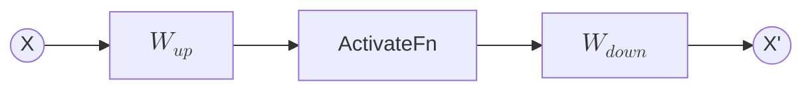

---
tags:
  - 深度学习
---

# 门控线性单元

在神经网络中，激活函数用于在线性变换之后引入非线性。单纯的线性层无论堆叠多少层，整体仍然可以等价为一次线性变换；激活函数使模型能够表达更复杂的函数关系。因此，在前馈网络中，激活函数通常位于两层线性映射之间，承担对中间特征进行筛选、压缩或平滑调制的作用。

一般意义上的 FFN *(feed-forward neural network，前馈神经网络)*，多层感知机可以看作其中最常见的形式，一般的计算形式为：

$$
Z = \phi(XW^{T} + b)
$$

其中 $X$ 是输入，$W$ 是线性层权重，$\phi$ 是激活函数，$Z$ 是激活后的中间表示。在经过多次上述变换后，输出层将中间表示映射到输出维度上：

$$
O = ZW_{\text{out}}^{T}
$$

在 Transformer 的 FFN 中，输入通常为 `[BatchSize, SeqLen, Hidden]`。FFN 对每个 token 的 hidden vector 独立进行相同的非线性变换，通常先升维到 `Intermediate`，再降维回 `Hidden`。因此，一层 Transformer FFN 可以写作：

$$
\mathrm{FFN}(X) = \phi(XW_{\text{up}}^{T})W_{\text{down}}^{T}
$$

其中 $W_{\text{up}}$ 将 hidden vector 投影到中间维度，$W_{\text{down}}$ 将中间表示投影回原 hidden 维度。



> [!info] 常用的传统激活函数
> - **Sigmoid**：Sigmoid 会将输入压缩到 $(0, 1)$ 区间，常用于早期神经网络和门控结构中。它的输出有明确的“通过比例”含义，但在输入绝对值较大时容易进入饱和区间，导致梯度变小。
> $$
> \sigma(x) = \frac{1}{1 + e^{-x}}
> $$
> - **tanh**：tanh 会将输入压缩到 $(-1, 1)$ 区间，相比 Sigmoid 具有零中心输出的特点。它也存在饱和区间，因此在很深的前馈网络中较少作为主流 FFN 激活函数。
> $$
> \tanh(x) = \frac{e^x - e^{-x}}{e^x + e^{-x}}
> $$
> 
> - **ReLU**：ReLU 将负值截断为 0，保留正值。它计算简单，梯度路径清晰，也容易形成稀疏激活。原始 Transformer 的 FFN 使用的就是 ReLU。
> $$
> \mathrm{ReLU}(x) = \max(0, x)
> $$
> - **GELU**：GELU 使用平滑方式对输入进行加权，相比 ReLU 的硬截断更加连续，因此在 BERT、GPT 等语言模型中被广泛采用。公式中 $\Phi(x)$ 是标准正态分布的累积分布函数。
> $$
> \mathrm{GELU}(x) = x\Phi(x)
> $$

> [!note] bias 去哪了？
> 原始 Transformer 的 FFN 公式中包含 bias，但许多现代 LLM 实现会在 Attention 和 FFN 的主要线性层中设置 `bias=False`。这通常是一种性能和工程上的权衡，而不是表示 bias 在数学上没有作用。
>
> 在线性层中，bias 提供与输入无关的平移项：
> $$
> Y = XW^T + b
> $$
> 对于 LLaMA-style 架构，模型中已经存在 RMSNorm、残差连接和多层线性投影。bias 带来的额外表达能力通常较小，而去掉 bias 可以减少参数、简化计算路径，并使矩阵乘法、门控激活和推理 kernel 更容易优化。GLU variants 的论文在比较 Transformer FFN 变体时也省略了 bias terms；LLaMA 系列架构进一步强化了这种 bias-free linear layer 的实现习惯。

## GLU

GLU **(Gate Linear Unit, 门控线性单元)** 引入了另一种思路：将中间表示拆分为两条分支。一条分支生成候选特征，另一条分支生成 gate。gate 用于控制候选特征中哪些部分应该通过、哪些部分应该被抑制。二者通过逐元素乘法结合：

$$
\mathrm{GLU}(X) = (XW_{\text{up}}^{T}) \odot \sigma(XW_{\text{gate}}^{T})
$$

其中 $W_{\text{up}}$ 生成 value 分支，$W_{\text{gate}}$ 生成 gate 分支，$\sigma$ 通常表示 **Sigmoid 函数**，$\odot$ 表示逐元素乘法。

```mermaid
flowchart LR
    X((X))
    UP["$$W_{up}$$"]
    GATE["$$W_{gate}$$"]
    SIG["ActivateFn"]
    MUL(("$$\odot$$"))
    O((Z))

    X --> UP --> MUL
    X --> GATE --> SIG --> MUL
    MUL --> O
````

在这个结构中，$XW_{\text{up}}^{T}$ 提供候选特征，$\sigma(XW_{\text{gate}}^{T})$ 提供取值在 $(0, 1)$ 之间的门控权重。因此，GLU 可以理解为一种显式的特征选择机制。普通激活函数通过固定函数形状调制输入，GLU 则通过一条额外的可学习分支生成 gate，使不同输入可以产生不同的特征通过模式。

将 GLU 放入 Transformer FFN 后，加上输出层映射，就得到了 GLU 风格的 FFN 层。

$$
\mathrm{FFN}_{\text{GLU}}(X) = \left( XW_{\text{up}}^{T}
\odot
\sigma(XW_{\text{gate}}^{T})
\right)
W_{\text{down}}^{T}
$$

与传统 FFN 相比，GLU 多出一个 $W_{\text{gate}}$ 分支。这个分支使 FFN 不再只依赖单个激活函数对中间特征进行固定形式的变换，而是可以根据输入动态生成门控权重。

## SwiGLU

SwiGLU **(Swish-Gated Linear Unit)** 是 GLU 在 Transformer FFN 中的一种常用变体。原始 GLU 使用 Sigmoid 生成 gate，而 SwiGLU 将 gate 分支中的 Sigmoid 替换为 Swish / SiLU 激活函数。SiLU 的定义为：
$$
\mathrm{SiLU}(x) = x \cdot \sigma(x)
$$
因此，SwiGLU 可以写作：
$$
\mathrm{SwiGLU}(X) =
(XW_{\text{up}}^{T}) \odot \mathrm{SiLU}(XW_{\text{gate}}^{T})
$$
将它放入 Transformer FFN 后，再通过输出映射回原 hidden 维度：
$$
\mathrm{FFN}_{\text{SwiGLU}}(X)
=
\left(
XW_{\text{up}}^{T}
\odot
\mathrm{SiLU}(XW_{\text{gate}}^{T})
\right)
W_{\text{down}}^{T}
$$

```mermaid
flowchart LR
    X((X))
    UP["$$W_{up}$$"]
    GATE["$$W_{gate}$$"]
    SILU["SiLU"]
    MUL(("$$\odot$$"))
    DOWN["$$W_{down}$$"]
    O((X'))

    X --> UP --> MUL
    X --> GATE --> SILU --> MUL
    MUL --> DOWN --> O
````

> [!note] SwiGLU 与 GLU 的区别
> GLU 使用 Sigmoid 作为 gate 激活，门控值被压缩到 $(0, 1)$ 区间，因此它更像一个显式的通过比例。
>
> SwiGLU 使用 SiLU 作为 gate 激活。SiLU 的形式为 $x \cdot \sigma(x)$，它不会把输出严格限制在 $(0, 1)$，而是保留了输入幅度信息，并通过 Sigmoid 进行平滑调制。因此，SwiGLU 的 gate 分支不仅可以控制通过比例，也可以携带更丰富的连续强度信息。

> [!info] GLU variants
> 在 Transformer FFN 中，GLU 的 gate 激活可以替换为不同函数，由此得到多个变体：
>
> - ReGLU：使用 ReLU 作为 gate 激活
> - GEGLU：使用 GELU 作为 gate 激活
> - SwiGLU：使用 Swish / SiLU 作为 gate 激活
>
> 这些结构共享相同的双分支门控形式，区别在于 gate 分支的非线性函数。

> [!example] 常见激活函数图像
> ![[98_Assets/GLU.png]]
