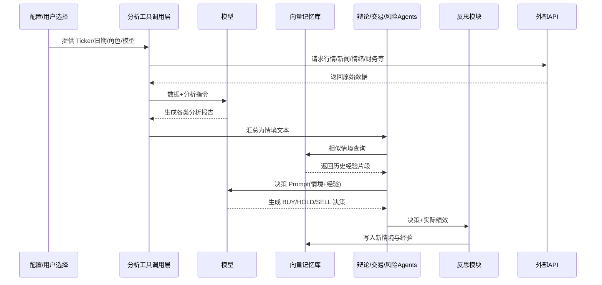

# 供应链大模型系统参考分析报告（基于 TradingAgents 项目）

## 1. 项目概览

### 项目目标与核心功能

- 多智能体协作：模拟真实投研 + 交易 + 风险控制流程，通过分析、辩论、裁决、执行生成最终 “BUY/HOLD/SELL” 决策。
- 数据多源融合：支持股票行情、技术指标、新闻、基本面、社交/情绪（通过可选 Alpha Vantage、yfinance、OpenAI 搜索等）。
- 过程可追溯：`trading_graph` 构建 LangGraph 工作流，状态包含各阶段报告、辩论历史与风险评估。
- 反思与经验沉淀：reflection.py + `FinancialSituationMemory`（Chroma + OpenAI Embeddings）对结果进行事后分析并写入记忆，用于后续决策提示。

### 适用场景与主要用户群体

- 研究型场景：多轮观点交叉验证与合成（投研、策略评估）。
- 自动化决策实验：评估多智能体结构在金融决策上的有效性。
- 可扩展到任意结构化/半结构化数据驱动的分析决策任务（供应链风险、市场监测等）。
- 目标用户：量化研究人员、AI Agent 系统架构师、学术与企业研究团队。

### 图示结构解读与角色速览

下述附图（多源数据→多角色讨论→交易与风险→管理授权→执行）展示了核心分层：

1. 数据采集层（Market / Social Media / News / Fundamentals）：分别从行情、社交平台、新闻源、财务与公司信息拉取原始数据；对应代码中的各 Analyst 工具节点。
2. 研究者辩论层（Bullish / Bearish）：多空观点以“证据”形式向 Trader 输出（图中绿色箭头代表买入证据，红色箭头代表卖出证据）。
3. 交易策略层（Trader）：整合双向证据生成初步交易方案（Transaction Proposal）。
4. 风险管理层（Aggressive / Neutral / Conservative）：图示名称与代码中 Risky / Neutral / Safe Analyst 对应；它们从不同风险偏好角度审视方案，补充风险信息。
5. 管理裁决层（Manager / Risk Judge）：深度思考模型（图示中的 “OpenAI o1 Deep Thinking” 对应配置里的 `deep_think_llm`）对提案进行最终授权/调整。
6. 执行层（Execution）：生成标准化 BUY/HOLD/SELL 决策（或在供应链场景中映射为执行策略/预警级别）。

角色职责对照表：

| 角色 (图示)              | 代码命名                          | 职责要点         | 输出形式        |
| -------------------- | ----------------------------- | ------------ | ----------- |
| Market Analyst       | Market Analyst                | 行情与技术信号整理    | 市场报告文本 + 表格 |
| Social Media Analyst | Social/Sentiment Analyst      | 社交/情绪脉冲分析    | 情绪报告        |
| News Analyst         | News Analyst                  | 新闻与宏观事件解读    | 新闻报告        |
| Fundamentals Analyst | Fundamentals Analyst          | 财务、报表、公司质量评估 | 基本面报告       |
| Bullish Panel        | Bull Researcher               | 多头证据构建、反驳空头  | 多头论据片段      |
| Bearish Panel        | Bear Researcher               | 空头证据构建、反驳多头  | 空头论据片段      |
| Trader               | Trader                        | 汇总证据→初步交易建议  | 包含决策标记的提案   |
| Aggressive Risk      | Risky Analyst                 | 高风险偏好视角评估    | 风险观点片段      |
| Neutral Risk         | Neutral Analyst               | 中性风险分析       | 风险观点片段      |
| Conservative Risk    | Safe Analyst                  | 保守风险控制建议     | 风险观点片段      |
| Manager              | Risk Judge / Research Manager | 综合风险 + 策略做最终裁决 | 最终决策/指令     |

线性主流程（与图示箭头对应）：

数据采集 → 四类报告 → 多空辩论 → Trader 汇总 → 风险多视角评估 → 深度裁决 (Manager) → 执行 & 结果记录 → 反思写入记忆。

命名差异说明：图示中的 Aggressive/Neutral/Conservative 与代码中的 Risky/Neutral/Safe 语义一致；Manager 在代码里由 `Research Manager`（投资辩论裁决）与 `Risk Judge`（风险裁决）组合完成。

### 角色输入 / 处理 / 输出与现实示例

以下针对每个核心角色给出：输入来源 (Input) → 处理逻辑 (Process) → 输出 (Output) → 现实可接入的具体数据示例 (Real World Examples)。

#### Market Analyst

- Input: `trade_date`, `company_of_interest`; 工具 `get_stock_data`, `get_indicators` 返回的价格序列、成交量、技术指标 (如 MACD, RSI, EMA)。
- Process: 将原始指标与价格变化进行趋势归类（上涨/盘整/下跌）、识别形态或波动加剧点；可能添加简单统计（过去 N 日涨跌幅、振幅）。
- Output: `market_report`（结构化自然语言 + 可选指标表格）。
- Real World Examples: Yahoo Finance / yfinance API 抓取日线 & 分钟线；Alpha Vantage 技术指标端点；补充波动率 (HV)、成交额排名。

#### Social Media (Sentiment) Analyst

- Input: `trade_date`, 工具 `get_news`（在社交模式下可替换为 OpenAI web_search 或内部抓取），社交平台原文（X 帖子、Reddit 讨论串标题与正文）、点赞/评论/转发量。
- Process: 分词与情绪打分（可对接情绪模型或关键词情绪词典）、主题聚类（热点话题）、噪声过滤（广告/重复贴）；生成聚合指标：正向比率、讨论量环比、突发情绪尖峰。
- Output: `sentiment_report`（包含“总体情绪倾向 + 主要话题 + 异常峰值”段落）。
- Real World Examples: Reddit API (subreddit: investing, stocks)、X API（品牌/公司名标签搜索）、EODHD 文章/社交端点等。

#### News Analyst

- Input: 工具 `get_news`, `get_global_news`, `get_insider_sentiment`, `get_insider_transactions` 返回新闻摘要、事件标签（并购/监管/宏观数据发布）、内部人士交易方向与规模。
- Process: 分类（宏观 vs 公司特定 vs 行业链条）、影响映射（利好/中性/利空），筛选高置信事件；合并重复来源确保去重；对时间窗口内事件排序（最新→最重要）。
- Output: `news_report`（事件列表 + 影响解读 + 潜在风险或机会段落）。
- Real World Examples: Reuters/Bloomberg 标题摘要（需授权）、Alpha Vantage NEWS_SENTIMENT、公司公告抓取、行业协会发布。

#### Fundamentals Analyst

- Input: 工具 `get_fundamentals`, `get_balance_sheet`, `get_cashflow`, `get_income_statement` 返回财务指标（营收、毛利率、现金流、负债率、ROE）、历史报表条目。
- Process: 对比同比/环比变化，识别质量趋势（盈利质量、现金流覆盖、杠杆风险）、提炼关键 KPI；构造指标对照表与风险提示（如存货周转恶化）。
- Output: `fundamentals_report`（深入描述 + 指标 Markdown 表格）。
- Real World Examples: SEC 报表解析、Alpha Vantage fundamentals、公司年报/季报 PDF OCR、内部财务数据库。

#### Bull Researcher

- Input: 聚合情境文本（四类报告）、`investment_debate_state.history`、记忆检索结果（成功案例经验）。
- Process: 抽取利好证据（增长、优势、正面事件）、针对 Bear 观点逐条反驳、引用历史成功模式支持论证结构。
- Output: 更新 `bull_history` 与 `investment_debate_state.current_response`（标记“Bull Analyst:”前缀）。
- Real World Examples: 使用历史场景：强劲财报 + 社交情绪正向 → 强调扩张潜力。

#### Bear Researcher

- Input: 与 Bull 类似但聚焦风险面：估值过高、财务下行、负面新闻、情绪过热信号；读取上一轮 Bull 论述。
- Process: 构建风险清单 + 量化证据（估值偏离、波动放大）、引用过往失败案例提示防范。
- Output: 更新 `bear_history` 与当前回应。
- Real World Examples: 利用历史“高位放量 + 负面监管担忧”案例强化卖出论据。

#### Research Manager

- Input: 辩论全历史（多空轮次）、四类报告、记忆检索经验。
- Process: 综合证据权重；筛选冗余与情绪化论点；形成中立投资计划（仓位大小/执行节奏/观察条件）。
- Output: 在 `investment_debate_state.judge_decision` 与全局 `investment_plan` 中记录结构化计划。
- Real World Examples: 结合“宏观降息预期 + 基本面改善”与“短期估值偏高”→给出分批买入策略。

#### Trader

- Input: `investment_plan`、四类报告、记忆检索、辩论裁决。
- Process: 将计划转化为明确交易决策（买/卖/持有），引用过往经验做风险提醒（如设置止损/跟踪指标）。
- Output: `trader_investment_plan`（包含 "FINAL TRANSACTION PROPOSAL:" 标记）。
- Real World Examples: 输出：“BUY — 分批 3 日建仓，止损 5%。”

#### Risk Layer (Risky / Neutral / Safe Analysts)

- Input: Trader 初步提案 + 情境文本 + 记忆（历史风险教训）。
- Process: 各自基于风险偏好生成批注：
    - Risky: 强调机会最大化，愿意承受波动；
    - Neutral: 平衡收益与风险，建议调整仓位；
    - Safe: 关注资本保全，强调缩减或分阶段监控。
- Output: 分别写入 `risk_debate_state.risky_history` / `neutral_history` / `safe_history`，并更新轮次与最新发言标识。
- Real World Examples: Risky 可能建议“扩大仓位抓取动量”；Safe 建议“仅小试仓位并等待监管事件落地”。

#### Risk Judge (Risk Manager)

- Input: 全部风险发言历史、Trader 方案、情境文本、记忆经验。
- Process: 归纳差异、评估是否需要调低/调高仓位与附加保护（对冲、止损、分批）；引用历史失败风险模式（如未设置止损导致过度回撤）。
- Output: `risk_debate_state.judge_decision` 与最终 `final_trade_decision`（标准化决策表达）。
- Real World Examples: “保持 BUY 但降仓位至 50%，设置波动率触发止损”。

#### Reflector & Memory System

- Input: 最终决策 + 实际结果（收益或供应链 KPI）+ 原始情境文本。
- Process: 生成反思：正确/错误归因、因素权重、改进建议、总结语句。写入向量库形成 (情境 → 经验)。
- Output: 新的嵌入记录；后续检索时成为补强证据。
- Real World Examples: 记录“忽视资金流出信号导致回撤”→未来类似资金流出场景优先提示。

#### 输入输出映射速览（字段级）

- 市场/社交/新闻/基本面分析节点：写 `market_report` / `sentiment_report` / `news_report` / `fundamentals_report`。
- 多空辩论：追加 `bull_history`, `bear_history` + 更新 `investment_debate_state.current_response`。
- 投研裁决：写入 `investment_plan` 与 `investment_debate_state.judge_decision`。
- Trader：写入 `trader_investment_plan`。
- 风险辩论：写入 `risk_debate_state.risky_history` / `safe_history` / `neutral_history`。
- 风险裁决：写入 `risk_debate_state.judge_decision` 与 `final_trade_decision`。
- 反思：通过 memory.add_situations() 增加嵌入与经验文本。

#### 供应链场景对应替换举例（再扩展）

- Market → 库存/需求波动分析；指标：库存周转、缺货率、预测偏差。
- Social Media → 供应商舆情、客户投诉、物流延迟社交反馈；处理：情绪趋势 + 主题聚类（延迟/质量/价格）。
- News → 政策公告、港口罢工、极端天气预警；分类：影响范围与预计持续时间。
- Fundamentals → 供应商财务稳定性、信用评分、合同履约历史。
- Bull/Bear → “扩充采购” vs “收缩订单” 论据；Trader → 采购策略与安全库存调整；Risk Layer → 库存风险/交付风险/资金占用风险偏好分层；Final Decision → 调整库存策略/发布风险预警等级。

## 2. 知识管理机制

### 外部知识收集方式

- API 抽象：`dataflows/` 目录下按类别封装（`alpha_vantage_*`, `y_finance`, openai.py, `google.py` 等），通过工具函数（如 `get_news`, `get_fundamentals`, `get_indicators`）。
- 工具绑定：在各分析 Agent 中通过 `llm.bind_tools(tools)` 触发实时调用。
- 动态检索：OpenAI `responses.create` 使用内置 `web_search_preview`（与实时搜索整合）——用于宏观新闻与社交讨论。
- 记忆数据：`reflection` 阶段基于市场 + 报告文本组合构造“情境”，Embedding 入 Chroma；后续辩论与交易 Agent 使用 `memory.get_memories()` 进行相似情境检索。

### 知识融合 / 注入策略

- 轻量检索增强：使用 OpenAI Embeddings + Chroma 向量相似度检索过往“情境→建议”记忆（属于简易 RAG 子集），在 `bull_researcher`, `bear_researcher`, `trader`, `risk_manager` 等节点拼接 past lessons 提示。
- 无显式知识图谱：未发现实体关系建模逻辑（信息不足，基于通用模式推测：可扩展为供应链实体—事件—风险图）。
- 无模型微调代码：均为调用外部通用 LLM（信息不足，推测可在未来通过指令微调或 LoRA 增强领域适配）。
- 记忆粒度：情境文本为四类报告串联（市场/情绪/新闻/基本面），反思产出高密度经验描述，用于后续语义提示增强。
- 未见缓存层与 TTL 策略：数据 vendor 访问频率控制主要依赖外部 API 限额。

#### 知识注入数据流（简化、侧重概念而非实现）

下面用“从原始外部数据到最终决策再回流为经验”全过程，说明知识在系统里的流动与被“注入”到模型的具体节点。

1. 参数配置阶段：用户或上层调度通过配置（Ticker、日期、所选分析角色、LLM 型号、Vendor）确定数据抓取范围与处理深度。
2. 外部数据访问：各 Analyst（市场/新闻/情绪/基本面）按顺序被激活；每个 Analyst 调用绑定工具函数向外部 API 请求结构化或半结构化数据（价格序列、指标、新闻条目、社交摘要、财务表格等）。
3. 原始数据拼接进 Prompt：工具返回的结果（通常为 JSON/表格/文本片段）被直接拼接进该 Analyst 的系统 + 用户提示中，模型就地生成一段“报告”（仍是自然语言 + 可附加 Markdown 表格）。这一步是第一层“知识注入”——把新鲜外部数据转换为归纳后的语义摘要。
4. 报告聚合：四类报告被串联形成一个“情境文本”（market + sentiment + news + fundamentals）。该合并文本成为后续所有上层推理（辩论、交易、风险评估）的共享语义底座。这里发生第二层“知识注入”——跨域信息融合成统一上下文载体。
5. 语义记忆检索：进入辩论或交易节点前，系统将当前情境文本作为查询向量到 Chroma；检索出若干最相似历史情境及其经验/反思总结（包含过去成功/失败要点、修正建议）。这是第三层“知识注入”——引入历史经验作为少样本补强与偏差校正。
6. 决策 Prompt 组装：辩论者或 Trader/Risk Judge 的最终提示由三部分组成：
   - 当前情境（新分析结果）
   - 历史经验（检索出的 recommendation 片段）
   - 角色指令（明确产出形式、要求给出 BUY/HOLD/SELL 等）
   通过并列呈现“当前事实 + 历史 lesson”，模型在推理时自然完成动态加权与对比，生成更稳健的论证或决策——第四层“知识注入”。
7. 输出截取与标准化：含有显式标记的最终决策被下游解析，用于执行或记录；此时决策本身成为一个新的“知识候选”。
8. 结果与绩效反馈：系统事后获得真实收益/风险指标（或在供应链场景下的 KPI：交付准时率、库存健康度等）。这些反馈与当时决策内容再次组成“反思 Prompt”，模型产出结构化经验总结（正确/错误原因、改进方向、压缩结论）。
9. 经验持久化：反思结果与原始情境文本一起写入向量库，形成可检索的“情境→经验”对；循环闭合，等待下次相似情境被引用。

#### 关键“注入”触点速览

- 原始数据→分析报告：数据被语义压缩，便于后续统一上下文。
- 多报告合并→情境文本：跨维度（行情/新闻/情绪/基本面）拼接形成全局视角。
- 检索记忆→Prompt：历史经验不覆盖原始事实，只追加在尾部或特定段落，避免“污染”而是“补强”。
- 反思→记忆：引入绩效标签后将决策质量显式编码进向量空间，支持后续基于“成功模式”优先检索。

#### 简化交互时序（Mermaid）



#### 失败模式与改进点（迁移供应链时需关注）

- 情境文本过长：易触发上下文截断；需拆分维度并做分层检索。
- 经验泛化不足：当前推荐直接拼接，未做结构化标签（如“供应风险/运输中断/价格剧烈波动”）。
- 缺少置信度：记忆检索相似度无与决策最终置信度联动，可增加评分与过滤阈值。
- 没有数据质量校验：原始 API 异常或缺失未被监控；需在注入前添加校验/补全步骤。
- 单一向量空间：不同角色经验混合检索可能造成语义漂移；可分角色或分风险类型建立多个集合。

#### 迁移到供应链的简单替换示例

- 工具替换：`get_stock_data` → `get_inventory_levels`; `get_news` → `get_supplier_disruption_events`; `get_fundamentals` → `get_supplier_financial_health`。
- 情境拼接：行情→库存；新闻→供应商与物流事件；情绪→舆情/社交投诉；基本面→供应商稳定性与合同条款。
- 绩效反馈：收益率→履约率、延迟率、额外成本、风险处置时间；反思输出作为运营策略迭代输入。

## 3. Agent 架构与交互逻辑

### 架构类型

- 典型多智能体分层：
  - 分析层：`market`, `social`, `news`, `fundamentals` Analysts（串行运行，条件判断是否继续调用工具或结束本阶段）。
  - 观点辩论层：Bull / Bear Researchers（双向辩论，轮数受 `max_debate_rounds` 控制，历史累计在 `investment_debate_state`）。
  - 裁决层：Research Manager（整合辩论与报告做交易前决策计划）。
  - 执行层：Trader（基于计划与记忆作出投资建议并规范输出格式）。
  - 风险复审：Risky / Safe / Neutral Analysts 多轮意见后由 Risk Judge（Risk Manager）最终裁决。
  - 反思层：Reflector 写入多类角色记忆。

### 任务规划与工具调用

- LangGraph 状态机：setup.py 中显式定义节点与条件边；工具节点（ToolNode）聚合不同功能类别。
- 条件分支：conditional_logic.py 根据消息是否包含 `tool_calls` 决定是否继续工具调用；辩论轮次计数决定何时转入裁决。
- 输出规范：Trader 与 Risk Manager Prompt 中强制添加 'FINAL TRANSACTION PROPOSAL: **BUY/HOLD/SELL**' 标记便于下游截取。
- 记忆注入：在生成辩论或决策 Prompt 时附加相似历史的 `recommendation` 集合（带语义召回的少样本提示）。
- 工具抽象：各工具函数独立，便于替换数据源（供应链场景可插入内部 API 或数据湖接口）。

### 动态反思与反馈闭环

- 反思触发：需外部提供真实结果或收益（`reflect_and_remember(returns_losses)`），将当前状态 + 绩效传入各角色反思。
- 反思内容：包含正确/错误判定、因素权重、改进建议、经验总结、压缩语句（方便后续引用）。
- 闭环利用：后续决策读取记忆（相似情境检索）提供 lesson learned；属于简化性能反馈循环。
- 用户交互：CLI 可调整日期、Ticker、模型与研究深度；未见显式在线纠偏接口（信息不足，基于通用模式推测：可加用户审核打分进入记忆）。

## 4. 供应链场景适配性分析

### 可直接复用的设计

- 多阶段流水线：分析→辩论→裁决→风险复审→反思，与供应链“监测→诊断→策略评估→风险评估→执行→复盘”高度对齐。
- 工具抽象层：便于将行情类工具替换为供应链数据工具（库存异常、物流延迟、采购价格波动、政策事件抓取）。
- 简易 RAG 记忆：历史风险事件与处置建议可写入向量记忆，供后续相似供应链情境检索。
- 可配置性：`default_config` 中集中管理模型、轮数、Vendor，易于扩展成内部数据源优先策略。
- 决策格式标准化：最终输出的统一标签便于自动落地为告警或执行指令。

### 需扩展的能力

- 实时监控：增加长驻采集/Streaming（Kafka/消息队列）对库存、运输、订单、合规事件实时刷新（当前为同步调用）。
- 多源风险信号融合：添加特征归一与权重建模（现阶段为文本拼接，缺少结构化评分框架）。
- 合规与政策解析：新增法规文档检索工具 + 专用分析 Agent（监管政策→影响路径）。
- 知识图谱/事件链：对“供应商→零部件→订单→物流节点→客户”关系建模支撑因果追踪（项目中未实现）。
- 反馈精细化：将执行后 KPI（交付准时率、库存周转率、风险响应时长）写入反思，细化到多维指标。
- 多目标优化：扩展 Trader 逻辑支持成本、服务水平、风险暴露联合优化（目前硬编码为单一 BUY/HOLD/SELL）。
- 访问控制与审计：引入权限层与操作日志（当前仅保存 JSON 状态，无审计策略）。
- 决策置信度：增加不确定性估计（当前输出无概率或分值）。

### 潜在技术挑战或局限性

- 向量记忆粒度粗：情境为长文本拼接，供应链场景需结构化分层（事件/指标/异常类型）。
- 工具调用成本高：多轮 LLM + 多 API 在高频实时监控中可能不可持续。
- 缺少异常检测算法：无专用时间序列/图检测模块（需集成统计或 ML 异常模型）。
- 反思依赖外部收益标签：供应链里需定义清晰绩效与风险量化反馈来源。
- 缺少多任务并发调度：当前串行分析对大规模品类或多地区网络扩展性有限。
- 安全与合规未体现：无敏感数据隔离策略。

## 5. Mermaid 体系流程图

```mermaid
flowchart LR
    subgraph ExternalData[外部与内部数据源]
        A1[行情/价格(yfinance/AV)] 
        A2[技术指标] 
        A3[新闻/宏观(AV/OpenAI搜索)] 
        A4[社交/情绪(OpenAI搜索)] 
        A5[基本面/财务(AV)]
        A6[(供应链扩展: 库存/物流/订单/法规):::future]
    end

    subgraph DataFlow[Dataflows 工具层]
        D1[get_stock_data]
        D2[get_indicators]
        D3[get_news & get_global_news]
        D4[get_fundamentals / balance_sheet / cashflow / income_statement]
        D5[get_insider_sentiment & transactions]
        D6[(供应链自定义工具):::future]
    end

    subgraph Analysts[分析阶段]
        M[Market Analyst]
        S[Social/Sentiment Analyst]
        N[News Analyst]
        F[Fundamentals Analyst]
        X[(SupplyChain Analysts: 库存/运输/风险):::future]
    end

    subgraph Debate[观点辩论]
        BULL[Bull Researcher]
        BEAR[Bear Researcher]
        RM[Research Manager(裁决)]
    end

    subgraph Trade[交易/策略层]
        T[Trader]
        RISKY[Risky Analyst]
        SAFE[Safe Analyst]
        NEUTRAL[Neutral Analyst]
        RJ[Risk Judge]
    end

    subgraph Memory[记忆与反思]
        REF[Reflector]
        MEM[(Chroma Embeddings)]
    end

    subgraph Output[输出]
        O1[最终决策 BUY/HOLD/SELL]
        O2[(供应链扩展: 风险告警/策略建议/报告生成/问答接口):::future]
    end

    ExternalData --> DataFlow
    DataFlow --> Analysts
    Analysts --> Debate
    Debate --> Trade
    Trade --> O1
    O1 --> REF
    REF --> MEM
    MEM --> BULL
    MEM --> BEAR
    MEM --> T
    MEM --> RJ
    MEM --> RM

    Analysts --> X
    Trade --> O2
    classDef future fill:#f5f5f5,stroke:#999,stroke-dasharray:3 3,color:#555;
```

## 总结与迁移建议（可用于技术评审）

- 核心思想：多角色结构化分工 + 语义记忆反馈循环，可直接迁移到供应链风险预警（角色替换：采购风险分析、物流异常分析、需求波动分析、合规策略分析、决策协调者、执行控制与风险复审）。
- 近期可实施：替换工具层为内网 API；扩展记忆索引结构；增加异常检测模块；在 Trader 输出中增加多维指标评分与置信度。
- 中期规划：引入知识图谱 + 事件链推理；在线强化学习或策略 A/B 对比；用户反馈回路（人工运营人员评分进入记忆）。
- 长期演进：多组织协作（跨区域仓配网络）、自适应优先级调度、策略仿真沙盒。

## 信息不足与推测声明

- 未发现：模型微调、知识图谱、复杂特征工程、性能监控模块、权限控制、并发分布式调度实现。
- 标注“信息不足，基于通用模式推测”部分为合理扩展方向而非当前仓库既有能力。