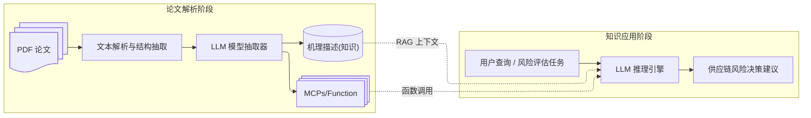

# 调研

> [!definition] 目标
> 通过对学术论文中提出的模型与机理进行自动化提取与结构化表示，使其能够被大语言模型（LLM）理解和调用，从而辅助供应链风险评估与决策支持。

> [!warning] 假设条件
> 1. 输入论文的内容真实、理论正确且包含完整的方法描述。
> 2. LLM 具备基本的领域知识（供应链管理、运筹优化、经济模型等）。
> 3. 提取工具具备对 PDF/文本的语义解析能力（可调用 OCR、NLP、结构分析模型）。

> [!tip] 输入输出怎么界定？我们需要实现的是什么效果？
> - 已知：
> 	- 输入可能有供应链网络结构
> 	- 业界知识 (知识图谱、纯文本形式？)
> 
> - 目标效果：
> 	- 提取论文中的模型 (MCP, Function Call)，并将接口暴露给大模型？
> 	- 提取机理，作为 **知识 (或者上下文？)** 提供给大模型?

## 现有系统与研究现状分析

目前的主流工作集中在两方面：
1. 文本理解与结构化提取
	- 典型技术：信息抽取（IE）、语义解析（Semantic Parsing）、文献知识图谱（Scholarly Knowledge Graphs）。
	- 工具与方向：SciSpacy、OpenAlex、Semantic Scholar API、GROBID、LLM-based extraction（GPT、Claude 等）。
	- 局限性：缺乏统一的模型表示规范（尤其是数学模型和机理性描述）。
2. 模型表达与可调用化
	- 工业界多用「函数调用接口」或「模块化建模」（如 Model Cards, Function Registry, MCP）。
	- 学术界尚未形成“通用模型语义层”，可借鉴 MCP（Model Context Protocol）

## 数据流图

## 可行性

| 方面     | 说明                                                           | 结论        |
| ------ | ------------------------------------------------------------ | --------- |
| 文本解析   | 现有工具（GROBID、PDFMiner、LLM-OCR）可实现结构化文本提取                      | ✅ 可行      |
| 模型提取   | 可利用大模型进行语义模板匹配与方程识别（例如 Symbolic Extraction, LLM + MathParse） | ⚠️ 部分可行   |
| 模型表示   | 可用 MCP、函数签名（JSON Schema）或 Python pseudo-code 表达模型结构          | ✅ 可行      |
| 知识机理提取 | 依赖大模型的抽象能力，可用知识图谱/向量数据库组织                                    | ⚠️ 可行但需调优 |
| 集成应用   | RAG + Function Call 框架成熟，可在 LLM 中集成调用                        | ✅ 可行      |

## 问题

> [!todo]
> - [ ] ==输入== 如何处理 pdf ?
> - [ ] ==输出== 如何表述模型？如何表述机理？
> - [ ] 如何提取模型？有可以借鉴的方法吗？
> - [ ] 可行性分析？

通用的模型表述方式：输入 -> 模型 -> 输出

> [!note] 模型表述方式
> - 方程
> 	- 优化模型
> - 机理图、过程图
> - 算法
> 
> 其中方程、算法更加通用的说法 (可以作为输出) 就是代码。机理图、过程图
