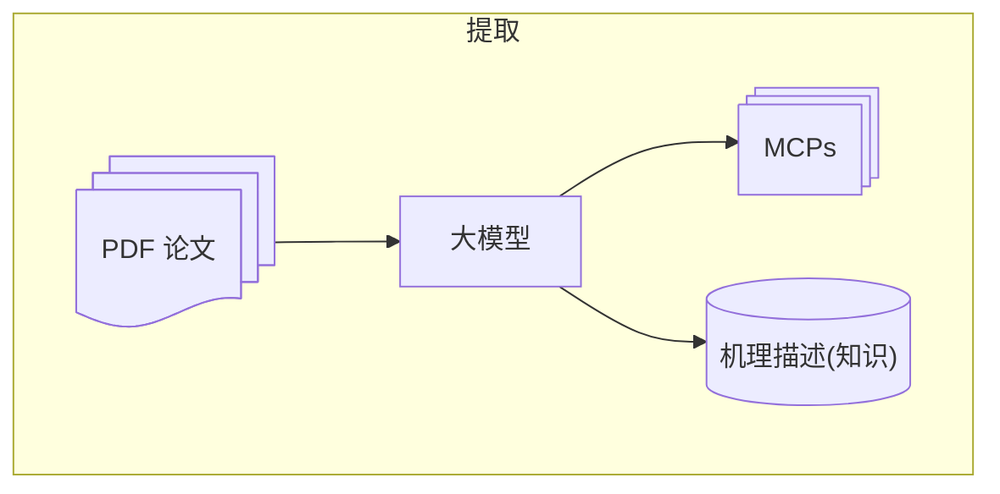

# 调研

> [!definition] 目标
> 将学术论文中的模型/机理进行提取并应用。*(供应链领域)* *辅助大模型进行决策（风险评估）*

> [!warning] 目前假设
> 1. 输入的论文理论上是正确的，清晰的表述了提出的方法和适用的场景。

> [!tip] 输入输出怎么界定？我们需要实现的是什么效果？
> - 已知：
> 	- 输入可能有供应链网络结构
> 	- 业界知识 (知识图谱、纯文本形式？)
> 
> - 目标效果：
> 	- 提取论文中的模型 (MCP, Function Call)，并将接口暴露给大模型？
> 	- 提取机理，作为 **知识 (或者上下文？)** 提供给大模型?

> [!todo]
> - [ ] ==输入== 如何处理 pdf ?
> - [ ] ==输出== 如何表述模型？如何表述机理？
> - [ ] 如何提取模型？有可以借鉴的方法吗？
> - [ ] 可行性分析？

通用的模型表述方式：输入 -> 模型 -> 输出

> [!note] 模型表述方式
> - 方程
> 	- 优化模型
> - 机理图、过程图
> - 算法
> 
> 其中方程、算法更加通用的说法 (可以作为输出) 就是代码。机理图、过程图
