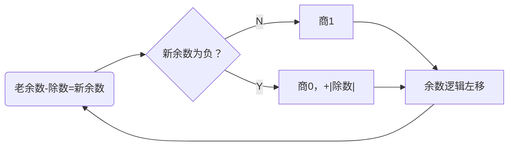
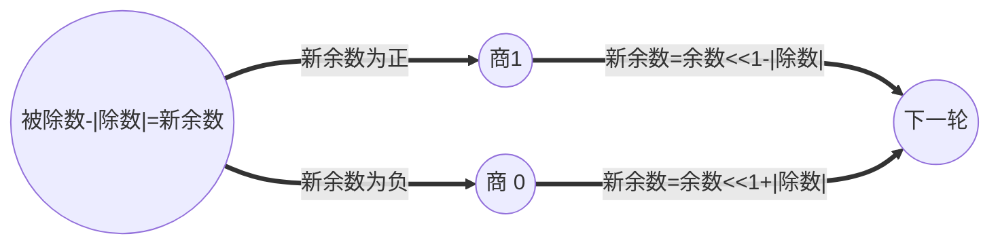
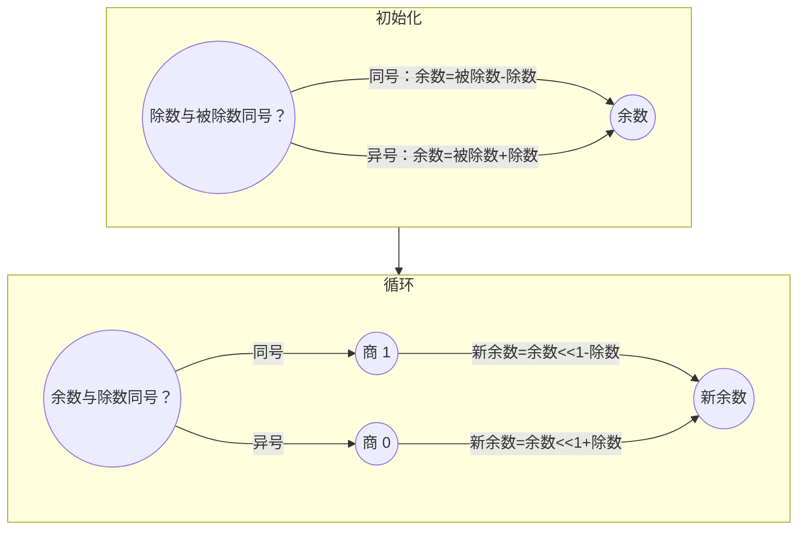

---
tags:
  - 计算机组成原理
cssclasses:
  - table-center
---

# 数据的表示和运算

## 数值数据的表示

在计算机中，所有的信息都是使用二进制进行编码的，这样做的原因如下：
1. 二进制只有两种状态，使用有两个稳定状态的物理器件就可以表示二进制的每一位，制造成本较低。
2. 二进制的 1 与 0 正好和逻辑值的真、假对应，为实现计算机的逻辑运算和程序的逻辑判断提供了遍历的条件。
3. 二进制的编码和运算规则都很简单，通过逻辑门电路就能方便的实现算术运算。

### 进位计数法

进位计数法是我们较为熟悉的数值表示方式。在 r 进制表示中，有如下的概念：
- **位权**：每个符号所在的位置表示权重不同；
- **基数**：每个数码位所用到的不同符号的个数，r 进制的基数为 r；

> [!example] $r$ 进制数
一个 $r$ 进制数 $(K_{n}K_{n-1}\cdots K_{0}K_{-1}\cdots K_{-m})$ 的数值为
>  $$
K_nr^n + K_{n-1}r^{n-1} + \cdots + K_1r_1 + K_0 + K_{-1}r^{-1} + \cdots + K_{-m}r^{-m}=\sum\limits_{i=n}^{-m}K_{i}r^i
> $$
> 将其转换为十进制数可以得到

> [!tip] $r$ 进制数的表示
> 常用的 r 进制数有**十进制 (D)、二进制 (B)、十六进制 (Q)、八进制数 (H)**。
> - 在 C 语言中，八进制以前缀 0 开始，十六进制以前缀 0x 开始。
> - 在我们的日常表达中，也可以使用下标表示法，例如使用 $(100)_2$ 表示二进制数。

> [!note] 不同进制数之间的相互转换
> 1. 二进制数转换为八进制数或者十六进制数
> 	- 八进制数：以小数点为界，向左或者向右数 3 位表示一个八进制数，不足的可以用 0 补足。
> 	- 十六进制数：以小数点为界，向左或者向右数 4 位表示一个十六进制数，补足的用 0 补足。
> 2. 任意进制数转换为十进制数：将每一位的数码与权值相乘，再相加。
> 3. 十进制数转换为任意进制数：**基数乘除法**
> 	- 整数部分：除基取余，短除法，商为 0 时结束。余数从上到下，对应着位数从低位到高位 (从上往下写)。
> 	- 小数部分：乘基取整，乘积为 1.0 或者满足精度时停止。整数从上到下，对应着位数从高位到低位 (从下往上写)。

> [!example]- 基数乘除法
> ![[Assets/数据的表示和运算-1.png|整数部分]]
> ![[Assets/数据的表示和运算-2.png|小数部分]]

### 定点数

> [!note] 真值与机器数
> - 真值：在日常生活中，通常使用正好、符号来分别表示整数和负数，例如 $+15,-8$ 等，使用这种表示方法表示的数称为**真值**。
> - 机器数：在机器中，通常将数的符号和数值一起编码，将数据的符号数字化，通常使用 0 表示正，使用 1 表示负。这种符号数字化的数字称为**机器数**。机器数有*原码*、*补码*和*反码*表示法。

> [!definition|定点数] 小数点位置固定的机器数表示。

> [!tip]
> 与定点数相对应的是浮点数，小数点的位置是浮动的。在实际的计算机中，我们一般使用定点数表示整数类型，使用浮点数表示小数类型。
>
> 在嵌入式开发领域，为了节省空间，也常使用不同长度的定点浮点数。

定点数表示法可以用于表示定点小数和定点整数。
- 定点小数：即纯小数，没有整数位，约定小数点在符号位之后，第一个数字位之前。
- 定点整数：即纯整数，没有小数位，约定小数点在最后一个数字之后。

> [!example]- 定点小数与定点整数
> ![[Assets/数据的表示和运算-3.png|定点小数与定点整数]]

#### 原码

原码使用机器数的最高位表示数的符号，其余各位表示数的绝对值。

> [!definition|Definition] 原码
> 原码的定义如下：
>  $$
[x]_{\text{原码}}=\begin{cases}
0\ x & 0\leqslant x<2^{n} \\
2^{n}-x=2^{n}+|x| & -2^{n}<x\leqslant 0
\end{cases}
> $$
> 其中 $x$ 表示真值，当真值为正时，符号位为 0，当真值为负时，符号位为 1。

> [!note]
> - 当字长为 $n+1$ 时，原码整数的表示范围为 $-(2^{n}-1)\leqslant x\leqslant 2^{n}-1$。*即第一位表示符号，后面的 $n$ 位表示数字，所以正负数的表示数量相同，均为 $2^{n}-1$ 个。*
> - 在原码表示法中，0 有两种表示方式。

> [!note] 原码表示的特点
> - 优点：
> 	1. 与真值的对应关系简单、直观。
> 	2. 用原码实现乘除法运算比较简便。
> - 缺点：
> 	1. 0 的表示不唯一。
> 	2. 原码的加减运算比较复杂。

> [!tip] 反码表示法
> 反码在计算机中几乎不使用，而是一种数码变换的中间表示形式。在反码表示法中，正数与原码表示相同，而负数表示为符号位为 1，其余为真值按位取反。

#### 补码

> [!definition|Definition] 补码
> 补码的定义如下：
> $$
> [x]_{\text{补码}}=\begin{cases}
> 0\ x, & 0\leqslant x<2^{n} \\
> 2^{n+1}+x=2^{n+1}-|x| & -2^{n}\leqslant x<0
> \end{cases}
> $$
> 即补码定义为了：
> - 正数的补码和原码相同。
> - 负数的补码等于*模与该负数绝对值之差*。

> [!note]
> - 根据补码的定义，无论是正数还是负数，$[x]_{\text{补码}}=2^{n+1}+x$。
> - 当字长为 $n+1$ 时，补码整数的表示范围为 $-2^{n}\leqslant x\leqslant 2^{n}-1$。*比原码表示法多表示一个最小的负数 $-2^{n}$。*
> - 补码表示法中，0 的表示唯一 (全为 0)。
> - 补码表示法中加减运算统一使用加法器完成。

> [!tip] 补码可以用加法替代减法的原因
> 根据补码的定义，$[A]_{补}-[B]_{补}=[A]_{补}+M-[B]_{补}$，而 $M-[B]_{补}=[-B]_{补}$，因此补码可以利用加法来实现减法运算。

> [!warning] 真值转换为补码
> - 正数：补码与原码表示方式相同。
> - 负数：符号位取 1，其余各位由**真值各位取反，末尾加 1 得到**。

> [!note] 变形补码
> 变形补码时一种采用双符号位的补码表示，也成为模 4 补码。假定变形补码的位数为 $n+1$，其中前两位为符号位，则整数变形补码的表示为
> $$
[x]_{变补}=\begin{cases}
00\ x & 0\leqslant x<2^{n-1} \\
2^{n+1}+x=2^{n+1}-|x| & -2^{n-1}\leqslant x<0
\end{cases} \quad(\text{mod}\ 2^{n+1})
> $$
> 变形补码使用双符号位表示正负，即 00 表示正，11 表示负。当补码运算溢出时，即符号位变为 01 或者 10 时，我们可以根据符号位来判断是正溢出还是负溢出，从而进行恰当的处理。*变形补码常用于 ALU 中*。

#### 原码、补码、反码对比

对于原码、补码、反码三种机器数，它们有以下特性：
1. 对于正数，它们都等于真值本身，而对于负数有着不同的表示。
2. 最高位都表示符号位，补码和反码的符号位可以和数值位一起参与运算，但是原码的符号位必须分开运算。
3. 对于真值 0，原码和反码各有两种不同的表示形式，而补码只有唯一一种表示形式。
4. 原码、反码表示的正、负数范围是对称的，但是补码负数能多表示一个最负的数，其中等于 $-2^n$ 纯整数或者 $-1$ 纯小数。

> [!tip] C 语言中的整数数据类型
> 在 C 语言中，int 型即定点整数，根据位数不同，可以分为字符型 (`char` 型，8 位)、短整型 (`short` 或者 `short int`，16 位)、整型 (`int`，32 位)、长整型 (`long` 或者 `long int`，在 32 位机器中为 32 位，在 64 位机器中为 64 位)。
>
> 在 C 语言中，允许强制类型转换，这样的操作并不会改变操作数本身。例如，我们将 `short x = -4321` 强制转换为 `unsigned short`，将会得到 `61215`，它们的二进制表示相同，但是表示不同的数字。**在 C 语言中，强制类型转换的结果是保持二进制数不变，仅改变解释这些位的方式**。在同时有无符号数与有符号数参与的运算中，C 语言标准规定按照无符号数进行运算。

> [!tip]
> 在 C 语言中，无论参与运算的数字是 `int` 还是 `unsigned int`，即无论是有符号数还是无符号数，它们的加减运算使用==同一套电路==。例如，
> ```c
> int a = 123, b = 456;
> unsigned m = a, n = b;
> int c = a + b;
> unsigned k = n + m;
> ```
> 在上述情况下，`c` 与 `k` 得到的数的二进制机器数实际上是完全一样的，只是它们的解释方式不同。此外，有符号数使用 OF 位表示溢出，无符号数用 CF 位表示溢出。

> [!note] 定点数的扩展
> 在某些场景，我们需要将一个定点数进行扩展，增加它的表示范围。
> - 无符号数：在高位进行**零扩展**，即在最高位添 0；
> - 有符号数：
> 	- 原码：在符号位之后进行**零扩展**，即在符号位之后添 0；
> 	- 补码和反码：在最高位进行**符号扩展**，即在最高位添加符号位数字；

^e5f8ca

#### 移码

移码常用来表示浮点数的阶码，它只能表示整数。

> [!definition|Definition] 移码
> 移码就是在真值 $X$ 前面加上一个常数 (偏置值)，通常这个常数取 $2^{n}$，相当于 $X$ 在数轴上向正方向偏移了若干单位。移码的定义如下：
> $$
[x]_{\text{移码}}=2^{n}+x
> $$

> [!note] 移码的特点
> 1. 移码中零的表示唯一，即 10000...
> 2. 一个真值的移码和补码仅差了一个符号位，即 $[x]_{补}$ 的符号位取反就是 $[x]_{移}$。
> 3. 移码全为 0 时，对应真值的最小值 $-2^{n}$，移码全为 0 时，对应真值的最大值 $2^{n}-1$。
> 4. 移码保持了原有数据的大小顺序，移码大的真值就大，移码小的真值就小。

### 浮点数

在科学计算中，计算机处理的往往是混合数，即既有小数部分又有整数部分的数。为了同时满足数值范围与精度要求，计算机中引入了浮点数的表示方式，让小数点根据需要而浮动，这就是浮点数。

> [!definition|Definition] 浮点数
> 浮点数的表示如下：
>  $$
N = M\times r^E
> $$
> 其中 $r$ 为浮点数阶码的底，与位数的基数相同，通常而言 $r=2$，$E$ 和 $M$ 都是带符号的定点数，$E$ 称为阶码(Exponent)，$M$ 称为尾数(Mantissa)。

> [!tip]
> 在大多数计算机中，尾数为纯小数，使用**原码或者补码**表示，而阶码为纯整数，使用**移码或者补码**表示。
>
> 在 IEEE754 标准中，我们使用原码表示尾数，使用移码表示阶码。

浮点数的表示范围主要由阶码的位数来决定，有效数字的精度主要由尾数的位数决定。一个浮点数的一般格式如下

![[Assets/float.png]]

> [!note] 浮点数的表示范围
> 由于原码的表示范围是关于原点对称，因此浮点数的范围也是关于原点对称的。不同于定点数表示法，浮点数表示法表示的范围更大，同时溢出的方式也更加复杂：
> - 上溢：整数部分超过了浮点数的表示范围，当发生上溢出时，计算机需要终止计算，进行溢出处理。
> 	- 正上溢：运算结果大于最大正数
> 	- 负上溢：运算结果小于最大负数
> - 下溢：运算结果在 0 到最小小数之间，当发生下溢出时，浮点值趋于 0，计算机将其当做机器零处理。
> 	- 正下溢：运算结果在 0 到最小正数之间
> 	- 负下溢：运算结果在 0 到最大负数之间

#### 规格化化浮点数

为了提高运算的精度，需要充分利用位数的有效数位，通常采用浮点数规格化形式，即**规定尾数的最高数位必须是一个有效值**。*换句话说，如同科学计数法一样，在众多的表示中，只有形如 $0.1101\times 2^{-11}$ 是规格化数。*

> [!warning]
> 规格化数小数点前只有符号位。即 1.1111 表示 -0.1111。

> [!note] 规格化数的范围
> 规格化数的尾数 $M$ 的绝对值一定在下面的范围中
>  $$
\frac{1}{r} \leqslant |M|\leqslant 1
> $$
> **由于规格化的这个限制，规格化的最小正数小于非规格化的最小正数。** 当 $r=2$ 时，$1/2\leqslant |M| <1$，即
> - 正数的最大值为 0.1xxx 形式，最小值为 0.10000 形式，表示范围为 $1/2\leqslant M \leqslant 1-2^{-n}$。
> - 负数的最小值为 1.1xxx 形式，最大值为 1.10000 形式，表示范围为 $-(1-2^{-n})\leqslant M\leqslant -1/2$。

> [!note] 规格化操作
> 规格化操作指通过调整一个非规格化浮点数的尾数和阶码，使得非零浮点数在尾数的最高位上保证是一个有效值。
> - 左规：当运算结果的尾数的最高数位不是有效位，即出现 0.000 的形式时，需要进行左规，即尾数左移，阶码减 1。*左规可能需要进行多次*。
> - 右规：当运算结果的尾数的有效位进到小数点前面时，即出现 1.123 的形式时，需要进行右规，即尾数右移，阶码加 1。*右规只需要进行一次*。

同时，只要浮点数的尾数为 0，不论阶码为何值，一般就当做机器零处理。为了保证浮点数形式的唯一性，机器零的标准形式规定为位数为 0，界面为最小值（绝对值最大的负数）。

> [!tip]
> 基数不同，浮点数的规格化形式也不同。例如，当浮点数尾数的基数为 2 时，原码规格化的最高位一定是 1。当基数为 4 时，原码规格化的最高位两位不全为 0。

##### IEEE754 标准

在目前常用的 $80\times 86$ 系列微型计算机中，通常设有支持浮点运算的部件。这些机器中的浮点数采用 IEEE 754 标准，其表示方式与前的有一些区别，其表示如下：

其中 $m_s$ 为数符，$E$ 为阶码，采用 [[ #移码 |移码]] 表示，$m$ 为尾数数值，数符与尾数数值组成了尾数，采用原码表示。在 IEEE 标准中定义了三种浮点数：

|  类型   | 数符  | 阶码  | 尾数数值 | 总位数 |  偏置值  |
| :---: | :-: | :-: | :--: | :-: | :---: |
| 短浮点数  |  1  |  8  |  23  | 32  |  127  |
| 长浮点数  |  1  | 11  |  52  | 64  | 1023  |
| 临时浮点数 |  1  | 15  |  64  | 80  | 16383 |

其中短浮点数又称为**单精度浮点数**(float)，长浮点数又称为**双精度浮点数**(double)，临时浮点数又称为拓展精度浮点数。给定浮点数，其真值计算方式为：
$$
(-1)^{s}\times 1.M\times 2^{E-bias}
$$

> [!warning] 移码
> IEEE 浮点数阶码的表示方式采用移码表示，且偏置值与我们一般常见的 [[#移码]] 不同。相较于一般的移码，IEEE 规定的偏置值要少 1，即 $2^{n-1}-1$，IEEE 中移码的计算方式是==补码符号位取反后，再加上 1 得到的==。*对于 8 位的阶码，真值的范围为-126 到 127，而-127 和-128 对应特殊的用途*。
>
> 这样做会使得移码的最小的两个数字编码为全一和全零，而这两个编码在 IEEE 中具有特殊的含义。
> - 全 1 移码：
> 	- 阶码全为 1，尾数不全为 0 时，表示非数值 (NaN)；
> 	- 阶码全为 1，尾数全为 0 时，表示无穷大；
> - 全 0 阶码：
> 	- 阶码全为 0，尾数不全为 0 时，表示非规格化的小数，此时补充的隐藏位为 0，阶码为最小阶码 (例如 8 位阶码中为-126)；
> 	- 阶码全为 0，尾数全为 0 时，表示真值 0；

> [!tip]
> 在我们实际计算移码的时候，可以先将移码作为无符号整数转换为十进制，然后减去对应的偏置值。
> - IEEE 移码 -> 真值：直接将符号位取反，然后减 1。
> - 真值 -> IEEE 移码：直接将符号位取反，然后加 1。

> [!note] 隐藏位
> 对个规格化的二进制浮点数，尾数的最高位总是 1，为了能使尾数多表示一位有效位，将这个 1 隐藏，称为**隐藏位**。IEEE754 规定隐藏 1 的位置在小数点之前。
>
> 单精度和双精度浮点数都采用了隐藏尾数最高位的方法，因而使得浮点数的精度更高。

> [!note] IEEE754 标准浮点数范围
> 由于浮点数的值域是对称的，因此这里讨论绝对值。以单精度浮点数为例：
> - 单精度浮点数：
> 	- 最小绝对值：即尾数全为 0，阶码真值最小为-126，此时整体的真值为 $(1.0)_{2}\times 2^{{-126}}$
> 	- 最大绝对值：即尾数全为 1，阶码真值最大为 127，此时整体的真值为 $(1.111\cdots)_{2}\times 2^{127}$

## 运算器

运算器是计算机进行算术运算和逻辑运算的主要部件，运算器的逻辑结构取决于机器的指令系统、数据表示方法和运算方法等。下面讨论数值数据在计算机中实现算术运算和逻辑运算的方法，以及运算部件的基本结构和工作原理。

> [!note] 运算器
> 运算器由**算术逻辑单元**(Arithmetic Logic Unit, ALU)、移位器、状态寄存器 (PSW) 和通用寄存器等组成。运算器的基本功能包括加、减、乘、除四则运算，与、或、非、异或等逻辑运算，以及移位、求补、直送^[直送操作指不对输入数进行处理，直接进行输出] 等操作。ALU 的核心部件是 [[ #加法器 ]] 。

> [!warning]
> ALU 是运算器的核心，而加法器是 ALU 的核心。

> [!example]- 一个常见的 ALU 示意图
> ![[Assets/数据的表示和运算-4.png#center|ALU示意图|400]]
> - 如果 ALU 支持 $k$ 种功能，则控制信号位数 $m\geqslant \lceil \log_{2} k\rceil$
> - ALU 的运算数、运算结果位数与计算机的机器字长相同
> - ZF/OF/SF/CF 标志位，用于表示本次运算结果的特征。(详细的见 [[#加法器|加法器]])
> - 标志位信息一般会被送到 PSW 程序状态字寄存器中 (有的地方也称为 FR 标志寄存器。
> - Cin 是进位输入信号，Cout 是进位输出信号。

### 加法器

加法器由全加器再配以其他必要的逻辑电路组成。
1. 全加器（FA）：全加器是最基本的加法单元，有三个输入：操作数 $A$ 和 $B$，低位传来的进位 $C_{i-1}$，两个输出量：本位和 $S_i$ 与向高位的进位 $C_i$。
2. 串行加法器：串行加法器中，只有一个全加器，数据逐位串行送入加法器中进行运算。串行加法器具有器件少，成本低的优点，但是运算速度太慢，因此除了某些低速的专用运算器以外很少使用。
3. 并行加法器：由多个全加器组成，其位数的多少取决于机器的字长，数据的各个位同时进行运算。并行加法器可以同时对数据的各个位数相加，但是存在一个加法的最长运算时间的问题。即最低位的进位将会逐位的影响高位的运算，因此并行加法器的最长运算时间主要是由进位是信号的传递时间决定的。**提高并行加法器速度的关键是尽量的加快进位的产生和传递的速度**。

在现实中，我们主要使用的是并行加法器。为了满足计算机的需要，就必须研究快速的并行加法器。

> [!note] 带标志位的加法器
> 在 ALU 实现中，加法器除了需要输出加法运算的结果外，还会提供一些辅助的功能。这些功能通过 4 个标志位来实现。
> - ZF (Zero Flag)：**零标志**，用于判断加减运算结果是否为 0。
> 	- ZF=1 表示结果为 0；
> 	- ZF=0 表示结果不为 0；
> - OF (Overflow Flag)：**溢出标志**，用于判断==带符号==加减运算是否溢出。
> 	- OF=1 表示溢出；
> 	- OF=-1 表示未溢出；
> - SF (Sign Flag)：**符号标志**，用于判断==带符号==数加减运算结果的正负性。
> 	- SF=1 表示结果为负；
> 	- SF=0 表示结果为正；
> - CF (Carry Flag)：**进位、借位标志**，用于判断 *==无符号==* 数加减运算是否溢出。
> 	- CF=1 表示溢出，即加法时表示溢出，减法时表示借位；
> 	- CF=0 表示未溢出；

> [!warning] SP、OF 对于无符号数是没有意义的。CF 对于有符号数是没有意义的。

> [!note] 标志位的逻辑表达式
> - OF：判断溢出可以使用 $C_{n}\oplus C_{n-1}$ 判断；
> - SF：判断符号只需要将结果的最高位输出即可。
> - ZF：判断零需要使用一个或非门，输出 $S_{n}+\cdots+S_{2}+S_{1}$
> - CF：判断无符号数的加减运算是否溢出，可以通过 $C_{\text{out}}\oplus C_{\text{in}}$ 来进行判断。这里 $C_{\text{in}}$ 实际上就表示是否是减法运算，当进行减法运算时，没有发生进位，则说明不够减。

#### 并行加法器的快速进位

显然，使用串行进位方式的进位延迟时间太长了。需要提高并行加法器的运算速度，就必须改变进位方式。

**并行进位**又称为先行进位、同时进位，特点为各级的进位同时进行。实际上，我们可以直接通过输入计算出每一个的进位，根据
$$
\begin{aligned}
C_1&=G_1+P_1C_0\\
C_2&=G_2+P_2C_1=G_2+P_2G_1+P_2P_1C_0\\
C_3&=G_2+P_3C_2=G_3+P_3G_2+P_3P_2G_1+P_3P_2P_1G_0\\
\vdots
\end{aligned}
$$
根据上面的推导，我们可以直接计算每一位的进位，但是随着加法器位数的增加，输入变量会变得原来越复杂，这会使电路的结构变得越来越复杂。因此，完全使用并行进位是不现实的。

> [!note] 分组并行进位
> 实际上通常采用**分组并行进位**方式。这种进位方式把 $n$ 位字长分为若干个小组，在小组内各位间使用并行快速进位，在组间即可使用串行进位方式，也可以再使用并行进位方式。由此又分为两种分组并行进位方式：
> 1. 单级先行进位方式（组内并行、组间串行）
> 2. 多级线性进位方式（组内并行、组间并行）

### 定点数加减运算

#### 原码加减运算

原码中，符号位不能直接参与运算。原码的加减运算规则如下：
1. 参加运算的操作数取其绝对值。
2. 若做加法运算，则两数直接相加；若做减法运算，则将减数先变一次补，再进行加法。
3. 运算之后，可能有两种情况：
   - 有进位，结果为正，即得到正确的结果
   - 无进位，结果为负，应当再变一次补，才能得到正确的结果
4. 结果加上符号位。

实际上，我们在进行原码的加减运算时，一般是转换为补码之后再进行的。

> [!note] 变补运算
> 将所有的二进制数各位取反后最低位加 1。
>
> 需要注意的是，与原码变为补码不同，变补运算需要将符号位也取反，原码变为补码时，不需要将符号位取反。

#### 补码加减运算

补码加减运算都可以转换为加法运算。
- 补码加法：两个补码表示的数相加，符号位参与运算，即
$$
[X+Y]_{补}=[X]_补+[Y]_补\quad (\text{mod}\  2^{n+1})
$$
- 补码减法：可以借用加法器来实现补码的减法运算，根据补码的加法公式可以得到减法公式为
	$$
	[X-Y]_补 = [X + (-Y)]_补 = [X]_补 + [-Y]_补
	$$
	其中
	$$
	[-Y]_补=[[Y]_{补}]_{变补}
	$$

于是可以得到补码的运算规则：
1. 参与运算的两个操作数均使用补码表示；
2. 符号位作为数的一部分参与运算；
3. 若做加法运算，则两数直接相加；若做减法运算，则将被减数与减数的机器负数相加 (变补)；
4. 运算结果仍用补码表示。

> [!note]
> 当**两个位数不同**的定点数进行计算时，我们需要将位数少的拓展，方法较为简单，即在符号位之后填充附加位，正数使用 0 填充，负数使用 1 填充。([[#^e5f8ca|定点数的拓展]])

> [!note] 无符号数的加减运算
> - 加法：无符号数的加法运算就是直接使用加法器进行相加。
> - 减法：被减数不变，减数变补^[全部位按位取反，末位 +1] 后，将减法变为加法进行运算。

#### 补码的溢出判断与检测方法

在补码加减运算中，有时会因为两数相加之和的数值超过了机器允许的表示范围，使得进位加到了符号位上，此时就产生了溢出。对于两个数 $X$ 和 $Y$，做加法运算：
- $X$ 与 $Y$ 异号，不会溢出；
- $X$ 与 $Y$ 同号，
	- 运算结果为正且大于所能表示的最大正数，发生正溢；
	- 运算结果为负且小于所能表示的最小负数时，发生负溢；

> [!note] 使用一位符号位检测溢出
> 设被操作数为 $[X]_补=X_sX_1X_2\cdots X_n$，操作数为 $[Y]_补=Y_sY_1Y_2\cdots Y_n$，结果为 $[S]_补=S_sS_1S_2\cdots S_n$。
> - 硬件检测法：使用一位符号位时，只要参加操作的两个数的符号位相同，且结果与原操作数的符号不同，则表示结果溢出。
> 	 $$
溢出=\bar X_s\bar Y_s S_n +X_s Y_s \bar S_n
> 	$$
> - 根据数值位的进位情况判断溢出：假设 $C_s$ 表示符号位产生的进位 (最高位)，$C_1$ 为最高数值位产生的进位 (次高位)。若符号位进位与数值位的进位相同，则说明无溢出。于是溢出条件为
> 	 $$
溢出=\bar C_sC_1 +C_s\bar C_1 = C_s\oplus C_1
> 	$$

> [!note] 使用变形补码检测溢出
> 一个符号位只能表示正负两种情况，当产生溢出是，符号位的含义就会发生混乱，如果将符号位扩充至两位，其所能表示的信息量将随之增大。
>
> 双符号位法也称为模 4 补码，把左边的符号位 $S_{s1}$ 称为真符，因为它代表了该数真正的符号，两个符号位都作为数的一部分进行运算。在这种情况下，每个组合都有确切的含义：
> - $S_{s1}S_{s2}=00$，结果为正数，无溢出
> - $S_{s1}S_{s2}=01$，结果正溢
> - $S_{s1}S_{s2}=10$，结果负溢
> - $S_{s1}S_{s2}=11$，结果为负数，无溢出
>
> 采用变形补码时，如果两个符号位不一致，就说明产生了溢出，溢出条件为
> $$
溢出=S_{s1}\oplus S_{s2}
> $$
> 为了尽可能的减小代价，在采用双符号位方案时，==操作数和结果在寄存器和主存中仍然使用单符号位==，仅在参与运算时扩充为双符号位。

> [!note] 无符号数的溢出判断
> 无符号数**加法**的溢出判断：最高位产生的进位为 1 时，发生溢出。
> 无符号数**减法**的溢出判断：减法变为了加法，则最高位产生的进位为 0 时，发生了溢出。

> [!tip] 加减运算电路
> 在 ALU 中，无论是无符号数，还是有符号数，我们都可以通过同一个加法器来实现。
> - 有符号使用补码表示，无符号数就相当于有符号数中的正整数。
> - 无论是补码减法还是无符号数的减法，都可以视为被减数加上减数的负数 (变补) 实现。

### 移位运算

在计算机中，实现乘除法的方案通常有以下 3 种：
- 软件实现：使用乘法和除法子程序实现。
- 在原有实现加减运算器的基础上增加一些逻辑线路，使乘除运算变换成加减运算来实现移位操作。在机器中设有乘除命令。
- 设置专用的乘、除法器，机器中设有相应的乘除指令。

但是不管使用什么方案实现乘除法，基本原理都是相同的。如果采用方案二，必然会使用到移位操作。下面介绍移位操作的实现。

#### 算数移位

算数移位时应当保持数的符号位不变，而数值的大小则要发生变化。左移一位相当于该数乘以 2，而右移一位相当于该数除以 2。
- **原码的移位规则**：不论正数还是负数，在往左移或者往右移时，符号位不变，空出的以 0 填补。
- **补码的移位规则**：
	- 正数：符号位不变，无论左移还是右移，空出位以 0 填补。
	- 负数：符号位不变，左移后空出位补 0，右移后空出位补 1。
- 反码的移位规则：不论整数还是负数，在往左移或者往右移时，符号位不变，空出的以 1 填补。

> [!note] 逻辑移位
> 逻辑移位相当于对无符号数的移位操作，即左移直接在最低位补 0，右移直接在最高位补 0。

> [!note] 循环移位
> 循环移位是进行循环补位的。
> - 左移时，最低位补充的内容是最高位舍去的内容。
> - 右移时，最高位补充的内容是最低位舍去的内容。
>
> 还有一种带进位位的循环移位，就是在原本的数的最高位添加一位进位位，再进位循环移位。

> [!tip]
> 实际上，在计算机中，移位操作只会对于无符号整数和有符号整数 (补码) 进行，分别对应了逻辑移位和算术移位。
> - 无符号数：低位补 0，高位补 0
> - 有符号数 (补码)：低位补 0，高位补符号位

### 定点数乘法运算

#### 原码一位乘法运算

原码一位乘法是从手算演变而来，即两个操作数的绝对值相乘，乘积的符号为两个操作数符号值的异或。

> [!example] 手算原码二进制乘法
> 首先确定符号位，即进行一次异或运算，同号为正，异号为负。其次进行乘法运算：
> $$
\begin{array}
&&&&0&.&1&1&0&1 \\
&&\times&0&.&1&0&1&1\\
\hline
&&&&&1&1&0&1 \\
&&&&1&1&0&1 \\
&&&0&0&0&0 \\
&&1&1&0&1 \\
\hline
0.&1&0&0&0&1&1&1&1
\end{array}
> $$
> 我们手算的过程实际上与机器计算的过程无异，计算机利用了两个寄存器和逻辑右移来一步一步的实现每一次加法。

> [!note] 手算二进制的原理
> 对于前面给出的例子，我们可以将其进行分解：
> $$
\begin{aligned}
0.1101&=1101\times 10^{-4}\\
0.1011&=1\times 10^{-1}+0\times 10^{-2}+1\times 10^{-3}+1\times 10^{-4}\\
\end{aligned}
> $$
> 于是就可以得到手算的方法。

根据手算乘法的原理，可以将乘法概括为移位与相加两种操作，具体如下：
1. 参与运算的操作数取绝对值；
2. 令乘数的最低位为判断位^[实际上就是对应了手算乘法中每一位与被乘数相乘，由于 1 与任何数相乘可以得到该数字，0 和任何数相乘都得 0，因此这一步可以简化为一个判断电路]，若为 1，加被加数，若为 0，什么都不做；
3. 累加后的部分积以及乘数右移一位；
4. 重复 $n$ 次 2 和 3 ( $n$ 为被乘数的位数，即当乘数全部被舍弃时，计算完毕)；
5. 符号位单独处理，使用异或运算，同号为正，异号为负；

> [!note] 计算机中的原码乘法实现方式
> 运算器中可以借助加法器、移位器和两个寄存器 ACC 和 MQ 实现原码的乘法。
> 1. 初始化：寄存器 $X$ 储存乘数，寄存器 $MQ$ 储存被乘数，寄存器 $ACC$ 存放结果，初始化为 0。
> 2. 在计算时，每次都使用 $MQ$ 中的最低位进行判断，如果为 1，则将 $X$ 中的内容与 $ACC$ 中内容相加存入 $ACC$ 中；如果为 0，则不做任何操作。
> - 将 $ACC$ 与 $MQ$ 中的内容右移一位，重复上一步直到遇到符号位，即重复 $n$ 次，$n$ 为操作位数。
> - 将符号位进行异或操作。

> [!example] 计算机原码乘法的手算模拟
> 设机器字长为 $5$ 位，$x=0.1101,y=-0.1011$，则原码乘法的流程如下：
> $$
\begin{aligned}
&\begin{array}
&\quad&\quad&\text{ACC 寄存器}&\quad&\quad&&\text{MQ 寄存器}&&\text{舍弃位} \\
\end{array}\\
&\begin{array}{ccccccccccccc:ccccc} \\
&0&0&.&0&0&0&0&\quad&1&0&1&\underline{1}&\\
+|x|&0&0&.&1&1&0&1\\ \hline
&0&0&.&1&0&1&1\\
\to&0&0&.&0&1&0&1&\quad&1&1&0&\underline{1}&1\\
+|x|&0&0&.&1&1&0&1\\ \hline
&0&1&.&0&0&1&1\\
\to&0&0&.&1&0&0&1&\quad&1&1&1&\underline{0}&1&1\\
+0&0&0&.&0&0&0&0\\ \hline
&0&0&.&1&0&0&1\\
\to&0&0&.&0&1&0&0&\quad&1&1&1&\underline{1}&0&1&1\\
+|x|&0&0&.&1&1&0&1\\ \hline
&0&1&.&0&0&0&1\\
\to&0&0&.&1&0&0&0&\quad&1&1&1&\underline{1}&1&0&1&1\\
\end{array}
\end{aligned}
> $$
> 最后再给结果添上符号，即 $x_{s}\oplus y_{s}=1$。*(这里使用了双符号位以确保和后续的补码乘法一致，实际上只需要一个符号位就可以实现运算)。*

> [!tip] 这里的*一位*代表每次相加只能计算结果的一个位，对应的还有多位乘法，每次相加可以计算结果的多个位。

#### 补码一位乘法

> [!tip]
> 虽然原码比补码乘法容易实现，但因为补码加减法更加简单，在以加减运算为主的通用机器中操作数都以补码表示，因此这类计算机在做乘法时使用补码乘法。

##### 校正法

补码乘法不能简单的套用原码乘法的算法，因为补码的符号位是参与运算的。校正法是将 $[X]_补$ 与 $[Y]_补$ 按照原码的规则运算，所得结果根据情况再加以校正，从而得到正确的 $[X\times Y]_补$。具体来说，其运算规则为
1. 乘数 $Y>0$ 时，不管被乘数 $X$ 的正负都直接按照原码乘法运算，只是移位时按照补码规则进行。
2. 当乘数 $Y<0$ 时，可以先把 $[Y]_补$ 的符号位丢掉不管，仍按照原码乘法运算，最后再加上 $[-X]_补$ 进行校正。

将上面两种算法综合起来，可以得到一位补码乘法的统一表达式
$$
[X\times Y]_补=[X]_补\times (0.Y_1Y_2\cdots Y_n) + [-X]_补\times Y_s
$$

##### 比较法——Booth 乘法

Booth 乘法是一个对于正数与负数都一致的算法，由英国的 Booth 夫妇提出来的，因此被称为 Booth 法。Booth 乘法的规则如下：
1. 参与运算的数用补码表示，符号位参与运算。
2. $\text{ACC}$ 寄存器与 $\text{MQ}$ 寄存器均增加了一位，其中 $\text{ACC}$ 在前面增加了一位符号位，使用双符号位，而 $\text{MQ}$ 在最后增加了一个辅助位。
3. 由于每求一次部分积要右移一位，所以乘数的最低两位 $Y_n$、$Y_{n+1}$ 的值决定了每次执行的操作。操作如下：

可以使用下面的方法判断：
- 最后一位-倒数第二位 = 1 时，乘数加上 $[X]_补$
- 最后一位-倒数第二位 = 0 时，什么都不做
- 最后一位-倒数第二位 = -1 时，乘数加上 $[-X]_补$

> [!example] 计算机补码乘法手算模拟
> 设机器字长为 $5$ 位 (含符号位)，$x=-0.1101$，$y=+0.1011$，则采用 Booth 算法计算过程如下：
> $$
\begin{aligned}
&\begin{array}
&\quad&\quad&\text{ACC 寄存器}&\quad&\quad&\quad&\text{MQ 寄存器}&\quad&\quad&\underline{\text{辅助位}} \\
\end{array}\\
&\begin{array}{ccccccccccccccc:ccccc} \\
&0&0&.&0&0&0&0&\quad&0&.&1&0&1&\underline{1}&\underline{0}\\
+[-x]*{\text{补}}&0&0&.&1&1&0&1\\ \hline
&0&0&.&1&1&0&1\\
\to&0&0&.&0&1&1&0&\quad&1&0&.&1&0&\underline{1}&\underline{1}&0\\
+0&0&0&.&0&0&0&0\\ \hline
&0&0&.&0&1&1&0\\
\to&0&0&.&0&0&1&1&\quad&0&1&0&.&1&\underline{0}&\underline{1}&1&0\\
+[x]*{\text{补}}&1&1&.&0&0&1&1\\ \hline
&1&1&.&0&1&1&0\\
\to&1&1&.&1&0&1&1&\quad&0&0&1&0&.&\underline{1}&\underline{0}&1&1&\\
+[-x]*{补}&0&0&.&1&1&0&1\\ \hline
&0&0&.&1&0&0&0\\
\to&0&0&.&0&1&0&0&\quad&0&0&0&1&\underline{0}&.&\underline{1}&1&0&\\
+[x]*{\text{补}}&1&1&.&0&0&1&1\\ \hline
&1&1&.&0&1&1&1&\quad&0&0&0&1
\end{array}
\end{aligned}
> $$

> [!note] 补码乘法与原码乘法的对比
> |                                   原码一位乘法                                    |                          补码一位乘法                          |
> | :-------------------------------------------------------------------------: | :------------------------------------------------------: |
> |                                进行 $n$ 轮加法、移位                                |                 进行 $n$ 轮加法、移位，最后再多进行一次加法                 |
> |         每次加法可能 $+0$ 或者 $+\left[ \lvert x \rvert \right]_{\text{原}}$         |    每次加法都可能 $+0$、$+[x]_{\text{补}}$、$+[-x]_{\text{补}}$     |
> |                                 每次移位都是逻辑右移                                  |                      每次移位都是补码的算术右移                       |
> |                          根据 $\text{MQ}$ 中的最低位来确定运算                          |              根据 $\text{MQ}$ 中的最低位和辅助位来确定运算               |
> | $\text{MQ}$ 最低位为 1，$(\text{ACC})+\left[ \lvert x \rvert \right]_{\text{原}}$ |  辅助位- $\text{MQ}$ 最低位=1 时，$(\text{ACC})+[x]_{\text{补}}$  |
> |                     $\text{MQ}$ 最低位为 0，$(\text{ACC})+0$                     |        辅助位- $\text{MQ}$ 最低位=0 时，$(\text{ACC})+0$         |
> |                                      无                                      | 辅助位- $\text{MQ}$ 最低位=-1 时，$(\text{ACC})+[-x]_{\text{补}}$ |

### 定点除法运算

除法是乘法的逆运算，与乘法运算的处理思想相似，可以将 $n$ 位除转换为若干次 " 减法-移位 "。

> [!example]- 二进制除法的手算过程
> 设机器字长为 $5$ 位，$x=0.1011,y=0.1101$，则 $x/y$ 的过程如下：
> ![[Assets/数据的表示和运算-5.png#center|二进制除法的手算过程|200]]

#### 原码除法运算

##### 恢复余数法

根据手算除法原理，计算每一位的商都是通过判断当前余数与除数的大小来判断的。但是由于计算机不能直接判断除数与被除数的大小关系，所以恢复余数法中，每次都假定商为 1，然后判断结果的正负来得到正确的结果：
- 如果为正，则结果正确；
- 如果为负，则在此加上除数得到的正确的结果。

恢复余数法的步骤如下：


恢复余数法符合人类的思考逻辑，但是在实际中因为每次运算都可能额外进行一次加法，所以在实际使用中运算速度较低，使用较少。

> [!tip]
> 这里的减去除数实际上就是加上除数的变补。

##### 加减交替法

加减交替法 (不恢复余数法) 是恢复余数法的优化。该方法将恢复余数、逻辑左移与计算新余数的过程合并，直接计算下一次的余数。在恢复余数法中，
- 若余数为正，则商 1，余数左移并减去除数。
- 若余数为负，则商 $0$，余数左移并加上除数。


需要注意，在计算到最后一位时，根据最后的余数的符号是否为负，可能还需要多进行一次恢复余数。

> [!note] 原码除法的特点
> - 加/减 $n+1$ 次，每次加减确定一位商；
> - 左移 $n$ 次 (最后一次加减完不位移)
> - 最终可能还要多一次加。
> - 符号位不参与运算，符号位需要通过异或运算来判断。

> [!note] 计算器中的除法实现方式
> 计算器可以使用 ALU，$\text{ACC},\text{MQ}$ 寄存器和变补器实现定点数的除法。
> - $\text{ACC}$ 在开始时保存被除数，在后续运算中保存除数。
> - $\text{MQ}$ 在开始时初始化为 0，在后续运算中，将商保存在最低位，并随着 $\text{ACC}$ 左移在最低位填充 0。
> - 除数保存在一个通用寄存器中，一般是输入的寄存器。

> [!tip]
> 在运算结束之后，$\text{MQ}$ 寄存器中保存的就是商，而 $\text{ACC}$ 寄存器中保存的值就是余数。

#### 补码除法运算

补码运算也通过加减交替法来实现。与原码的加减交替法的区别如下：
1. 补码除法运算使用双符号位，且符号位参与运算。
2. 与原码除法的第一次操作不同，原码除法的第一次操作一定是减去除数，而补码的第一次操作是根据除数的符号确定。
	- 如果除数与被除数同号，则使用被除数减去除数；
	- 如果被除数与除数异号，则使用被除数加上除数；
3. 在后续的计算中，原码除法是通过余数的符号判断商的，而补码除法的后续运算中是根据余数与除数符号是否相同来计算商的。
	- 如果余数与除数同号，则商 1，新余数=余数-除数；
	- 如果余数与除法异号，则商 0，新余数=余数 + 除数；



加减 $n+1$ 次，每一次加减确定一位商。对于最后一位，规定恒置为 1。这种方法简单，易于实现。由于符号位参与运算，因此不需要使用异或门来处理符号。

> [!note]
> 在补码的加减交替法中，商的最后一位 ( $\text{MQ}$ 的最后一位) 恒置为 1。这样可以简化电路，且误差不超过 $2^{-n}$。

> [!note] 原码除法与补码除法的对比
> |    对比     |      原码除法      |   补码除法    |
> | :-------: | :------------: | :-------: |
> | 符号位是否参与运算 |       否        |     是     |
> |   加减次数    | $n+1$ 或者 $n+2$ |   $n$   |
> |   移位次数    |     $n+1$      |   $n$   |
> |  上商、加减原则  |     余数的正负      | 余数与除数是否同号 |
> |  最后一位的处理  | 若最终余数为负，需要恢复余数 | 商的末尾恒置为 1 |

### 规格化浮点数运算

浮点数的加减运算可以使用前述的几种定点数计算方法实现，设两个非零的规范化浮点数分别为：
$$
\begin{cases}
A=M_A\times 2^{E_A}\\
B=M_B\times 2^{E_B}
\end{cases}
$$

则它们的加减运算的过程为：
1. 对阶：将阶数小的浮点数与阶数大的浮点数对齐。*假设 $E_{A}<E_{B}$，则将小的阶数的尾数进行算术右移，使得 $E_{A}'=E_{B}$。*
2. 尾数加减：对阶后，可以直接将尾数进行加减法。需要注意的是，如果参照 IEEE754 标准，则尾数包含一个隐藏位 1，需要将隐藏位还原到尾数部分之后才能进行加减运算。
3. 尾数结果规格化：尾数加减后得到的可能不是规格化数，我们需要将计算后的数字进行规格化。
	- 左规：当出现形如 $0.009876$ 形式的尾数时，需要将尾数算术左移，并将阶数减小。
	- 右规：当出现形如 $987.65$ 形式的尾数时，需要将尾数算术右移，并将阶数增大。
4. 舍入：由于受到硬件的限制，在对阶和右规处理后，可以将尾数的低位丢失，这会引起一些误差。舍入主要有两种方法：
	- 恒舍法：无条件丢掉正常位数最低位之后的全部数值。
	- 0 舍 1 入：如果舍去位为 0，则直接舍去；如果舍去位为 1，则数值加 1。
5. 判断溢出：规定阶码不能超过 $n$ 位，若运算后阶码超过范围 $n$，则溢出。

> [!note]- 浮点数乘除运算步骤 (非考研内容)
> 1. 阶码相加：
> 	- 补码：阶码相加后无需矫正
> 	- 移码：阶码相加后需要减去一个偏执值 $2^n$
>    阶码可能产生溢出，因此需要进行溢出判断。
> 2. 尾数相乘：若 $M_A$ 和 $M_B$ 都不为 0，则可以进行尾数乘法，与前述定点数乘法运算相同。
> 3. 尾数结果规范化：结果浮点数规范化

> [!note]- 浮点数除法运算步骤 (非考研内容)
> 1. 尾数调整：保证商的尾数是一个定点小数，首先检测 $|M_A|<|M_B|$，如果不小于，则 $M_A$ 右移一位，$E_A+1\to E_A$，称为尾数调整。因为 $A$ 与 $B$ 均为规格化数，因此最多调整一次。
> 2. 阶码相减：
>    - 补码表示：阶码相减后无需校正。
>    - 移码表示：阶码相减后加上一个偏置值 $2^n$。
>    阶码相减后可能出现溢出现象，需要进行处理。
> 3. 尾数相除：若 $M_A$ 与 $M_B$ 都不为 0，则可以进行尾数除法。尾数除法与前述的定点数除法相同。同时由于开始时进行了尾数调整，因此运算结果一定落在规格化范围内。

#### 强制类型转换

由于各种数表示的范围不同，编码方式不同，因此不同的数值类型进行运算前需要进行强制类型转换。在 c 语言中，强制类型转换的方向为

- char -> int -> long -> double
- float -> double

这是按照表示范围从小到大的顺序进行的强制类型转换。如果反过来，就可以能会因为范围问题导致溢出。

> [!warning]
> 在 C 语言中，`float` 类型使用 1+8+23 位表示，其中尾数能够表示的范围为 24 位，小于 `int` 类型的长度 32 位，因此
> - 将 `int` 转换为 `float` 型时，会损失精度。
> - 将 `float` 转换为 `int` 型是，会损失精度或者溢出。
>
>   而在 64 位机器中，`long` 类型使用 64 位表示，`double` 类型使用 1+11+52 位表示，其中尾数能够表示的范围为 53 位，因此同理。但是在 32 位机器中，`long` 类型的长度为 32 位，转换为 `double` 不会损失精度。

## 数据的存储和排列

### 数据的存储

在存储数据时，数据可以将低位到高位按从左到右排列，或者按从右到左排列。因此，无法使用最左或者最右来表征数据的最高位和最低位。我们通常使用**最低有效字节** (LSB) 和**最高有效字节** (MSB) 来分别表示数据的低位和高位。

> [!tip] 这里的最高位和最低位是相对于数字而言的，而不是相对于存储位置而言的。要认识这种写法。

> [!example]
> 在 32 位计算机中，一个 `int` 型变量 `i` 的机器数为 `01 23 45 67H`，那么它的最高有效字节 MSB 为 `01H`，最低有效字节 LSB 为 `67H`。

现代计算机基本采用字节编址，每个地址编号中存放了 1 字节数据。不同类型数据占用的字节数不同，*例如 `int` 占 4 字节，`double` 占 8 字节*，但是程序对于每个数据只给定一个地址。我们要通过这个地址和类型的大小来找到其对应的内存空间。根据数据中各个字节在连续字节序列中排列顺序不同，可以采用两种排列方式：
$$
\begin{aligned}
\small\text{大端方式}\quad&
\begin{array}{cccccc}
&\small0800\text{H} &\small 0801\text{H} &\small 0802\text{H} &\small 0803\text{H}& \\ \hline
\cdots &\small 01\text{H} &\small 23\text{H} &\small 45\text{H} & \small67\text{H} & \cdots \\ \hline
\end{array}\\[1em]
\small\text{小端方式}\quad &
\begin{array}{cccccc}
&\small0800\text{H} &\small 0801\text{H} &\small 0802\text{H} &\small 0803\text{H}& \\ \hline
\cdots &\small 67\text{H} &\small 45\text{H} &\small 23\text{H} &\small 01\text{H} & \cdots \\ \hline
\end{array}\\
\end{aligned}
$$

> [!note] 根据存储顺序判断大小端方式
> 先将地址按照从小到大的顺序排列：
> 1. 大端方式：先存储高位字节，后存储低位字节。字中字节顺序与阅读顺序相同。
> 2. 小段方式：先存储低位字节，后存储高位字节。字中字节顺序与阅读顺序相反。
>
> 一种更加便捷的判断方式，对于一个操作数 0123H，若
> - 01H 存放在高地址，23H 存放在低地址，则与逻辑顺序相同，为大端存储。
> - 01H 存放在低地址，23H 存放在高地址，则与逻辑顺序相反，为小端存储。

### 数据的对齐

现代计算机都是按字节编址的，假设字长为 32 位，数据**按边界对齐方式**存放要求存储地址是自身大小的整数倍。
- 半字地址一定是 2 的整数倍；
- 字地址一定是 4 的整数倍；

这样可以保证无论所取的数据是字节、半子还是字，均可以一次访存取出。当所存数据不满足上述要求时，可以通过填充空白字节使其符合要求。

> [!tip] 按边界对齐方式编址显然是空间换时间的方式。

---
< [[02_Areas/计算机组成原理/计算机系统概述|计算机系统概述]] | [[02_Areas/计算机组成原理/存储系统|存储系统]] >
