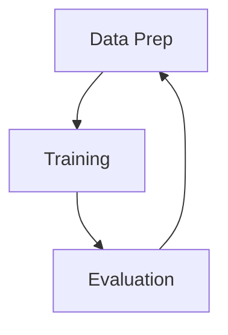

# 指令微调 (Instruct Finetuning)

指令微调技术是一个特别的微调技术，也被称为指令调整 (instruction-tuned) 或者指令跟随 (instruction-following)。使用该技术，可以将 GPT3 调整为 ChatGPT，使其使用范围更加广泛。

指令微调可以使用数据，例如一些
- 调查问卷，FAQs
- 对话数据集
- instruction-response 数据集

在没有 QA 问题的情况下，可以通过使用提示模板，将数据转换为更具问答形式或者指令跟随形式的内容。

## 指令微调步骤

