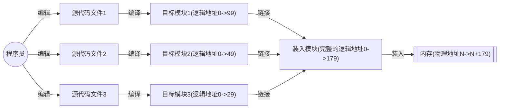

# 内存管理

## 内存基本知识

### 什么是内存

内存可存放数据，程序执行前需要先放到内存中才能被 CPU 处理，内存用于缓冲 CPU 与硬盘之间的速度矛盾。

在多道程序环境下，系统中会有多个程序并发执行，也就是说会有多个程序的数据需要同时放到内存中。计算机通过给内存的存储单元编地址的方式来区分每个内存对应的程序。

- 如果计算机是按字节编址，那么每个存储单元大小为 1 字节。
- 如果字长为 16 的计算机是按字编址，那么每个存储单元的大小为一个字，每个字的大小为 16 个二进制位。

### 内存的大小

在计算机中，表示存储容量大小的单位一般为：

- $2^{10}=1$ K，千
- $2^{20}=1$ M，兆，百万
- $2^{30}=1$ G，吉，千兆，十亿

这是根据二进制来划分的。

### 指令的工作原理

指令的工作基于地址，每个地址对应一个数据的存储单元。系统通过对应的指令进行对应的操作，跳转到下一个指令不断执行。

- 相对地址：程序经过编译、链接后生成的指令中指名的是逻辑地址 (相对地址) ，即相对于进程起始点的地址。
- 绝对地址：相对于 0 物理地址的绝对地址。

#### 绝对装入

在编译时，如果知道程序将放到内存的哪个位置，编译程序将产生绝对地址的目标代码，装入程序按照转入模块中的地址，将程序和数据转入内存。

绝对装入只适用于单道程序环境。

#### 可重定位装入

静态重定位，又称为可重定位装入。编译、链接后的装入模块的地址都是从 0 开始的，指令中使用的地址、数据存放的地址都是相对于起始地址而言的逻辑地址。

- 静态重定位的特点是在一个作业装入内存时，必须分配其要求的全部内存空间，如果没有足够的内存空间，就不能装入该作业。
- 作业一旦进入内存中后，在运行期间就不能再移动，也不能再申请内存空间。

#### 动态运行时装入

动态重定位，又称动态运行时装入。编译、链接后的装入模块的地址都是自从 0 开始，装入程序把装入模块装入内存后，并不会立即把逻辑地址转换为物理地址，而是把地址转换推迟到程序真正要执行时才进行。因此装入内存后所有的地址仍然是逻辑地址。这种方式需要一个重定位寄存器的支持。

- 重定位寄存器存放装入模块存放的起始位置。
- 并且将程序分配到不连续的存储区中，在程序运行前只需要装入它的部分代码即可投入运行，然后在程序运行期间动态申请分配内存。
- 便于内存的共享，可以向用户提供一个比存储空间大得多的地址空间。

**采用动态重定位时允许程序在内存中发生移动**。

### 从写程序到程序运行的过程

其中
- 编译：由编译程序将用户源代码编译成若干个目标模块 (把高级语言翻译为机器语言)
- 链接：由链接程序将编译后形成的一组目标模块，以及所需库函数链接在一起，形成一个完成的装入模块
- 装入 (装载)：由装入程序将装入模块装入内存运行

### 链接的三种方式

1. 静态链接：在程序运行之前，先将各目标模块及它们所需的库函数连接成一个完成的可执行文件，之后不再拆开
2. 装入时动态链接：将各目标模块装入内存，边装入边链接的链接方式
3. 运行时动态链接：在程序执行中需要该目标模块时，才对它进行链接。其优点是便于修改和更新，便于实现对目标模块的共享

## 内存管理的概念

操作系统作为系统资源的管理者，需要对内存进行管理。操作系统管理内存一般指：
1. 操作系统负责内存空间的分配与回收。
2. 操作系统需要提供某种技术从逻辑上对内存空间进行扩充。
3. 操作系统需要提供地址转换功能，负责程序的逻辑地址与物理地址的转换。
4. 操作系统需要提供内存保护的功能，保证各个进程在各自存储空间内运行，互不干扰。

## 内存保护技术

内存保护可以采取两种方式：
1. 设置上下限寄存器，分别存放进程上下限地址。进程的指令要访问某个地址时，CPU 检查是否越界。
2. 采用重定位寄存 (基址寄存器) 器和界地址寄存器 (限长寄存器) 进行越界检查。重定位寄存器中存放的的时进程的**起始物理地址**，界地址寄存器中存放的是进程的**最大逻辑地址**。

## 内存扩充技术

早期计算机的内存很小，因此经常出现内存大小不够的情况。人们引入了覆盖技术来解决程序大小超过物理内存总和的问题。

### 覆盖技术

覆盖技术的思想：将程序分为多个段（多个模块），常用的段常驻内存，不常用的段在需要时调入内存。
- 内存中分为一个固定区和若干个覆盖区。
- 需要常驻内存的段放在固定区中，调入后就不再调出。除非运行结束。不常用的段放在覆盖区，需要用到时调入内存，用不到时调出内存。

即按照自身逻辑结果，让那些不可能被同时访问的程序段共享同一个覆盖区。

必须由程序员声明覆盖结构，操作系统完成自动覆盖。缺点：对用户不透明增加了用户编程负担。

### 交换技术

交换（对换）技术的设计思想：内存空间紧张时，系统将内存中的某些进程暂时换出外存，把外存中某些具备运行条件的进程换入内存（进程在内存与磁盘间动态调度）。

[[进程管理#调度的三个层次]] 中的中级调度就是内存调度。暂时换出内存的等待的进程状态为挂起状态（挂起态），挂起态又可以进一步细分为就绪挂起、阻塞挂起两种状态。

> 在外存的什么位置保存被换出的进程？
>
> 具有对换功能的操作系统中，通常把磁盘空间分为文件区和对换区两部分。
> - 文件区主要用于存放文件，主要追求存储空间的利用率，因此对文件区空间的管理采用离散分配方式。
> - 对换区空间只占磁盘空间的小部分，被换出的进程数据就存放在对换区。由于对换的速度直接影响了操作系统的整体速度，因此对换区空间的管理主要追求换入换出速度，因此通常采用连续分配方式。
> - 总之，对换区的 I/O 速度比文件区更快。
> 
> 什么时候应该交换？
>
> 交换通常在许多进程运行且内存吃紧时进行，而系统负荷降低就暂停。例如在发现许多进程运行时经常发生缺页，就说明内存紧张，此时可以换出一些进程。如果缺页率明显下降，就可以暂停换出。
>
> 应该换出那些进程？
> 
> 可以优先换出阻塞进程，可以优先换出优先级低的进程，为了防止优先级的进程在被调入内存后很快又被换出，有的系统还会考虑进程在内存的驻留时间。

## 内存空间的分配与回收

- 连续分配：指为用户进程分配的必须是连续内存空间
- 非连续分配：

### 连续分配管理方式

#### 单一连续分配

在单一连续分配方式中，内存被分为系统区和用户区。系统区通常位于内存的低地址部分，用于存放操作系统相关数据。用户区用于存放用户进程相关数据。

内存中只能有一道用户程序，用户程序独占整个用户区空间。

- 优点：实现简单，无外部碎片；可以采用覆盖技术扩充内存；不一定需要采取内存保护。用于早期的操作系统。
- 缺点：只能用于单用户、单任务的操作系统中。有内部碎片，存储器利用率极低。

> - 内部碎片：分配给某进程的内存区域中，如果有些部分没有用上，就称为内部碎片
> - 外部碎片：指内存中的某些空闲分区由于太小而难以利用

#### 固定分区分配

为了能在内存中装入多道程序，且这些程序间不会互相干扰，于是将整个用户空间划分为若干个固定大小的分区，在每个分区中只装入一道作业。
- 分区大小相等：缺乏灵活性，但是适合用于用一台计算机控制多个相同对象的场合。
- 分区大小不等：增加了灵活性，可以满足不同大小的进程需求。根据常在系统中运行的作业大小情况进行划分。

操作系统需要建立一个**分区说明表**数据结构来实现各个分区的分配与回收。每个表项对应一个分区，通常按分区大小排列，每个表项包括对应分区的大小、起始地址、分配状态。

当用户程序要装入内存时，由操作系统内核程序根据用户程序大小检索该表，从中找到一个能满足大小的、未分配的分区，将之分配给该程序，然后修改状态为已分配。

- 优点：实现简单，无外部碎片。
- 缺点：
	- 当用户程序太大时，可能所有的分区都不能满足需求，此时不得不采用覆盖技术来解决。但这又会降低性能。
	- 会产生内部碎片，内存利用率低。

#### 动态分区分配

动态分区分配又称为可变分区分配。这种分配方式不会预先划分内存分区，而是在进程装入内存时，根据进程的大小动态地建立分区，并使分区的大小正好适合进程的需要。因此系统分区的大小和数目是可变。

常用空间分区表或者空闲分区链记录内存的使用情况。
- 空闲分区表：每个空闲分区表对应一个表项，表项中包含分区号、分区大小、分区起始地址等信息。
- 空闲分区链：每个分区的起始部分和末尾部分分别设置向前指针和向后指针。起始部分处还可以记录分区大小等信息。

把一个新作业装入内存时，须按照一定的 [[#动态分区分配算法]]，从空闲分区表中选出一个分区分配给该作业。由于分配算法随系统性能有很大的影响，因此人们对它进行了广泛的研究。

分区的分配与回收：
- 分配：若分配内存的大小小于分区大小，则修改分区的大小，同时将起始地址增加。若分配内存的大小等于分区大小，则将该分区表项删除。
- 回收：合并回收区相邻的空闲分区
	1. 回收区的后面有一个相邻的空闲分区：回收后将相邻的空闲分区的大小与起始位置修改
	2. 回收区的前面有一个相邻的空闲分区：回收后将相邻的空闲分区的大小修改
	3. 回收区的前后各有一个相邻的空闲分区：回收后将相邻的两个分区合并，即分区大小为三者相加，起始地址为前面的分区的起始地址
	4. 回收区的前后都没有相邻的空闲分区：回收后增加一个新的表项。

动态分区分配没有内部碎片，但是有外部碎片。

如果内存中空闲空间的总和本来可以满足某进程的需要，但是由于进程需要的是一整块连续的内存空间，因此这些碎片不能满足进程的需求。这个问题可以通过紧凑技术（拼凑技术）来解决外部碎片。

#### 动态分区分配算法

动态分区分配算法是在进程装入内存时，为其选择空闲分区的算法。

##### 首次适应算法

算法思想：每次都从低地址开始查找，找到第一个能满足大小的空闲分区。

实现方法：空闲分区以地址递增的次序排列，每次分配内存时顺序查找空闲分区链，找到大小能满足要求的第一个空闲分区。

##### 最佳适应算法

算法思想：由于动态分区分配是一种连续分配方式，为各进程分配的空间必须是连续的一整片区域。为了保证当大进程到来时能有连续的大片空间，可以尽可能多的留下大片的空闲区。即优先使用更小的空闲区。

实现方法：空闲分区按容量递增次序链接。每次分配内存时顺序查找空闲分区链，找到大小能满足要求的第一个空闲分区。

缺点：每次都选最小的分区进行分配，会留下越来越多的、很小的、难以利用的内存块。因此这种方法会产生很多的外部碎片。

##### 最坏适应算法

又称为最大适应算法 (largest Fit)。

算法思想：为了解决最佳适应算法的问题，即留下太多难以利用的小碎片，可以在每次分配时优先使用最大的连续空闲区，这样分配后剩余的空闲区就不会太小，更加方便使用。

实现方法：空闲分区按容量递减次序链接。每次分配内存时顺序查找空闲分区链，找到大小能满足要求的第一个空闲分区。

缺点：每次都选最大的分区进行分配，虽然可以让分配后留下的空闲区更大，更可用，但是这种方法会导致较大的连续空闲区被迅速用完。如果之后有大进程到达，就没有内存分区可用了。

##### 邻近适应算法

算法思想：首次适应算法每次都从链头开始查找。这可能会导致低地址部分出现很多小的空闲分区，而每次分配查找时都要经过这些分区，因此增加了查找的开销。如果每次都从上次查找结束的位置开始检索，就可以解决上述问题。

实现方法：空闲分区以地址递增的顺序排列（例如循环链表）。每次分配内存时从上次查找结束的位置开始查找空闲分区链，找到大小能满足要求的第一个空闲分区。

缺点：和首次适应算法相比，邻近适应算法的规则可能导致无论低地址、高地址部分的空闲分区都有相同的概率被使用，也就导致了高地址部分的大小分区更可能被使用，划分为小分区，最后导致无大分区可用（与最大适应算法相同）。

综合上面的四种算法，首次适应算法效果反而最好。

### 非连续分配管理方式

#### 基本分页存储管理的概念

将内存空间分为一个个大小相等的分区，每个分区就是一个**页框**。每个页框有一个编号，即**页框号**，页框号从 0 开始。

> 页框=页帧=内存块=物理块=物理页面
> 页框号=页帧号=内存块号=物理块号=物理页号

将进程的逻辑地址空间也分为与页框大小相等的一个个部分，每个部分称为一个**页**或者**页面**，每个页面也有一个编号，即**页号**，页号从 0 开始。

操作系统以页框为单位为各个进程分配内存空间，进程的每个页面放入一个页框中。也就是说，进程的页面与内存的页框有一一对应的关系。各个页面不必连续存放，可以放到不相邻的各个页框中。

##### 页表

为了能知道进程的每个页面在内存中存放的位置，操作系统要为每个进程建立一张页表。页表通常保存在 PCB 中。
- 一个进程对应一个页表
- 进程的每个页面对应一个页表项
- 每个页表项由页号和块号组成
- 页表记录进程页面和实际存放的内存块之间的映射关系

> 根据内存块的数量推导页表项中块号至少占多少字节
> 内存块数量=物理内存大小/页面大小
> 需要找到数量以字节为单位内存块号来表示所有的内存块

由于页表项连续存放，因此页号是隐含的，不占存储空间。可以利用页表中的块号大小与数量来推导页表的大小。需要注意的是，页表中记录的时内存块的块号，而不是起始地址。起始地址为块号 $\times$ 每块的大小

> 将进程地址空间分页后，操作系统如何实现逻辑地址到物理地址的转换？
> 
> 虽然进程的各个页面是离散存在的，但是页面内部是连续存放的。如果要访问逻辑地址 A，则
> 1. 确定逻辑地址 A 对应的页号 P
> 2. 找到 P 号页面在内存中的起始地址（需要查找页表）
> 3. 确定逻辑地址 A 的页内偏移量 W

页表中涉及的相关计算：
$$
\tiny
\begin{aligned}
逻辑地址 A 对应的物理地址&=P 号页面在内存中的起始地址+页内偏移量 W\\[3mm]
页号&=逻辑地址/页面长度(取整数部分)\\[3mm]
页内偏移量&=逻辑地址\%页面长度(取余数部分)
\end{aligned}
 $$

分页储存管理的逻辑地址结构为
$$
\tiny 页号P+页内偏移量W
$$
地址结构包括两个部分，前一部分为页号，后一部分为页内偏移量。如果有 K 位表示页内偏移量，则说明系统中有一个页面的大小是 $2^k$ 个内存单元。如果有 M 位表示页号，则说明在该系统中，一个进程最多允许有 $2^M$ 个页面。

##### 基本地址变化机构

基本地址变换机构可以借助进程的页表将逻辑地址转换为物理地址。

通常会在系统中设置一个**页表寄存器** (PRT)，存放页表在内存中的起始地址 F 和页表长度 M。程序未执行时，页表的始址和页表长度放在进程控制块中，当进程被调度时，操作系统内核会将他们放到页表寄存器中。

设页面大小为 L，逻辑地址 A 到物理地址 E 的变换过程如下：
1. 计算页号 P 和页内偏移量 W
2. 比较页号 P 和页表长度 M，若 P $\geqslant$ M，则产生越界中断，否则继续执行。
3. 页表中页号 P 对应的 $\small 页表项地址=页表起始地址 F+页号 P\times 页表项长度$，取出该页表项内容 b, 即为内存块号。
4. 计算 $E=b\times L+W$，用得到的物理地址 E 去访存。(如果内存块号、页面偏移量是用二进制表示的，那么将他们拼接起来就是最终的物理地址)

##### 具有块表的地址变换机构

快表，又称为联想寄存器 (TLB, translation lookaside buffer)，是一种访问速度比内存块很多的高速缓存 (TLB 不是内存，属于 Cache)，用来存放最近访问的页表项的副本，可以加速地址变换的速度。与此对应的，内存中的页表常称为慢表。

![[Pasted image 20231102213548.png]]

引入快表后，地址的变换过程：
1. CPU 给出逻辑地址，由某个硬件算得页号、页内偏移量，将页号与快表中的所有页号进行比较。
2. 如果找到匹配的页号，说明要访问的页表项在快表中有副本，则直接从中取出改页对应的内存块号，再将内存块号与页内偏移量拼接形成物理地址。最后访问该物理地址对应的内存单元。因此，若快表命中，则访问某个逻辑地址仅需**一次访存**即可。
3. 如果没有找到匹配的页号，则需要访问内存中的页表，找到对应页表项，得到页面存放的内存块号，在将内存块号与页内偏移量拼接形成物理地址。最后访问该物理地址对应的内存单元。因此，若快表未命中，则访问某个逻辑地址需要**两次访存**。但若快表已满，则必须按照一定的算法对旧的页表项进行替换。

由于查询快表的速度比查询页表的速度快很多，因此只要快表命中，就可以节省很多的时间。根据局部性原理，一般来说快表的命中率可以达到 90\% 以上。

> 对于有些系统，支持快表和页表同时查询，这样页表就不会等到快表未命中后才开始查询。

###### 局部性原理

- 时间局部性：如果执行了程序中的某条指令，那么不久后这条指令很可能再次执行。如果某个数据被访问过，不久之后数据很可能再次被访问。(因为程序中存在大量的循环)
- 空间局部性：一旦程序访问了某个存储单元，在不久之后，其附近的存储单元也很有可能被访问。(因为很多数据在内存中是连续存放的)

##### 两级页表

单级页表中存在问题：
1. 页表必须连续存放，因此当页表很大时，需要占用很多个连续的页框
2. 没有必要让整个页表常驻内存，因为进程在一段时间内可能只需要访问几个特定的页面

两级页表的思想：将连续的页表分块，创建两级页表，称为**页目录表** (顶级页表、外层页表)，原来的页表称为二级页表。

修改为两级页表后，逻辑地址变换为了
$$
\tiny一级页号+二级页号+页内偏移量
$$
查询的步骤变为：
1. 按照地址结构将逻辑地址拆为三部分
2. 从 PCB 中读出页目录表始址，在根据一级页号查页目录表，找到下一级页表在内存中的存放位置
3. 根据二级页号查表，找到最终想访问的内存块号
4. 结合页内偏移量得到物理地址

> 需要注意的几个细节：
> 1. 若采用多级页表机制，则各级页表的大小不能超过一个页面
> 2. 两级页表的访存分析：
> 	1. 访问内存中的页目录表
> 	2. 访问内存中的二级页表
> 	3. 访问目标内存单元

#### 基本分段存储管理

分段存储管理与分页存储管理最大的区别就是离散分配时所分配的地址空间的基本单位不同。

##### 分段

进程的地址空间会按照程序自身的逻辑关系划分为若干个段，每个段都有一个段名。每段从 0 开始。

操作系统在为进程分配内存空间时，以段为单位进行分配。每个段在内存中占连续空间，但各段之间可以不相邻。

由于段是按照逻辑功能划分的，用户编程更加方便，程序的可读性更高。分段系统的逻辑地址结构由段号和段内地址所组成：
$$
\tiny 段号+段内地址
$$
- 段号的位数决定了每个进程最多可以分几个段
- 段内地址位数决定了每个段的最大长度是多少

##### 段表

由于段是离散的分布在内存中，为了保证程序能正常运行，就必须能从物理内存中找到各个逻辑段的存放位置。为此，需要为每个进程建立一张段映射表，简称**段表**。
1. 每个段对应一个段表项，其中记录了该段在内存中的起始位置 (基址) 和段的长度。
2. 各个段表项中的长度是相同的。由于段表项长度相同，因此段号可以是隐含的，不占存储空间。若段表存放的起始位置为 M，则 K 号段对应的段表项存放的地址为 $M+K*6$。

> 在进程没有上处理机运行时，基址和段表长度是记录在 PCB 中的。

##### 地址变换

分段管理的方式进行地址变化与分页管理非常类似，基本流程如下：
1. 根据逻辑地址得到段号、段内地址
2. 判断段号是否越界，若 $S\geqslant M$，则产生越界中断，否则继续执行。需要注意，段表长度至少是 1，而段号从 0 开始。
3. 查询段表，找到对应段表项，段表项的存放地址为 F+S\*段表项长度。
4. **检查段内地址是否超过段长**。若 $W\geqslant C$，则产生越界中断，否则继续执行。
5. 计算得到物理地址，访问目标内存单元。

> 分段内存管理与分页内存管理的区别
> 1. 页是信息的物理单位。分页的主要目的是为了实现离散分配，提高内存利用率。分页仅仅是系统管理上的需要，完全是系统行为，对用户不可见。
> 2. 段是信息的逻辑单位。分段的主要目的是更好的满足用户需求。一个段通常包含了一组属于同一个逻辑模块的信息。分段对用户是可见的，用户编程时需要显式地给出段名。
> 3. 页的大小固定且有系统决定。段的长度不固定，决定于用户编写的程序。
> 4. 分页的用户进程的地址空间是一维的，程序员只需要给出一个记忆符即可表示一个地址。
> 5. 分段的用户进程的地址空间是二维的，程序员在表示一个地址时，既要给出段名，也要给出段内地址。
> 6. 分段相比于分页，更容易实现信息的共享和保护。因此分段是按照逻辑功能划分的。

与分页管理类似，分段系统中也可以引入快表机制来加速。

#### 段页式管理方式

分页、分段的优缺点分析：
- 分页管理：
	- 优点：内存空间利用率高，不会产生外部碎片，只会有少量的内页碎片
	- 缺点：不方便按照逻辑模块实现信息的共享和保护
- 分段管理：
	- 优点：很方便按照逻辑模块实现信息的共享和包含
	- 缺点：如果段过长过大，为其分配很大的连续空间会很不方便。例外，段式管理会产生外部碎片。

段页式管理综合了二者的优点。段页式管理的逻辑地址由段号、页号、页内偏移量组成：
$$
\tiny 段号+页号+页内偏移量
$$
- 段号的位数决定了每个进程最多可以分为几个段
- 页号的位数决定了每个段最大有多少页
- 页内偏移量决定了页面大小、内存块大小是多少

> 分段对用户是可见的，程序员编程时需要显式的给出段号、段内地址。而将各个段分页对用户是不可见的。系统会根据段内地址自动划分页号和页内偏移量。因此段页式管理的地址结构是二维的。

##### 段表与页表

每个段对应一个段表，每个段表由段号、页表长度、页表存放块号 (页表起始地址) 组成。每个段表项长度相等，段号是隐含的。

每个页面对应一个页表项，每个页表项由页号、页面存放的内存块号组成。每个页表项长度相等，页号是隐含的。

> 一个进程对应一个段表，可以对应多个页表。

##### 地址转换

段页式管理的地址转换如下：
1. 根据逻辑地址得到段号、页号、页内偏移量。
2. 判断段号是否越界。若 $S\geqslant M$，则产生越界中断，否则继续执行。
3. 查询段表，找到对应的段表项，段表项的存放地址为 F+S\*段表项长度。
4. 检查页号是否越界，若页号 $\geqslant$ 页表长度，则发生越界中断。否则继续执行。
5. 根据页表存放块号、页号查询页表，找到对应页表项。
6. 根据内存块号，页内偏移量得到最终的物理地址。
7. 访问目标内存单元。

同样可以引入快表机制，用段号与页号作为查询快表的关键字。若快表命中，则进需要一次访存。否则需要三次访存。

## 虚拟内存

虚拟内存技术是一种更加先进的内存扩充技术。

传统的存储管理机制有下面几种特点：
1. 一次性：作业必须一次性全部装入内存后才能开始运行。这会导致：
	- 作业很大时，不能全部装入内存，导致大作业无法运行。
	- 当大量作业要求运行时，由于内存无法容纳所有作业，因此只有少量作业能运行，导致多道程序并发度下降。
2. 驻留性：一旦作业被装入内存，就会一直驻留内存中，直到作业运行结束。

### 虚拟内存的定义

基于 [[#局部性原理]]，在程序装入时，可以将程序中很快会用到的部分装入内存，暂时用不到的部分留在外存，就可以让程序开始执行。
- 在程序执行的过程中，当所访问的信息不在内存时，由操作系统负责将所需信息从外存调入内存，然后继续执行程序。
- 若内存空间不够，由操作系统将内存中暂时用不到的信息换出到外存。

在操作系统的管理下，在用户看来似乎有一个比实际内存大得多的内存。这就是**虚拟内存**。虚拟内存有下面的三个主要特征：
- 多次性：无需在作业运行时一次性全部装入内存，而是允许在作业运行过程中，将作业换入、换出
- 对换性：在作业运行时无需一直常驻内存，而是允许在作业运行过程中，将作业换入、换出
- 虚拟性：从逻辑上扩充了内存的容量，使用户看到的内存容量远大于实际容量

#### 实现虚拟内存技术的方法

虚拟内存技术允许一个作业多次调入内存，因此如果采取 [[#连续分配管理方式]]，不方便实现。因此虚拟内存技术的实现需要建立在 [[#非连续分配管理方式]]，即离散分配的内存管理方式基础上。

实现虚拟内存技术的内存管理方式与传统的非连续分配管理方式的主要区别体现在：
- 请求调页功能：在程序执行过程中，当所访问的信息不在内存时，由操作系统负责将所需信息从外存调入内存，然后继续执行程序。
- 页面置换功能：若内存空间不够，由操作系统负责将内存中暂时用不到的信息换出到外存。

#### 请求分页管理方式

请求分页存储管理与基本分页存储管理的主要区别：
1. 在程序执行过程中，当所访问的信息不在内存时，由操作系统负责将所需信息从外存调入内存，然后继续执行程序。
2. 若内存不够，由操作系统负责将内存中暂时用不到的信息换出到外存。

##### 页表机制

与基本分页管理相比，请求分页管理中需要存在下面的机制：
1. 操作系统需要知道页面是否已经调入内存，如果还没有调入，那么也需要知道该页面在外存中存放的位置
2. 当内存空间不够时，要实现页面置换。操作需要也需要记录各个页面是否被修改的信息，如果有的页面没有被修改过，就不需要浪费时间写会外存中。

总的来说，请求分页存储管理的页表有下面的几项，新增了四个字段：
1. 内存块号
2. 状态位：是否已经调入内存
3. 访问字段：可以记录最近被访问的次数或者上次访问的时间，供置换算法选择换出页面时参考
4. 修改位：页面调入内存后是否被修改
5. 外存地址：页面在外存的存放位置

##### 缺页中断机构

在请求分页系统中，每当要访问的页面不在内存中，产生一个缺页中断，然后由操作系统的缺页中断处理程序处理中断。此时缺页的进程阻塞，放入阻塞队列，调页完成后将其唤醒，放回就绪队列。
- 如果内存中有空闲块，则为进程分配一个空闲块，将所缺页面装入该块，并修改页表中相应的页表项
- 如果内存中没有空闲块，则由页面置换算法选择一个页面淘汰，若该页面在内存期间被修改过，则要将其写回外存。未被修改过的页面不用写回外存。

> 缺页中断是因为当前执行的指令想要访问目标页面未调入内存而产生的，因此属于 [[操作系统基本原理概论#操作系统的中断|内中断]]。

##### 地址变换

基本流程与传统的 [[#基本分页存储管理的概念#基本地址变化机构|基本分页地址变换]] 流程类似，但是在访问页表时需要多做一步：
- 找到对应的页表项后，若对应页面未调入内存，则产生缺页中断，之后由操作系统的缺页中断处理程序进行处理。
- 需要注意，快表中的页面一定是在内存中的。若某个页面被换出外存，则快表中的相应表项也要删除。

> 一般在调入内存的过程中也会同时将页面地址写入快表，因此在具有快表机构的请求分页系统中，访问一个逻辑地址时，若发生缺页，地址变换的步骤是：
> 1. 查快表，未命中
> 2. 查慢表，发现未调入内存
> 3. 调页，调入的页面对应的表项直接加入快表
> 4. 查快表，命中
> 5. 访问目标内存单元

#### 页面置换算法

页面置换算法用于在内存不够时，选择将哪些暂时用不到的信息换到外存中。由于页面的换入、换出需要磁盘的 IO，会有较大的开销，因此好的页面置换算法应该追求更少的缺页率。

##### 最佳置换算法 (OPT)

算法思想：每次选择淘汰的页面将是以后永不使用，或者在最长时间内不再被访问的页面，这样可以保证最低的缺页率。

最佳置换算法可以保证最低的缺页率，但在实际上，只有进程执行的过程中才能知道接下来会访问到的是哪个页面。操作系统无法提前预判页面的访问序列。因此，**最佳置换算法是无法实现的**。

##### 先进先出置换算法 (FIFO)

算法思想：每次选择淘汰的页面是最早进程内存的页面。

实现方法：把调入内存的页面根据调入内存的先后顺序排成一个队列，每次换出时选择对头页面。队列的最大长度取决于系统为进程分配了多少内存块。

> Belady 异常：当为进程分配的物理块数增大时，缺页次数不减反增的异常现象。只有 FIFO 算法会产生 Belady 异常。此外，FIFO 算法与进程实际运行时的规律不适应，因此算法性能差。

##### 最近最久未使用置换算法 (LRU)

算法思想：每次淘汰的页面是最近最久未使用的页面。

实现方法：赋予每个页面对应的页表项中，用访问字段记录该页面上次被访问以来所经历的时间，当需要淘汰一个页面时，选择现有页面中 t 最大的，即最近最久没有使用的页面。

最近最久未使用置换算法性能好，是最接近 OPT 算法性能的。但是实现起来需要专门的硬件支持，算法开销大。

##### 时钟置换算法 (CLOCK)

算法思想：使用访问位来遍历，找到最近没有访问过的页面换出。时钟置换算法是一种性能和开销均衡的算法，又称 CLOCK 算法，或者最近未使用算法 (NRU)。

实现方法：为每个页面设置一个访问位，在将内存中的页面都通过链接指针链接成一个循环队列。当某页被访问时，其访问位置为 1. 当需要淘汰一个页面时，只需要检查页的访问位。如果是 0，就选择该页换出。如果是 1，则将它置为 0，暂不换出，继续检查下一个页面，若第一轮扫描中所有页面都是 1，那么将这些页面访问位一次置为 0 后再进行第二轮扫描。

时钟置换算法的实现简单，算法开销小，但是没有考虑页面是否被修改过。

##### 改进型时钟置换算法

算法思想：简单的时钟置换算法仅考虑一个页面最近是否被访问过，事实上，如果被淘汰的页面没有被修改过，就不需要进行 IO 操作。只有被淘汰的页面被修改过，才需要写回外存。**在其他条件都相同时，应优先淘汰没有修改过的页面**。

实现方法：增加修改位，0 表示没有修改过。使用 (访问位，修改位) 表示页面状态。算法规则修改为：
1. 从当前位置开始扫描第一个 (0, 0) 的帧用于替换，本轮扫描不修改任何标志位。
2. 若第一轮扫描失败，则重新扫描，查找第一个 (0, 1) 的帧用于替换，本轮扫描将所有扫描过的帧访问位设置为 0
3. 若第二轮扫描失败，则重新扫描，查找第一个 (0, 0) 的帧用于替换，本轮扫描不修改任何标志位
4. 若第三轮扫描失败，则重新扫描，查找第一个 (0, 1) 的帧用于替换。

由于第二轮已经将所有帧的访问位设为了 0，因此经过第三轮和第四轮的扫描一定会有一帧被选中，因此改进型 CLOCK 置换算法选择一个淘汰页面最多会进行四轮扫描。

#### 页面分配策略

驻留集指请求分页存储管理中给进程分配的物理块的集合。
在采用了虚拟存储技术的系统中，驻留集大小一般小于进程的总大小。
- 驻留集太小：会频繁导致缺页，系统需要花费大量的时间来处理缺页，实际用于进程推进的时间很少。
- 驻留集太大：会导致多道程序并发度下降，资源利用率降低。

所以应该选择一个适合的驻留集大小。对于页面的分配与置换策略，由下面集中实现方式：
- 固定分配：操作系统为每个进程分配一组固定数目的物理块，在进程运行期间不再改变。即驻留集的大小不变。
- 可变分配：先为每个进程分配一定数目的物理块，在进程运行期间，可根据情况做适当的增加或减少，即驻留集的大小可变
- 局部置换：发生缺页时只能选择进程自己的物理块进行置换
- 全局置换：可以将操作系统保留的空闲物理块分配给缺页进程，也可以将别的进程持有的物理块置换到外存中，在分配给缺页进程

将上面的策略两两组合，可以得到四种方式。

##### 固定分配，局部置换

系统为每个进程分配一定数量的物理块，在整个运行期间不改变。若进程在运行时发生缺页，只能从该进程在内存中的页面中选出一页换出，然后再调入需要的页面。

缺点：很难在刚开始就确定应为每个进程分配多少物理块才合理。灵活性很低。

##### 可变分配，全局置换

刚开始会为每个进程分配一定数量的物理块。操作系统会保持一个空闲物理块队列，当进程发生缺页时，从空闲物理块中取出一块分配给该进程。若无空闲物理块，则可以选择一个未锁定的页面换出外存，在将该物理块分配给缺页的进程。

缺点：只要某进程发生缺页，都将获得新的物理块，仅当空闲物理块用完时，系统才选择一个未锁定的页面调出。被选择调出的页可能是系统中任何一个进程的页。因此这个被选中的进程拥有的物理块会减少，缺页率会增加。

##### 可变分配，局部置换

刚开始为每个进程分配一定数量的物理块。当某进程发生缺页时，只允许该进程自己的物理块中选出一个进程换出外存。如果进程运行中频繁地缺页，系统会为进程多分配几个物理块，直到该进程缺页率适当程度。反之，如果进程在运行中缺页率特别低，则可适当减少分配给该进程的物理块。

#### 调入页面策略

调入页面的时机的选择有两种策略：
1. 预调页策略：根据局部性原理，一次调入若干个相邻的页面可能比一次调入一个页面更高效。但是如果提前调入的页面中大多数没有被访问，那么又是低效的。故这种策略主要用于进程的首次调入，由程序员指出应该先导入哪些部分。
2. 请求调页策略：进程在运行期间发生缺页时才将所缺的页面调入内存。这种策略调入的页面一定会被访问到，但由于每次只能调入一页，因此 IO 开销大。

实际中是将上面两个策略配合使用。预调页策略在进程运行前使用，请求调页策略在进程运行中使用。

调入页面的位置的选择有两种策略：
1. 系统拥有足够的对换区空间：页面的调入、调出都是在内存与对换区之间进行，这样可以保证页面的调入、调出速度很快。在进程运行前，需要将进程相关的数据从文件区复制到对换区。
2. 系统缺少足够的对换区空间：凡是不会被修改的数据都直接从文件区调入。对于可能被修改的部分，换出时需要写回磁盘对换区，下次需要时在从对换区调入。
3. UNIX 方式：运行之前进程有关的数据全部放在文件区，故未使用过的页面，都可以从文件区调入。若被使用过的页面需要换出，则写回对换区，下次需要时从对换区调入。

#### 抖动 (颠簸) 现象

刚刚换出的页面马上又要换入内存，方法换入的页面马上又要换出外存，这种频繁的页面调度行为称为抖动，或颠簸。产生抖动的主要原因是进程频繁访问的页面数目高于可用的物理块数 (分配给进程的物理块数不够)。

为了研究应该为每个进程分配多少个物理块，Denning 提出了进程"工作集"的概念。

##### 工作集

工作集指在某段时间内，进程实际访问页面的集合。

工作集大小可能小于窗口尺寸。在实际应用中，操作系统可以统计进程的工作集大小，根据工作集大小给进程分配若干内存块。一般来说，驻留集大小不能小于工作集大小，否则进程运行过程中将频繁缺页。

> 根据局部性原理，可以根据进程近期访问的页面的集合 (工作集) 来设计一种页面置换算法，即选择一个不在工作集中的页面进行淘汰。

## 内存映射文件

内存映射文件时操作系统向上层程序员提供的功能 (系统调用)，方便程序员访问文件数据，也方便多个进程共享同一文件。

传统的文件访问方式：
1. 使用 `open` 系统调用打开文件
2. 使用 `seek` 系统调用将读写指针移到某个位置
3. 使用 `read` 系统调用从读写指针所指的位置读入若干数据
4. 使用 `write` 系统调用将内存中的指定数据写回磁盘 `

使用内存映射文件的文件访问方式：
1. 使用 `open` 系统调用打开文件
2. 使用 `mmap` 系统调用将文件映射到进程的虚拟地址空间
	- 以访问内存的方式访问文件数据
	- 文件数据的读入、写出由操作系统自动完成
	- 进程关闭文件时，操作系统自动将文件被修改的数据写回磁盘

使用内存映射文件实现文件共享：多个进程可以映射同一个文件，实现文件共享。