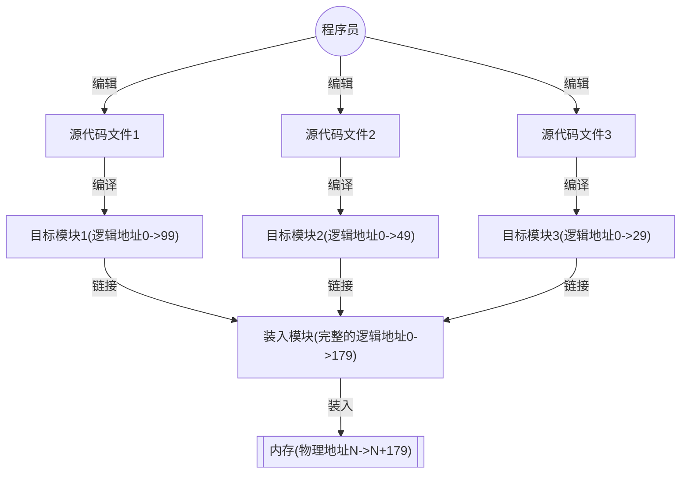

# 内存管理

内存管理 (Memory Management) 是操作系统中最重要和最复杂的内容之一。虽然计算机硬件技术一直在飞速发展，内存容量也在不断增大，但是仍然不可能将所有用户进程和系统所需要的全部程序和数据放入主存，因此操作系统必须对内存空间进行合理的划分和有效的动态分配。

操作系统作为系统资源的管理者，需要对内存进行管理。操作系统管理内存一般指：
1. 操作系统负责内存空间的分配与回收。
2. 操作系统需要提供某种技术从逻辑上对内存空间进行扩充。
3. 操作系统需要提供地址转换功能，负责程序的逻辑地址与物理地址的转换。
4. 操作系统需要提供内存保护的功能，保证各个进程在各自存储空间内运行，互不干扰。

> [!tip] 内存管理的概念
> 操作系统对内存空间进行合理划分和有效的动态分配。

> [!note] 内存管理的主要功能
> - 内存空间的分配与回收。由操作系统进行内存空间的分配和管理，记录内存的空闲空间、内存的分配情况，并回收已经结束进程所占用的空间。
> - 地址转换。由于程序的逻辑地址与内存中的物理地址不可能一致，因此存储管理必须提供地址转换功能，将逻辑地址转换为相应的物理地址。
> - 内存空间的扩充。利用虚拟存储技术从逻辑上扩充内存。
> - 内存共享。指多个进程允许访问内存的同一部分。
> - 存储保护。保证各个进程在各自的存储空间内运行，互不干扰。

## 内存

内存是 [[计算机组成原理/存储系统|存储系统]] 的一部分，可存放数据。程序执行前需要先放到内存中才能被 CPU 处理，内存用于缓冲 CPU 与硬盘之间的速度矛盾。

> [!note]
> 在多道程序环境下，系统中会有多个程序并发执行，也就是说会有多个程序的数据需要同时放到内存中。计算机通过给内存的存储单元编址的方式来区分每个内存对应的程序。

> [!note] 存储容量单位
> 在计算机中，表示存储容量大小的单位一般为：
> - $2^{10}=1$ K，千
> - $2^{20}=1$ M，兆，百万
> - $2^{30}=1$ G，吉，千兆，十亿

### 指令的工作原理

指令的工作基于地址，每个地址对应一个数据的存储单元。系统通过对应的指令进行对应的操作，跳转到下一个指令不断执行。
- 相对地址：程序经过编译、链接后生成的指令中指名的是逻辑地址 (相对地址) ，即相对于进程起始点的地址。
- 绝对地址：相对于 0 物理地址的绝对地址。

### 程序的链接与装入

创建进程首先要将程序和数据装入内存。将用户源程序变为可在内存中执行的程序，通常需要以下步骤：
- 编译。由编译程序将用户源代码编译为若干目标模块 (将高级语言翻译为机器语言)。
- 链接。由链接程序将编译后的形成的一组目标模块，以及他们所需的库函数链接在一起，形成一个完整的装入模块。
- 装入。由装入程序将装入模块装入内存运行。

> [!note] 装入的三种方式
> 当一个模块装入内存时，有以下三种装入方式：
> 1. 绝对装入。只适用于单道程序环境。
> 	- 在编译时，若知道程序将放到内存的哪个位置，则编译程序将产生包含绝对地址的目标代码。装入程序按照装入模块的地址，将程序和数据装入内存。
> 	- *在绝对装入中，程序中的逻辑地址与实际的物理地址相同，因此不需要进行地址转换*。
> 2. 可重定位装入。也称静态重定位。
> 	- 经过编译、链接后的装入模块的始址通常从 0 开始，程序中使用的指令和数据地址都是相对于始址的。装入程序根据内存的当前情况，将装入模块装入内存的适当位置，并将目标程序中的相对地址修改为物理地址。
> 	- 在装入时对目标程序中的相对地址的修改过程称为重定位，又由于地址转换通常在进程装入时一次完成，因此称为**静态重定位**。
> 	- *在可重定位装入中，当一个作业被装入内存时，必须为它分配全部内存空间，若没有足够的内存，则无法装入。作业一旦装入内存，整个运行期间就不能在内存中移动，也不能再申请内存空间*。
> 3. 动态运行时装入。也称**动态重定位**。
> 	- 装入程序将装入模块装入内存后，并不会立即将装入模块中的相对地址转换为绝对地址，而是将这种地址转换推迟到程序真正要执行时才进行。
> 	- *在动态运行时装入中，装入内存后的所有地址均为相对地址，这种方法需要一个重定位寄存器 (用于存放装入模块的起始地址) 辅助*。

> [!note] 动态重定位的优点
> - 可以将程序分配到不连续的存储区。
> - 在程序运行前只需要装入它的部分代码即可投入运行，然后再程序运行期间，根据动态申请分配内存。
> - 便于程序段的共享。

>[!note] 链接的三种方式
当对目标模块进行链接时，根据链接的时间不同，可以分为以下三种链接方式：
> 1. **静态链接**
   > 	- 在程序运行之前，将各个目标模块及其所需的库函数组合成一个完整的可执行模块，并且这个模块在之后的运行过程中不会被拆分。
   > 	- 在静态链接过程中，链接器会调整相对地址，并转换外部引用符号，确保每个模块中的外部引用都被正确地指向其目标地址。
> 2. **装入时动态链接**
   > 	- 当用户源程序被编译成一组目标模块后，在这些模块加载到内存的过程中进行链接。
   > 	- 这种方式便于对代码进行更新和修改，并且有助于实现目标模块间的资源共享。
> 3. **运行时动态链接**
   > 	- 在程序执行期间，仅当需要某个目标模块时才会对其进行链接。
   > 	- 如果程序执行过程中没有使用某些目标模块，则这些模块不会被加载进内存并与主程序链接。
   > 	- 这种方式不仅加速了程序的初始加载速度，还能有效利用内存空间。

### 逻辑地址与物理地址

- **逻辑地址**：编译后，每个目标模块都会从 0 号单元开始编址，这种地址被称为该模块的相对地址（或逻辑地址）。
- **逻辑地址空间**：当连接程序将各个模块链接成一个完整的可执行目标程序时，这些模块的相对地址会被整合成一个统一的、从 0 号单元开始编址的逻辑地址空间（或虚拟地址空间）。
- **物理地址空间**：由内存中的实际存储单元组成，它是地址转换的最终结果，CPU 根据物理地址直接访问内存。当装入程序将可执行代码载入内存时，必须通过地址转换机制将逻辑地址转换为物理地址，这一过程称为地址重定位。

> [!note]
> - 对于程序和程序员而言，只需关注逻辑地址，而具体的内存管理机制对外部是透明的。不同的进程可以拥有相同的逻辑地址，因为这些相同的逻辑地址可以映射到主存的不同位置。
> - 操作系统通过内存管理单元（MMU）将进程使用的逻辑地址转换为物理地址。进程操作的是虚拟内存空间中的地址，而在操作系统的管理和硬件的支持下，这些地址会被转换为真实的物理地址。
> - 逻辑地址通过页表映射到物理内存，页表由操作系统维护，并供处理器引用。

### 进程的内存映像

不同于存放在硬盘上的可执行程序文件，当一个程序调入内存运行时，就构成了进程的内存映像。一个进程的内存映像一般有几个要素：
- **代码段和常量区**：即程序的二进制代码。代码段是只读的，可以被多个进程共享。
- **数据段**：即程序运行时加工处理的对象，包括全局变量和静态变量。
- **进程控制块** (PCB)：存放在系统区，操作系统通过 PCB 来控制和管理进程。
- **堆**：用来存放动态分配的变量。通过调用 `malloc` 函数动态的向高地址分配空间。
- [[计算机组成原理/指令系统#栈帧的概念|栈]]：用来实现函数调用。从用户空间的最大地址向低地址方向增长。
- **共享库的存储映射**：即公用的库函数，物理上只用一份，操作系统将其物理地址映射到每个进程的共享库存储映射区域

> [!note]
> - 代码段和数据段在程序调入内存时就指定了大小，而堆和栈不同。
> 	- 当调用类似 `malloc` 和 `free` 这样的 C 标准函数时，堆可以在运行时动态的拓展和收缩。
> 	- 用户栈在程序运行期间也可以动态的拓展和收缩，每次调用一个函数，栈就会增长。从一个函数返回时，栈就会收缩。

> [!example]- 进程的虚拟内存空间
> ![[image/内存管理-1.png|内存中的一个进程|500]]

## 内存保护技术

内存保护需要确保每个进程都有一个独立的内存空间。内存分配前，需要保护操作系统不受用户进程的影响，同时保护用户进程不受其他用户进程的影响。内存保护可以采取两种方式：
1. 在 CPU 中设置一对上、下限寄存器，分别存放进程上、下限地址。每当进程的指令访问某个地址时，CPU 与这两个寄存器的值进行对比，检查是否越界。
2. 采用重定位寄存 (基址寄存器) 器和界地址寄存器 (限长寄存器) 进行越界检查。重定位寄存器中存放的的时进程的**起始物理地址**，界地址寄存器中存放的是进程的**最大逻辑地址**。
	- 在访问一个逻辑地址时，内存管理部件将逻辑地址与界地址寄存器进行比较，如果没有发生越界，则将逻辑地址加上重定位寄存器的值，映射为物理地址后送交内存单元。

> [!warning] 重定位寄存器与界地址寄存器
> 实现内存保护需要重定位寄存器和界地址寄存器，它们有如下区别：
> 1. 重定位寄存器用于相加，即逻辑地址加上重定位寄存器中的值就能得到物理地址。
> 2. 界地址寄存器用于比较，即比较逻辑地址与界地址寄存器的值来判断是否越界。
>
> 加载重定位寄存器和界地址寄存器时必须使用特权指令，只有操作系统内核才可以加载这两个存储器。这种方案允许操作系统内核修改这两个寄存器的值，而不允许用户程序修改。

## 内存共享技术

并不是所有的进程内存空间都适合共享，只有那些只读的区域才可以共享。

**可重入代码**也称为纯代码，是一种允许多个进程同时访问但不被允许被任何进程修改的代码。在实际执行时，可以为每个进程配以局部数据区，将在执行中可能被改变的部分复制到该数据区。这样，程序在执行时只需要对该私有数据区中的内存进行修改，并不去改变共享的代码。

> [!tip]
> [[#内存映射文件]] 就是实现内存共享的一种技术。

## 内存扩充技术

早期计算机的内存很小，因此经常出现内存大小不够的情况。人们引入了覆盖技术来解决程序大小超过物理内存总和的问题。

### 覆盖技术

覆盖技术的思想：将程序分为多个段（多个模块），常用的段常驻内存，不常用的段在需要时调入内存。
- 内存中分为一个固定区和若干个覆盖区。
- 需要常驻内存的段放在固定区中，调入后就不再调出。除非运行结束。不常用的段放在覆盖区，需要用到时调入内存，用不到时调出内存。

即按照自身逻辑结果，让那些不可能被同时访问的程序段共享同一个覆盖区。

> [!note] 覆盖技术的特点
> 必须由程序员声明覆盖结构，操作系统完成自动覆盖。缺点：对用户不透明增加了用户编程负担。

### 交换技术

交换（对换）技术的设计思想：内存空间紧张时，系统将内存中的某些进程暂时换出外存，把外存中某些具备运行条件的进程换入内存（进程在内存与磁盘间动态调度）。

[[进程管理#调度的三个层次]] 中的中级调度就是内存调度。暂时换出内存的等待的进程状态为挂起状态（挂起态），挂起态又可以进一步细分为就绪挂起、阻塞挂起两种状态。

> [!note] 在外存的什么位置保存被换出的进程？
> 具有对换功能的操作系统中，通常把磁盘空间分为文件区和对换区两部分。
> - 文件区主要用于存放文件，主要追求存储空间的利用率，因此对文件区空间的管理采用离散分配方式。
> - 对换区空间只占磁盘空间的小部分，被换出的进程数据就存放在对换区。由于对换的速度直接影响了操作系统的整体速度，因此对换区空间的管理主要追求换入换出速度，因此通常采用连续分配方式。
> - 总之，对换区的 I/O 速度比文件区更快。

> [!note] 什么时候应该交换？
> 交换通常在许多进程运行且内存吃紧时进行，而系统负荷降低就暂停。例如在发现许多进程运行时经常发生缺页，就说明内存紧张，此时可以换出一些进程。如果缺页率明显下降，就可以暂停换出。

> [!note] 应该换出那些进程？
> 可以优先换出阻塞进程，可以优先换出优先级低的进程，为了防止优先级的进程在被调入内存后很快又被换出，有的系统还会考虑进程在内存的驻留时间。

## 内存空间的分配与回收

存储管理方式随着操作系统的发展而发展，在操作系统由单道向多道发展时，存储管理方式便由单一连续分配发展为固定分区分配。为了更好地适应不同大小的程序要求，又从固定分区分配发展到动态分区分配。为了更好提高内存的利用率，进而从连续分配方式发展到离散分配方式。

### 连续分配管理方式

连续分配方式指为一个用户分配一个连续的内存空间。*例如，用户需要使用 100MB 的内存空间，连续分配方式就在内存空间中为用户分配一块连续的 100MB 空间*。

#### 单一连续分配

在单一连续分配方式中，内存被分为系统区和用户区。
- 系统区仅供操作系统使用，通常位于内存的低地址部分，用于存放操作系统相关数据。
- 用户区内存中有且仅有一道用户程序，即用户程序独占整个用户区。

> [!note] 单一连续分配的特点
> - 优点：
> 	- 实现简单，无外部碎片；
> 	- 可以采用覆盖技术扩充内存；
> 	- 不一定需要采取内存保护。用于早期的操作系统。
> - 缺点：
> 	- 只能用于单用户、单任务的操作系统中。
> 	- 有内部碎片。
> 	- 存储器利用率极低。

> [!tip] 内部碎片与外部碎片
> - **内部碎片**：分配给某进程的内存区域大于进行所需空间大小，导致一些分配后的内存没有用上，就称这些内存为内部碎片
> - **外部碎片**：指内存中的某些空闲分区由于太小而难以利用

#### 固定分区分配

为了能在内存中装入多道程序，且这些程序间不会互相干扰，于是将整个用户空间划分为若干个固定大小的分区，在每个分区中只装入一道作业。每当有空闲分区时，便可以从外存的后备作业队列中选择适当大小的作业装入该分区。

在划分分区时，有两种不同的方法：
- 分区大小相等：缺乏灵活性，但是适合用于用一台计算机控制多个相同对象的场合。
- 分区大小不等：划分为多个较小的分区，适量的中等分区，少量的大分区。

> [!note] 分区使用表
> 操作系统需要建立一个**分区使用表**数据结构来实现各个分区的分配与回收。
> - 每个表项对应一个分区，通常按分区大小排列，每个表项包括对应分区的大小、起始地址、分配状态。
> - 分配内存时^[用户程序需要装入内存时]，由操作系统内核程序根据用户程序大小检索该表，从中找到一个能满足大小的、未分配的分区，将之分配给该程序，然后修改状态为已分配。若找不到符合要求的分区，则拒绝分配。
> - 回收内存时，将对应的表项状态置位未分配即可。

> [!note] 固定分区分配的特点
> - 优点：实现简单，无外部碎片。
> - 缺点：
>	- 当用户程序太大时，可能所有的分区都不能满足需求，此时不得不采用覆盖技术来解决。但这又会降低性能。
>	- 当程序小于固定分区大小时，也要占用完整的一个分区，这样分区的内部存在空间浪费，存在内部碎片。

#### 动态分区分配

动态分区分配又称为可变分区分配。这种分配方式不会预先划分内存分区，而是在进程装入内存时，根据进程的大小动态地建立分区，并使分区的大小正好适合进程的需要。因此系统分区的大小和数目是可变。

在动态分区分配中，我们通过空闲分区表 (链) 来进行内存的分配和回收。
- **空闲分区表**：每个空闲分区表对应一个表项，按照起始地址排序。表项中包含分区号、分区大小、分区起始地址等信息。
- **空闲分区链**：每个分区的起始部分和末尾部分分别设置向前指针和向后指针。起始部分处还可以记录分区大小等信息。

把一个新作业装入内存时，须按照一定的 [[#动态分区分配算法]]，从空闲分区表中选出一个分区分配给该作业。由于分配算法随系统性能有很大的影响，因此人们对它进行了广泛的研究。

> [!note] 动态分区分配的过程
> - 分配内存：检索空闲分区表，找到一个可以使用的空闲分区。
> 	- 空闲分区的大小大于需要分配的内存，则进行分配，同时空闲分区的起始地址增加。
> 	- 空闲分区的大小正好等于需要分配的内存，则将该分区表项直接删除。
> - 回收内存：回收内存，并合并相邻的空闲分区
> 	1. 回收区的后面有一个相邻的空闲分区：回收后将相邻的空闲分区的大小与起始位置修改
> 	2. 回收区的前面有一个相邻的空闲分区：回收后将相邻的空闲分区的大小修改
> 	3. 回收区的前后各有一个相邻的空闲分区：回收后将相邻的两个分区合并，即分区大小为三者相加，起始地址为前面的分区的起始地址
> 	4. 回收区的前后都没有相邻的空闲分区：回收后增加一个新的表项。

> [!note] 动态分区分配方法的弊端
> 动态分区在开始时是效果很好的，但是随着时间的推移，内存中会产生越来越多的小内存块，内存的利用率也随之下降。这些小内存块称为**外部碎片**，它存在于所有分区的外部，与固定分区中的内部碎片正好相对。
>
> 外部碎片可以通过**紧凑技术**克服，即操作系统不时地对进程进行移动和整理。但是紧凑技术需要动态重定位寄存器的支持，且相对费时。

#### 动态分区分配算法

将作业装入主存时，需要按照一定的分配算法从空闲分区表中选出一个分区，以分配给该作业。按照分区的检索方式，可以分为顺序分配算法和索引分配算法。

##### 基于顺序搜索的分配算法

顺序搜索空闲分区链上的空闲分区，以寻找一个大小符合要求的分区。顺序分配算法有以下 4 种：
1. 首次适应 (First Fit) 算法：空闲分区按照地址递增次序排列，每次分配内存时，顺序查找到第一个满足大小的空闲分区，分配给作业。
	- 首次适应算法保留了内存高地址的大空闲分区，有利于后续大作业的装入。
	- 首次适应算法会使得内存低地址部分出现许多小碎片，而每次分配查找时都要经过这些分区，因此增加了开销。
2. 邻近适应 (Next Fit) 算法：也称为循环适应算法，由首次适应算法演变而来。相较于首次适应算法，分配地址时，从上一次查找结束的位置开始继续查找。
	- 邻近适应算法让高、低地址部分的空闲分区以同等概率被分配，划分为小分区。
	- 容易导致内存高地址部分没有大空闲分区可用。*常比首次适应算法更差*。
3. 最佳适应 (Best Fit) 算法。空闲分区按照容量递增的次序排列，每次分配内存时，顺序查找第一个能够满足大小的空闲分区，即最小的空闲分区，分配给作业。
	- 最佳适应算法能更多的留下大空闲分区，但是每次分配会留下来越来越多很小的难以利用的内存块，进而产生最多的外部碎片。*性能通常很差*。
4. 最坏适应 (Worst Fit) 算法。空闲分区按照容量递减的次序排列，每次分配内存时，顺序查找第一个能够满足大小的空闲分区，即最大的空闲分区，从中分割一部分给作业。
	- 与最佳适应算法相反，每次选择最大的空闲分区，虽然不容易产生碎片，但是很快就会导致没有大的空闲分区可用。*性能通常很差*。

> [!tip]
> 综合来看，首次适应算法开销小，性能最好，且回收分区不需要对空闲分区进行重新排序。

##### 基于索引搜索的分配算法

当系统很大时，空闲分区链可能很长，此时采用顺序分配算法可能会很慢。因此，在大、中型系统中往往采用索引分配算法。

**索引分配算法**的思想是，根据其大小对空闲分区进行分类，对于每个大小相同的空闲分区，单独设立一个空闲分区表，并设置一张索引表来管理这些空闲分区表。当为进程分配空间时，在索引表中查找所需要的空间大小对应的表项，从中得到对应的空闲分区表的指针，从而获得一个空闲分区。

索引分配算法有以下三种：
1. 快速适应算法。空闲分区的分类根据进程常用的空间大小进行划分。
	- 分配内存时，首先根据进程的长度，在索引表中找到能够容纳它的最小的空闲分区表。然后从链表中取出第一块进行分配。
	- 优点：查找效率高，不产生内部碎片。
	- 缺点：回收分区时，需要有效合并分区，算法比较复杂，系统开销较大。
2. 伙伴系统。规定所有的分区的大小都为 2 的整数次幂。
	- 当需要为进程分配大小为 $n$ 的分区时，在大小为 $2^i$ 的空闲分区链中查找。若找到，则将空闲分区分配给进程。否则，表示大小为 $2^{i}$ 的空闲分区已经耗尽，需要在大小为 $2^{i+1}$ 的空闲分区链中继续查找。
	- 若找到了一个大小为 $2^{i+1}$ 的空闲分区，则将其划分为两个大小为 $2^{i}$ 的分区，一个用于分配，另一个加入 $2^{i}$ 的空闲分区链中。若不存在，则继续查找，直到找到为止。
	- 回收时，也需要对伙伴分区进行合并。
3. 哈希算法。根据空闲分区链表的分布规律，建立哈希函数，构建一张以空闲分区大小为关键字的哈希表，每个表项记录一个对应空闲分区链的头指针。
	- 分配时，根据所需分区的大小，通过哈希函数计算得到哈希表中的位置，从中得到相应的空闲分区表。

### 非连续分配管理方式

固定分区会产生内部碎片，动态分区会缠上外部碎片，这两种技术对于内存的利用率都比较低。非连续分配方式将内存空间分为若干大小的小块，使得进程可以分散的分布在内存的各个区域内。

#### 基本分页存储管理

为了避免碎片的产生，引入的分页的思想，操作系统以页框为单位为各个进程分配内存空间。
- 物理地址空间：将内存空间分为若干固定大小分区，分为页框、页帧或物理块。
- 逻辑地址空间：将进程的逻辑地址空间也分为相同块大小的若干区域，称为页或者页面。

> [!note] 分页与固定分区技术的区别
> 从形式上看，分页的方法与分区相等的固定分区技术相同，但是**分页管理不产生外部碎片**。它们之间有本质的不同：
> - 分页管理中，块的大小相对分区要小很多，而且进程也按照块进行划分，进程运行时按块申请主存可用空间并执行。
> - 分页管理中，只有在进程最后一个不完整的块中才会产生内部碎片。尽管分页管理会产生内部碎片，但是这种碎片对于进程来说也是很小的，对于每个进程，平均只会产生半个块大小的碎片 (页内碎片)。

##### 基本概念

进程的逻辑地址空间中的每个页面由一个编号，称为**页号**，从 0 开始。内存空间中每个页框也有一个编号，成为**页框号** (物理块号)，也从 0 开始。进程在执行时需要申请内存空间，即要为每个页面分配内存中的可用页框 (页框与页面一一对应)。

> [!note] 分页系统的逻辑地址结构
> 下面是一个常见的分页系统的逻辑地址结构：
> $$
\begin{array}{|ccc|ccc|}
\hline 31 & \cdots & 12 & 11 & \cdots & 0 \\ \hline
 & \small\text{页号} P & & & \small\text{页内偏移量} W & \\ \hline
\end{array}
> $$
> 逻辑地址前面的部分 (高位) 为页号，后面的部分 (低位) 是页内偏移量。在上面的分页系统中，地址的长度为 32 位，其中
> -  0~11 位为页内地址，即每页大小为 $2^{12}B$；
> - 12~31 位为页号，即最多允许 $2^{20}$ 逻辑页；

为了便于找到进程的每个页面在内存中存放的位置，操作系统为每个进程建立一张**页面映射表**, 简称为**页表**。页表通常保存在 PCB 中。
- 一个进程对应一个页表；
- 进程的每个页面对应一个页表项；
- 每个页表项由页号和块号组成，它记录了页面在内存中对应的物理块号。

> [!warning]
> **由于页表项连续存放，因此页号是隐含的，不占存储空间**。可以利用页表中页表项的存储位置来推出其对应的页号。
>
> 需要注意的是，页表中记录的是内存块的块号，而不是起始地址。起始地址为块号×每块的大小

> [!note] 页框的大小选择
> 为了方便转换，页面的大小应该是 2 的整数次幂，同时页面大小应该适中。
> - 页面太小：会使得进程的页面数过多，导致页表过长，占用大量内存，也会增加硬件地址转换的开销，降低页面换入、换出的效率。
> - 页面过大：会使得页内碎片增多，降低内存的利用率。

##### 基本地址变化机构

地址变换机构的任务是将逻辑地址转换为内存中的物理地址。地址变换是借助于页表实现的。

> [!note] 页表寄存器
> 为了提高地址变换的速度，通常会在系统中设置一个**页表寄存器** (PTR)，存放页表在内存中的起始地址 F 和页表长度 M。
>
> 由于寄存器的造价昂贵，因此在单 CPU 系统中只设置一个页表寄存器。程序未执行时，页表的始址和页表长度放在 PCB 中，当进程被调度时，操作系统内核会将他们放到页表寄存器中。

设页面大小为 $L$，逻辑地址 $A$ 到物理地址 $E$ 的变换过程如下：
1. 根据逻辑地址计算出页号 $P=A/L$，页内偏移量 $W=A\%L$。
2. 比较页号 $P$ 和页表长度 $M$ 的大小，若 $P\geqslant M$，则产生越界中断，否则继续执行。
3. 在页表中查询页号对应的页表项，确定页表存放的物理块号 $b$。
	- 页表 $P$ 对应的页表项地址 = 页表起始地址 + 页号 × 页表项长度。
4. 计算物理地址，即 $E=b\times L+W$，CPU 使用物理地址去访存。

> [!note]
> 以上的整个地址变换过程均是由硬件自动完成的。

> [!example]- 分页存储管理系统中的地址变换机构 (硬件)
> ![[image/内存管理-2.png#center|分页存储管理系统中的地址变换机构|600]]

> [!note] 分页式管理的主要问题
> 1. 每次访存操作都需要进行逻辑地址到物理地址的转换，地址转换的过程必须足够快，否则访存速度会降低。
> 2. 每个进程进入页表，用于存储映射机制，页表不能太大，否则内存利用率低。

##### 具有块表的地址变换机构

> [!note] 使用 TLB 的原因
> 如果页表全部放在内存中，则存取一个数据或者一条指令至少要访问两次内存：
> - 第一次是访问页表，确定存取的数据或者指令所在的物理地址
> - 第二次是根据该地址存储数据或指令。
>
> 显然，这种方法比通常执行指令的速度慢了一半。为此，在地址变换机构中增设一个具有并行查找能力的高速缓冲器，即快表 TLB。

快表，又称为联想寄存器 (TLB, translation lookaside buffer)，是一种访问速度比内存块很多的高速缓存 (TLB 不是内存，属于 Cache)，用来存放最近访问的页表项的副本，可以加速地址变换的速度。与此对应的，内存中的页表常称为慢表。

引入快表后，地址的变换过程：
1. CPU 给出逻辑地址，由某个硬件算得页号、页内偏移量，将页号与快表中的所有页号进行比较。
2. 如果找到匹配的页号，说明要访问的页表项在快表中有副本，则直接从中取出改页对应的内存块号，再将内存块号与页内偏移量拼接形成物理地址。最后访问该物理地址对应的内存单元。
	- 因此，若快表命中，则访问某个逻辑地址仅需**一次访存**即可。
3. 如果没有找到匹配的页号，则需要访问内存中的页表，找到对应页表项，得到页面存放的内存块号，在将内存块号与页内偏移量拼接形成物理地址。最后访问该物理地址对应的内存单元。
	- 因此，若快表未命中，则访问某个逻辑地址需要**两次访存**。
	- 若快表已满，则必须按照一定的算法对旧的页表项进行替换。

> [!note]
> - 由于查询快表的速度比查询页表的速度快很多，因此只要快表命中，就可以节省很多的时间。根据 [[计算机组成原理/存储系统#^localityPrinciple|局部性原理]]，一般来说快表的命中率可以达到 90\% 以上。
> - 对于有些系统，支持快表和页表同时查询，这样页表就不会等到快表未命中后才开始查询。

> [!example]- 具有快表的地址变换机构
> ![[image/内存管理-3.png#center|具有快表的地址变换机构|600]]

##### 两级页表

在引入分页管理后，进程在执行时不需要将所有页调入内存页框，而只需要保存现有映射关系的页表调入内存。但是即使这样，也需要考虑页表的大小，在某些情况下，单级页表可能过大，超过了一个页框的大小。

> [!note] 单级页表存在的问题
> 1. 页表必须连续存放，因此当页表很大时，需要占用很多个连续的页框。
> 2. 没有必要让整个页表常驻内存，因为进程在一段时间内可能只需要访问几个特定的页面。

两级页表的思想：将连续的页表分块，创建两级页表，称为**页目录表** (顶级页表、外层页表)，原来的页表称为二级页表。在两级页表中，逻辑地址的空间格式变为了
$$
\begin{array}{|c|c|c|}
\hline
\small\text{一级页号} & \small\text{二级页号} & \small\text{页内偏移地址}\\ \hline
\end{array}
$$

查询的步骤变为：
1. 按照地址结构将逻辑地址拆为三部分
2. 从 PCB 中读出页目录表始址，在根据一级页号查页目录表，找到下一级页表在内存中的存放位置
3. 根据二级页号查表，找到最终想访问的内存块号
4. 结合页内偏移量得到物理地址

> [!warning]
> 1. 若采用多级页表机制，则各级页表的大小不能超过一个页面
> 2. 两级页表的访存顺序分析：
> 	1. 访问内存中的页目录表
> 	2. 访问内存中的二级页表
> 	3. 访问目标内存单元
> 3. 两级页表需要访问两次内存。推广一下，n 级页表需要访问 n+1 次内存 (n 次查表与 1 次访问目标内存)。

#### 基本分段存储管理

分页管理方式是从计算机的角度考虑设计的，目的是提高内存的利用率，提升计算机的性能。分页通过硬件机制实现，对用户完全透明。分段管理方式的提出则考虑了用户和程序员，以满足方便编程、信息保护和共享、动态增长及动态链接等多方面的需要。

##### 基本概念

分段系统将用户进程的逻辑地址空间划分为大小不等的段。*例如，用户进程由主程序段、两个子程序段、栈段和数据段组成^[[[#进程的内存映像]]]，于是将这个进程分为 5 段，每段从 0 开始编址，并分配一段连续的地址空间*。分段系统中，每个段内的地址是连续的，段之间不要求连续。

> [!note] 分段存储管理的逻辑地址
> 一个常见的分段系统的逻辑地址结构如下：
> $$
\begin{array}{|ccc|ccc|}
\hline 31 & \cdots & 16 & 15 & \cdots & 0 \\ \hline
 & \small\text{段号}S & & & \small\text{段内偏移地址}W & \\ \hline
\end{array}
> $$
> 在页式系统中，逻辑地址的页号和页内偏移量对用户是透明的，但是在分段系统中，段号和段内偏移量必须由用户显式提供。在高级程序设计语言中，这个功能由编译程序完成。

由于段是离散的分布在内存中，为了保证程序能正常运行，就必须能从物理内存中找到各个逻辑段的存放位置。为此，需要为每个进程建立一张**段映射表**，简称**段表**。
1. 每个段对应一个段表项，其中记录了该段在内存中的起始位置 (基址) 和段的长度。
2. 各个段表项中的长度是相同的。由于段表项长度相同，因此段号可以是隐含的，不占存储空间。若段表存放的起始位置为 M，每个段表项长度为 $L$，则 K 号段对应的段表项存放的地址为 $M+K\times L$。

> [!tip]
> 与页表相同，在进程没有上处理机运行时，基址和段表长度是记录在 PCB 中的。

##### 地址变换机构

为了实现进程从逻辑地址到物理地址的变换功能，在系统中设置了一个段表寄存器，用于存放段表起始地址 $F$ 和段表长度 $M$。从逻辑地址 $A$ 到物理地址 $E$ 之间的地址变换过程如下：
1. 根据逻辑地址得到段号 $S$、段内偏移量 $W$；
2. 判断段号是否越界，若 $S\geqslant M$，则产生越界中断，否则继续执行。
3. 查询段表，找到对应段表项，段号 $S$ 对应的段表项地址 = 段表起始地址 + 段号 × 段表项长度。
4. **检查段内地址是否超过段长**。取出段表项中的段长 $C$，若 $W\geqslant C$，则产生越界中断，否则继续执行。^[这一步与页式存储管理不同，段的长度不同，因此需要判断段的长度与段内地址的关系]
5. 取出段表项中的物理段起始地址 $b$，计算物理地址 $E=b+W$，CPU 使用物理地址进行访存。

> [!note] 分段内存管理与分页内存管理的区别
> 1. 页是信息的物理单位。*分页的主要目的是为了实现离散分配，提高内存利用率。分页仅仅是系统管理上的需要，完全是系统行为，对用户不可见。*
> 2. 段是信息的逻辑单位。*分段的主要目的是更好的满足用户需求。一个段通常包含了一组属于同一个逻辑模块的信息。分段对用户是可见的，用户编程时需要显式地给出段名。*
> 3. 页的大小固定且有系统决定。*段的长度不固定，决定于用户编写的程序。*
> 4. 页和段的用户进程的地址空间不同。
> 	- 分页的用户进程的地址空间是一维的，程序员只需要给出一个记忆符即可表示一个地址。
> 	- 分段的用户进程的地址空间是二维的，程序员在表示一个地址时，既要给出段名，也要给出段内地址。
> 5. 分段相比于分页，更容易实现信息的共享和保护。因此分段是按照逻辑功能划分的。

> [!tip]
> 与分页管理类似，分段系统中也可以引入快表机制来加速。

#### 段页式管理方式

> [!note] 分页、分段的优缺点分析
>  - 分页管理：
> 	- 优点：内存空间利用率高，不会产生外部碎片，只会有少量的内页碎片
> 	- 缺点：不方便按照逻辑模块实现信息的共享和保护
> - 分段管理：
> 	- 优点：很方便按照逻辑模块实现信息的共享和包含
> 	- 缺点：如果段过长过大，为其分配很大的连续空间会很不方便。例外，段式管理会产生外部碎片。

段页式管理综合了二者的优点。在段页式系统中，进程的地址空间首先被划分为若干逻辑段，每段都有自己的段号，然后将每段划分为若干大小固定的页。段页式管理的逻辑地址由段号、页号、页内偏移量组成：
$$
\begin{array}{|c|c|}
\hline\small\text{段号}S & \small\text{页号}P & \small\text{页内偏移量}W \\ \hline
\end{array}
$$
- 段号的位数决定了每个进程最多可以分为几个段
- 页号的位数决定了每个段最大有多少页
- 页内偏移量决定了页面大小、内存块大小是多少
- 一个进程对应一个段表，对应多个页表。一个段对应一个页表。

> [!note]
> 分段对用户是可见的，程序员编程时需要显式的给出段号、段内地址。而将各个段分页对用户是不可见的。系统会根据段内地址自动划分页号和页内偏移量。因此段页式管理的地址结构是二维的。

##### 地址转换

为了实现地址变换，系统为每个进程建立一张段表，每个段对应一个段表项，包含段号、页表长度和页表始址。每个段有一张页表，每个页表项包含页号和块号。此外，系统中还有一个段表寄存器，指出段表始址和段表长度。

段页式管理的地址转换如下：
1. 根据逻辑地址得到段号、页号、页内偏移量。
2. 判断段号是否越界。若 $S\geqslant M$，则产生越界中断，否则继续执行。
3. 查询段表，找到对应的段表项，段表项的存放地址为 F+S×段表项长度。
4. 检查页号是否越界，若页号 $\geqslant$ 页表长度，则发生越界中断。否则继续执行。
5. 根据页表存放块号、页号查询页表，找到对应页表项。
6. 根据内存块号，页内偏移量得到最终的物理地址。
7. 访问目标内存单元。

> [!note]
> 在段页式管理方式中，同样可以引入快表机制，用段号与页号作为查询快表的关键字。若快表命中，则进需要一次访存。否则需要三次访存。

## 虚拟内存

虚拟内存技术是一种更加先进的内存扩充技术。

传统的存储管理机制有下面几种特点：
1. 一次性：作业必须一次性全部装入内存后才能开始运行。这会导致两个问题：
	- 作业很大时，不能全部装入内存，导致大作业无法运行。
	- 当大量作业要求运行时，由于内存无法容纳所有作业，因此只有少量作业能运行，导致多道程序并发度下降。
2. 驻留性：一旦作业被装入内存，就会一直驻留内存中，直到作业运行结束。而运行中的程序可能由于等待 IO 而被阻塞，处于长期等待状态。

### 虚拟存储器的定义

基于 [[#局部性原理]]，在程序装入时，仅需要将程序当前要用到的少数页面装入内存中，暂时用不到的部分留在外存，就可以让程序开始执行。
- 请求调页：在程序执行的过程中，当所访问的信息不在内存时，由操作系统负责将所需信息从外存调入内存，然后继续执行程序。
- 页面置换：若内存空间不够，由操作系统将内存中暂时用不到的信息换出到外存。

在操作系统的管理下，在用户看来似乎有一个比实际内存大得多的内存。这就是**虚拟内存**。虚拟内存有下面的三个主要特征：
- 多次性：无需在作业运行时一次性全部装入内存，而是允许在作业运行过程中，将作业换入、换出，分为多次调入内存中。*这是虚拟内存最重要的特征*。
- 对换性：在作业运行时无需一直常驻内存，而是允许在作业运行过程中，将作业换入、换出。
- 虚拟性：从逻辑上扩充了内存的容量，使用户看到的内存容量远大于实际容量。

#### 实现虚拟内存技术的方法

虚拟内存技术允许一个作业多次调入内存，因此如果采取 [[#连续分配管理方式]]，会使得相当一部分空间都处于暂时或者永久的空闲状态，在成资源的严重浪费。因此虚拟内存技术的实现需要建立在 [[#非连续分配管理方式]]，即离散分配的内存管理方式基础上。

虚拟内存的实现方式主要有：
- 请求分页存储管理
- 请求分段存储管理
- 请求段页式存储管理

> [!note]
> 不管使用什么方式实现虚拟存储，都需要一定的硬件支持。一般需要一下几个方面：
> 1. 一定的容量的内存和外存。
> 2. 页表机制 (或段表机制) 作为主要的数据结构。
> 3. 中断机构，当用户程序要访问的部分尚未调入内存时，产生中断。
> 4. 地址变换机构，实现逻辑地址到物理地址的变换。

#### 请求分页管理方式

请求分页系统建立在基本分页系统的基础之上，为支持虚拟存储功能而增加了请求调页和页面置换功能。
1. 请求调页：在程序执行过程中，要访问的页面不在内存中时，由操作系统负责将所需页面从外存调入内存，然后继续执行程序。
2. 页面置换：若内存不够，由操作系统负责将内存中暂时用不到的页面换出到外存。

##### 页表机制

与基本分页管理相比，请求分页管理中需要存在下面的机制：
1. 操作系统需要知道页面是否已经调入内存，如果还没有调入。
2. 当页面没有调入内存中时，操作系统还需要知道页面在外存中的存放位置。
3. 当内存空间不够时，要实现页面置换。
4. 对于换出的页面，操作系统也需要知道页面是否被修改的信息，如果有的页面没有被修改过，就不需要浪费时间写回外存中。

为此，在请求分页管理机制中，页表项增加了一些额外的标志位，其结构如下：
$$
\begin{array}{|c|c|c|c|c|c|}
\hline\small\text{页号} & \small\text{物理块号} & \small\text{状态位}P & \small\text{访问字段}A & \small\text{修改位}M & \small\text{外存地址} \\ \hline
\end{array}
$$
其中每个字段如下：
1. 页号、物理块号与基本分页机制中相同。
2. 状态位 $P$：标记该页是否已调入内存，供程序访问时参考。
3. 访问字段 $A$：可以记录最近被访问的次数或者上次访问的时间，供置换算法选择换出页面时参考。
4. 修改位 $M$：标记该页在调入内存后是否被修改过，以决定换出时是否写回外存。
5. 外存地址：记录该页在外存的存放地址，通常是物理块号，供调入该页时参考。

##### 缺页中断机构

在请求分页系统中，每当要访问的页面不在内存中，就产生一个**缺页中断**，然后由操作系统的缺页中断处理程序处理中断。此时缺页的进程阻塞，放入阻塞队列，调页完成后将其唤醒，放回就绪队列。
- 如果内存中有空闲页框，则为进程分配一个页框，将所缺页面从外存中装入该页框，并修改页表中相应的页表项。
- 如果内存中没有空闲块，则由页面置换算法选择一个页面淘汰，若该页面在内存期间被修改过，则要将其写回外存。未被修改过的页面不用写回外存。

> [!warning]
> 缺页中断是因为当前执行的指令想要访问目标页面未调入内存而产生的，因此属于 [[操作系统基本原理概论#中断和异常|内部中断]]。与一般的中断相同，都需要经历诸如保护 CPU 环境、分析中断原因、转入缺页中断处理程序、恢复 CPU 环境等步骤。但是与一般的中断相比，它有以下两个明显的区别：
> 1. 在指令执行期间而非一条指令指向完成后产生和处理中断，属于内部异常。
> 2. 一条指令在执行期间，可能产生多次缺页中断。

##### 地址变换机构

基本流程与传统的 [[#基本分页存储管理#基本地址变化机构|分页存储]] 流程类似，但是为了实现虚拟内存，增加了产生和处理缺页中断，以及从内存中换出一页的功能。其过程如下：
- 检索快表，若命中，从中取出该页的物理块号，并修改页表项中的访问位，以供置换算法换出页面时参考。对于写指令，还需要将修改位置为 1。
- 若快表未命中，则从页表中查找，若找到，则从相应表项中取出物理块号，并将该页写入快表中。若快表已满，则需要采用某种算法替换。
- 若在页表中未找到，则需要进行缺页处理，请求系统将该页从外存换入内存，页面被调入内存后，由操作系统负责更新页表和快表，并获得物理块号。
- 利用获得的物理块号和页内地址拼接形成物理地址，使用该地址访存。

> [!note] 使用逻辑地址访存的过程
> 1. 查快表，命中，则访存。
> 2. 快表未命中，查慢表，找到页表项，检查状态位，若调入内存，则访存。
> 3. 若未调入内存，则触发缺页中断，请求调页，调入的页面对应的表项直接加入快表。
> 4. 再次查快表，此时一定命中，直接访存。
> 5. 访问目标内存单元

#### 页框分配

对于分页式的虚拟内存，在进程准备执行时，不需要也不可能将一个进程的所有页都读入主存。因此，操作系统必须决定读取多少页，即决定给特定的进程分配几个页框。给一个进程分配的页框的集合就是该进程的**驻留集**。
1. 驻留集越小，驻留在内存中的进程就越多，可以提高多道程序的并发度，但是分配给每个进程的页框太少，会导致缺页率较高，CPU 需要耗费大量时间来处理缺页。
2. 驻留集越大，当分配给进程的页框数超过了某个数目时，再为进程增加页框对缺页率的改善是不明显的，反而只能浪费内存空间，还会导致多道程序并发度的下降。

##### 内存分配策略

在请求分页系统中，可以采取两种内存分配策略，即**固定分配策略**和**可变分配策略**。在进行置换时，可以采用**全局置换**和**局部置换**。于是可以组合出下面的三种策略：
1. **固定分配，局部置换**：系统为每个进程分配固定数量的物理块，在整个运行期间不改变。
	- 若进程在运行时发生缺页，只能从该进程在内存中的页面中选出一页换出，然后再调入需要的页面。
	- 缺点：
		- 实现这种策略时，难以确定一开始为每个进程分配的物理块数目，灵活性低。
		- 分配物理块太少会导致频繁出现缺页中断，太多会降低 CPU 和其他资源的利用率
2. **可变分配，全局置换**：刚开始会为每个进程分配一定数量的物理块，在进程运行期间根据情况适当的增加或减少。
	- 操作系统会保持一个空闲物理块队列，当进程发生缺页时，从空闲物理块中取出一块分配给该进程。
	- 优点：比固定分配局部置换更加灵活，可以动态的增加进程的物理块。
	- 缺点：
		- 会盲目的给进程增加物理块，导致系统多道程序的并发能力下降。
		- 只要某进程发生缺页，都将获得新的物理块，仅当空闲物理块用完时，系统才选择一个未锁定的页面调出。被选择调出的页可能是系统中任何一个进程的页。因此这个被选中的进程拥有的物理块会减少，缺页率会增加。
3. **可变分配，局部置换**：刚开始为每个进程分配一定数量的物理块，当某进程发生缺页时，只允许该进程自己的物理块中选出一个进程换出外存。
	- 如果进程运行中频繁地缺页，系统会为进程多分配几个物理块，直到该进程缺页率适当程度。反之，如果进程在运行中缺页率特别低，则可适当减少分配给该进程的物理块。
	- 优点：这种方法在保证不会过多调用页的同时，也保持了系统的多道程序并发能力。
	- 缺点：需要更加复杂的实现，也需要更大的开销。但是相较于频繁的换入、换出所浪费的计算机资源，这种牺牲是值得的。

> [!note] 固定分配策略中物理块调入算法
> 采用固定分配策略时，将系统中的空闲物理块分配给各个进程，可以采用下述几种算法：
> 1. **平均分配算法**：将系统中所有可供分配的物理块平均分配给各个进程。
> 2. **按比例分配算法**：根据进程的大小按比例分配物理块。
> 3. **优先权分配算法**：为重要和紧迫的进程分配较多的物理块。通常采用的方法是将所有可分配的物理块分为两部分。一部分按比例分配给各个进程，一部分按照优先权分配。

> [!note] 调入页面的时机
> 为了确定系统将进程运行时所缺的页面调入内存的时机，可以采用以下策略：
> 1. **预调页策略**：根据局部性原理，一次调入若干个相邻的页面可能比一次调入一个页面更高效。但是如果提前调入的页面中大多数没有被访问，那么又是低效的。故这种策略主要用于进程的首次调入，由程序员指出应该先导入哪些部分。
> 2. **请求调页策略**：进程在运行期间发生缺页时才将所缺的页面调入内存。这种策略调入的页面一定会被访问到，但由于每次只能调入一页，因此 IO 开销大。
>
> 实际中是将上面两个策略配合使用。预调页策略在进程运行前使用，请求调页策略在进程运行中使用。

##### 调入页面的方式

请求分页系统中的外存分为两个部分，分别是文件区和对换区。
- 文件区：采用离散分配方式，主要存放文件。
- 对换区：也称为交换区，采用连续分配方式，用于存放对换页面。

对换区的磁盘 IO 速度比文件区更快，这样，当发生缺页请求时，系统和何处调入页面就分为三种情况：
1. **系统拥有足够的对换区空间**：页面的调入、调出都是在内存与对换区之间进行，这样可以保证页面的调入、调出速度很快。在进程运行前，需要将进程相关的数据从文件区复制到对换区。
2. **系统缺少足够的对换区空间**：凡是不会被修改页面都直接从文件区调入，当换出这些页面时，由于它们不会被修改，因此不需要写回磁盘。对于可能被修改的页面，它们换出时放在对换区，下次需要时在从对换区调入。
3. **UNIX 方式**：未使用过的页面都文件区，因此未运行过的页面都从文件区调入。曾经运行过，且被换出的页面全部放在对换区，下次需要时从对换区调入。*进程请求的共享页面若被其他进程调入内存，则不需要再从交换区调入*。

当进程所访问的页面不在内存中时 (状态位为 0)，便向 CPU 发出缺页中断，中断响应后转中断处理程序。中断处理程序通过查找页表得到该页的物理块，此时：
- 若内存未满，则启动磁盘 IO，将所缺页调入内存，并修改页表。
- 若内存已满，则先按照某种置换算法从内存中选出一页准备换出。
	- 若该页未被修改过 (修改位为 0)，则不需要将该页写回磁盘。
	- 若该页已经被修改过，则必须将该页写回磁盘。
	- 将所缺页调入内存，修改页表中的相应表项，置其状态位为 1.
	- 调入完成后，进程就可以利用修改后的页表形成所要访问数据的内存地址。

#### 页面置换算法

页面置换算法用于在内存不够时，选择将哪些暂时用不到的信息换到外存中。由于页面的换入、换出需要磁盘的 IO，会有较大的开销，因此好的页面置换算法应该追求更少的缺页率。

##### 最佳置换算法 (OPT)

每次选择淘汰的页面将是以后永不使用，或者在最长时间内不再被访问的页面，这样可以保证最低的缺页率。

> [!note] OPT 算法的特点
> 最佳置换算法可以保证最低的缺页率，但在实际上，只有进程执行的过程中才能知道接下来会访问到的是哪个页面。操作系统无法提前预判页面的访问序列。因此，**最佳置换算法是无法实现的**。

##### 先进先出置换算法 (FIFO)

每次选择淘汰的页面是最早进入内存的页面。

实现方法：把调入内存的页面根据调入内存的先后顺序排成一个队列，每次换出时选择对头页面。队列的最大长度取决于系统为进程分配了多少内存块。

> [!note] FIFO 算法的特点
> 实现简单，但是没有利用局部性原理，与程序实际运行的规律不适应，因此性能较差。

> [!note] Belady 异常
> 当为进程分配的物理块数增大时，缺页次数不减反增的异常现象。只有 FIFO 算法会产生 Belady 异常。

##### 最近最久未使用置换算法 (LRU)

每次淘汰的页面是最近最久未使用的页面。

实现方法：为每个页面设置一个访问字段，用于记录页面自上次被访问以来所经历的时间，当需要淘汰一个页面时，选择现有页面中 t 最大的，即最近最久没有使用的页面。

> [!note] LRU 算法的特点
> LRU 算法性能好，是最接近 OPT 算法性能的。但是实现起来需要寄存器和栈的硬件支持，算法开销大。

##### 简单时钟置换算法 (CLOCK)

使用访问位来遍历，找到最近没有访问过的页面换出。时钟置换算法是一种性能和开销均衡的算法，又称 CLOCK 算法，或者最近未使用算法 (NRU)。

实现方法：为每个页面设置一个访问位，在将内存中的页面都通过链接指针链接成一个循环队列。
- 当某页被访问时，修改其访问位为 1。
- 当需要淘汰一个页面时，只需要从当前指针开始检查每一页的访问位。如果是 0，就选择该页换出。如果是 1，则将它置为 0，暂不换出，继续检查下一个页面，若第一轮扫描中所有页面都是 1，那么将这些页面访问位一次置为 0 后再进行第二轮扫描。

> [!note] CLOCK 算法的特点
> 将一个页面换出时，若该页已经被修改过，则要将其写回磁盘。若该页没有被修改过，则不必将其写回磁盘。可见，对于修改过的页面，替换代价更大。简单的时钟置换算法显然没有考虑这样的特性，因此提出了改进型时钟置换算法。

##### 改进型时钟置换算法

简单的时钟置换算法仅考虑一个页面最近是否被访问过，事实上，如果被淘汰的页面没有被修改过，就不需要进行 IO 操作。只有被淘汰的页面被修改过，才需要写回外存。**在其他条件都相同时，应优先淘汰没有修改过的页面**。

实现方法：增加修改位，0 表示没有修改过。使用 (访问位，修改位) 表示页面状态。算法规则修改为：
1. 从当前位置开始扫描第一个 (0, 0) 的帧用于替换，本轮扫描不修改任何标志位。
2. 若第一轮扫描失败，则重新扫描，查找第一个 (0, 1) 的帧用于替换，本轮扫描将所有扫描过的帧访问位设置为 0。
3. 若第二轮扫描失败，则重新扫描，查找第一个 (0, 0) 的帧用于替换，本轮扫描不修改任何标志位。
4. 若第三轮扫描失败，则重新扫描，查找第一个 (0, 1) 的帧用于替换。

> [!note] 改进 CLOCK 算法的特点
> 由于第二轮已经将所有帧的访问位设为了 0，因此经过第三轮和第四轮的扫描一定会有一帧被选中，因此改进型 CLOCK 置换算法选择一个淘汰页面最多会进行四轮扫描。

#### 抖动 (颠簸) 现象

在页面置换过程中，一种最糟糕的情形是，刚刚换出的页面马上又要换入内存，刚刚换入的页面马上又要换出外存，这种频繁的页面调度行为称为**抖动**，或颠簸。

> [!note] 抖动发生的根本原因
> 分配给进程的物理块太少，不能满足进程正常运行的基本要求，致使每个进程在运行时频繁地出现缺页，必须请求系统将所缺页面调入内存。显然，对磁盘访问时间也随之极具增加，造成每个进程的大部分时间都用于页面的换入和换出，而几乎不能再去做任何有效的工作，进程导致发生 CPU 利用率急剧下降并趋于零的情况。

##### 工作集

工作集指在某段时间内，进程要访问的页面集合。一般来说，工作集 $W$ 可由时间 $t$ 和工作集窗口尺寸来决定。

> [!note]
> 工作集大小可能小于窗口尺寸。在实际应用中，操作系统可以统计进程的工作集大小，根据工作集大小给进程分配若干内存块。一般来说，**驻留集大小不能小于工作集**，否则进程运行过程中将频繁缺页。
>
> 根据局部性原理，可以根据进程近期访问的页面的集合 (工作集) 来设计一种页面置换算法，即选择一个不在工作集中的页面进行淘汰。

> [!example]
> 对于时刻 t 的工作集，取该时刻之前窗口大小中的元素的集合，例如，窗口大小为 5 时
> $$
\begin{array}{cc|ccccc|cccc}
1 & 4 & 2 & 3 & 5 & 3 & 2 & 2 & 1 & 1 \\
&&&&&&t_{1}
\end{array}
> $$
> 上述例子中的工作集为 $\{ 2,3,5 \}$。

### 内存映射文件

**内存映射文件** (Memory-Mapped Files) 是操作系统向应用程序提供的一个系统调用，它与虚拟内存有些相似，在磁盘文件与进程的虚拟地址空间之间建立映射关系。

进程通过该系统调用，将一个文件映射到其虚拟地址空间中的某个区域，之后就用访问内存的方式读写文件。这种功能将一个文件当做内存中的一个大字符数组来访问，而不通过文件 IO 操作来访问。
- 磁盘文件的读写由操作系统完成，对于进程而言是透明的。
- 当映射进程的页面时，不会实际读入文件的内容，而只有在访问页面时才会每次一页地读入。当进程退出后者关闭文件映射时，所有被改动的页面才被写回磁盘。

> [!note] 内存映射与传统文件访问方式的对比
> 传统的文件访问方式：
> 1. 使用 `open` 系统调用打开文件
> 2. 使用 `seek` 系统调用将读写指针移到某个位置
> 3. 使用 `read` 系统调用从读写指针所指的位置读入若干数据
> 4. 使用 `write` 系统调用将内存中的指定数据写回磁盘 `
>
> 使用内存映射文件的文件访问方式：
> 1. 使用 `open` 系统调用打开文件
> 2. 使用 `mmap` 系统调用将文件映射到进程的虚拟地址空间
> 	- 以访问内存的方式访问文件数据
> 	- 文件数据的读入、写出由操作系统自动完成
> 	- 进程关闭文件时，操作系统自动将文件被修改的数据写回磁盘

> [!note]
> 进程可以通过共享内存来通信，实际上很多时候，共享内存都是通过映射相同文件到通信进程的虚拟地址空间来实现的。
> - 当多个进程映射同一个文件时，各进程的虚拟地址空间都是相互独立的，但是操作系统将对应的这些虚拟地址空间映射到相同的物理内存。
> - 一个进程在共享内存上完成了写操作，此刻当另一个进程在映射这个文件的虚拟地址空间上执行读操作时，可以立刻看到上一个进程的写操作的结果。

> [!note] 内存映射文件的特点
> 1. 使得程序员编程更加简单，已建立映射的文件，只需要按照访问内存的方式进行读写
> 2. 方便多个进程共享同一个磁盘文件

### 虚拟存储器性能影响因素

**缺页率**是影响虚拟存储器的主要因素，而缺页率又受到了页面大小、分配的物理块的数量、页面置换算法以及程序的编制方法的影响。
- 页面大小：根据局部性原理，页面较大时缺页率低，页面较小时缺页率较高。
	- 页面较小时，减少了内存碎片，提高了内存利用率。但是每个进程要求更多的页面，导致页表过长，占用内存多。
	- 页面较大时，可以减少页表长度，但是会使得页内碎片增大。
- 分配的物理块数量：分配给进程的物理块数量越多，缺页率越低。但是当物理块超过某个数目时，再为进程增加物理块对其缺页率改善是不明显的。因此只需要分配足够的物理块，保持缺页率在一个很低的范围内就可以了。
- 页面置换算法：好的页面置换算法可以使进程在运行过程中具有较低的缺页率。
- 写回磁盘的频率：换出已经修改的页面时，应当写回磁盘，但是如果每当一个页面被换出时就将其直接写回磁盘，相当于每换出一个页面就要启动一次磁盘，效率极低。
	- 一个较好的改进方式是在系统中建立一个已修改换出页面的链表，对每个要被换出的已修改页面，可以暂时不写回磁盘，而是挂在该链表上。当被换出页面到达一定阈值时，才将它们写回磁盘。*若有进程在这批数据还未写回磁盘前，就再次进行了修改，那么直接修改链表中的页面即可，而不需要从外存中再次调入*。
- 程序的编制方式：编写的程序局部化程度越高，执行时的缺页率就越低。若存储采用的是按行存储，则访问时就要尽量采用相同的访问方式，避免按列访问的方式。

## 地址翻译

最后，这里综合 [[计算机组成原理/存储系统#高速缓冲存储器|Cache]] 部分，来完整的描绘虚拟地址到物理地址的转换过程。这里假设一个页式系统满足：
1. 有一个 TLB 和一个 data Cache。
2. 虚拟存储器以字节为编址单位。
3. 虚拟地址 14 位。
4. 物理地址 12 位。
5. 页面大小 64B。
6. TLB 为四路组相联，共 16 个条目。
7. data Cache 使用物理寻址、直接映射，行大小为 4B，共有 16 组。

> [!note] 地址格式分析
> 本系统以字节编制，页面大小为 64B，则页内偏移地址最大为 $\dfrac{64B}{1B}=64=2^{6}$, 页内地址需要 6 位。于是可以得到该页式存储方式的虚拟地址的结构为：
> $$
\begin{array}{|ccc|ccc|}
\hline 13 & \cdots & 6 & 5 & \cdots & 0 \\ \hline
 & \small\text{虚拟页号} & & & \small\text{页内地址} & \\ \hline
\end{array}
> $$
> 在访问页面时，使用了 TLB 快表技术，且映射方式为四路组相联，共 16 行，则每组有 $\dfrac{16}{4}=4=2^{2}$，组号使用两位表示，tag 位使用 8-2=6 位，因此虚拟地址在 TLB 中的映射如下：
> $$
\begin{array}{|ccc|ccc|ccc|}
\hline 13 & \cdots & 8 & 7 & & 6 & 5 & \cdots & 0 \\ \hline
 & \small\text{TLB Tag 位} & & & \small\text{TLB 组号}& & & \small\text{页内地址} & \\ \hline
\end{array}
> $$
> 相同的，物理页使用相同大小的页框，其在页式存储管理下的物理地址结构如下：
> $$
\begin{array}{|ccc|ccc|}
\hline 11 & \cdots & 6 & 5 & \cdots & 0 \\ \hline
 & \small\text{物理页号} & & & \small\text{页内地址} & \\ \hline
\end{array}
> $$
> 物理页使用 Cache 方式节省访存时间，Cache 行大小为 4B，则 Cache 块内偏移地址最大为 $\dfrac{4B}{1B}=4=2^{2}$，因此需要使用 2 位表示。(这里要注意，Cache 是以 Cache 行为单位来存储数据的，与页面无关)。Cache 使用直接映射方式，则物理地址中需要记录 Cache 行号 $16=2^{4}$ ，使用 4 位，其余为 tag 位。于是物理地址在 Cache 的映射为
> $$
\begin{array}{|ccc|ccc|ccc|}
\hline 11 & \cdots & 6 & 5 & \cdots & 2 & 1 & & 0 \\ \hline
 & \small\text{Cache Tag 位} & & & \small\text{Cache 行号}& & & \small\text{Cache 块内地址} & \\ \hline
\end{array}
> $$

> [!example] 地址 0x03d4 的访存方式
> 1. 首先将虚拟地址转换为物理地址。将地址拆分，即拆分为 0000 0011 1101 0100，可以得到虚拟页号为 00 0000 1111，页内地址为 01 0100。
> 	- 将虚拟页号再次拆分，得到 TLB tag 位为 0000 0011，TLB 组号为 11，查询 TLB 的第 3 组，比较是否有符合的 Tag 位。若命中，则直接从 TLB 中取出物理块号，与页内地址组合得到物理地址。
> 	- 若 TLB 中没有命中，则进行访存，从内存中查找页表中对应的页表项。如果其有效位为 1，表示目前对应页存放在内存中，将其物理页号取出，并组合得到物理地址。然后将该页写入 TLB 中。
> 	- 若页表项中的有效位为 0，则触发缺页中断，从外存中调入该页面。然后查询 TLB，取出该页的物理块号，得到物理地址。
> 2. 根据物理地址访存。将物理地址拆分，得到对应的物理块号、块内地址，Cache Tag 位、行号、块内地址。
> 	- 查询 Cache 对应行，如果 Tag 位相同且 Cache 有效位为 1，则命中。CPU 直接访问 Cache 中的对应数据。
> 	- 若 Cache 中未命中，则根据物理块号与块内地址访存，然后将该地址所在的 Cache 块调入 Cache 中。

---
< [[操作系统/进程管理|进程管理]] | [[操作系统/文件管理|文件管理]] >
