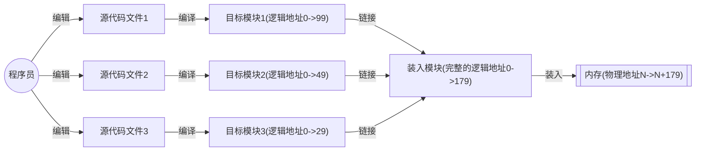

# 内存管理

## 内存基本知识

### 什么是内存

内存可存放数据，程序执行前需要先放到内存中才能被 CPU 处理，内存用于缓冲 CPU 与硬盘之间的速度矛盾。

在多道程序环境下，系统中会有多个程序并发执行，也就是说会有多个程序的数据需要同时放到内存中。计算机通过给内存的存储单元编地址的方式来区分每个内存对应的程序。

- 如果计算机是按字节编址，那么每个存储单元大小为 1 字节。
- 如果字长为 16 的计算机是按字编址，那么每个存储单元的大小为一个字，每个字的大小为 16 个二进制位。

### 内存的大小

在计算机中，表示存储容量大小的单位一般为：

- $2^10=1$K，千
- $2^20=1$M，兆，百万
- $2^30=1$G，吉，千兆，十亿

这是根据二进制来划分的。

### 指令的工作原理

指令的工作基于地址，每个地址对应一个数据的存储单元。系统通过对应的指令进行对应的操作，跳转到下一个指令不断执行。

- 相对地址：程序经过编译、链接后生成的指令中指名的是逻辑地址 (相对地址) ，即相对于进程起始点的地址。
- 绝对地址：相对于 0 物理地址的绝对地址。

#### 绝对装入

在编译时，如果知道程序将放到内存的哪个位置，编译程序将产生绝对地址的目标代码，装入程序按照转入模块中的地址，将程序和数据转入内存。

绝对装入只适用于单道程序环境。

#### 可重定位装入

静态重定位，又称为可重定位装入。编译、链接后的装入模块的地址都是从 0 开始的，指令中使用的地址、数据存放的地址都是相对于起始地址而言的逻辑地址。

- 静态重定位的特点是在一个作业装入内存时，必须分配其要求的全部内存空间，如果没有足够的内存空间，就不能装入该作业。
- 作业一旦进入内存中后，在运行期间就不能再移动，也不能再申请内存空间。

#### 动态运行时装入

动态重定位，又称动态运行时装入。编译、链接后的装入模块的地址都是自从 0 开始，装入程序把装入模块装入内存后，并不会立即把逻辑地址转换为物理地址，而是把地址转换推迟到程序真正要执行时才进行。因此装入内存后所有的地址仍然是逻辑地址。这种方式需要一个重定位寄存器的支持。

- 重定位寄存器存放装入模块存放的起始位置。
- 并且将程序分配到不连续的存储区中，在程序运行前只需要装入它的部分代码即可投入运行，然后在程序运行期间动态申请分配内存。
- 便于内存的共享，可以向用户提供一个比存储空间大得多的地址空间。

**采用动态重定位时允许程序在内存中发生移动**。

### 从写程序到程序运行的过程

```mermaid
graph LR
A((程序员))-->|编辑|B[源代码文件1]
A-->|编辑|C[源代码文件2]
A-->|编辑|D[源代码文件3]
B-->|编译|E["目标模块1(逻辑地址0->99)"]
C-->|编译|F["目标模块2(逻辑地址0->49)"]
D-->|编译|G["目标模块3(逻辑地址0->29)"]
E-->|链接|H["装入模块(完整的逻辑地址0->179)"]
F-->|链接|H
G-->|链接|H
H-->|装入|J[["内存(物理地址N->N+179)"]]
```

其中
- 编译：由编译程序将用户源代码编译成若干个目标模块 (把高级语言翻译为机器语言)
- 链接：由链接程序将编译后形成的一组目标模块，以及所需库函数链接在一起，形成一个完成的装入模块
- 装入 (装载)：由装入程序将装入模块装入内存运行

### 链接的三种方式

1. 静态链接：在程序运行之前，先将各目标模块及它们所需的库函数连接成一个完成的可执行文件，之后不再拆开
2. 装入时动态链接：将各目标模块装入内存，边装入边链接的链接方式
3. 运行时动态链接：在程序执行中需要该目标模块时，才对它进行链接。其优点是便于修改和更新，便于实现对目标模块的共享

## 内存管理的概念

操作系统作为系统资源的管理者，需要对内存进行管理。操作系统管理内存一般指：
1. 操作系统负责内存空间的分配与回收
2. 操作系统需要提供某种技术从逻辑上对内存空间进行扩充、
3. 操作系统需要提供地址转换功能，负责程序的逻辑地址与物理地址的转换
4. 操作系统需要提供内存保护的功能，

### 内存保护

内存保护可以采取两种方式：
1. 设置上下限寄存器
2. 采用重定位寄存 (基址寄存器) 器和界地址寄存器 (限长寄存器) 进行越界检查。重定位寄存器中存放的