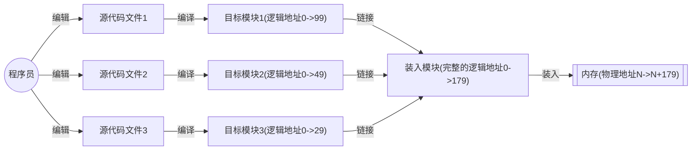

# 内存管理

## 内存基本知识

### 什么是内存

内存可存放数据，程序执行前需要先放到内存中才能被 CPU 处理，内存用于缓冲 CPU 与硬盘之间的速度矛盾。

在多道程序环境下，系统中会有多个程序并发执行，也就是说会有多个程序的数据需要同时放到内存中。计算机通过给内存的存储单元编地址的方式来区分每个内存对应的程序。

- 如果计算机是按字节编址，那么每个存储单元大小为 1 字节。
- 如果字长为 16 的计算机是按字编址，那么每个存储单元的大小为一个字，每个字的大小为 16 个二进制位。

### 内存的大小

在计算机中，表示存储容量大小的单位一般为：

- $2^10=1$K，千
- $2^20=1$M，兆，百万
- $2^30=1$G，吉，千兆，十亿

这是根据二进制来划分的。

### 指令的工作原理

指令的工作基于地址，每个地址对应一个数据的存储单元。系统通过对应的指令进行对应的操作，跳转到下一个指令不断执行。

- 相对地址：程序经过编译、链接后生成的指令中指名的是逻辑地址 (相对地址) ，即相对于进程起始点的地址。
- 绝对地址：相对于 0 物理地址的绝对地址。

#### 绝对装入

在编译时，如果知道程序将放到内存的哪个位置，编译程序将产生绝对地址的目标代码，装入程序按照转入模块中的地址，将程序和数据转入内存。

绝对装入只适用于单道程序环境。

#### 可重定位装入

静态重定位，又称为可重定位装入。编译、链接后的装入模块的地址都是从 0 开始的，指令中使用的地址、数据存放的地址都是相对于起始地址而言的逻辑地址。

- 静态重定位的特点是在一个作业装入内存时，必须分配其要求的全部内存空间，如果没有足够的内存空间，就不能装入该作业。
- 作业一旦进入内存中后，在运行期间就不能再移动，也不能再申请内存空间。

#### 动态运行时装入

动态重定位，又称动态运行时装入。编译、链接后的装入模块的地址都是自从 0 开始，装入程序把装入模块装入内存后，并不会立即把逻辑地址转换为物理地址，而是把地址转换推迟到程序真正要执行时才进行。因此装入内存后所有的地址仍然是逻辑地址。这种方式需要一个重定位寄存器的支持。

- 重定位寄存器存放装入模块存放的起始位置。
- 并且将程序分配到不连续的存储区中，在程序运行前只需要装入它的部分代码即可投入运行，然后在程序运行期间动态申请分配内存。
- 便于内存的共享，可以向用户提供一个比存储空间大得多的地址空间。

**采用动态重定位时允许程序在内存中发生移动**。

### 从写程序到程序运行的过程

```mermaid
graph LR
A((程序员))-->|编辑|B[源代码文件1]
A-->|编辑|C[源代码文件2]
A-->|编辑|D[源代码文件3]
B-->|编译|E["目标模块1(逻辑地址0->99)"]
C-->|编译|F["目标模块2(逻辑地址0->49)"]
D-->|编译|G["目标模块3(逻辑地址0->29)"]
E-->|链接|H["装入模块(完整的逻辑地址0->179)"]
F-->|链接|H
G-->|链接|H
H-->|装入|J[["内存(物理地址N->N+179)"]]
```

其中
- 编译：由编译程序将用户源代码编译成若干个目标模块 (把高级语言翻译为机器语言)
- 链接：由链接程序将编译后形成的一组目标模块，以及所需库函数链接在一起，形成一个完成的装入模块
- 装入 (装载)：由装入程序将装入模块装入内存运行

### 链接的三种方式

1. 静态链接：在程序运行之前，先将各目标模块及它们所需的库函数连接成一个完成的可执行文件，之后不再拆开
2. 装入时动态链接：将各目标模块装入内存，边装入边链接的链接方式
3. 运行时动态链接：在程序执行中需要该目标模块时，才对它进行链接。其优点是便于修改和更新，便于实现对目标模块的共享

## 内存管理的概念

操作系统作为系统资源的管理者，需要对内存进行管理。操作系统管理内存一般指：
1. 操作系统负责内存空间的分配与回收。
2. 操作系统需要提供某种技术从逻辑上对内存空间进行扩充。
3. 操作系统需要提供地址转换功能，负责程序的逻辑地址与物理地址的转换。
4. 操作系统需要提供内存保护的功能，保证各个进程在各自存储空间内运行，互不干扰。

## 内存保护技术

内存保护可以采取两种方式：
1. 设置上下限寄存器，分别存放进程上下限地址。进程的指令要访问某个地址时，CPU 检查是否越界。
2. 采用重定位寄存 (基址寄存器) 器和界地址寄存器 (限长寄存器) 进行越界检查。重定位寄存器中存放的的时进程的**起始物理地址**，界地址寄存器中存放的是进程的**最大逻辑地址**。

## 内存扩充技术

早期计算机的内存很小，因此经常出现内存大小不够的情况。人们引入了覆盖技术来解决程序大小超过物理内存总和的问题。

### 覆盖技术

覆盖技术的思想：将程序分为多个段（多个模块），常用的段常驻内存，不常用的段在需要时调入内存。
- 内存中分为一个固定区和若干个覆盖区。
- 需要常驻内存的段放在固定区中，调入后就不再调出。除非运行结束。不常用的段放在覆盖区，需要用到时调入内存，用不到时调出内存。

即按照自身逻辑结果，让那些不可能被同时访问的程序段共享同一个覆盖区。

必须由程序员声明覆盖结构，操作系统完成自动覆盖。缺点：对用户不透明增加了用户编程负担。

### 交换技术

交换（对换）技术的设计思想：内存空间紧张时，系统将内存中的某些进程暂时换出外存，把外存中某些具备运行条件的进程换入内存（进程在内存与磁盘间动态调度）。

[[进程管理#调度的三个层次]] 中的中级调度就是内存调度。暂时换出内存的等待的进程状态为挂起状态（挂起态），挂起态又可以进一步细分为就绪挂起、阻塞挂起两种状态。

> 在外存的什么位置保存被换出的进程？
>
> 具有对换功能的操作系统中，通常把磁盘空间分为文件区和对换区两部分。
> - 文件区主要用于存放文件，主要追求存储空间的利用率，因此对文件区空间的管理采用离散分配方式。
> - 对换区空间只占磁盘空间的小部分，被换出的进程数据就存放在对换区。由于对换的速度直接影响了操作系统的整体速度，因此对换区空间的管理主要追求换入换出速度，因此通常采用连续分配方式。
> - 总之，对换区的 I/O 速度比文件区更快。
> 
> 什么时候应该交换？
>
> 交换通常在许多进程运行且内存吃紧时进行，而系统负荷降低就暂停。例如在发现许多进程运行时经常发生缺页，就说明内存紧张，此时可以换出一些进程。如果缺页率明显下降，就可以暂停换出。
>
> 应该换出那些进程？
> 
> 可以优先换出阻塞进程，可以优先换出优先级低的进程，为了防止优先级的进程在被调入内存后很快又被换出，有的系统还会考虑进程在内存的驻留时间。

## 内存空间的分配与回收

- 连续分配：指为用户进程分配的必须是连续内存空间
- 非连续分配：

### 连续分配管理方式

#### 单一连续分配

在单一连续分配方式中，内存被分为系统区和用户区。系统区通常位于内存的低地址部分，用于存放操作系统相关数据。用户区用于存放用户进程相关数据。

内存中只能有一道用户程序，用户程序独占整个用户区空间。

- 优点：实现简单，无外部碎片；可以采用覆盖技术扩充内存；不一定需要采取内存保护。用于早期的操作系统。
- 缺点：只能用于单用户、单任务的操作系统中。有内部碎片，存储器利用率极低。

> - 内部碎片：分配给某进程的内存区域中，如果有些部分没有用上，就称为内部碎片
> - 外部碎片：指内存中的某些空闲分区由于太小而难以利用

#### 固定分区分配

为了能在内存中装入多道程序，且这些程序间不会互相干扰，于是将整个用户空间划分为若干个固定大小的分区，在每个分区中只装入一道作业。
- 分区大小相等：缺乏灵活性，但是适合用于用一台计算机控制多个相同对象的场合。
- 分区大小不等：增加了灵活性，可以满足不同大小的进程需求。根据常在系统中运行的作业大小情况进行划分。

操作系统需要建立一个**分区说明表**数据结构来实现各个分区的分配与回收。每个表项对应一个分区，通常按分区大小排列，每个表项包括对应分区的大小、起始地址、分配状态。

当用户程序要装入内存时，由操作系统内核程序根据用户程序大小检索该表，从中找到一个能满足大小的、未分配的分区，将之分配给该程序，然后修改状态为已分配。

- 优点：实现简单，无外部碎片。
- 缺点：
	- 当用户程序太大时，可能所有的分区都不能满足需求，此时不得不采用覆盖技术来解决。但这又会降低性能。
	- 会产生内部碎片，内存利用率低。

#### 动态分区分配

动态分区分配又称为可变分区分配。这种分配方式不会预先划分内存分区，而是在进程装入内存时，根据进程的大小动态地建立分区，并使分区的大小正好适合进程的需要。因此系统分区的大小和数目是可变。

常用空间分区表或者空闲分区链记录内存的使用情况。
- 空闲分区表：每个空闲分区表对应一个表项，表项中包含分区号、分区大小、分区起始地址等信息。
- 空闲分区链：每个分区的起始部分和末尾部分分别设置向前指针和向后指针。起始部分处还可以记录分区大小等信息。

把一个新作业装入内存时，须按照一定的 [[#动态分区分配算法]]，从空闲分区表中选出一个分区分配给该作业。由于分配算法随系统性能有很大的影响，因此人们对它进行了广泛的研究。

分区的分配与回收：
- 分配：若分配内存的大小小于分区大小，则修改分区的大小，同时将起始地址增加。若分配内存的大小等于分区大小，则将该分区表项删除。
- 回收：合并回收区相邻的空闲分区
	1. 回收区的后面有一个相邻的空闲分区：回收后将相邻的空闲分区的大小与起始位置修改
	2. 回收区的前面有一个相邻的空闲分区：回收后将相邻的空闲分区的大小修改
	3. 回收区的前后各有一个相邻的空闲分区：回收后将相邻的两个分区合并，即分区大小为三者相加，起始地址为前面的分区的起始地址
	4. 回收区的前后都没有相邻的空闲分区：回收后增加一个新的表项。

动态分区分配没有内部碎片，但是有外部碎片。

如果内存中空闲空间的总和本来可以满足某进程的需要，但是由于进程需要的是一整块连续的内存空间，因此这些碎片不能满足进程的需求。这个问题可以通过紧凑技术（拼凑技术）来解决外部碎片。

#### 动态分区分配算法

动态分区分配算法是在进程装入内存时，为其选择空闲分区的算法。

##### 首次适应算法

算法思想：每次都从低地址开始查找，找到第一个能满足大小的空闲分区。

实现方法：空闲分区以地址递增的次序排列，每次分配内存时顺序查找空闲分区链，找到大小能满足要求的第一个空闲分区。

##### 最佳适应算法

算法思想：由于动态分区分配是一种连续分配方式，为各进程分配的空间必须是连续的一整片区域。为了保证当大进程到来时能有连续的大片空间，可以尽可能多的留下大片的空闲区。即优先使用更小的空闲区。

实现方法：空闲分区按容量递增次序链接。每次分配内存时顺序查找空闲分区链，找到大小能满足要求的第一个空闲分区。

缺点：每次都选最小的分区进行分配，会留下越来越多的、很小的、难以利用的内存块。因此这种方法会产生很多的外部碎片。

##### 最坏适应算法

又称为最大适应算法 (largest Fit)。

算法思想：为了解决最佳适应算法的问题，即留下太多难以利用的小碎片，可以在每次分配时优先使用最大的连续空闲区，这样分配后剩余的空闲区就不会太小，更加方便使用。

实现方法：空闲分区按容量递减次序链接。每次分配内存时顺序查找空闲分区链，找到大小能满足要求的第一个空闲分区。

缺点：每次都选最大的分区进行分配，虽然可以让分配后留下的空闲区更大，更可用，但是这种方法会导致较大的连续空闲区被迅速用完。如果之后有大进程到达，就没有内存分区可用了。

##### 邻近适应算法

算法思想：首次适应算法每次都从链头开始查找。这可能会导致低地址部分出现很多小的空闲分区，而每次分配查找时都要经过这些分区，因此增加了查找的开销。如果每次都从上次查找结束的位置开始检索，就可以解决上述问题。

实现方法：空闲分区以地址递增的顺序排列（例如循环链表）。每次分配内存时从上次查找结束的位置开始查找空闲分区链，找到大小能满足要求的第一个空闲分区。

缺点：和首次适应算法相比，邻近适应算法的规则可能导致无论低地址、高地址部分的空闲分区都有相同的概率被使用，也就导致了高地址部分的大小分区更可能被使用，划分为小分区，最后导致无大分区可用（与最大适应算法相同）。

综合上面的四种算法，首次适应算法效果反而最好。

### 基本分页存储管理的概念

将内存空间分为一个个大小相等的分区，每个分区就是一个**页框**。每个页框有一个编号，即**页框号**，页框号从 0 开始。

> 页框=页帧=内存块=物理块=物理页面
> 页框号=页帧号=内存块号=物理块号=物理页号

将进程的逻辑地址空间也分为与页框大小相等的一个个部分，每个部分称为一个**页**或者**页面**，每个页面也有一个编号，即**页号**，页号从 0 开始。

操作系统以页框为单位为各个进程分配内存空间，进程的每个页面放入一个页框中。也就是说，进程的页面与内存的页框有一一对应的关系。各个页面不必连续存放，可以放到不相邻的各个页框中。

#### 页表

为了能知道进程的每个页面在内存中存放的位置，操作系统要为每个进程建立一张页表。页表通常保存在 PCB 中。
- 一个进程对应一个页表
- 进程的每个页面对应一个页表项
- 每个页表项由页号和块号组成
- 页表记录进程页面和实际存放的内存块之间的映射关系

> 根据内存块的数量推导页表项中块号至少占多少字节
> 内存块数量=物理内存大小/页面大小
> 需要找到数量以字节为单位内存块号来表示所有的内存块

由于页表项连续存放，因此页号是隐含的，不占存储空间。可以利用页表中的块号大小与数量来推导页表的大小。需要注意的是，页表中记录的时内存块的块号，而不是起始地址。起始地址为块号 $\times$ 每块的大小

> 将进程地址空间分页后，操作系统如何实现逻辑地址到物理地址的转换？
> 
> 虽然进程的各个页面是离散存在的，但是页面内部是连续存放的。如果要访问逻辑地址 A，则
> 1. 确定逻辑地址 A 对应的页号 P
> 2. 找到 P 号页面在内存中的起始地址（需要查找页表）
> 3. 确定逻辑地址 A 的页内偏移量 W

页表中涉及的相关计算：
$$
\tiny
\begin{aligned}
逻辑地址 A 对应的物理地址&=P 号页面在内存中的起始地址+页内偏移量 W\\[3mm]
页号&=逻辑地址/页面长度(取整数部分)\\[3mm]
页内偏移量&=逻辑地址\%页面长度(取余数部分)
\end{aligned}
 $$

分页储存管理的逻辑地址结构为
$$
\tiny 页号P+页内偏移量W
$$
地址结构包括两个部分，前一部分为页号，后一部分为页内偏移量。如果有 K 位表示页内偏移量，则说明系统中有一个页面的大小是 $2^k$ 个内存单元。如果有 M 位表示页号，则说明在该系统中，一个进程最多允许有 $2^M$ 个页面。

#### 基本地址变化机构

基本地址变换机构可以借助进程的页表将逻辑地址转换为物理地址。

通常会在系统中设置一个**页表寄存器** (PRT)，存放页表在内存中的起始地址 F 和页表长度 M。程序未执行时，页表的始址和页表长度放在进程控制块中，当进程被调度时，操作系统内核会将他们放到页表寄存器中。

设页面大小为 L，逻辑地址 A 到物理地址 E 的变换过程如下：
1. 计算页号 P 和页内偏移量 W
2. 比较页号 P 和页表长度 M，若 P $\geqslant$ M，则产生越界中断，否则继续执行。
3. 页表中页号 P 对应的 $\small 页表项地址=页表起始地址 F+页号 P\times 页表项长度$，取出该页表项内容 b, 即为内存块号。
4. 计算 $E=b\times L+W$，用得到的物理地址 E 去访存。(如果内存块号、页面偏移量是用二进制表示的，那么将他们拼接起来就是最终的物理地址)

#### 具有块表的地址变换机构

快表，又称为联想寄存器 (TLB, translation lookaside buffer)，是一种访问速度比内存块很多的高速缓存 (TLB 不是内存，属于 Cache)，用来存放最近访问的页表项的副本，可以加速地址变换的速度。与此对应的，内存中的页表常称为慢表。

![[Pasted image 20231102213548.png]]

引入快表后，地址的变换过程：
1. CPU 给出逻辑地址，由某个硬件算得页号、页内偏移量，将页号与快表中的所有页号进行比较。
2. 如果找到匹配的页号，说明要访问的页表项在快表中有副本，则直接从中取出改页对应的内存块号，再将内存块号与页内偏移量拼接形成物理地址。最后访问该物理地址对应的内存单元。因此，若快表命中，则访问某个逻辑地址仅需**一次访存**即可。
3. 如果没有找到匹配的页号，则需要访问内存中的页表，找到对应页表项，得到页面存放的内存块号，在将内存块号与页内偏移量拼接形成物理地址。最后访问该物理地址对应的内存单元。因此，若快表未命中，则访问某个逻辑地址需要**两次访存**。但若快表已满，则必须按照一定的算法对旧的页表项进行替换。

由于查询快表的速度比查询页表的速度快很多，因此只要快表命中，就可以节省很多的时间。根据局部性原理，一般来说快表的命中率可以达到 90\% 以上。

> 对于有些系统，支持快表和页表同时查询，这样页表就不会等到快表未命中后才开始查询。

##### 局部性原理

- 时间局部性：如果执行了程序中的某条指令，那么不久后这条指令很可能再次执行。如果某个数据被访问过，不久之后数据很可能再次被访问。(因为程序中存在大量的循环)
- 空间局部性：一旦程序访问了某个存储单元，在不久之后，其附近的存储单元也很有可能被访问。(因为很多数据在内存中是连续存放的)

#### 两级页表

单级页表中存在问题：
1. 页表必须连续存放，因此当页表很大时，需要占用很多个连续的页框
2. 没有必要让整个页表常驻内存，因为进程在一段时间内可能只需要访问几个特定的页面

两级页表的思想：将连续的页表分块，创建两级页表，称为**页目录表** (顶级页表、外层页表)，原来的页表称为二级页表。

修改为两级页表后，逻辑地址变换为了
$$
\tiny一级页号+二级页号+页内偏移量
$$
查询的步骤变为：
1. 按照地址结果