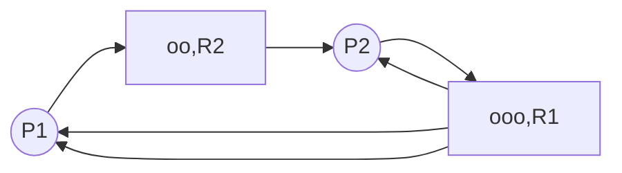

# 进程管理

现代操作系统的一个重要特性是程序的并发性与资源的共享性，为了满足多用户并发计算的要求，现代操作系统围绕进程这个概念进行设计和构造。

## 进程的定义

> [!tip] 进程这个概念是为了描述系统中的并发活动而引入的。
> **进程** (process)，又叫做任务 (task)，是操作系统中最基本、最重要的概念之一，它对于操作系统的理解、描述与设计都具有非常重要的意义。

从不同的角度，进程可以有不同的定义，下面是几种比较典型的定义：
1. 进程是程序的一次执行过程，*是一个正在执行程序的实例*。
2. 进程是一个程序及其数据从磁盘加载到内存后，在 CPU 上执行的过程。
3. 进程是程序在一个数据集合上顺序执行时发生的活动。它是系统进行资源分配和调度的一个独立单位。

> [!note] PCB 描述块
> 为了使得并发执行的每个程序 (包括数据) 都可以独立的运行，必须为之配备一个专门的数据结构，称为**[[#进程控制块]]** (Process Control Block, PCB)。系统通过 PCB 来描述进程的基本情况和运行状态，进而管理进程。
> - 程序段、相关数据段和 PCB 三个部分构成了**进程实体**(进程映像)。
> - 所谓的创建进程，就是创建进程的 PCB；撤销进程，就是撤销进程的 PCB。

> [!definition|Definition] 进程
> 进程是进程实体的运行过程，是系统进行资源分配和调度的一个独立单位。

> [!note] 进程的特点
> 1. 进程是程序的一次执行过程，具有**动态性**；*程序是完成某个特定功能的指令的有序序列，是一个静态的概念。进程是程序的一次执行过程，是临时的，有生命周期的；而程序可以作为一种长期储存的资源。* **动态性是进程最基本的特征**。
> 2. 进程是系统进行资源分配和调度的一个独立单位，具有**独立性**。*而同一个程序可以在同一时间被多个用户使用。资源分配时以进程为单位的，而不是以程序为单位的。*
> 3. 一个进程可以与其他进程并发执行，具有**并发性**。
> 4. 进程具有**结构性**。*为了描述进程，系统为每个进程创建了一个进程描述块。从结构上来看，一个进程包含了程序、数据和进程控制块。*
> 5. 进程具有**异步性**。*各进程按各自独立的、不可预知的速度向前推进，操作系统要提供进程同步机制来解决异步问题。*

> [!note] 进程与程序的区别
> 简单来说，程序是静态的，是个存放在磁盘里的可执行文件，是一系列的指令集合。进程是动态的，是程序的一次执行过程。

## 进程的描述

进程是一个独立的运行单位，也是操作系统进行资源分配和调度的基本单位。它由进程控制块、程序段和数据段组成。

### 进程控制块

进程控制块(process control block)是进程存在的唯一标识，通常包含了：
1. **进程描述信息**：进程标识符，标识各个进程。如进程ID (PID, process ID)，进程所属用户ID (UID)；
2. **进程控制和管理信息**：进程当前状态，描述进程的状态信息。如进程的CPU使用时间、磁盘使用时间、网络流量使用情况等，此外还包含了进程当前的状态：就绪态/阻塞态/运行态等；
3. **资源分配清单**：如分配了多少内存、正在使用哪些IO设备，正在使用哪些文件。
4. **处理机相关信息**：也称 CPU 上下文，主要指 CPU 各寄存器中的值，如PSW、PC等各种寄存器的值，当进程被切换时，CPU 状态信息应该被保存在 PCB 中，以便该进程重新执行时，能够从断点继续执行。

> [!note]
> 进程创建时，操作系统为它新建立一个 PCB，该结构之后常驻内促，任意时刻都可以进行存取，并随进程删除一起删除。**PCB 是进程存在的唯一标志**。

> [!note] PCB 的组织方式
> 为了方便进程的管理和调度，需要将各个进程的 PCB 用适当的方式组织起来。目前，常用的组织方式有链接方式和索引方式两种。(详细见[[#进程的组织]])
> - 链接方式：将同一个状态的 PCB 链接成一个队列，不同状态对应不同的队列。
> - 索引方式：将同一个状态的进程组织来一个索引表中，索引表的表项指向相应的 PCB。

> [!note] 程序段和数据段
> - 程序段：能够被进程调度程序调度到 CPU 中执行的程序段代码。*一个程序可以被多个进程共享，即多个进程可以运行同一个程序*；
> - 数据段：可以是进程对应的程序加工处理的原始数据，也可以是程序执行时产生的中间结果；

### 进程的状态

进程在生命周期内一直处于一个状态不断变化的过程中。为了刻画这种变化过程，操作系统将进程分为了若干状态，使用状态机来表述。这些状态信息记录在进程的 PCB 结构中。

一个进程的状态有以下几种：
1. **创建态**：进程正在被创建时，它的状态是创建态，在这个阶段操作系统会为进程分配资源，初始化 PCB。
2. **就绪态**：进程创建完毕后，便进入了就绪态，处于就绪态的进程已经具备了运行条件，但是由于没有空闲的 CPU，暂时不能运行。*系统中的就绪进程可能有多个，通常将他们排成就绪队列。*
3. **运行态**：当 CPU 空闲时，操作系统就会选择一个就绪进程，让它上处理机运行。
4. **阻塞态**：在进程运行的过程中，可能会请求等待某个事件的发生 (如等待某种系统资源的分配，或者等待其他进程的响应)。在这个事件发生之前，进程无法向下执行，这时操作系统会让这个进程下 CPU，让其进入阻塞态，然后选择另一个就绪态的进程上 CPU 运行。*系统通常将处于阻塞状态的进程也排成一个队列，甚至会根据阻塞的原因不同，设置多个阻塞队列*。
5. **终止态**：一个进程可以请求 `exit` 的系统调用，请求操作系统终止该进程。此时一个进程进入终止态，操作系统会让该进程下 CPU，并回收内存空间等资源，最后还要回收该进程的PCB。当终止进程的工作完成后，该进程就彻底消失了。

> [!example]- 五种进程状态的转换
> ![[image/进程管理-1.png#center|五种进程状态的转换]]

> [!note] [[#进程的创建 (创建原语)]]
> 1. 首先，申请一个空白 PCB，并向 PCB 中填写用于控制和管理进程的信息；
> 2. 然后，为该进程分配运行时所必须的资源；
> 3. 最后，将该进程转入就绪态，加入就绪队列；
>
> 进程在所需的资源尚不能满足的情况下，会留在创建态，等待资源分配。*例如，无法分配足够的内存，则创建工作未完成*。

> [!note] 引起进程状态转换的事件
> - 就绪态 -> 运行态：处于就绪态的进程被调度后，获得了 CPU 资源 (分配 CPU 时间片)，于是进程进入运行态。
> - 运行态 -> 就绪态：
> 	- 处于运行态的进程在时间片用完后，让出 CPU，转换为就绪态。
> 	- 在可剥夺的操作系统中，有更高优先级的进程就绪时，调度程序将正在执行的进程转换为就绪态，让更高优先级的进程执行。
> - 运行态 -> 阻塞态：进程以系统调用的方式请求操作系统提供服务，例如请求某一资源的分配和使用、等待某一事件的发生 (如 IO 操作的完成) 时，它将从运行态转换为阻塞态。
> - 阻塞态 -> 就绪态：进程等待的事件到来时，中断处理程序将相应的进程状态转换为就绪态。

> [!warning]
> **不能直接从阻塞态直接转换为运行态，也不能直接从就绪态转为阻塞态**。
> 在进程的整个生命周期中，大部分时间都是处于就绪态、运行态、阻塞态三种状态。在单核CPU下，同一时刻只会有一个进程处于运行态，多核CPU情况下，可能有多个进程处于运行态。
> - 进程从运行态变为阻塞态是主动的行为。
> - 进程从阻塞态并为就绪态是被动的行为。

> [!tip]
> 在PCB中，会有一个变量state来表示进程的当前状态。为了便于管理，操作系统会将处于同一状态的进程组织起来。

### 进程的组织

为了便于进程的管理，通常对系统中的进程采用两种组织方式。
- **线性表组织方式**：把所有进程的 PCB 存放在一个数组中，系统通过数组下标访问每一个 PCB。系统根据进程的状态，建立了多张索引表，并把索引表的内存首地址记录在内存中的一些专用单元中以完成索引。
- **链表组织方式**：把具有相同状态的 PCB 组织成一个队列。
	- 处理就绪态的进程可按照某种策略排成多个就绪队列。
	- 处于阻塞态的进程又可以根据阻塞的原因组织成多个阻塞队列。

> [!tip]
> 在单 CPU 系统中，任何时间都只有一个进程处于运行状态，因此系统专门设定了一个指针指向当前运行进程的 PCB。

## 进程控制

进程控制的主要功能是对系统中所有的进程实施有效的管理，它具有创建进程、撤销已有进程、实现进程状态转换等功能。简单说，进程控制是：
- 系统使用一些具有特定功能的程序段来创建、撤销进程，以及完成进程各状态之间的转换。进程控制是由操作系统内核实现的，属于原语一级操作，不能被中断。

> [!definition|Definition] 原语
> 原语是一种特殊的程序，它的执行具有原子性。也就是说，这段程序运行必须一气呵成，不能中断。

> [!tip] 进程控制需要使用原语的原因
> 如果进程控制不能一气呵成的执行，可能导致操作系统中的某些关键数据结构不统一的情况，如PCB中的进程状态与进程所处的队列不一致，这会影响操作系统进行别的管理工作，可能导致操作系统出错。

> [!note] 原语的实现方式
> 在计算机中，CPU每执行完一条指令后，会例行检查是否有中断信号。在进行原语之前，CPU先执行**关中断**指令，此时不再例行检查中断信号，在原语执行完毕后，再执行**开中断**指令。关中断与开中断指令为特权指令，只能由内核使用，而不能由用户使用。

### 进程的创建 (创建原语)

系统一般通过下面的步骤创建进程，创建原语使一个进程由创建态进入就绪态。
1. 扫描进程表，找到一个空闲的 PCB。*为进程分配一个唯一的进程标识符，并申请一个空白 PCB (PCB 是有限的)，若 PCB 申请失败，则创建失败*；
2. 为进程分配其运行所需的资源。*例如内存、文件、IO 设备和 CPU 时间等，这些资源从操作系统或者父进程中获得。如果资源不足，则停留在创建态，等待内存资源*；
3. 初始化 PCB。*把调用者提供的参数（进程名、进程优先级、实体所在主存的起始地址、所需的资源清单、记账信息及进程家族关系等）填入 PCB 中*；
4. 将新的进程插入就绪队列，等待被调度。

> [!note]
> 下面是常见的引起创建原语的事件：
> 1. 用户登录：在分时系统中，用户登录成功，系统为其创建一个新进程
> 2. 作业调度：多道批处理系统中，有新的作业放入内存时，会为其创建一个新的进程
> 3. 提供服务：用户向操作系统提出某些请求时，会新建一个进程处理该请求
> 4. 应用请求：由用户进程主动请求创建一个子进程

> [!tip]
> 允许一个进程创建另一个进程，此时创建者称为父进程，被创建的进程称为子进程。
> - 子进程可以继承父进程所拥有的资源，当子进程被撤销时，应将其从父进程那里获得的资源还给父进程。
> - 当父进程被撤销时，通常也会撤销所有其所有子进程。

### 进程的终止 (撤销原语、终止原语)

如果一个进程已经完成任务或者由于故障不能继续运行时，应当被撤离系统而消亡。撤销原语的功能是在 PCB 集合中寻找要撤销的进程，若有子孙进程，也需要终止，以防称为不可控的；将其全部资源或者归还其父进程或者归还系统。撤销其 PCB。

撤销原语使一个进程由其他状态进入终止态，其过程为：
1. 从PCB集合中找到终止进程的PCB，从中读取出进程的状态；
2. 若进程处于运行态，立即剥夺CPU，将CPU分配给其他进程；
3. 若进程还有子孙进程，终止所有子孙进程^[不是所有操作系统都这样规定]；
4. 将该进程拥有的所有资源归还给父进程或者操作系统；
5. 删除PCB。

> [!note] 引起进程终止的事件
> 1. 进程正常结束：*表示进程的任务已经完成，并且准备退出运行*；
> 2. 异常结束：发生了某种异常事件，使程序无法继续运行，例如数组越界、保护错、非法指令、特权指令错、运行超时、算术运算错、IO 故障等；
> 3. 外界干预：指进程应外界的请求而终止运行。*例如操作员或者操作系统干预、父进程请求、父进程终止等*。

### 进程的阻塞和唤醒 (阻塞原语、唤醒原语)

处于运行状态的进程，在其运行过程中期待某一事件^[如等待键盘输入、等待磁盘数据传输完成]发生，将会自己执行**阻塞原语** (Block)，由运行态变为阻塞态。

阻塞原语的功能是中断 CPU，将其运行现场保存在其 PCB 中，置状态为阻塞态，插入相应事件的阻塞队列中。之后，由处理机调度，重选一个进程投入运行。其过程为：
1. 根据 PID 找到要阻塞的进程对应的PCB；
2. 保护进程的运行现场，将 PCB 状态信息设置为阻塞态，暂时停止进程进行；
3. 将 PCB 插入相应事件的等待队列，将 CPU 资源调度给其他就绪进程。

当某进程等待的事件^[例如它所期待的 IO 操作完成、期待的数据到达等]出现时，由有关进程^[例如，释放该 IO 设备的进程，或提供等待的数据的进程]调用唤醒原语 (Wakeup) 将等待该事件的进程唤醒。唤醒原语的执行过程如下：
1. 在该事件等待队列中找到相应进程的 PCB；
2. 将 PCB 从等待队列移出，设置进程为就绪态；
3. 将 PCB 插入就绪队列，等待被调度。

> [!note]- 挂起原语\*
> - 在实时系统中，根据实时现场的需要，会将正在执行或者没有执行的进程挂起一段时间。被挂起的进程由活动状态转换为静止状态。
> - 在分时系统中，将进程从内存换到外存中，进程就处于了进制状态，不被调度。

> [!note]- 解挂原语\*
> 当挂起进程的原因被解除时，系统调用解挂原语将指定的进程解挂，使其由静止态变为活动态。当被解挂的进程变为活动就绪时，通常立即转进程调度。

## 进程通信

进程间通信 (Inter-Process Communication, IPC) 指两个进程之间产生数据交互。进程之间的通信必须有操作系统的支持。

> [!note] 进程通信的必要性
进程是分配系统资源的单位，包括内存地址空间，因此各进程拥有的内存地址空间相互独立。为了保证安全，一个进程不能直接访问另一个进程的地址空间。因此需要操作系统的支持才能完成。

> [!tip]
> PV 操作是低级的通信方式，高级通信方式是指以较高的效率传输大量数据的通信方式。高级的通信方式主要包括共享存储、消息传递和管道通信。

### 共享存储

共享存储方式通过系统调用申请了一片共享内存区，使得通信的进程都可以访问共性存储区从而实现进程通信。进程间如果通过共享存储的方式进行通信，那么进程间对于共享空间的访问是互斥的，需要使用同步互斥工具 (例如 PV 操作) 对共享空间的读写进行控制。一个进程访问共享空间时，其他进程不能访问。

共享存储有两种形式：
- **基于存储区的共享**：操作系统在内存中划出一块共享存储区，数据的形式、存放位置都由通信进程控制，而不是操作系统。这种共享方式传输数据的速度非常快，是一种高级的方式。
- **基于数据结构的共享**：例如共享空间中只能放一个长度为 10 的数组，这种共享方式速度慢，限制多，是一种低级的方式。

> [!tip]
> 操作系统只负责为通信进程提供可共享使用的存储空间和同步互斥工具，而数据的交换则由用户自己安排读写指令完成。

### 消息传递

进程间的数据交换以**格式化的消息**（Message）为单位，进程通过操作系统提供的发送消息/接受消息两个原语进行数据交换。进程通过操作系统提供的发送消息和接受消息两个原语进行数据交换。

消息传递分为两种方式：
- 直接通信方式：消息进程指明接受进程的 ID。在每个进程的 PCB 中包含了每个进程的消息队列，其中保存了其他进程发送给该进程的消息。
	- 需要发送消息的进程通过发送原语发送消息，操作系统内核将消息放入接收进程的消息缓冲队列；
	- 接受进程通过接收原语从消息缓冲队列中取得消息。
- 间接通信方式：通过“信箱”间接地通信，因此又称为信箱通信方式。发送进程通过发送原语将消息发送到指定的信箱，接受进程通过接收原语从指定的信箱接受消息。*该通信方式广泛的应用于计算机网络中*。

> [!tip]
> 若通信的进程之间不存在可以直接访问的共享空间，则必须利用操作系统提供的消息传递方式实现进程通信。这种方式隐藏了通信实现细节，使得通信过程对用户透明，简化了通信程序的设计，是当前应用最广泛的进程通信机制。在微内核操作系统中，微内核和服务器之间就采用了消息传递机制。
>
> 此外，由于该机制能很好的支持多 CPU 系统、分布式系统和计算机网络，因此也成为了这些领域的主要通信工具。

### 管道通信

**管道**是一种特殊的共享文件，也被称为 pipe 文件。管道本质上是在内存中创建了一个固定大小的缓冲区，数据在其中以先进先出的方式流动。管道通信允许两个进程以生产者-消费者的模式进行通信：
- 当管道未满时，写进程可以向管道的一端写入数据；
- 当管道非空时，读进程可以从管道的另一端读取数据。

> [!note] 管道通信的特点
> 为了保证通信的顺利进行，管道机制必须具备以下三方面的协调能力：
> - **互斥**：当一个进程对管道进行读写操作时，其他进程必须等待 (通过读写锁实现)；
> - **同步**：
>   - 写进程写入数据后，如果管道已满或需要等待读进程消费数据，写进程将被阻塞，直到读进程读取数据后唤醒它；
>   - 读进程读取完管道中的数据后，如果管道为空，读进程将被阻塞，直到写进程写入新数据后唤醒它；
> - **双方存在**：通信过程中，必须确保至少一个读进程和一个写进程同时存在。

> [!tip] 管道通信与共享内存的对比
> 与共享内存不同，管道通信中只有一方可以写入数据，另一方读取数据。此外，管道通信遵循先进先出的原则，数据的读取顺序与写入顺序一致。管道可以视为一个[[数据结构/栈、队列和数组#循环队列|循环队列]]。

> [!note]
> 在 Linux 系统中，管道是一种非常常用的进程间通信机制。管道与普通文件不同，它克服了使用文件通信时的两个主要问题：
> 1. **大小限制**：管道文件是一个固定大小的缓冲区，在 Linux 中通常为 4KB。这一限制防止了管道文件像普通文件那样无限制增长。
> 2. **同步问题**：使用普通文件进行通信时，可能出现读进程比写进程读取得更快的情况。此时，管道通信通过阻塞 `read` 操作来等待数据写入，从而确保同步。

> [!note] 管道的访问权限
> 管道通信只能在创建它的进程及其子进程之间进行。当父进程创建一个管道时，子进程会继承父进程的管道文件描述符，因此子进程可以通过该管道与父进程进行通信。
>
> 需要注意的是，从管道中读取数据是一次性的，数据一旦被读取，对应的缓冲区空间就会释放，以便写入更多的数据。**普通管道只能用于单向通信，如果需要双向通信，则必须使用两个管道**。

## 线程

> [!note] 进程与线程的引入
> - 引入进程的目的是更好的使多道程序并发执行，提供资源利用率和操作系统吞吐量；
> - 引入线程的目的是减小程序在并发执行时所付出的时空开销，提供操作系统的并发性能。

线程最直观的理解就是轻量级进程，它是一个基本的 CPU 执行单元，也是程序执行流的最小单元，由线程 ID、程序计数器 PC、寄存器集合和堆栈组成。线程是进程中的一个实体，是被系统独立调度和分派的基本单位。

引入线程机制后，为操作系统带来了如下的变化：
1. **资源分配、调度**：传统进程机制中，进程是资源分配、调度的基本单位，但是在引入线程后，进程是资源分配的基本单位，线程是调度的基本单位。
2. **并发性**：传统进程机制中，只能进程间并发。在引入线程后，各个线程间也能并发，提升了并发度。
3. **系统开销**：传统进程间并发，需要切换进程的运行环境，系统开销很大。引入线程后，线程间的并发，如果是同一进程内的线程切换，则不需要切换进程环境，系统开销小，并发所带来的系统开销减小。

> [!note] 线程的属性
> 多线程操作系统中的进程已经不再是一个基本的执行实体，但是它任何具有与执行相关的状态。因此，进程处于执行状态，实际上是该进程中的线程正在执行。线程的主要属性如下：
> 1. 每个线程都有唯一的标识符和一个线程控制块 (TCB)，线程控制块记录线程执行的寄存器和栈等现场状态。
> 2. 不同的线程可以执行相同的程序，*即同一个服务程序被不同用户调用时，操作系统将它们创建为不同的线程。*
> 3. 同一进程中的各个线程共享该进程所拥有的资源。
> 4. 线程是 CPU 的独立调度单位，多个线程是可以并发执行的。
> 	- 在单 CPU 的计算机系统中，各线程可以交替地占用 CPU；
> 	- 在多 CPU 的计算机系统中，各线程可以同时占用不同的 CPU。
> 5. 一个线程被创建后，便开始了它的生命周期，直到终止。线程在生命周期内也会经历阻塞态、就绪态和运行态等各种状态变化。

> [!note] 线程的状态与转换
> 与进程一样，各个线程之间也存在共享资源和互相制约关系，致使线程在运行时也具有间断性。相应地，线程在运行时也具有下面三种基本状态：
> - 执行态：线程已获得 CPU 而正在执行；
> - 就绪态：线程已具备各种执行条件，只需要获得 CPU 便可立即执行；
> - 阻塞态：线程在执行中因为某事件受阻而处于暂停状态；
>
> 线程的状态与转换与[[#进程的状态]]是一致的。

> [!warning]
> 在引入线程后，进程的内涵发生了改变，进程只作为除了 CPU 外的系统资源的分配单位，而线程则作为 CPU 的分配单元。一个进程内部有多个线程，若线程的切换发生在同一个进程内部，则只需要很少的时空开销。

> [!note] 进程和线程的对比
> 1. **调度**：
> 	- 在传统操作系统中，用于资源和独立调度的基本单位都是进程，每次调度都要进行上下文切换，开销较大。
> 	- 在引入线程的操作系统中，线程是独立调度的基本单位，在同一个进程中，线程的切换不会引起进程的切换。
> 2. **并发性**：在引入线程的操作系统中，不仅进程之间可以并发执行，而且一个进程中的多个线程之间也可以并发执行，不同进程之间的线程也可以并发执行，使得操作系统具有更好的并发性，提高了系统资源的利用率和系统的吞吐量。
> 3. **拥有资源**：进程是系统中拥有资源的基本单位，而线程不拥有系统资源，*仅有一点必不可少、能保证独立运行的资源*。但是线程可以访问其隶属的进程的系统资源。
> 4. **独立性**：
> 	- 每个进程都拥有独立的地址空间和资源，处理共享全局变量，不允许其他进程访问。
> 	- 同一进程的不同线程是为了提供并发性以及进行相互之间的合作而创建的，它们共享进程的地址空间和资源。
> 5. **支持多处理器系统**：
> 	- 对于传统单线程进程，不管有多少个 CPU，进程只能运行在一个 CPU 上。
> 	- 对于多线程进程，可将进程中的多个线程分配到多个 CPU 上。

### 线程的实现方式

#### 用户级线程 (User-Level Thread, ULT)

早期的操作系统只支持进程，不支持线程。此时的线程是由线程库实现的。很多的编程语言提供了强大的线程库，可以实现线程的创建、调度、销毁的功能。用户级线程由以下特点：
- 用户级线程通过调用线程库实现，所有的线程管理工作都应由应用程序负责（包括线程切换）。
- 用户级线程中，线程切换可以在用户态下完成，无需操作系统干涉。
- 在用户看来，程序是由多个线程的。但是操作系统内核看来，还是使用一个进程。

> [!note] 用户级线程的优缺点：
> - 优点：
> 	- 用户级线程的切换在用户空间中即可完成，不需要切换到核心态，线程管理的系统开销小，效率高。
> 	- 调度算法可以是进程专用的，不同进程可以根据自身需要，对自己的线程选择不同的调度算法。
> 	- 用户级线程的实现与操作系统平台无关，对线程管理的代码是属于用户程序的一部分。
> - 缺点：
> 	- 在用户级线程中，如果一个线程被阻塞，那么其他线程也将被阻塞，并发度不高，多个线程不可在多核处理机上并行运行。
> 	- 不能发挥多 CPU 的优势，内核每次分配给一个进程的仅有一个 CPU，因此进程中仅有一个线程能够执行。

> [!tip] 在用户级线程中，进程仍然时调度的基本单位，线程间不能并行的进行。

#### 内核级线程 (Kernel-Level Thread, KLT)

大多数的现代操作系统都实现了内核级线程。内核级线程由以下特点：
1. 内核级线程的管理工作由操作系统内核完成。
2. 线程调度、切换等操作都由内核负责，因此内核级线程的切换必然在核心态才能完成。
3. 操作系统会为每个内核级线程建立相应的 TCB (Thread Control Block)，通过 TCB 对线程进行管理。

> [!note] 内核级线程的优缺点：
> - 优点：
> 	- 当一个线程被阻塞后，别的线程还可以继续执行，并发能力强。
> 	- 能够利用多 CPU 的优势，多线程可以在多核处理机上并发执行。
> 	- 内核支持线程具有很小的数据结构和堆栈，线程切换比较快，开销小。
> 	- 内核本身也可以采用多线程技术，可以提高系统的执行速度和效率。
> - 缺点：一个用户进程会占用多个内核级线程，线程的切换由操作系统内核完成，需要切换到核心态，因此线程管理的成本较高，开销大。

#### 组合方式

有些系统使用组合方式的多线程实现。在组合实现方式中，内核支持多个内核级线程的建立、调度和管理，同时允许用户程序建立、调度和管理用户级线程。一些内核级线程对应多个用户级线程，这是用户级线程通过时分多路复用内核级线程实现的。用一进程中的多个线程可以同时在多 CPU 上并行执行，且在阻塞一个线程时不需要将整个进程阻塞，所以组合方式结合 KLT 和 ULT 的优点，并且克服了各自的不足。

> [!note] 线程库
> 线程库 (Thread Library) 是为程序员提供创建和管理线程的 API，实现线程库的主要方法有如下两种：
> 1. 在用户空间中提供一个没有内核支持的库。这种库的所有代码和数据结构都位于用于空间中，这意味着，调用库内的一个函数只导致用户空间中的一个本地函数的调用。
> 2. 实现由操作系统直接支持的内核级的一个库。对于这种情况，库内的代码和数据接口位于内核空间。调用库中的一个 API 函数通常会导致对内核的系统调用。

### 线程的组织与控制

线程的组织方式与进程相似。系统会为每个线程建立一个线程控制块 (TCB)，用于记录控制和管理线程的信息。每个线程控制块通常包含：
1. 线程标识符 TID：与 PID 类似，标识线程；
2. 程序计数器 PC：线程目前执行到哪里；
3. 其他寄存器：线程运行的中间结果，包含状态寄存器、通用寄存器；
4. 堆栈指针：堆栈保存函数调用信息，局部变量等，用于过程调用时保存局部变量及返回地址；
5. 线程运行状态：运行/就绪/阻塞；
6. 优先级：线程调度、资源分配的参考；

> [!tip]
> 同一进程的所有线程都完全共享进程的地址空间和全局变量，各个线程都可以访问进程地址空间中的每个单元，所以一个线程可以读、写、甚至清除另一个线程的堆栈。

> [!note] 线程的创建和终止
> 在操作系统中，有用于创建线程和终止线程的系统调用。
> - 用户程序启动时，通常仅有一个称为初始化线程的线程正在执行，其主要功能是创建新线程；
> - 在创建新线程时，需要利用一个线程创建函数，并提供相应的参数。
> - 线程创建函数执行完后，将返回一个线程标识符。
>
> 当一个线程完成自己的任务后，或者线程在执行中出现异常而要被强制终止时，由终止线程调用相应的函数执行终止操作。通常，线程被终止后，并不立即释放它所占用的资源，只有当进程中的其他线程执行了分离函数后，被终止线程才与资源分离，此时资源才能被其他线程利用。*被终止但尚未释放资源的线程仍可被其他线程调用，以使被终止线程重新恢复运行*。

### 多线程模型

在同时支持内核级线程和用户级线程的系统中，根据用户级线程和内核级线程的映射关系，可以划分为几种多线程模型。
- **一对一模型**：一个用户级线程映射到一个内核级线程，每个用户进程有与用户级线程同数量的内核级线程。
	- 优点：当一个线程被阻塞后，别的线程还可以继续执行，并发能力强。多线程可以在多核处理机上并行执行。
	- 缺点：一个用户进程会占用多个内核级线程，线程的切换由操作系统内核完成，需要切换到核心态，因此线程的管理成本高，开销大。
 - **多对一模型**：多个用户线程映射到一个内核级线程，且一个进程只被分配一个内核级线程。这种方式相当于退化到了普通的用户级线程。
 - **多对多模型**：n 个用户级线程映射到 m 个内核级线程 (n $\geqslant$ m)，每个用户进程对应 m 个内核级线程。
	 - 克服了多对一模型并发度不高的缺点 (一个阻塞全部阻塞)，又克服了一对一模型中一个用户进程占用太多内核级线程，开销太大的缺点。

> [!warning]
> 内核级线程才是处理机分配的单位。内核级线程中可以运行任意一个由映射关系的用户级线程代码，只有两个内核级线程中正在运行的代码都阻塞时，整个进程才阻塞。

## CPU 调度

系统中的用户进程数远远超过处理机数，这么多的进程竞争处理机，就需要操作系统采用一些策略，将处理机动态的分配给系统中的各个就绪进程。分配资源的过程就是调度，即 CPU 需要从就绪队列中按照一定的算法 (公平、高效原则) 选择一个进程，并将 CPU 分配给它运行，以实现进程并发的进行。

### 调度的三个层次

一个作业从提交开始直到完成，往往要经历三级调度：
- **高级调度** (作业调度)：按照某种规则从外存处于后备队列的作业中挑选一个 (或多个) 存入内存，分配相应的资源并创建进程，使得它们获得竞争 CPU 的权利。
	- 每个作业只调入一次，调出一次。
	- 作业调入时建立 PCB，调出时撤销 PCB。
	- 高级调度中进程的状态转换：*无->创建态->就绪态*。
- **中级调度** (内存调度)：按照某种策略决定将哪个处于挂起状态的进程重新调入内存中。
	- 内存不够时，可将某些进程的数据调出外存，等内存空闲或者进程需要运行时再重新调入内存。
	- 暂时调到外存等待的进程称为挂起状态，被挂起的进程 PCB 会被组织成挂起队列。
	- 中级调度发生的频率要高于高级调度。
	- 中级调度中进程的状态转换：*挂起态->就绪态*或者从*阻塞挂起->阻塞态*。
- **低级调度** (进程调度/处理机调度)：按照某种策略从就绪队列中选取一个进程，将处理机分配给它。
	- 进程调度时操作系统中最基本的一种调度.
	- 进程调度的频率很高，一般几十毫秒一次。
	- 低级调度中进程的状态转换：*就绪态->运行态*。

> [!note]
> 1. 多道批处理系统中大多配有作业调度，而其他系统中通常不需要配置作业调度。
> 2. 进程调度是一种最基本的调度，在各种操作系统中都必须配备这种调度。

> [!note] 三级调度的关系
> 1. 作业调度是为进程活动做准备，进程调度使得进程正常活动起来。
> 2. 中级调度将暂时不能运行的进程挂起，中级调度处于作业调度和进程调度之间。
> 3. 作业调度的次数最少，中级调度次数略多，进程调度频率最高。
> 4. 进程调度是最基本的，不可或缺。

> [!tip] 挂起状态
>  暂时调到外存等待的进程状态为挂起状态，挂起态又可以进一步分为就绪挂起、阻塞挂起两种状态。将挂起态加入进行的状态转换图中，就可以得到
 > ```mermaid
graph LR
Cr(创建态)-->A(就绪态)-->B(运行态)-->终止态
B-->A
B-->C(阻塞态)-->A
E(阻塞挂起)
Cr-->D(就绪挂起)-->|激活|A
A-->|挂起|D
B-->D
C-->|挂起|E-->|激活|C
E-->|事件出现|D
> ```

### 进程调度

进程调度 (低级调度) 是按照某种算法从就绪队列中选择一个进程为其分配处理机。一般而言，在下面的情况会发生进程调度：
- 当前运行进程**主动放弃**处理机
	- 进程正常终止；
	- 运行过程中发生异常终止；
	- 进程主动请求阻塞；
- 当前运行进程**被动放弃**处理机
	- 分给进程的时间片用完；
	- 有更加紧急的事需要处理；
	- 有更高优先级的进程进入就绪队列；

> [!note] 进程调度的时机
> 下面几种情况下不能进行进程调度与切换：
> 1. 在处理中断中。中断处理过程复杂，与硬件密切相关，很难做到在中断处理过程中进行进程切换。
> 2. 进程在操作系统内核程序临界区中。
> 3. 在原子操作过程中 (原语)。原子操作不可中断。

> [!note] 
> - 临界资源：一个时间段内只允许一个进程使用的资源，各进程需要互斥地访问临界资源。
> - 临界区：访问临界资源的那段代码。
> - 内核程序临界区：一般是用来访问某种内核数据结构的，比如进程的就绪队列。内核程序临界区访问的临界资源如果不尽快释放的话，极有可能影响到操作系统内核的其他管理工作。
> 	- 在访问普通临界资源时，可以发生进程调度；
> 	- 在访问内核程序临界区时，不能发生进程调度；

进程调度方式分为非剥夺调度方式与剥夺调度方式。
- **非剥夺调度方式**，又称为**非抢占式调度方式**，只允许进程主动放弃处理机。在运行过程中即便有更加紧迫的任务到达，当前进程依然会继续使用处理机，直到该进程终止或者主动要求进入阻塞态。
	- 实现简单，系统开销资源小但是无法及时处理紧急任务，适合于早期的批处理系统。
- **剥夺调度方式**，又称为**抢占方式**。当一个进程正在处理机上执行时，如果有一个更重要或者更紧迫的进程需要使用处理机，则立即暂停正在执行的进程，将处理机分配给更重要更紧迫的那个进程。
	- 可以优先处理更紧急的进程，也可以实现让各进程按时间片轮流执行的功能。适合于分式操作系统，实时操作系统。

> [!note] 进程调度和切换的方式
> 广义的进程调度包含了选择一个进程和进程切换两个步骤，其中：
> - **狭义的进程调度**：指从就绪队列中选中一个要运行的进程。
> - **进程切换**：指一个进程让出处理机，由另一个进程占用处理机的过程。进程切换主要完成了：
> 	1. 对原来运行进程的各种数据的保存：将运行进程信息保存到 PCB 中
> 	2. 对新的进程各种数据的恢复：从 PCB 中读取运行进程的信息，恢复到寄存器中。
>
> 进程的切换是有代价的，因此如果过于频繁的进行进程调度、切换，必然会使整个系统的效率降低，使系统的大部分时间都花在进程切换上，而真正用于执行进程的时间减少。

#### 调度程序 (scheduler)

用于调度和分派 CPU 的组件称为调度程序，调用调度程序意味着进行一次调度。进程的调度时机实际上就是调度程序工作的时机。通常，在创建新进程、进程退出、运行进程阻塞、IO 中断等情况会触发调度程序。

在不支持内核级线程的操作系统中，调度程序的处理对象是进程。在支持内核级线程的操作系统中，调度程序的处理对象是线程。

> [!tip]
> 只要就绪队列发生改变，调度程序就会检查是否需要进行调度。

> [!note]
> - 非抢占式调度策略，只有运行进程阻塞或者退出时才出发调度程序工作。
> - 抢占式调度策略，每个时钟中断或 k 个时钟中断会出发调度程序工作。

> [!note] 闲逛进程
> 调度程序在没有其他就绪进程时，将会运行闲逛进程 (idle)，闲逛进程的特点是
> - 优先级最低
> - 可以是 0 地址指令，占一个完整的指令周期
> - 能耗低

#### 进程切换

进程的切换由系统调用在内核的支持下实现。在进行进程调度时，主要进行的操作是进行**上下文切换**，即切换 CPU 到另一个进程时，需要保存当前进程状态并恢复另一个进程的状态。进程上下文主要保存在进程的 PCB 中，包括 CPU 寄存器的值、进程状态和内存管理信息等。上下文切换的过程如下：
1. 挂起一个进程，将 CPU 上下文保存到 PCB 中，包括程序计数器 PC 和其他寄存器；
2. 将进程的 PCB 移入相应的队列，如就绪、阻塞队列；
3. 选择另一个进程执行，并更新其 PCB；
4. 恢复新进程的 CPU 上下文；
5. 跳转到新进程 PCB 中的程序计数器所指向的位置执行；

> [!note] 上下文切换的消耗
> 上下文切换通常是计算密集型的，需要相当可观的 CPU 时间，每次切换都需要纳秒量级，每秒都需要进行几十上百次的切换。

> [!note] 模式切换
> 用户态和内核态之间的切换称为模式切换。模式切换与上下文切换是不同的，模式切换时，CPU 逻辑上可能还在执行同一个进程。上下文切换只能发生在内核态，它是多任务操作系统的一个必需的特性。

### 调度算法的评价指标

#### CPU 利用率

由于早期的 CPU 造价昂贵，因此人们希望 CPU 尽量多的工作。CPU 利用率表示 CPU 忙碌的时间占总的时间的比例。
$$
\tiny 利用率=\frac{忙碌的时间}{总时间}
$$

> [!tip]
> 上式不仅可以算 CPU 的利用率，也可以计算其他设备的利用率。对于多道程序并行计算时，需要主要 CPU 与设备、设备与设备之间是可以并行的。

#### 系统吞吐量

对于计算机来说，希望能用尽可能少的时间处理完尽可能多的作业。系统吞吐量表示单位时间内完成作业的数量。
$$
\tiny 系统吞吐量=\frac{总共完成了多少道作业}{总共花了多少时间}
$$

#### 周转时间

对于计算机的用户来说，一般很关心自己的作业从提交到完成总共花了多少时间。周转时间指作业被提交给系统来时，到作业完成为止的这段时间间隔。
$$
\tiny 周转时间=作业完成时间-作业提交时间
$$
此外，我们更加关心系统的整体表现，因此常用平均周转时间
$$
\tiny 平均周转时间=\frac{各作业周转时间之和}{作业数}
$$
上面的指标没有考虑作业的实际运行时间，因此提出了带权周转时间
$$
\tiny 带权周转时间=\frac{作业周转时间}{作业时间运行时间}=\frac{作业完成时间-作业提交时间}{作业实际运行时间}
$$
相应的，系统整体的指标使用
$$
\tiny 平均带权周转时间=\frac{各作业带权周转时间之和}{作业数}
$$

#### 等待时间

计算机的用户希望自己的作业尽可能少的等待处理机。等待时间指作业处于等待处理机状态时间之和。相应的，使用平均等待时间作为系统的整体指标。

> [!note] 
> - 对于进程来说，等待之间指进程建立后等待被服务的时间之和，在等待 IO 设备的时间不计入等待时间。
> - 对于作业的等待时间，还需要加上作业在外存后备队列中等待的时间。
> - 不同的调度算法实际上只影响作业的等待时间。

#### 响应时间

响应时间指从用户提交到首次产生响应所用的时间。

### 调度算法

#### 先来先服务 (FCFS)

先来先服务调度算法 (First Come First Serve)，按照到达的先后顺序调度，事实上就是等待的时间的越久的越优先得到服务。

先来先服务算法为非抢占式算法，由于作业调度时，考虑的是哪个作业先到达后备队列，用于进程调度时，考虑的是哪个进程先到达就绪队列。

> [!note] FCFS 调度算法特点
> - 优点：公平，算法实现简单，不会导致饥饿。
> - 缺点：排在长作业 (进程) 后面的短作业需要等待很长的时间，带权周转时间很大。FCFS 算法对长作业有利，对短作业不利。

> [!tip] FCFS 也可以成为 FIFO，是一种常见的算法思想。

#### 短作业优先 (SJF)

短作业优先 (SJF, Shortest Job First) 追求最少的平均等待时间，最少的平均周转时间，最少的平均带权周转时间。
- 非抢占式短作业优先算法，每次调度时选择当前已到达且运行时间最短的作业/进程。
- 抢占式短作业优先算法，又称为**最短剩余时间优先算法** (SRTN)，每当有进程加入就绪队列需要进行调度，如果新到达的进程剩余时间比当前运行的进程剩余时间更短，则由新进程抢占处理机，当前运行进程重新回到就绪队列。此外，在一个进程完成时也需要进程调度。

> [!tip] 
> 一般而言，书上提到的短作业/进程优先算法默认是非抢占式的。
> 
> 严格来说，抢占式短作业优先算法的平均等待时间、平均周转时间最少。

> [!note] SJF调度算法的特点
> - 优点：最短的平均等待时间、平均周转时间
> - 缺点：
> 	- 不公平，对短作业有利，对长作业不利。可能会产生饥饿现象。
> 	- 该算法完全没有考虑作业的紧迫程度，不能保证紧迫性作业会被及时处理。
> 	- 由于作业/进程的运行时间由用户提供，不一定真实，不一定可以做到真正的短作业优先。

#### 高响应比优先 (HRRN)

高响应比优先算法综合考虑作业的等待时间和要求服务的时间。是对 FCFS 调度算法和 SJF 调度算法的一种综合平衡。定义进程的响应比为：
$$
\tiny 响应比R_{p}=\frac{等待时间+要求服务时间}{要求服务时间}
$$
高响应比优先算法为非抢占式算法，只有当前运行的进程主动放弃 CPU 时，才需要进程调度。在每次调度时先计算各个作业的响应比，选择响应比最高的作业为其提供服务。

> [!note] NRRN 调度算法特点
> - 优点：综合考虑了等待时间和运行时间，等待时间相同时，要求服务时间短的优先，要求服务时间相同时，等待时间长的优先。
> - 不会导致饥饿。
> -  高响应比优先算法结合了 FCFS 算法与 SJF 算法的优点，是一种折中的算法。

> [!note] 
> FCFS 算法、SJF 算法与 HRRN 算法只关心系统整体的性能指标，但不关心响应时间，也不区分任务的紧急程度，因此对于用户来说，交互性很糟糕。因此这三种算法一般适用于早期批处理系统。

#### 时间片轮转调度算法 (RR)

时间片轮转算法 (Round-Robin) 公平地、轮流的为各个进程服务，让每个进程在一定时间间隔内都可以得到响应。

时间片轮转调度算法是抢占式算法，只能用于进程调度。按照各个进程到达就绪对列的顺序，轮流让各个进程执行一个时间片，若进程未在一个时间片内执行完，则剥夺处理机，将进程重新放入就绪队列队尾排队。
- 若一个时间片尚未用完而当期进程完成，则调度程序被立即激活。
- 若一个时间片已用完，则产生一个是时钟中断，有时钟中断处理程序来激活调度程序。
- 在进行时间片轮转调度时，始终维护一个进程队列，每次选择一个排在就绪队列队头的进程。

> [!note]
> - 如果时间片太大，使得每个进程都可以在一个时间片内完成，则时间片轮转调度算法退化为了先来先服务算法，并且会增大进程的响应时间。
> - 如果时间片太小，进程切换过于频繁，系统会花大量时间来处理进程切换，从而导致实际用于进程执行的时间比例减少。

> [!note] RR 调度算法的特点
> - 优点：公平，响应快，适用于分式操作系统。不会导致饥饿。
> - 缺点：由于高频率的进程切换，因此有一定的开销。不区分任务的紧急程度。

#### 优先级调度算法

随着计算机发展，特别是实时操作系统的出现，越来越多的应用场景需要根据任务的紧急程度来决定处理顺序。

优先级调度算法在每次调度时选择优先级最高的进程。
- 非抢占式优先级调度：在进程主动放弃处理器后，检查就绪队列，查找优先级最高的进程。
- 抢占式优先级调度：在就绪队列变化时检查就绪队列，如果有优先级更高的进程，则抢占 CPU。

在优先级调度算法中，就绪队列未必只有一个，可以按照不同优先级来组织。另外，也可以把优先级高的进程排在更加靠近队头的位置，使用优先队列实现。根据优先级是否可以动态改变，可以将优先级分为：
1. 静态优先级：创建进程时确定，之后一直不变。
2. 动态优先级：创建进程时有一个初始值，之后会根据情况动态地调整优先级。例如，提高等待时间长的进程的优先级，降低占用处理器很长时间的进程的优先级。

> [!note] 优先级的设置
> 一般来说，进程优先级的设置可以参考以下原则：
> 1. 系统进程 > 用户进程。系统进程作为系统的管理者，理应拥有更高的优先级。
> 2. 交互型进程 > 非交互型进程。
> 3. IO 型进程 > 计算型进程。

> [!note] 优先级调度算法的特点
> - 优点：用优先级区分紧急程度、重要程度，适用于实时操作系统，可以灵活地调整对各种作业/进程的偏好程度
> - 缺点：若源源不断地有高优先级的进程到来，可能会导致饥饿

#### 多级反馈队列调度算法

多级反馈队列是对其他调度算法的这种权衡，是抢占式的算法。多级反馈队列调度算法通过动态调整进程优先级和时间片大小，可以兼顾多方面的系统目标。

多级反馈队列调度的算法步骤为：
- 多级反馈队列调度算法设置了多级就绪队列，各级队列优先级从高到低，时间片从小到大。
- 新进程到达时，先进入第 1 级队列，按照 FCFS 原则排队等待被分配时间片。若用完时间片，进程还未结束，则进程进入下一级队列队尾。如果此时已经在最下级的队列，则重新放回最下级队列队尾。
- 只有第 k 级队列为空时，才会为 k+1 级队头的进程分配时间片。
- 在 k 级队列的进程正在运行过程中，若上级的队列中进入了一个新进程，由于新进程处于优先级更高的队列中，因此新进程会抢占处理机。原来的进程放回 k 级队列队尾。

> [!note] 多级反馈队列调度算法的特点：
> - 优点：
> 	- 对各类型进程相对公平 (FCFS)
> 	- 每个新到达的进程都可以很快得到响应 (RR)
> 	- 短进程只用较少时间就可完成 (SPF)
> 	- 不必实现估计进程的运行时间 (避免用户作假)
> 	- 可以灵活的调整对各类进程的偏好程度
>  - 缺点：会导致饥饿。(一直有新的进程到来)

> [!tip] 
> 时间片轮转调度、优先级调度、多级反馈队列调度算法适用于交互式系统，它们更加注重系统的响应时间、公平性、平衡性等指标。

#### 多级队列调度算法

前述的各种算法，由于系统中仅设置一个进程的就绪队列，且调度算法是固定且单一的，无法满足系统中不同用于对于进程调度策略的不同要求。在多 CPU 系统中，这种单一调度策略实现机制的缺点更为突出，多级队列调度算法可以在一定程度上弥补这一缺点。

多级对立调度算法中，系统按进程类型设置多个就绪队列，进程创建成功后插入某个队列。队列之间的调度可以采取固定优先级，或时间片划分
- 固定优先级：高优先级队列为空时低优先级队列的进程才能被调度；
- 时间片划分：为不同的队列中的进程分配不同的时间片；

各个队列还可以使用不同的调度策略，一般来说
- 系统进程队列采用优先级调度；
- 交互式进程采用 RR；
- 批处理队列采用 FCFS；

## 进程同步与互斥

在多道程序环境下，进程是并发执行的，不同进程之间存在着不同的制约关系。为了协调进程之间的相互制约关系，引入了进程同步和互斥的概念。

> [!definition|Definition] 同步
> 同步也称为直接制约关系，它指为了完成某种任务而建立的两个或者多个进程，这些进程因为需要再某些位置上协调它们的工作次序而产生的制约关系。进程间的直接制约关系就是源于它们之间的互相合作。

> [!definition|Definition] 互斥
> 互斥也称为间接制约关系。当一个进程进入临界区使用临界资源时，另一个进程必须等待，当占用临界资源的进程退出临界区后，另一个进程才允许区访问该临界资源。

为了实现对临界资源的互斥访问，同时保证系统整体性能，需要遵循以下原则：
1. **空闲让进**：临界区空闲时，可以运行一个请求进入临界区的进程立即进入临界区；
2. **忙则等待**：当已有进程进入临界区时，其他试图进入临界区的进程必须等待；
3. **有限等待**：对请求访问的进程，应保证能在有限时间内进入临界区；
4. **让权等待**：当进程不能进入临界区时，应立即释放处理机，防止进程忙等待；

> [!note] 临界资源
> 虽然多个进程可以共享系统中的各种资源，但其中许多资源一次只能为一个进程所用，我们将一次仅允许一个进程使用的资源称为临界资源。许多物理设备都属于临界资源，例如打印机等。此外，很多变量、数据都可以被若干进程共享，也属于临界资源。
> 
> 对临界资源的访问，必须互斥地进行。在每个进程中，**访问临界资源的那段代码称为临界区**。为了保证临界资源的正确使用，可以将临界资源的访问过程分为 4 个部分：
> 1. 进入区：为了进入临界区使用临界资源，在进入区要检查是否可以进入临界区，若能够进入，需要设置正在访问临界区的标志，以阻止其他进程同时进入临界区。
> 2. 临界区：进程中访问临界资源的那段代码，又称为临界段。
> 3. 退出区：将正在访问临界区的标志清除。
> ```c
> while(1){
> 	entry section; 			// 进入区
> 	critical section;		// 临界区
> 	exit section;			// 退出区
> 	remainder section;		// 剩余区
> }
> ```

### 进程互斥的软件实现方法

#### 单标志法

算法思想：两个进程在访问完临界区后会把使用临界区的权限转让给另一个进程，也就是说每个进程进入临界区的权限只能被另一个进程赋予。在下面的伪 c 代码中，我们设置`turn`为进程标志号，表示目前可以使用临界区的进程。

```c title=进程p0
// P0 进程
while(turn != 0); // 进入区
critical section; // 临界区
turn = 1;         // 退出区
remainder section;// 剩余区
```

```c title=进程p1
// P1 进程
while(turn != 1); // 进入区
critical section; // 临界区
turn = 0;         // 退出区
remainder section;// 剩余区
```

> [!note] 单标志法分析
> 单标志法虽然可以实现互斥的访问资源，但是违反了空闲让进的原则。
> 
> 原因：因为在该算法中，两个进程必须交替进入临界区，若某个进程不再进入临界区，则另一个进程也无法进入临界区。例如，若 p0 顺利进入临界区并从临界区离开，则此时临界区是空闲的，且标志位`turn=1`。如果 p1 之后没有进入临界区的打算，`turn=1`将会一直保持，使得 p0 无法进入临界区。

#### 双标志先检查法

算法思想：设置一个布尔数组，数组中各个元素用于标记各个进程想要进入临界区的意愿。每个进程在进入临界区之前先检查当前有没有别的进程需要进入临界区，如果没有，则把自身的标志设为 true，之后开始访问临界区。

```c title=进程p0
while(flag[1]); 	// 进入区，检查是否有其他进程在访问
flag[0] = true;	 	// 进入区，设置自己在访问
critical section; 	// 临界区
flag[0] = false; 	// 退出区
remainder section; 	// 剩余区
```

```c title=进程p1
while(flag[0]); 	// 进入区，检查是否有其他进程在访问
flag[1] = true;	 	// 进入区，设置自己在访问
critical section; 	// 临界区
flag[1] = false; 	// 退出区
remainder section; 	// 剩余区
```

> [!note] 双标志法分析
> 双标志法在按照一定的顺序执行时可能会导致两个进程同时访问临界区，违反了忙则等待的原则。
> 
> 原因：在检查与上锁的处理不是一气呵成的，可能在中间出错。例如，p0 在执行完第 1 行后，执行第 2 行之前，p1 可能执行了第一行，此时两个进程同时进入了临界区。

#### 双标志后检查法

算法思想：前一个算法的问题是先检查后上锁，但是这样导致了两个进程同时进入临界区的问题。因此该方式使用先上锁后检查的方法来避免上述问题。

```c title=进程p0
flag[0] = true; 	// 进入区，先上锁
while(flag[1]); 	// 进入区，后检查
critical section; 	// 临界区
flag[0] = false;  	// 退出区
remainder section;	// 剩余区
```

```c title=进程p1
flag[1] = true; 	// 进入区，先上锁
while(flag[0]); 	// 进入区，后检查
critical section; 	// 临界区
flag[1] = false;  	// 退出区
remainder section;	// 剩余区
```

> [!note] 双标志后检查法分析
> 这个方法虽然解决了忙则等待的问题，但是如果并发的执行上锁指令，会导致两者都无法进入临界区。因此违背了空闲让进和有限等待的原则，会应各进程都长期无法访问临界资源而产生饥饿现象。
> 
> 原因：与之前相同，检查与上锁不是一气呵成的，因此交替进行时可能出错。例如，p0 在执行第 1 行后，执行第 2 行之前，p1 执行了第一行，此时 `flag`中 p0 和 p1 标志位均为`true`，导致双方在第 2 行都陷入了等待，无法访问临界区。

#### Peterson 算法

算法思想：结合双标志法、单标志法的思想，如果双方都争着想要进入临界区，则先让对方进入临界区。也就是说，在每个进程进入临界区之前，先设置自己的`flag`标志，在设置允许进入`turn`标志，之后，再同时检测对方的`flag`和`turn`标志，以确保双方同时要求进入临界区之前，只允许一个进程进入。

```c title=进程p0
// P0 进程
flag[0] = true;            // 进入区，表示意愿
turn = 1;                  // 进入区，优先让其他进程进入
while(flag[1] && turn==1); // 进入区，有其他进程要进入，等待
critical section;
flag[0] = false;
remainder section;
```


```c title=进程p1
// P0 进程
flag[1] = true;            // 进入区，表示意愿
turn = 0;                  // 进入区，优先让其他进程进入
while(flag[0] && turn==0); // 进入区，有其他进程要进入，等待
critical section;
flag[1] = false;
remainder section;
```

> [!note] Peterson 算法分析
> Peterson 算法用软件的方法解决了进程互斥问题，遵循了空闲让进、忙则等待、优先等待是三个原则，但是仍然未遵循让权等待原则。
> 
> 分析：为了进入临界区，p0 先设置 `flag[0]=1`，并设置`turn=1`，表示让 p1 先进入临界区。若 p1 和 p0 同时试图进入临界区，这时由`turn`决定最后由谁进入临界区。即后执行 `turn=i`的进程将后进入临界区。在进入临界区的进程执行完毕后，将意愿标志`flag`恢复为`0`，此时，另一个进程可以进入临界区。

### 进程互斥的硬件实现方法

#### 中断屏蔽方法

利用开/关中断指令实现，类似于原语的实现方式。
- 关中断后即不允许当前进程被中断，也必然不会发生进程切换
- 直到当前进程访问完临界区，再执行开中断指令，才有可能有别的进程上处理机访问临界区

- 优点：简单、高效
- 缺点：不使用于多处理机，只适用于操作系统内核进程，不适用于用户进程 (开/关中断是特权指令)

#### TestAndSet 指令

简称为 TS 指令，也可以称为 TSL (Test And Set Lock) 指令。TSL 指令是用硬件实现的，执行过程中不允许被中断，只能一气呵成。使用 c 语言描述逻辑如下：

```c
// lock 表示当前区域是否被加锁
bool TestAndSet(bool *lock){
	bool old;
	old = *lock;
	*lock = true;
	return old;
}

// 使用TSL指令实现的互斥逻辑
while(TestAndSet(&lock)); // 进入区，上锁并检查
critical section;
lock = false; // 退出区，解锁
remainder section;
```

- 优点：与软件实现的方法相比，TSL 指令把上锁和检查用硬件的方式变成了一气呵成的原子操作。实现简单，且适用于多处理机环境。
- 缺点：不满足让权等待原则。暂时无法进入临界区的进程会循环执行 TSL 指令。

#### Swap 指令

Swap 指令也称为 Exchange 指令，或者简称 XCHG 指令。Swap 指令是使用硬件实现的，执行过程不允许被中断，只能一气呵成。下面用 c 语言描述其逻辑：

```c
Swap(bool *a, bool *b){
	bool temp = *a;
	*a = *b;
	*b = temp;
}
// 下面是用Swap实现互斥的算法逻辑
bool old = true;
while (old == true) Swap(&lock, &old); // 进入区
critical section;
lock = false;
remainder section;
```

使用 Swap 指令与 TSL 并无太大区别，都是先记录下此临界区是否已经被上锁 (记录在 old 变量)，在将上锁标记 lock 设置为 true，最后检查 old。如果 old 为 false 则说明之前没有别的进程对临界区上锁，则可以跳出循环。
- 优点：实现简单，无需像软件实现方法那样严格检查是否会有逻辑漏洞，适用于多处理机环境
- 缺点：不满足让权等待原则。

### 互斥锁

解决临界区最简单的工具是互斥锁 (mutex lock)。一个进程在进入临界区时获得相应的锁，在退出临界区时释放锁。
- 使用函数 `acquire()` 获得锁，使用函数 `release()` 释放锁。
- 每个互斥锁有一个布尔变量 available 表示锁是够可用，如果锁可用，调用 `acquire()` 可以成功；如果锁不可用，调用 `acquire()` 会被阻塞，直到锁被释放。
- `acquire()` 与 `release()` 的执行必须是原子操作。

互斥锁的主要缺点是忙等待，当有一个进程在临界区中，任何其他进程在进入临界区时必须连续循环调用 `acquire()`。当多个进程共享同一个 CPU 时，就浪费了 CPU 周期，因此，互斥锁通常用于多处理器系统，一个线程可以在一个处理器上等待，不影响其他进程的执行。

需要连续循环忙等检查的互斥锁可以称为自旋锁 (spin lock)，如 TSL 指令、Swap 指令、单标志指令。需要忙等的锁都违反让权等待的原则。

- 优点：等待期间不用切换进程上下文，多处理器系统中，若上锁的时间短，则等待代价很低。
- 不太适用于单处理器系统，忙等的过程中不可能解锁。

### 信号量机制

用户进程可以通过操作系统提供的一对原语来对信号量进行操作，从而很方便的实现了进程互斥、进程同步。

信号量是一个变量，用于表示系统中某种资源的数量，可以是整数或者更加复杂的记录型信号量。使用两个原语来进行操作
- `wait(S)` 或者 P 操作
- `signal(S)` 或者 V 操作

#### 整型信号量

用一个整数型的变量作为信号量，用来表示系统中某种资源的数量。对于这种信号量，PV 操作为

```c
void wait(int S){  // wait 原语，相当与进入区
	while(S <= 0); // 如果资源数不够，就一直等待
	S = S - 1;     // 如果资源数量足够，则占用一个资源
}

void signal(int S){ // signal 原语，相当于退出区
	S = S + 1;      // 使用完资源后，在退出区释放资源
}
```

缺陷：在 wait 原语中，如果资源数量不足，会一直占用 CPU，造成忙等。

#### 记录型信号量

记录型信号量是用记录型数据结构表示的信号量。记录型信号量解决了忙等问题。

```c
/*记录型信号量的定义*/
typedef struct {
	int value;        // 剩余资源数
	struct process *L;// 等待队列
} aemaphore;

void wait(semaphore S){
	S.value--;
	if(S.value < 0){
		block(S.L);
	}
}

void signal(semaphore S){
	s.value++;
	if (S.value <= 0){
		wakeup(S.L);
	}
}
```

- 如果剩余资源不够，使用 block 原语使进程从运行态进入阻塞态，并挂到等待队列中。
- 释放资源后，若还有别的进程在等待这种资源，则使用 `weakup` 原语唤醒等待队列中的一个进程，该进程转变为就绪态。

`S.value` 的初值表示系统中某种资源的数目。这样的机制遵循了让权等待的原则。

#### 实现进程互斥

在使用信号量解决问题前，需要明确：
1. 信号量的值=这种资源的剩余数量 (如果信号量的值小于 0，说明有进程在等待这种资源)
2. `P(S)`：申请一个资源 S，如果资源不够就阻塞等待
3. `V(S)`：释放一个资源 S，如果有进程在等待该资源，则唤醒一个进程

实现进程互斥的步骤：
1. 分析并发进程的关键活动，划定临界区
2. 设置互斥信号量 mutex，初值为 1 (申请一个进入临界区的名额，设置为 1 以实现互斥)
3. 在进入区 `P(mutex)`，申请进入
4. 在退出区 `V(mutex)`，申请释放

#### 实现进程同步

进程同步需要各并发进程按照有序地推进。实现进程同步的步骤：
1. 分析什么地方需要实现同步关系，即必须保证一前一后执行两个操作
2. 设置同步信号量 S，初始为 0
3. 在需要先运行的代码后使用 `V(S)`，即在前操作后再生产该资源
4. 在需要后运行的代码之前使用 `P(S)`，即在后操作前必须获得同步资源

简单来说，可以简化为前 V 后 P。

#### 生产者消费者问题

系统中有一组生产者进程和一组消费者进程，生产者进程每次生产一个产品放入缓冲区，消费者进程每次从缓冲区中取出一个产品并使用。其中
- 生产者、消费者共享一个初始为空，大小为 n 的缓冲区
- 只有缓冲区没满时，生产者才能把产品放入缓冲区，否则必须等待
- 只有缓冲区不空时，消费者才能从中取出产品，否则必须等待
- 缓冲区是一种临界资源，各个进程必须互斥地访问

```c
semaphore mutex = 1; // 互斥信号量，实现对缓冲区的互斥访问
semaphore empty = n; // 同步信号量，表示空闲缓冲区的数量
semaphore full = 0; // 同步信号量，表示产品的数量，即非空缓冲区的数量

producer(){
	while(1){
		生产一个产品;
		p(empty);
		P(mutex);
		把产品放入缓冲区;
		V(mutex);
		V(full);
	}
}

consumer(){
	while(1){
		P(full);
		P(mutex);
		从缓冲区取出一个产品;
		V(mutex);
		V(empty);
		使用产品;
	}
}
```

> 改变相邻 P 操作的顺序后：产生死锁。
> 改变相邻 V 操作的顺序后，没有问题。

#### 多生产者-多消费者问题

桌子上有一只盘子，每次只能向其中放入一个水果。爸爸专向盘子中放苹果，妈妈专向盘子中放橘子，儿子专等着吃盘子中的橘子，女儿专等着吃盘子中的苹果。只有盘子空时，爸爸或妈妈才可向盘子中放一个水果。仅当盘子中有自己需要的水果时，儿子或女儿可以从盘子中取出水果。

#### 吸烟者问题

假设一个系统有三个抽烟者进程和一个供应者进程。每个抽样这不停地卷烟并抽调它，但是要卷起并抽掉一支烟，抽烟者需要有三种材料：烟草、纸和胶水。三个抽烟者中，第一个拥有烟草、第二个拥有纸、第三个拥有胶水。供应者无限地提供三种材料，供应者每次将两种材料放桌子上，拥有剩下那种材料的抽烟者卷一根烟并抽掉它，并给供应者进程一个信号量告诉完成了，供应者就会放另外两种材料在桌上，这个过程一种重复，让三个抽烟者轮流地抽烟。

#### 读者写者问题

有读者和写者两组并发进程，共享一个文件，当两个或两个以上的读进程同时访问共享数据时不会产生副作用，单若某个写进程和其他进程 (读进程或写进程) 同时访问共享数据时则可能导致数据不一致的错误。因此要求：
1. 允许多个读者可以同时对文件执行读操作
2. 只允许一个写者往文件中写信息
3. 任一写者在完成写操作执之前不允许其他读者或者写者工作
4. 写者执行写操作前，应让已有的读者和写者全部退出

#### 哲学家进餐问题

一张圆桌上坐着 5 名哲学家，每两个哲学家之间的桌上摆了一根筷子，桌子的中间是一碗米饭。哲学家们倾注毕生的精力用于思考和进餐，哲学家在思考时，不影响他人。只有当哲学家饥饿时，才试图拿起左右两根筷子 (一根一根地拿起)。如果筷子已经在他人手上，则需等待。饥饿的哲学家只有同时拿起两根筷子才可以开始进餐，当进餐完毕后，放下筷子继续思考。

## 管程

在使用信号量机制编写进程同步时，需要面对复杂的 PV 操作，容易出错。管程作为一种高级同步机制被引入。

管程是一种特殊的软件模块，由下面的部分组成：
1. 局部于管程的共享数据结构说明
2. 对该数据结构进行操作的一组过程
3. 对局部于管程的共享数据设置初始值的语句
4. 管程有一个名字

管程的基本特征：
1. 局部于管程的数据只能被局部于管程的过程所访问
2. 一个进程只有通过管程内的过程才能进入管程访问共享数据
3. 每次仅允许一个进程在管程内执行某个内部过程

> 过程：可以理解为函数

## 死锁

死锁指在并发环境下，各个进程因争抢资源而造成的一种互相等待对方手里的资源，导致各进程都阻塞，都无法向前推进的现象。发生死锁后，若没有外力干涉，这些进程都将无法向前推进。

> 容易与死锁混淆的概念：
> 1. 死锁：进程互相等待对方手里的资源，导致各进程都阻塞，无法向前推进的现象
> 2. 饥饿：由于长期得不到想要的资源，某进程无法向前推进的现象
> 3. 死循环：某进程执行过程中一直无法跳出某个循环的现象
>
> 死锁与饥饿是管理者 (操作系统) 的问题，死循环是被管理者的问题。

### 死锁产生的必要条件

产生死锁必须满足下面的四个条件：
1. 互斥条件：只有对必须互斥使用的资源的争抢才会导致死锁
2. 不剥夺条件：进程所获得的资源在未使用之前，不能由其他进程强行夺走，只能主动释放
3. 请求和保持条件：进程已经保持了至少一个资源，但又提出了新的资源请求，而该资源由被其他进程占有，此时请求进程被阻塞，但又对自己已有的资源保持不放
4. 循环等待条件：存在一种进程资源的循环等待链，链中每个进程已获得的资源同时被下一个进程所请求

> 发生死锁时一定有循环等待，但是发生循环等待时未必发生死锁，即循环等待是死锁的充分不必要条件。如果同类资源数大于 1，则即使有循环等待，也未必发生死锁。但是**如果系统中每类资源都只有一个，那循环等待就是死锁的充分充分必要条件**。

一般在下面的情况时发生死锁：
1. 对系统资源的竞争。各进程对不可剥夺的资源的竞争可能会引起死锁，对可剥夺的资源的竞争不会发生死锁。
2. 进程推进顺序非法。请求和释放资源的顺序不当，也同样会导致死锁。
3. 信号量的使用不当也会造成死锁。

总结来说，对于不可剥夺资源的不合理分配，可能导致死锁。

### 死锁的处理策略

#### 预防死锁

预防死锁的思路是破环死锁发生的四个必要条件中的任意一个。

##### 破环互斥条件

如果将互斥使用的资源改造为允许共享使用，则系统不会进入死锁状态。例如**SPOOLing**技术，该技术将独占设备在逻辑上改造为共享设备。

该策略的缺点：由于不是所有的资源否可以改造为可共享使用的资源，并且为了系统安全，很多地方还必须保护这种互斥性，因此很多时候无法破坏互斥条件。

##### 破坏不剥夺条件

有几种方案可以破坏不剥夺条件：
1. 当某个进程请求新的资源得不到满足时，它必须立即释放保持的所有资源，待到以后需要时再重新申请。
2. 当某个进程需要的资源被其他进程占用时，可以有操作系统协助，将想要的资源强行剥夺。

缺点：
- 实现起来较为复杂。
- 释放已获得的资源可能会造成前一阶段的工作失效。因此这种方法一般只适用于已保存和恢复状态的资源，如 CPU。
- 反复地申请和释放资源会增加系统开销，降低系统吞吐量。
- 若采用方案一，则可以导致饥饿。

##### 破环请求和保持条件

采用静态分配方法，即进程在运行前一次申请完它所需要的全部资源。在它的资源没有得到满足前，不让它投入运行。一旦投入运行后，这些资源就一直归它所有，该进程就不会再请求别的资源。

该策略实现起来较为简单，但是也有明显的缺点：有些资源可能只需要很短的时间，因此如果进程的整个运行都一直保持着所有资源，就会造成严重的资源浪费，资源利用率极低。另外，该资源也有可能导致某些进程饥饿。

##### 破环循环等待条件

可以采用顺序资源分配法。首先给资源编号，规定每个进程必须按照编号递增的顺序请求资源，同类资源 (即编号相同的资源) 一次申请完。

一个进程只有已占有小编号的资源时，才有资格申请更大编号的资源。按照此规则，已持有更大编号资源的进程不可能逆向地回来申请小编号资源，从而不会产生循环等待的现象。

在任意时刻，总有一个进程拥有的资源编号是最大的，那么这个进程在之后一定可以畅通无阻的运行下去。

该策略的缺点：
1. 不方便增加新的设备，因为可能需要重新分配所有的编号
2. 进程实际使用的资源的顺序可能和编号的递增顺序不一致，会导致资源的浪费
3. 必须按规定次序申请资源，用户编程麻烦

#### 避免死锁

安全序列：如果系统按照这种序列分配资源，则每个进程都能顺利完成。只要找到一个安全序列，系统就是安全状态。安全状态可能有多个。

如果分配了资源之后，系统找不出任何一个安全序列，系统就进入了不安全状态。这就意味着之后可能很多进程都无法顺利的执行下去。当然，如果有进程提前归还了一些资源，那系统也有可能重新回到安全状态，不过我们在分配资源之前总是要考虑最坏的情况。

如果系统处于安全状态，就一定不会发生死锁。如果系统进入了不安全状态，就可能发生死锁。因此可以在资源分配之前先预判这次分配是否会导致系统进入不安全状态，以此决定是否答应资源分配请求。

**银行家算法**：假设系统中有 n 个进程，有 m 种资源。每个进程在运行前先声明对各种资源的最大需求数，于是可以使用一个 $n\times m$ 的矩阵表示所有进程对各种资源的最大需求数。设最大需求矩阵为 $Max$,其中 $Max[i,j]=K$ 表示进程 $P_i$ 最多需要 $K$ 个资源 $R_j$。同理，系统可以使用一个 $n\times m$ 的分配矩阵 $Allocation$ 表示对所有进程的资源分配情况。各个进程还需要多少各类资源可以表示为
$$
Max - Allocation = Need
$$
此外，还需要一个长度为 m 的一维数组 Available 表示当前进程中还有多少可用资源。当某进程 $P_i$ 像系统申请资源，可以用一个长度为 m 的一维数组 $Request_i$ 表示本次申请的各种资源数量。银行家算法概括如下：
1. if Request<sub>i</sub>\[j\] <= Need\[i, j\] for j in range(m)
	1. if Request<sub>i</sub>\[j\] <= Available\[j\] for j in range(m)
		1. 系统试探着把资源分配给进程 P<sub>i</sub>，并修改相应的数据
		2. Available = Available - Request<sub>i</sub>
		3. Allocation\[i, j\]=Allocation\[i, j\] + Request<sub>i</sub>\[j\]
		4. Need\[i, j\]=Need\[i, j\]-Request<sub>i</sub>\[j\]
		5. 操作系统执行安全性算法，检查此次资源分配后，系统是否处于安全状态，若安全，才正式分配；否则，恢复相应数据，让进程阻塞等待
	2. else 表示尚无足够资源，P<sub>i</sub>必须等待
2. else 认为出错

安全性算法：检查当前剩余的可用资源能否满足某个进程的最大需求，如果可以，就把该进程加入安全序列，并把该进程持有的资源全部回收。

#### 死锁的检查和解除

##### 死锁的检查

用于保存资源的请求和分配信息的数据结构：
- 进程节点：对应一个进程
- 资源节点：对应一类资源，一类资源可能有多个
- 进程节点->资源节点：表示进程想申请几个资源
- 资源节点->进程节点：表示已经为进程分配了几个资源

一个资源分配图一般如下所示：


在这种图中，一般使用矩形表示资源节点，矩形中的小圆表示该类资源的数量。我们可以通过化简资源分配边的方式来判断是否有死锁发生。

检测死锁的算法：
1. 在资源分配图中找到既不阻塞又不是孤点的进程 $P_i$，消去它所有的请求边和分配边，使之成为孤立的结点。
2. 进程 $P_i$ 所释放的资源可以唤醒某些因为资源而阻塞的进程，原来阻塞的进程可能变成非阻塞进程。
3. 若能消除所有的边，那么称该图是可完全简化的。

> 死锁定理：如果某时刻系统的资源分配图是不可完全简化的，那么此时系统死锁。

##### 死锁的解除

一旦检测出死锁的发生，就应该立即解除死锁。并不是系统中的所有进程都是死锁状态，我们将发生死锁的几个进程称为死锁进程。解除死锁的主要方法有：
1. 资源剥夺法：挂起某些死锁进程，并抢占它的资源，将这些资源分配给其他死锁进程。但是需要防止被挂起的进程长时间得不到资源而饥饿。
2. 撤销进程法：强制撤销部分、甚至全部死锁进程，并剥夺这些进程的资源。
3. 进程回退法：让一个或者多个死锁进程回退到足以避免死锁的地步，这需要记录进程的历史信息，设置还原点。可以根据进程优先级、已执行时间、剩余完成时间、进程使用的资源数等原则选择回退的进程。
