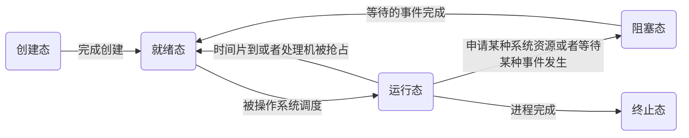
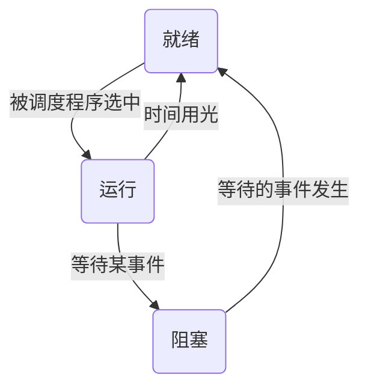
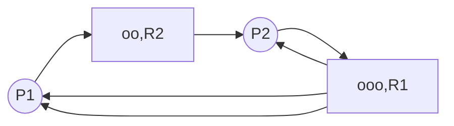

# 进程管理

现代操作系统的一个重要特性是程序的并发性与资源的共享性，为了满足多用户并发计算的要求，现代操作系统围绕进程这个概念进行设计和构造。

## 进程的定义

> [!tip] 进程这个概念是为了描述系统中的并发活动而引入的。
> **进程** (process)，又叫做任务 (task)，是操作系统中最基本、最重要的概念之一，它对于操作系统的理解、描述与设计都具有非常重要的意义。

从不同的角度，进程可以有不同的定义，下面是几种比较典型的定义：
1. 进程是程序的一次执行过程，*是一个正在执行程序的实例*。
2. 进程是一个程序及其数据从磁盘加载到内存后，在 CPU 上执行的过程。
3. 进程是程序在一个数据集合上顺序执行时发生的活动。它是系统进行资源分配和调度的一个独立单位。

> [!note] PCB 描述块
> 为了使得并发执行的每个程序 (包括数据) 都可以独立的运行，必须为之配备一个专门的数据结构，称为**进程控制块**(Process Control Block, PCB)。
> 系统通过 PCB 来描述进程的基本情况和运行状态。

书上给出了便于记忆的简单定义：**进程是可以和其他程序并行执行的程序关于某个数据集合的一次执行过程**。

> [!note] 进程的特点
> 1. 进程是程序的一次执行过程，具有**动态性**；程序是完成某个特定功能的指令的有序序列，是一个静态的概念。进程是程序的一次执行过程，是临时的，有生命周期的；而程序可以作为一种长期储存的资源。**动态性是进程最基本的特征**。
> 2. 进程是系统进行资源分配和调度的一个独立单位，具有**独立性**。而同一个程序可以在同一时间被多个用户使用。资源分配时以进程为单位的，而不是以程序为单位的。
> 3. 一个进程可以与其他进程并发执行，具有**并发性**。
> 4. 进程具有**结构性**。为了描述进程，系统为每个进程创建了一个进程描述块。从结构上来看，一个进程包含了程序、数据和进程控制块。
> 5. 进程具有**异步性**。各进程按各自独立的、不可预知的速度向前推进，操作系统要提供进程同步机制来解决异步问题。

> [!note] 进程与程序的区别
> 简单来说，程序是静态的，是个存放在磁盘里的可执行文件，是一系列的指令集合。进程是动态的，是程序的一次执行过程。

## 进程的描述

### 进程控制块

进程控制块(process control block)是进程存在的唯一标识，通常包含了：
1. 进程描述信息，如进程ID(PID, process ID)，进程所属用户ID(UID)。
2. 进程控制和管理信息，如进程的CPU使用时间、磁盘使用时间、网络流量使用情况等，此外还包含了进程当前的状态：就绪态/阻塞态/运行态等
3. 资源分配清单，如分配了多少内存、正在使用哪些IO设备，正在使用哪些文件。
4. 处理机相关信息，如PSW、PC等各种寄存器的值，用于实现进程的切换。

操作系统对进程进行管理工作所需的信息都存在PCB中。当进程被创建时，操作系统为其创建PCB，但进程结束时，操作系统回收其PCB。

### 进程实体的组成

一个进程实体(进程映像)由PCB、程序段、数据段组成。进程是动态的，但是进程实体时静态的。换句话说，进程实体是进程在执行某一时刻的状态。
1. 一个程序开始运行时，需要创建对应的进程，创建相应的PCB。
2. 运行前需要将程序放入内存中，在运行时从CPU从内存中取出指令执行。
3. 数据段中包含了运行过程中产生的各种数据，如变量等。

进程是进程实体的运行过程，是系统进行资源资源分配和调度的一个独立单位。

### 进程的状态

进程在生命周期内一直处于一个状态不断变化的过程中。为了刻画这种变化过程，操作系统将进程分为了若干状态，使用状态机来表述。这些状态信息记录在进程的 PCB 结构中。

一个进程的状态有以下几种：
1. 创建态：进程正在被创建时，它的状态是创建态，在这个阶段操作系统会为进程分配资源，初始化PCB。
2. 就绪态：进程创建完毕后，便进入了就绪态，处于就绪态的进程已经具备了运行条件，但是由于没有空闲的CPU，就暂时不能运行。
3. 运行态：当CPU空闲时，操作系统就会选择一个就绪进程，让它上处理机运行。
4. 阻塞态：在进程运行的过程中，可能会请求等待某个事件的发生(如等待某种系统资源的分配，或者等待其他进程的响应)。在这个事件发生之前，进程无法向下执行，这时操作系统会让这个进程下CPU，让其进入阻塞态，然后选择另一个就绪态的进程上CPU运行。
5. 终止态：一个进程可以请求exit的系统调用，请求操作系统终止该进程。此时一个进程进入终止态，操作系统会让该进程下CPU，并回收内存空间等资源，最后还要回收该进程的PCB。当终止进程的工作完成后，该进程就彻底消失了。



注意：不能直接从阻塞态直接转换为运行态，也不能直接从就绪态转为阻塞态。在进程的整个生命周期中，大部分时间都是处于就绪态、运行态、阻塞态三种状态。在单核CPU下，同一时刻只会有一个进程处于运行态，多核CPU情况下，可能有多个进程处于运行态。

在PCB中，会有一个变量state来表示进程的当前状态。为了便于管理，操作系统会将处于同一状态的进程组织起来。

### 进程的组织

为了便于进程的管理，通常对系统中的进程采用两种组织方式。

- 线性表组织方式：把所有进程的 PCB 存放在一个数组中，系统通过数组下标访问每一个 PCB。系统根据进程的状态，建立了多张索引表，并把索引表的内存首地址记录在内存中的一些专用单元中以完成索引。
- 链表组织方式：把具有相同状态的 PCB 组织成一个队列。
  - 处理就绪态的进程可按照某种策略排成多个就绪队列。
  - 处于阻塞态的进程又可以根据阻塞的原因组织成多个阻塞队列。

在单 CPU 系统中，任何时间都只有一个进程处于运行状态，因此系统专门设定了一个指针指向当前运行进程的 PCB。

## 进程控制

进程控制：是指系统使用一些具有特定功能的程序段来创建、撤销进程，以及完成进程各状态之间的转换。进程控制是由操作系统内核实现的，属于原语一级操作，不能被中断。

> 原语：是一种特殊的程序，它的执行具有原子性。也就是说，这段程序运行必须一气呵成，不能中断。进程控制需要使用原语的原因(需要一气呵成的原因)：如果不能一气呵成的执行，可能导致操作系统中的某些关键数据结构不统一的情况，如PCB中的进程状态与进程所处的队列不一致，这会影响操作系统进行别的管理工作，可能导致操作系统出错。
> 原语的原子性的实现：在计算机中，CPU每执行完一条指令后，会例行检查是否有中断信号。在进行原语之前，CPU先执行关中断指令，此时不再例行检查中断信号，在原语执行完毕后，再执行开中断指令。关中断与开中断指令为特权指令，只能由内核使用，而不能由用户使用。

### 创建原语

系统一般通过下面的步骤创建进程，创建原语使一个进程由创建态进入就绪态。

1. 扫描进程表，找到一个空闲的 PCB。
2. 为新进程的程序、数据、用户栈分配内存。
3. 初始化 PCB。把调用者提供的参数（进程名、进程优先级、实体所在主存的起始地址、所需的资源清单、记账信息及进程家族关系等）填入 PCB 中。
4. 将新的进程插入就绪队列。

下面是常见的引起创建原语的事件：

1. 用户登录：在分时系统中，用户登录成功，系统为其创建一个新进程
2. 作业调度：多道批处理系统中，有新的作业放入内存时，会为其创建一个新的进程
3. 提供服务：用户向操作系统提出某些请求时，会新建一个进程处理该请求
4. 应用请求：由用户进程主动请求创建一个子进程

### 撤销原语

如果一个进程已经完成任务或者由于故障不能继续运行时，应当被撤离系统而消亡。撤销原语的功能是在 PCB 集合中寻找要撤销的进程，若有子孙进程，也需要终止，以防称为不可控的；将其全部资源或者归还其父进程或者归还系统。撤销其 PCB。

撤销原语使一个进程由其他状态进入终止态，其过程为：

1. 从PCB集合中找到终止进程的PCB
2. 若进程正在运行，立即剥夺CPU，将CPU分配给其他进程
3. 终止其所有子进程
4. 将该进程拥有的所有资源归还给父进程或者操作系统
5. 删除PCB

### 阻塞原语

处于运行状态的进程，在其运行过程中期待某一事件发生，将会自己执行阻塞原语，由运行态变为阻塞态。（如等待键盘输入、等待磁盘数据传输完成）

阻塞原语的功能是中断 CPU，将其运行现场保存在其 PCB 中，置状态为阻塞态，插入相应事件的阻塞队列中。之后，由处理机调度，重选一个进程投入运行。其过程为：

1. 找到要阻塞的进程对应的PCB
2. 保护进程的运行现场，将PCB状态信息设置为阻塞态，暂时停止进程进行
3. 将PCB插入相应时间的等待队列

### 唤醒原语

当某进程等待的事件为 I/O 事件完成时，I/O 处理完成后，CPU 响应中断，在中断处理中，将等待 I/O 完成而阻塞的进程唤醒，并置于就绪态。

另一种情况，若等待的事件是某一进程发出信息，由发送进程将等待者唤醒，置为就绪态，并插入就绪队列。其过程为：

1. 在事件等待队列中找到PCB
2. 将PCB从等待队列移除，设置进程为就绪态
3. 将PCB插入就绪队列，等待被调度

### 挂起原语

- 在实时系统中，根据实时现场的需要，会将正在执行或者没有执行的进程挂起一段时间。被挂起的进程由活动状态转换为静止状态。
- 在分时系统中，将进程从内存换到外存中，进程就处于了进制状态，不被调度。

### 解挂原语

当挂起进程的原因被解除时，系统调用解挂原语将指定的进程解挂，使其由静止态变为活动态。当被解挂的进程变为活动就绪时，通常立即转进程调度。

## 进程通信

进程间通信 (Inter-Process Communication, IPC) 指两个进程之间产生数据交互。进程之间的通信必须有操作系统的支持。

进程是分配系统资源的单位，包括内存地址空间，因此各进程拥有的内存地址空间相互独立。为了保证安全，一个进程不能直接访问另一个进程的地址空间。因此需要操作系统的支持才能完成。

进程通信的方式包括共享存储、

### 共享存储

共享存储方式通过系统调用申请了一片共享内存区，使得通信的进程都可以访问共性存储区从而实现进程通信。

进程间如果通过共享存储的方式进行通信，那么进程间对于共享空间的访问是互斥的，一个进程访问共享空间时，其他进程不能访问。

共享存储有两种形式：
- 基于存储区的共享：操作系统在内存中划出一块共享存储区，数据的形式、存放位置都由通信进程控制，而不是操作系统。这种共享方式传输数据的速度非常快，是一种高级通信方式。
- 基于数据结构的共享：例如共享空间中只能放一个长度为 10 的数组，这种共享方式速度慢，限制多，是一种低级的通信方式。

### 消息传递

进程间的数据交换以**格式化的消息**（Message）为单位，进程通过操作系统提供的发送消息/接受消息两个原语进行数据交换。

发送的消息头包括发送进程的 ID、接受进程的 ID、消息长度等格式化信息，消息体包含需要发送的格式化信息。

消息传递分为两种方式：
- 直接通信方式：消息进程指明接受进程的 ID。在每个进程的 PCB 中包含了每个进程的消息队列，其中保存了其他进程发送给该进程的消息。需要发送消息的进程通过发送原语发送消息，操作系统内核将消息放入接收进程的消息队列；之后接受进程通过接收原语，操作系统通过
- 间接通信方式：通过“信箱”间接地通信，因此又称为信箱通信方式。发送进程通过发送原语将消息发送到指定的信箱，接受进程通过接收原语从指定的信箱接受消息。

### 管道通信

在管道通信中，可以从一端写入数据，从另一端读数据。这里管道是一个特殊的共享文件，又名 pipe 文件，该文件的本质是在内存中开辟了一个大小固定的内存缓冲区。

相比于共享内存的方式，管道通信只有一方可以写入文件，另一方读取文件。并且管道通信中，读取数据的顺序与写入数据的顺序必须按照内存的方向读取。即读写数据是先进先出的，管道相当于一个循环队列。

管道通信有下面的几个特点：
1. 管道只能采用半双工通信，某一时间段内只能实现单向的传输。如果要实现双向通信，则需要设置两个管道。
2. 各个进程要互斥地访问管道（由操作系统实现）。
3. 当管道写满时，写进程被阻塞，直到读进程将管道中的数据被取走，即可唤醒进程。
4. 当管道读空时，读进程被阻塞，直到写进程往管道中写入数据，即可唤醒读进程。
5. 管道数据中的数据一旦被读出，就彻底消失了。因此当多个进程读取同一个管道时，可能会错乱。对此，由两种解决方案：
	1. 一个管道允许多个写进程，一个读进程（以这个为准）。
	2. 允许多个写进程，多个读进程，但系统会让各个读进程轮流从管道中读数据（linux）。

## 线程

进程的引入使得程序间可以并发执行的，但是在进程内部只能串行的进行。但是在实际的应用中，一个进程可能需要同时进行事，即进程内部也存在并发执行的要求。

引入线程后，CPU 的基本服务对象转变为了线程，进程之间可以并发执行，同时进程内的线程也可以并发的执行，增加了操作系统的并发度。

线程，可以理解为轻量级线程，是调度的基本单位。引入线程机制后，为操作系统带来了如下的变化：
1. 资源分配、调度：传统进程机制中，进程是资源分配、调度的基本单位，但是在引入线程后，进程是资源分配的基本单位，线程是调度的基本单位。
2. 并发性：传统进程机制中，只能进程间并发。在引入线程后，各个线程间也能并发，提升了并发度。
3. 系统开销：传统进程间并发，需要切换进程的运行环境，系统开销很大。引入线程后，线程间的并发，如果是同一进程内的线程切换，则不需要切换进程环境，系统开销小，并发所带来的系统开销减小。

线程具有与进程类似的属性，但是也有自己的特点：
1. 线程是处理机调度的单位
2. 多 CPU 计算机中，各个线程可以占用不同的 CPU
3. 每个线程都有一个线程 ID、线程控制块（TCB）
4. 线程也有就绪、阻塞、运行三种基本状态
5. 线程几乎不拥有系统资源
6. 同一进程的不同线程间共享进程资源
7. 由于共享内存地址空间，同一进程的线程间通信无需系统干预
8. 同一进程中的线程切换不会引起进程切换
9. 不同进程中的线程切换会引起进程切换
10. 切换同进程内的线程，系统开销很小
11. 切换进程，系统开销很大

### 线程的实现方式

#### 用户级线程 (User-Level Thread, ULT)

早期的操作系统只支持进程，不支持线程。此时的线程是由线程库实现的。很多的编程语言提供了强大的线程库，可以实现线程的创建、调度、销毁的功能。用户级线程由以下特点：
- 用户级线程由引用程序通过线程库实现，所有的线程管理工作都应由应用程序负责（包括线程切换）。
- 用户级线程中，线程切换可以在用户态下完成，无需操作系统干涉。
- 在用户看来，程序是由多个线程的。但是操作系统内核看来，还是使用一个进程。

用户级线程的优缺点：
- 优点：用户级线程的切换在用户空间中即可完成，不需要切换到核心态，线程管理的系统开销小，效率高。
- 缺点：在用户级线程中，如果一个线程被阻塞，那么其他线程也将被阻塞，并发度不高，多个线程不可在多核处理机上并行运行。

在用户级线程中，进程仍然时调度的基本单位，线程间不能并行的进行。

#### 内核级线程 (Kernel-Level Thread, KLT)

大多数的现代操作系统都实现了内核级线程。内核级线程由以下特点：
1. 内核级线程的管理工作由操作系统内核完成。
2. 线程调度、切换等操作都由内核负责，因此内核级线程的切换必然在核心态才能完成。
3. 操作系统会为每个内核级线程建立相应的 TCB (Thread Control Block)，通过 TCB 对线程进行管理。

内核级线程的优缺点：
- 优点：当一个线程被阻塞后，别的线程还可以继续执行，并发能力强。多线程可以在多核处理机上并发执行。
- 缺点：一个用户进程会占用多个内核级线程，线程的切换由操作系统内核完成，需要切换到核心态，因此线程管理的成本较高，开销大。

### 多线程模型

在支持内核级线程的系统中，根据用户级线程和内核级线程的映射关系，可以划分为几种多线程模型。

- 一对一模型：一个用户级线程映射到一个内核级线程，每个用户进程有与用户级线程同数量的内核级线程。
	- 优点：当一个线程被阻塞后，别的线程还可以继续执行，并发能力强。多线程可以在多核处理机上并行执行。
	- 缺点：一个用户进程会占用多个内核级线程，线程的切换由操作系统内核完成，需要切换到核心态，因此线程的管理成本高，开销大。
 - 多对一模型：多个用户线程映射到一个内核级线程，且一个进程只被分配一个内核级线程。这种方式相当于退化到了普通的用户级线程。
 - 多对多模型：n 个用户级线程映射到 m 个内核级线程 (n $\geqslant$ m)，每个用户进程对应 m 个内核级线程。
	 - 克服了多对一模型并发度不高的缺点 (一个阻塞全部阻塞)，又克服了一对一模型中一个用户进程占用太多内核级线程，开销太大的缺点。

需要注意的是：内核级线程才是处理机分配的单位。内核级线程中可以运行任意一个由映射关系的用户级线程代码，只有两个内核级线程中正在运行的代码都阻塞时，整个进程才阻塞。

### 线程的状态与转换

线程的状态与转换方式和进程基本相同：


### 线程的组织与控制

线程的组织方式与进程相似。系统会为每个线程建立一个线程控制块 (TCB)，每个线程控制块包含：
1. 线程标识符：TID，与 PID 相似
2. 程序计数器 PC：线程目前执行到哪里
3. 其他寄存器：线程运行的中间结果
4. 堆栈指针：堆栈保存函数调用信息，局部变量等
5. 线程运行状态：运行/就绪/阻塞
6. 优先级：线程调度、资源分配的参考

同时使用线程表将多个 TCB 组织在一起。

## 处理机调度

系统中的用户进程数远远超过处理机数，这么多的进程竞争处理机，就需要操作系统采用一些策略，将处理机动态的分配给系统中的各个就绪进程。分配资源的过程就是调度。

### 调度的三个层次

- 高级调度 (作业调度)：按照一定的元组从外存的作业后备队列中挑选一个作业存入内存，并创建进程。每个作业只调入一次，调出一次。作业调入时建立 PCB，调出时才撤销 PCB。高级调度将进程从无->创建态->就绪态。
- 低级调度 (进程调度/处理机调度)：按照某种策略从就绪队列中选取一个进程，将处理机分配给它。**进程调度时操作系统中最基本的一种调度**，进程调度的频率很高，一般几十毫秒一次。低级调度将进程从就绪态->运行态。
- 中级调度 (内存调度)：按照某种策略决定将哪个处于挂起状态的进程重新调入内存中。**内存不够时，可将某些进程的数据调出外存，等内存空闲或者进程需要运行时再重新调入内存。暂时调到外存等待的进程称为挂起状态，被挂起的进程 PCB 会被组织成挂起队列**。中级调度发生的频率要高于高级调度。中级调度将进程从挂起态->就绪态或者从阻塞挂起->阻塞态。

> 挂起状态：暂时调到外存等待的进程状态为挂起状态，挂起态又可以进一步分为就绪挂起、阻塞挂起两种状态。将挂起状态加入状态表中，得到七状态模型：
 ```mermaid
graph
Cr(创建态)-->A(就绪态)-->B(运行态)-->终止态
B-->A
B-->C(阻塞态)-->A
E(阻塞挂起)
Cr-->D(就绪挂起)-->|激活|A
A-->|挂起|D
B-->D
C-->|挂起|E-->|激活|C
E-->|事件出现|D
```

### 进程调度

进程调度 (低级调度) 是按照某种算法从就绪队列中选择一个进程为其分配处理机。一般而言，在下面的情况会发生进程调度：
- 当前运行进程**主动放弃**处理机
	- 进程正常终止
	- 运行过程中发生异常终止
	- 进程主动请求阻塞
- 当前运行进程**被动放弃**处理机
	- 分给进程的时间片用完
	- 有更加紧急的事需要处理
	- 有更高优先级的进程进入就绪队列

下面几种情况下不能进行进程调度与切换：
1. 在处理中断中。中断处理过程复杂，与硬件密切相关，很难做到在中断处理过程中进行进程切换。
2. 进程在操作系统内核程序临界区中。
3. 在原子操作过程中 (原语)。原子操作不可中断。

> 临界资源：一个时间段内只允许一个进程使用的资源，各进程需要互斥地访问临界资源。
> 临界区：访问临界资源的那段代码。
> 内核程序临界区：一般是用来访问某种内核数据结构的，比如进程的就绪队列。内核程序临界区访问的临界资源如果不尽快释放的话，极有可能影响到操作系统内核的其他管理工作。

进程调度方式分为非剥夺调度方式与剥夺调度方式。
- 非剥夺调度方式，又称为非抢占式调度方式，只允许进程主动放弃处理机。在运行过程中即便有更加紧迫的任务到达，当前进程依然会继续使用处理机，直到该进程终止或者主动要求进入阻塞态。
	- 实现简单，系统开销资源小但是无法及时处理紧急任务，适合于早期的批处理系统。
- 剥夺调度方式，又称为抢占方式。当一个进程正在处理机上执行时，如果有一个更重要或者更紧迫的进程需要使用处理机，则立即暂停正在执行的进程，将处理机分配给更重要更紧迫的那个进程。
	- 可以优先处理更紧急的进程，也可以实现让各进程按时间片轮流执行的功能。适合与分式操作系统，实时操作系统。

> 广义的进程调度包含了选择一个进程和进程切换两个步骤，其中：
> - **狭义的进程调度**：指从就绪队列中选中一个要运行的进程。
> - **进程切换**：指一个进程让出处理机，由另一个进程占用处理机的过程。进程切换主要完成了：
> 	1. 对原来运行进程的各种数据的保存：将数据保存到 PCB 中
> 	2. 对新的进程各种数据的恢复：将相应的数据存放到寄存器中
>
> 进程的切换是由代价的，因此如果过于频繁的进程进程调度、切换，必然会使整个系统的效率降低，使系统的大部分时间都花在进程切换上，而真正用于执行进程的时间减少。

### 调度程序 (scheduler)

调度程序是用于调度的程序。调用调度程序意味着进行一次调度。通常，在创建新进程、进程退出、运行进程阻塞、IO 中断等时候回触发调度程序。此外：
- 非抢占式调度策略，只有运行进程阻塞或者退出时才出发调度程序工作。
- 抢占式调度策略，每个时钟中断或 k 个时钟中断会出发调度程序工作。

在不支持内核级线程的操作系统中，调度程序的处理对象是进程。在支持内核级线程的操作系统中，调度程序的处理对象是线程。

> 调度程序在没有其他就绪进程时，将会运行闲逛进程 (idle)，闲逛进程的特点是
> - 优先级最低
> - 可以是 0 地址指令，占一个完整的指令周期
> - 能耗低

### 调度算法的评价指标

#### CPU 利用率

由于早期的 CPU 造价昂贵，因此人们希望 CPU 尽量多的工作。CPU 利用率表示 CPU 忙碌的时间占总的时间的比例。
$$
\tiny 利用率=\frac{忙碌的时间}{总时间}
$$
上式不仅可以算 CPU 的利用率，也可以计算其他设备的利用率。

#### 系统吞吐量

对于计算机来说，希望能用尽可能少的时间处理完尽可能多的作业。系统吞吐量表示单位时间内完成作业的数量。
$$
\tiny 系统吞吐量=\frac{总共完成了多少道作业}{总共花了多少时间}
$$

#### 周转时间

对于计算机的用户来说，一般很关心自己的作业从提交到完成总共花了多少时间。周转时间指作业被提交给系统来时，到作业完成为止的这段时间间隔。
$$
\tiny 周转时间=作业完成时间-作业提交时间
$$
此外，我们更加关心系统的整体表现，因此常用平均周转时间
$$
\tiny 平均周转时间=\frac{各作业周转时间之和}{作业数}
$$
上面的指标没有考虑作业的实际运行时间，因此提出了带权周转时间
$$
\tiny 带权周转时间=\frac{作业周转时间}{作业时间运行时间}=\frac{作业完成时间-作业提交时间}{作业实际运行时间}
$$
相应的，系统整体的指标使用
$$
\tiny 平均带权周转时间=\frac{各作业带权周转时间之和}{作业数}
$$

#### 等待时间

计算机的用户希望自己的作业尽可能少的等待处理机。等待时间指进程/作业处于等待处理机状态时间之和。

对于进程来说，等待之间指进程建立后等待被服务的时间之和，在等待 IO 设备的时间不计入等待时间。

对于作业的等待时间，还需要加上作业在外存后备队列中等待的时间。

相应的，使用平均等待时间作为系统的整体指标。

#### 响应时间

响应时间指从用户提交到首次产生响应所用的时间。

### 调度算法

#### 先来先服务 (FCFS)

先来先服务调度算法 (First Come First Serve)，按照到达的先后顺序调度，事实上就是等待的时间的越久的越优先得到服务。

先来先服务算法为非抢占式算法，由于作业调度时，考虑的是哪个作业先到达后备队列，用于进程调度时，考虑的是哪个进程先到达就绪队列。
- 优点：公平，算法实现简单，不会导致饥饿。
- 缺点：排在长作业 (进程) 后面的短作业需要等待很长的时间，带权周转时间很大。FCFS 算法对长作业有利，对短作业不利。

#### 短作业优先 (SJF)

短作业优先 (SJF, Shortest Job First) 追求最少的平均等待时间，最少的平均周转时间，最少的平均带权周转时间。

- 非抢占式短作业优先算法，每次调度时选择当前已到达且运行时间最短的作业/进程。
- 抢占式短作业优先算法，又称为**最短剩余时间优先算法** (SRTN)，每当有进程加入就绪队列需要进行调度，如果新到达的进程剩余时间比当前运行的进程剩余时间更短，则由新进程抢占处理机，当前运行进程重新回到就绪队列。此外，在一个进程完成时也需要进程调度。

一般而言，书上提到的短作业/进程优先算法默认是非抢占式的。严格来说，抢占式短作业优先算法的平均等待时间、平均周转时间最少。

- 优点：最短的平均等待时间、平均周转时间
- 缺点：不公平，对短作业有利，对长作业不利。可能会产生饥饿现象。此外，由于作业/进程的运行时间由用户提供，不一定真实，不一定可以做到真正的短作业优先。

#### 高响应比优先 (HRRN)

高响应比优先算法综合考虑作业/进程的等待时间和要求服务的时间。定义了进程的响应比为：
$$
\tiny 响应比=\frac{等待时间+要求服务时间}{要求服务时间}
$$

高响应比优先算法为非抢占式算法。只有当前运行的进程主动放弃 CPU 时，才需要进程调度。在每次调度时先计算各个作业/进程的响应比，选择响应比最高的作业/进程为其服务。
- 优点：综合考虑了等待时间和运行时间，等待时间相同时，要求服务时间短的优先，要求服务时间相同时，等待时间长的优先。
- 不会导致饥饿。

高响应比优先算法结合了 FCFS 算法与 SJF 算法的优点，是一种折中的算法。

> FCFS 算法、SJF 算法与 HRRN 算法只关心系统整体的性能指标，但不关心响应时间，也不区分任务的紧急程度，因此对于用户来说，交互性很糟糕。因此这三种算法一般适用于早期批处理系统。

#### 时间片轮转调度算法 (RR)

时间片轮转算法 (Round-Robin) 公平地、轮流的为各个进程服务，让每个进程在一定时间间隔内都可以得到响应。

时间片轮转调度算法是抢占式算法，只能用于进程调度。按照各个进程到达就绪对列的顺序，轮流让各个进程执行一个时间片，若进程未在一个时间片内执行完，则剥夺处理机，将进程重新放入就绪队列队尾排队。

在进行时间片轮转调度时，始终维护一个进程队列，每次选择一个排在就绪队列对头的进程。

- 如果时间片太大，使得每个进程都可以在一个时间片内完成，则时间片轮转调度算法退化为了先来先服务算法，并且会增大进程的响应时间。
- 如果时间片太小，进程切换过于频繁，系统会花大量时间来处理进程切换，从而导致实际用于进程执行的时间比例减少。

- 优点：公平，响应快，适用于分式操作系统。不会导致饥饿。
- 缺点：由于高频率的进程切换，因此有一定的开销。不区分任务的紧急程度。

#### 优先级调度算法

随着计算机发展，特别是实时操作系统的出现，越来越多的应用场景需要根据任务的紧急程度来决定处理顺序。

- 非抢占式：在进程主动放弃处理器时检查就绪队列
- 抢占式：在就绪队列变化时检查就绪队列

优先级调度算法在每次调度时选择优先级最高的进程。在优先级调度算法中，就绪队列未必只有一个，可以按照不同优先级来组织。另外，也可以把优先级高的进程排在更加靠近对头的位置。根据优先级是否可以动态改变，可以将优先级分为：
1. 静态优先级：创建进程时确定，之后一直不变。
2. 动态优先级：创建进程时有一个初始值，之后会根据情况动态地调整优先级。例如，提高等待时间长的进程的优先级，降低占用处理器很长时间的进程的优先级。

- 优点：用优先级区分紧急程度、重要程度，适用于实时操作系统，可以灵活地调整对各种作业/进程的偏好程度
- 缺点：若远远不断地有高优先级的进程到来，可能会导致饥饿

#### 多级反馈队列调度算法

多级反馈队列是对其他调度算法的这种权衡，是抢占式的算法。

多级反馈队列调度的算法步骤为：
- 多级反馈队列调度算法设置了多级就绪队列，各级队列优先级从高到低，时间片从小到大。
- 新进程到达时，先进入第 1 级队列，按照 FCFS 原则排队等待被分配时间片。若用完时间片，进程还未结束，则进程进入下一级队列队尾。如果此时已经在最下级的队列，则重新放回最下级队列队尾。
- 只有第 k 级队列为空时，才会为 k+1 级队头的进程分配时间片。
- 若在 k 级队列的进程正在运行过程中，若更上级的队列中进入了一个新进程，则由于新进程处于优先级更高的队列中，因此新进程会抢占处理机。原理运行的进程放回 k 级队列队尾。

多级反馈队列调度算法的特点：
- 优点：
	- 对各类型进程相对公平 (FCFS)
	- 每个新到达的进程都可以很快得到响应 (RR)
	- 短进程只用较少时间就可完成 (SPF)
	- 不必实现估计进程的运行时间 (避免用户作假)
	- 可以灵活的调整对各类进程的偏好程度
 - 缺点：会导致饥饿。

> 时间片轮转调度、优先级调度、多级反馈队列调度算法适用于交互式系统，它们更加注重系统的响应时间、公平性、平衡性等指标。

#### 多级队列调度算法

系统按进程类型设置多个队列，进程创建成功后插入某个队列。队列之间可以采取固定优先级，或时间片划分
- 固定优先级：高优先级空时低优先级进程才能被调度
- 时间片划分：分配不同的时间片

此外，各个队列还可以使用不同的调度策略，如
- 系统进程队列采用优先级调度
- 交互式进程采用 RR
- 批处理队列采用 FCFS

## 进程同步与互斥

进程同步：进程具有 [[操作系统基本原理概论#异步性|异步性]] 的特征，各个并发的进程以各自独立的、不可预知的速度向前推进。

同步也称为直接制约关系，它指为了完成某种任务而建立的两个或者多个进程，这些进程因为需要再某些位置上协调它们的工作次序而产生的制约关系。进程间的直接制约关系就是源于它们之间的互相合作。

进程互斥：一个时间段内只允许一个进程使用的资源称为临界资源，对于临界资源，进程必须互斥的访问。

### 进程互斥

对于临界资源的访问，在逻辑上分为下面的四个部分：
1. 进入区：负责检查是否可进入临界区，若可进入，则应设置正在访问临界区的标志 (可以理解为上锁)，以阻止其他进程同时进入临界区
2. 临界区：访问临界资源的那段代码
3. 退出区：负责解除正在访问临界资源的标志 (可以理解为解锁)
4. 剩余区：做其他处理

其中进入区与退出区是时间进程互斥的代码段，临界区是访问临界资源的代码段。

为了实现对临界资源的互斥访问，同时保证系统整体性能，需要遵循以下原则：
1. 空闲让进：临界区空闲时，可以运行一个请求进入临界区的进程立即进入临界区
2. 忙则等待：当已有进程进入临界区时，其他试图进入临界区的进程必须等待
3. 有限等待：对请求访问的进程，应保证能在有限时间内进入临界区
4. 让权等待：当进程不能进入临界区时，应立即释放处理机，防止进程忙等待

#### 进程互斥的软件实现方法

##### 单标志法

算法思想：两个进程在访问完临界区后会把使用临界区的权限转让给另一个进程，也就是说每个进程进入临界区的权限只能被另一个进程赋予。

```c
int turn = 0; // 表示当前运行进入临界区的进程号

// P0 进程
while(turn != 0); // 进入区
critical section; // 临界区
turn = 1;         // 退出区
remainder section;// 剩余区

// P1 进程
while(turn != 1); // 进入区
critical section; // 临界区
turn = 0;         // 退出区
remainder section;// 剩余区
```

单标志法可以实现互斥的访问资源，但是违反了空闲让进的原则。

##### 双标志先检查法

算法思想：设置一个布尔数组，数组中各个元素用于标记各个进程想要进入临界区的意愿。每个进程在进入临界区之前先检查当前有没有别的进程需要进入临界区，如果没有，则把自身的标志设为 true，之后开始访问临界区。

```c
bool flag[2] = {false, false}；

// P0 进程
while(flag[1]); // 进入区，检查是否有其他进程在访问
flag[0] = true; // 进入区，设置自己在访问
critical section; // 临界区
flag[0] = false; // 退出区
remainder section; // 剩余区
```

双标志法在按照一定的顺序执行时可能会导致两个进程同时访问临界区，违反了忙则等待的原则。原因是在检查与上锁的处理不是一气呵成的，可能在中间出错。

##### 双标志后检查法

算法思想的改版：前一个算法的问题是先检查后上锁，但是这样导致了两个进程同时进入临界区的问题。因此该方式使用先上锁后检查的方法来避免上述问题。

```c
bool flag[2] = {false, false};

// P0 进程
flag[0] = true; // 进入区，先上锁
while(flag[1]); // 进入区，后检查
critical section; // 临界区
flag[0] = false;  // 退出区
remainder section;// 剩余区
```

这个方法虽然解决了忙则等待的问题，但是如果并发的执行上锁指令，会导致两者都无法进入临界区。因此违背了空闲让进和有限等待的原则，会应各进程都长期无法访问临界资源而产生饥饿现象。

##### Peterson 算法

算法思想：结合双标志法、单标志法的思想，如果双方都争着想要进入临界区，则先让对方进入临界区。

```c
bool flag[2] = false;
int turn = 0;

// P0 进程
flag[0] = true;            // 进入区，表示意愿
turn = 1;                  // 进入区，优先让其他进程进入
while(flag[1] && turn==1); // 进入区，有其他进程要进入，等待
critical section;
flag[0] = false;
remainder section;
```

Peterson 算法用软件的方法解决了进程互斥问题，遵循了空闲让进、忙则等待、优先等待是三个原则，但是仍然未遵循让权等待原则。

#### 进程互斥的硬件实现方法

##### 中断屏蔽方法

利用开/关中断指令实现，类似于原语的实现方式。
- 关中断后即不允许当前进程被中断，也必然不会发生进程切换
- 直到当前进程访问完临界区，再执行开中断指令，才有可能有别的进程上处理机访问临界区

- 优点：简单、高效
- 缺点：不使用于多处理机，只适用于操作系统内核进程，不适用于用户进程 (开/关中断是特权指令)

##### TestAndSet 指令

简称为 TS 指令，也可以称为 TSL (Test And Set Lock) 指令。TSL 指令是用硬件实现的，执行过程中不允许被中断，只能一气呵成。使用 c 语言描述逻辑如下：

```c
// lock 表示当前区域是否被加锁
bool TestAndSet(bool *lock){
	bool old;
	old = *lock;
	*lock = true;
	return old;
}

// 使用TSL指令实现的互斥逻辑
while(TestAndSet(&lock)); // 进入区，上锁并检查
critical section;
lock = false; // 退出区，解锁
remainder section;
```

- 优点：与软件实现的方法相比，TSL 指令把上锁和检查用硬件的方式变成了一气呵成的原子操作。实现简单，且适用于多处理机环境。
- 缺点：不满足让权等待原则。暂时无法进入临界区的进程会循环执行 TSL 指令。

##### Swap 指令

Swap 指令也称为 Exchange 指令，或者简称 XCHG 指令。Swap 指令是使用硬件实现的，执行过程不允许被中断，只能一气呵成。下面用 c 语言描述其逻辑：

```c
Swap(bool *a, bool *b){
	bool temp = *a;
	*a = *b;
	*b = temp;
}
// 下面是用Swap实现互斥的算法逻辑
bool old = true;
while (old == true) Swap(&lock, &old); // 进入区
critical section;
lock = false;
remainder section;
```

使用 Swap 指令与 TSL 并无太大区别，都是先记录下此临界区是否已经被上锁 (记录在 old 变量)，在将上锁标记 lock 设置为 true，最后检查 old。如果 old 为 false 则说明之前没有别的进程对临界区上锁，则可以跳出循环。
- 优点：实现简单，无需像软件实现方法那样严格检查是否会有逻辑漏洞，适用于多处理机环境
- 缺点：不满足让权等待原则。

#### 互斥锁

解决临界区最简单的工具是互斥锁 (mutex lock)。一个进程在进入临界区时获得相应的锁，在退出临界区时释放锁。
- 使用函数 `acquire()` 获得锁，使用函数 `release()` 释放锁。
- 每个互斥锁有一个布尔变量 available 表示锁是够可用，如果锁可用，调用 `acquire()` 可以成功；如果锁不可用，调用 `acquire()` 会被阻塞，直到锁被释放。
- `acquire()` 与 `release()` 的执行必须是原子操作。

互斥锁的主要缺点是忙等待，当有一个进程在临界区中，任何其他进程在进入临界区时必须连续循环调用 `acquire()`。当多个进程共享同一个 CPU 时，就浪费了 CPU 周期，因此，互斥锁通常用于多处理器系统，一个线程可以在一个处理器上等待，不影响其他进程的执行。

需要连续循环忙等检查的互斥锁可以称为自旋锁 (spin lock)，如 TSL 指令、Swap 指令、单标志指令。需要忙等的锁都违反让权等待的原则。

- 优点：等待期间不用切换进程上下文，多处理器系统中，若上锁的时间短，则等待代价很低。
- 不太适用于单处理器系统，忙等的过程中不可能解锁。

#### 信号量机制

用户进程可以通过操作系统提供的一对原语来对信号量进行操作，从而很方便的实现了进程互斥、进程同步。

信号量是一个变量，用于表示系统中某种资源的数量，可以是整数或者更加复杂的记录型信号量。使用两个原语来进行操作
- `wait(S)` 或者 P 操作
- `signal(S)` 或者 V 操作

##### 整型信号量

用一个整数型的变量作为信号量，用来表示系统中某种资源的数量。对于这种信号量，PV 操作为

```c
void wait(int S){  // wait 原语，相当与进入区
	while(S <= 0); // 如果资源数不够，就一直等待
	S = S - 1;     // 如果资源数量足够，则占用一个资源
}

void signal(int S){ // signal 原语，相当于退出区
	S = S + 1;      // 使用完资源后，在退出区释放资源
}
```

缺陷：在 wait 原语中，如果资源数量不足，会一直占用 CPU，造成忙等。

##### 记录型信号量

记录型信号量是用记录型数据结构表示的信号量。记录型信号量解决了忙等问题。

```c
/*记录型信号量的定义*/
typedef struct {
	int value;        // 剩余资源数
	struct process *L;// 等待队列
} aemaphore;

void wait(semaphore S){
	S.value--;
	if(S.value < 0){
		block(S.L);
	}
}

void signal(semaphore S){
	s.value++;
	if (S.value <= 0){
		wakeup(S.L);
	}
}
```

- 如果剩余资源不够，使用 block 原语使进程从运行态进入阻塞态，并挂到等待队列中。
- 释放资源后，若还有别的进程在等待这种资源，则使用 `weakup` 原语唤醒等待队列中的一个进程，该进程转变为就绪态。

`S.value` 的初值表示系统中某种资源的数目。这样的机制遵循了让权等待的原则。

##### 实现进程互斥

在使用信号量解决问题前，需要明确：
1. 信号量的值=这种资源的剩余数量 (如果信号量的值小于 0，说明有进程在等待这种资源)
2. `P(S)`：申请一个资源 S，如果资源不够就阻塞等待
3. `V(S)`：释放一个资源 S，如果有进程在等待该资源，则唤醒一个进程

实现进程互斥的步骤：
1. 分析并发进程的关键活动，划定临界区
2. 设置互斥信号量 mutex，初值为 1 (申请一个进入临界区的名额，设置为 1 以实现互斥)
3. 在进入区 `P(mutex)`，申请进入
4. 在退出区 `V(mutex)`，申请释放

##### 实现进程同步

进程同步需要各并发进程按照有序地推进。实现进程同步的步骤：
1. 分析什么地方需要实现同步关系，即必须保证一前一后执行两个操作
2. 设置同步信号量 S，初始为 0
3. 在需要先运行的代码后使用 `V(S)`，即在前操作后再生产该资源
4. 在需要后运行的代码之前使用 `P(S)`，即在后操作前必须获得同步资源

简单来说，可以简化为前 V 后 P。

##### 生产者消费者问题

系统中有一组生产者进程和一组消费者进程，生产者进程每次生产一个产品放入缓冲区，消费者进程每次从缓冲区中取出一个产品并使用。其中
- 生产者、消费者共享一个初始为空，大小为 n 的缓冲区
- 只有缓冲区没满时，生产者才能把产品放入缓冲区，否则必须等待
- 只有缓冲区不空时，消费者才能从中取出产品，否则必须等待
- 缓冲区是一种临界资源，各个进程必须互斥地访问

```c
semaphore mutex = 1; // 互斥信号量，实现对缓冲区的互斥访问
semaphore empty = n; // 同步信号量，表示空闲缓冲区的数量
semaphore full = 0; // 同步信号量，表示产品的数量，即非空缓冲区的数量

producer(){
	while(1){
		生产一个产品;
		p(empty);
		P(mutex);
		把产品放入缓冲区;
		V(mutex);
		V(full);
	}
}

consumer(){
	while(1){
		P(full);
		P(mutex);
		从缓冲区取出一个产品;
		V(mutex);
		V(empty);
		使用产品;
	}
}
```

> 改变相邻 P 操作的顺序后：产生死锁。
> 改变相邻 V 操作的顺序后，没有问题。

##### 多生产者-多消费者问题

桌子上有一只盘子，每次只能向其中放入一个水果。爸爸专向盘子中放苹果，妈妈专向盘子中放橘子，儿子专等着吃盘子中的橘子，女儿专等着吃盘子中的苹果。只有盘子空时，爸爸或妈妈才可向盘子中放一个水果。仅当盘子中有自己需要的水果时，儿子或女儿可以从盘子中取出水果。

##### 吸烟者问题

假设一个系统有三个抽烟者进程和一个供应者进程。每个抽样这不停地卷烟并抽调它，但是要卷起并抽掉一支烟，抽烟者需要有三种材料：烟草、纸和胶水。三个抽烟者中，第一个拥有烟草、第二个拥有纸、第三个拥有胶水。供应者无限地提供三种材料，供应者每次将两种材料放桌子上，拥有剩下那种材料的抽烟者卷一根烟并抽掉它，并给供应者进程一个信号量告诉完成了，供应者就会放另外两种材料在桌上，这个过程一种重复，让三个抽烟者轮流地抽烟。

##### 读者写者问题

有读者和写者两组并发进程，共享一个文件，当两个或两个以上的读进程同时访问共享数据时不会产生副作用，单若某个写进程和其他进程 (读进程或写进程) 同时访问共享数据时则可能导致数据不一致的错误。因此要求：
1. 允许多个读者可以同时对文件执行读操作
2. 只允许一个写者往文件中写信息
3. 任一写者在完成写操作执之前不允许其他读者或者写者工作
4. 写者执行写操作前，应让已有的读者和写者全部退出

##### 哲学家进餐问题

一张圆桌上坐着 5 名哲学家，每两个哲学家之间的桌上摆了一根筷子，桌子的中间是一碗米饭。哲学家们倾注毕生的精力用于思考和进餐，哲学家在思考时，不影响他人。只有当哲学家饥饿时，才试图拿起左右两根筷子 (一根一根地拿起)。如果筷子已经在他人手上，则需等待。饥饿的哲学家只有同时拿起两根筷子才可以开始进餐，当进餐完毕后，放下筷子继续思考。

## 管程

在使用信号量机制编写进程同步时，需要面对复杂的 PV 操作，容易出错。管程作为一种高级同步机制被引入。

管程是一种特殊的软件模块，由下面的部分组成：
1. 局部于管程的共享数据结构说明
2. 对该数据结构进行操作的一组过程
3. 对局部于管程的共享数据设置初始值的语句
4. 管程有一个名字

管程的基本特征：
1. 局部于管程的数据只能被局部于管程的过程所访问
2. 一个进程只有通过管程内的过程才能进入管程访问共享数据
3. 每次仅允许一个进程在管程内执行某个内部过程

> 过程：可以理解为函数

## 死锁

死锁指在并发环境下，各个进程因争抢资源而造成的一种互相等待对方手里的资源，导致各进程都阻塞，都无法向前推进的现象。发生死锁后，若没有外力干涉，这些进程都将无法向前推进。

> 容易与死锁混淆的概念：
> 1. 死锁：进程互相等待对方手里的资源，导致各进程都阻塞，无法向前推进的现象
> 2. 饥饿：由于长期得不到想要的资源，某进程无法向前推进的现象
> 3. 死循环：某进程执行过程中一直无法跳出某个循环的现象
>
> 死锁与饥饿是管理者 (操作系统) 的问题，死循环是被管理者的问题。

### 死锁产生的必要条件

产生死锁必须满足下面的四个条件：
1. 互斥条件：只有对必须互斥使用的资源的争抢才会导致死锁
2. 不剥夺条件：进程所获得的资源在未使用之前，不能由其他进程强行夺走，只能主动释放
3. 请求和保持条件：进程已经保持了至少一个资源，但又提出了新的资源请求，而该资源由被其他进程占有，此时请求进程被阻塞，但又对自己已有的资源保持不放
4. 循环等待条件：存在一种进程资源的循环等待链，链中每个进程已获得的资源同时被下一个进程所请求

> 发生死锁时一定有循环等待，但是发生循环等待时未必发生死锁，即循环等待是死锁的充分不必要条件。如果同类资源数大于 1，则即使有循环等待，也未必发生死锁。但是**如果系统中每类资源都只有一个，那循环等待就是死锁的充分充分必要条件**。

一般在下面的情况时发生死锁：
1. 对系统资源的竞争。各进程对不可剥夺的资源的竞争可能会引起死锁，对可剥夺的资源的竞争不会发生死锁。
2. 进程推进顺序非法。请求和释放资源的顺序不当，也同样会导致死锁。
3. 信号量的使用不当也会造成死锁。

总结来说，对于不可剥夺资源的不合理分配，可能导致死锁。

### 死锁的处理策略

#### 预防死锁

预防死锁的思路是破环死锁发生的四个必要条件中的任意一个。

##### 破环互斥条件

如果将互斥使用的资源改造为允许共享使用，则系统不会进入死锁状态。例如**SPOOLing**技术，该技术将独占设备在逻辑上改造为共享设备。

该策略的缺点：由于不是所有的资源否可以改造为可共享使用的资源，并且为了系统安全，很多地方还必须保护这种互斥性，因此很多时候无法破坏互斥条件。

##### 破坏不剥夺条件

有几种方案可以破坏不剥夺条件：
1. 当某个进程请求新的资源得不到满足时，它必须立即释放保持的所有资源，待到以后需要时再重新申请。
2. 当某个进程需要的资源被其他进程占用时，可以有操作系统协助，将想要的资源强行剥夺。

缺点：
- 实现起来较为复杂。
- 释放已获得的资源可能会造成前一阶段的工作失效。因此这种方法一般只适用于已保存和恢复状态的资源，如 CPU。
- 反复地申请和释放资源会增加系统开销，降低系统吞吐量。
- 若采用方案一，则可以导致饥饿。

##### 破环请求和保持条件

采用静态分配方法，即进程在运行前一次申请完它所需要的全部资源。在它的资源没有得到满足前，不让它投入运行。一旦投入运行后，这些资源就一直归它所有，该进程就不会再请求别的资源。

该策略实现起来较为简单，但是也有明显的缺点：有些资源可能只需要很短的时间，因此如果进程的整个运行都一直保持着所有资源，就会造成严重的资源浪费，资源利用率极低。另外，该资源也有可能导致某些进程饥饿。

##### 破环循环等待条件

可以采用顺序资源分配法。首先给资源编号，规定每个进程必须按照编号递增的顺序请求资源，同类资源 (即编号相同的资源) 一次申请完。

一个进程只有已占有小编号的资源时，才有资格申请更大编号的资源。按照此规则，已持有更大编号资源的进程不可能逆向地回来申请小编号资源，从而不会产生循环等待的现象。

在任意时刻，总有一个进程拥有的资源编号是最大的，那么这个进程在之后一定可以畅通无阻的运行下去。

该策略的缺点：
1. 不方便增加新的设备，因为可能需要重新分配所有的编号
2. 进程实际使用的资源的顺序可能和编号的递增顺序不一致，会导致资源的浪费
3. 必须按规定次序申请资源，用户编程麻烦

#### 避免死锁

安全序列：如果系统按照这种序列分配资源，则每个进程都能顺利完成。只要找到一个安全序列，系统就是安全状态。安全状态可能有多个。

如果分配了资源之后，系统找不出任何一个安全序列，系统就进入了不安全状态。这就意味着之后可能很多进程都无法顺利的执行下去。当然，如果有进程提前归还了一些资源，那系统也有可能重新回到安全状态，不过我们在分配资源之前总是要考虑最坏的情况。

如果系统处于安全状态，就一定不会发生死锁。如果系统进入了不安全状态，就可能发生死锁。因此可以在资源分配之前先预判这次分配是否会导致系统进入不安全状态，以此决定是否答应资源分配请求。

**银行家算法**：假设系统中有 n 个进程，有 m 种资源。每个进程在运行前先声明对各种资源的最大需求数，于是可以使用一个 $n\times m$ 的矩阵表示所有进程对各种资源的最大需求数。设最大需求矩阵为 $Max$,其中 $Max[i,j]=K$ 表示进程 $P_i$ 最多需要 $K$ 个资源 $R_j$。同理，系统可以使用一个 $n\times m$ 的分配矩阵 $Allocation$ 表示对所有进程的资源分配情况。各个进程还需要多少各类资源可以表示为
$$
Max - Allocation = Need
$$
此外，还需要一个长度为 m 的一维数组 Available 表示当前进程中还有多少可用资源。当某进程 $P_i$ 像系统申请资源，可以用一个长度为 m 的一维数组 $Request_i$ 表示本次申请的各种资源数量。银行家算法概括如下：
1. if Request<sub>i</sub>\[j\] <= Need\[i, j\] for j in range(m)
	1. if Request<sub>i</sub>\[j\] <= Available\[j\] for j in range(m)
		1. 系统试探着把资源分配给进程 P<sub>i</sub>，并修改相应的数据
		2. Available = Available - Request<sub>i</sub>
		3. Allocation\[i, j\]=Allocation\[i, j\] + Request<sub>i</sub>\[j\]
		4. Need\[i, j\]=Need\[i, j\]-Request<sub>i</sub>\[j\]
		5. 操作系统执行安全性算法，检查此次资源分配后，系统是否处于安全状态，若安全，才正式分配；否则，恢复相应数据，让进程阻塞等待
	2. else 表示尚无足够资源，P<sub>i</sub>必须等待
2. else 认为出错

安全性算法：检查当前剩余的可用资源能否满足某个进程的最大需求，如果可以，就把该进程加入安全序列，并把该进程持有的资源全部回收。

#### 死锁的检查和解除

##### 死锁的检查

用于保存资源的请求和分配信息的数据结构：
- 进程节点：对应一个进程
- 资源节点：对应一类资源，一类资源可能有多个
- 进程节点->资源节点：表示进程想申请几个资源
- 资源节点->进程节点：表示已经为进程分配了几个资源

一个资源分配图一般如下所示：


在这种图中，一般使用矩形表示资源节点，矩形中的小圆表示该类资源的数量。我们可以通过化简资源分配边的方式来判断是否有死锁发生。

检测死锁的算法：
1. 在资源分配图中找到既不阻塞又不是孤点的进程 $P_i$，消去它所有的请求边和分配边，使之成为孤立的结点。
2. 进程 $P_i$ 所释放的资源可以唤醒某些因为资源而阻塞的进程，原来阻塞的进程可能变成非阻塞进程。
3. 若能消除所有的边，那么称该图是可完全简化的。

> 死锁定理：如果某时刻系统的资源分配图是不可完全简化的，那么此时系统死锁。

##### 死锁的解除

一旦检测出死锁的发生，就应该立即解除死锁。并不是系统中的所有进程都是死锁状态，我们将发生死锁的几个进程称为死锁进程。解除死锁的主要方法有：
1. 资源剥夺法：挂起某些死锁进程，并抢占它的资源，将这些资源分配给其他死锁进程。但是需要防止被挂起的进程长时间得不到资源而饥饿。
2. 撤销进程法：强制撤销部分、甚至全部死锁进程，并剥夺这些进程的资源。
3. 进程回退法：让一个或者多个死锁进程回退到足以避免死锁的地步，这需要记录进程的历史信息，设置还原点。可以根据进程优先级、已执行时间、剩余完成时间、进程使用的资源数等原则选择回退的进程。
