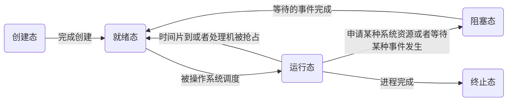
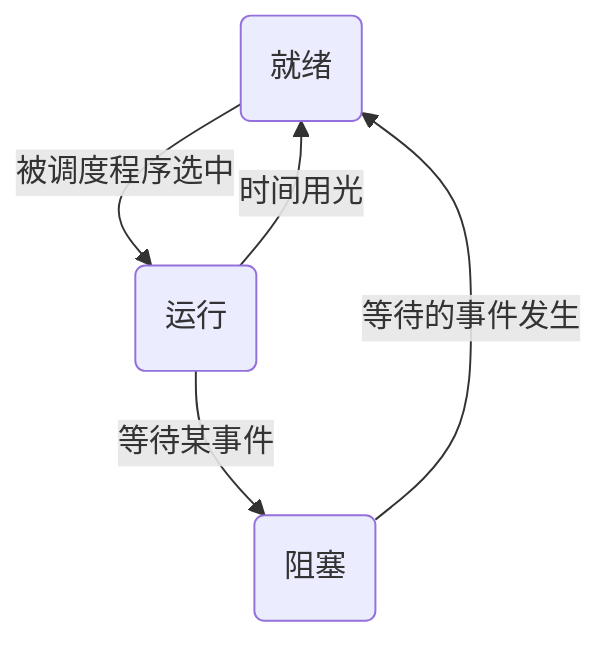

# 进程管理

现代操作系统的一个重要特性是程序的并发性与资源的共享性，为了满足多用户并发计算的要求，现代操作系统围绕进程这个概念进行设计和构造。

## 进程的定义

进程这个概念是为了描述系统中的并发活动而引入的。进程(process)，又叫做任务(task)，是操作系统中最基本、最重要的概念之一，它对于操作系统的理解、描述与设计都具有非常重要的意义。

对于进程还没有一个确切统一的描述，下面是几种简单的定义：

1. 进程是程序的一次执行过程。
2. 进程是程序在一个数据集合上顺序执行时发生的活动。它是系统进行资源分配和调度的一个独立单位。

书上给出了便于记忆的简单定义：**进程是可以和其他程序并行执行的程序关于某个数据集合的一次执行过程**。

简单来说，程序是静态的，是个存放在磁盘里的可执行文件，是一系列的指令集合。进程是动态的，是程序的一次执行过程。

区别于程序，进程有以下特征：

1. 进程是程序的一次执行过程，具有动态性；程序是完成某个特定功能的指令的有序序列，是一个静态的概念。进程是程序的一次执行过程，是临时的，有生命周期的；而程序可以作为一种长期储存的资源。**动态性是进程最基本的特征**。
2. 进程是系统进行资源分配和调度的一个独立单位，具有独立性。而同一个程序可以在同一时间被多个用户使用。资源分配时以进程为单位的，而不是以程序为单位的。
3. 一个进程可以与其他进程并发执行，具有并发性。
4. 进程具有结构性。为了描述进程，系统为每个进程创建了一个进程描述块。从结构上来看，一个进程包含了程序、数据和进程控制块。
5. 进程具有异步性。各进程按各自独立的、不可预知的速度向前推进，操作系统要提供进程同步机制来解决异步问题。

## 进程的描述

### 进程控制块

进程控制块(process control block)是进程存在的唯一标识，通常包含了：
1. 进程描述信息，如进程ID(PID, process ID)，进程所属用户ID(UID)。
2. 进程控制和管理信息，如进程的CPU使用时间、磁盘使用时间、网络流量使用情况等，此外还包含了进程当前的状态：就绪态/阻塞态/运行态等
3. 资源分配清单，如分配了多少内存、正在使用哪些IO设备，正在使用哪些文件。
4. 处理机相关信息，如PSW、PC等各种寄存器的值，用于实现进程的切换。

操作系统对进程进行管理工作所需的信息都存在PCB中。当进程被创建时，操作系统为其创建PCB，但进程结束时，操作系统回收其PCB。

### 进程实体的组成

一个进程实体(进程映像)由PCB、程序段、数据段组成。进程是动态的，但是进程实体时静态的。换句话说，进程实体是进程在执行某一时刻的状态。
1. 一个程序开始运行时，需要创建对应的进程，创建相应的PCB。
2. 运行前需要将程序放入内存中，在运行时从CPU从内存中取出指令执行。
3. 数据段中包含了运行过程中产生的各种数据，如变量等。

进程是进程实体的运行过程，是系统进行资源资源分配和调度的一个独立单位。

### 进程的状态

进程在生命周期内一直处于一个状态不断变化的过程中。为了刻画这种变化过程，操作系统将进程分为了若干状态，使用状态机来表述。这些状态信息记录在进程的 PCB 结构中。

一个进程的状态有以下几种：
1. 创建态：进程正在被创建时，它的状态是创建态，在这个阶段操作系统会为进程分配资源，初始化PCB。
2. 就绪态：进程创建完毕后，便进入了就绪态，处于就绪态的进程已经具备了运行条件，但是由于没有空闲的CPU，就暂时不能运行。
3. 运行态：当CPU空闲时，操作系统就会选择一个就绪进程，让它上处理机运行。
4. 阻塞态：在进程运行的过程中，可能会请求等待某个事件的发生(如等待某种系统资源的分配，或者等待其他进程的响应)。在这个事件发生之前，进程无法向下执行，这时操作系统会让这个进程下CPU，让其进入阻塞态，然后选择另一个就绪态的进程上CPU运行。
5. 终止态：一个进程可以请求exit的系统调用，请求操作系统终止该进程。此时一个进程进入终止态，操作系统会让该进程下CPU，并回收内存空间等资源，最后还要回收该进程的PCB。当终止进程的工作完成后，该进程就彻底消失了。


```mermaid
flowchart LR
A("创建态")-->|完成创建|B("就绪态")
B-->|被操作系统调度|C("运行态")
C-->|申请某种系统资源或者等待某种事件发生|D("阻塞态")
C-->|时间片到或者处理机被抢占|B
D-->|等待的事件完成|B
C-->|进程完成|E("终止态")
```

注意：不能直接从阻塞态直接转换为运行态，也不能直接从就绪态转为阻塞态。在进程的整个生命周期中，大部分时间都是处于就绪态、运行态、阻塞态三种状态。在单核CPU下，同一时刻只会有一个进程处于运行态，多核CPU情况下，可能有多个进程处于运行态。

在PCB中，会有一个变量state来表示进程的当前状态。为了便于管理，操作系统会将处于同一状态的进程组织起来。

### 进程的组织

为了便于进程的管理，通常对系统中的进程采用两种组织方式。

- 线性表组织方式：把所有进程的 PCB 存放在一个数组中，系统通过数组下标访问每一个 PCB。系统根据进程的状态，建立了多张索引表，并把索引表的内存首地址记录在内存中的一些专用单元中以完成索引。
- 链表组织方式：把具有相同状态的 PCB 组织成一个队列。
  - 处理就绪态的进程可按照某种策略排成多个就绪队列。
  - 处于阻塞态的进程又可以根据阻塞的原因组织成多个阻塞队列。

在单 CPU 系统中，任何时间都只有一个进程处于运行状态，因此系统专门设定了一个指针指向当前运行进程的 PCB。

## 进程控制

进程控制：是指系统使用一些具有特定功能的程序段来创建、撤销进程，以及完成进程各状态之间的转换。进程控制是由操作系统内核实现的，属于原语一级操作，不能被中断。

> 原语：是一种特殊的程序，它的执行具有原子性。也就是说，这段程序运行必须一气呵成，不能中断。进程控制需要使用原语的原因(需要一气呵成的原因)：如果不能一气呵成的执行，可能导致操作系统中的某些关键数据结构不统一的情况，如PCB中的进程状态与进程所处的队列不一致，这会影响操作系统进行别的管理工作，可能导致操作系统出错。
> 原语的原子性的实现：在计算机中，CPU每执行完一条指令后，会例行检查是否有中断信号。在进行原语之前，CPU先执行关中断指令，此时不再例行检查中断信号，在原语执行完毕后，再执行开中断指令。关中断与开中断指令为特权指令，只能由内核使用，而不能由用户使用。

### 创建原语

系统一般通过下面的步骤创建进程，创建原语使一个进程由创建态进入就绪态。

1. 扫描进程表，找到一个空闲的 PCB。
2. 为新进程的程序、数据、用户栈分配内存。
3. 初始化 PCB。把调用者提供的参数（进程名、进程优先级、实体所在主存的起始地址、所需的资源清单、记账信息及进程家族关系等）填入 PCB 中。
4. 将新的进程插入就绪队列。

下面是常见的引起创建原语的事件：

1. 用户登录：在分时系统中，用户登录成功，系统为其创建一个新进程
2. 作业调度：多道批处理系统中，有新的作业放入内存时，会为其创建一个新的进程
3. 提供服务：用户向操作系统提出某些请求时，会新建一个进程处理该请求
4. 应用请求：由用户进程主动请求创建一个子进程

### 撤销原语

如果一个进程已经完成任务或者由于故障不能继续运行时，应当被撤离系统而消亡。撤销原语的功能是在 PCB 集合中寻找要撤销的进程，若有子孙进程，也需要终止，以防称为不可控的；将其全部资源或者归还其父进程或者归还系统。撤销其 PCB。

撤销原语使一个进程由其他状态进入终止态，其过程为：

1. 从PCB集合中找到终止进程的PCB
2. 若进程正在运行，立即剥夺CPU，将CPU分配给其他进程
3. 终止其所有子进程
4. 将该进程拥有的所有资源归还给父进程或者操作系统
5. 删除PCB

### 阻塞原语

处于运行状态的进程，在其运行过程中期待某一事件发生，将会自己执行阻塞原语，由运行态变为阻塞态。（如等待键盘输入、等待磁盘数据传输完成）

阻塞原语的功能是中断 CPU，将其运行现场保存在其 PCB 中，置状态为阻塞态，插入相应事件的阻塞队列中。之后，由处理机调度，重选一个进程投入运行。其过程为：

1. 找到要阻塞的进程对应的PCB
2. 保护进程的运行现场，将PCB状态信息设置为阻塞态，暂时停止进程进行
3. 将PCB插入相应时间的等待队列

### 唤醒原语

当某进程等待的事件为 I/O 事件完成时，I/O 处理完成后，CPU 响应中断，在中断处理中，将等待 I/O 完成而阻塞的进程唤醒，并置于就绪态。

另一种情况，若等待的事件是某一进程发出信息，由发送进程将等待者唤醒，置为就绪态，并插入就绪队列。其过程为：

1. 在事件等待队列中找到PCB
2. 将PCB从等待队列移除，设置进程为就绪态
3. 将PCB插入就绪队列，等待被调度

### 挂起原语

- 在实时系统中，根据实时现场的需要，会将正在执行或者没有执行的进程挂起一段时间。被挂起的进程由活动状态转换为静止状态。
- 在分时系统中，将进程从内存换到外存中，进程就处于了进制状态，不被调度。

### 解挂原语

当挂起进程的原因被解除时，系统调用解挂原语将指定的进程解挂，使其由静止态变为活动态。当被解挂的进程变为活动就绪时，通常立即转进程调度。


## 进程通信

进程间通信 (Inter-Process Communication, IPC) 指两个进程之间产生数据交互。进程之间的通信必须有操作系统的支持。

进程是分配系统资源的单位，包括内存地址空间，因此各进程拥有的内存地址空间相互独立。为了保证安全，一个进程不能直接访问另一个进程的地址空间。因此需要操作系统的支持才能完成。

进程通信的方式包括共享存储、

### 共享存储

共享存储方式通过系统调用申请了一片共享内存区，使得通信的进程都可以访问共性存储区从而实现进程通信。

进程间如果通过共享存储的方式进行通信，那么进程间对于共享空间的访问是互斥的，一个进程访问共享空间时，其他进程不能访问。

共享存储有两种形式：
- 基于存储区的共享：操作系统在内存中划出一块共享存储区，数据的形式、存放位置都由通信进程控制，而不是操作系统。这种共享方式传输数据的速度非常快，是一种高级通信方式。
- 基于数据结构的共享：例如共享空间中只能放一个长度为 10 的数组，这种共享方式速度慢，限制多，是一种低级的通信方式。

### 消息传递

进程间的数据交换以**格式化的消息**（Message）为单位，进程通过操作系统提供的发送消息/接受消息两个原语进行数据交换。

发送的消息头包括发送进程的 ID、接受进程的 ID、消息长度等格式化信息，消息体包含需要发送的格式化信息。

消息传递分为两种方式：
- 直接通信方式：消息进程指明接受进程的 ID。在每个进程的 PCB 中包含了每个进程的消息队列，其中保存了其他进程发送给该进程的消息。需要发送消息的进程通过发送原语发送消息，操作系统内核将消息放入接收进程的消息队列；之后接受进程通过接收原语，操作系统通过
- 间接通信方式：通过“信箱”间接地通信，因此又称为信箱通信方式。发送进程通过发送原语将消息发送到指定的信箱，接受进程通过接收原语从指定的信箱接受消息。

### 管道通信

在管道通信中，可以从一端写入数据，从另一端读数据。这里管道是一个特殊的共享文件，又名 pipe 文件，该文件的本质是在内存中开辟了一个大小固定的内存缓冲区。

相比于共享内存的方式，管道通信只有一方可以写入文件，另一方读取文件。并且管道通信中，读取数据的顺序与写入数据的顺序必须按照内存的方向读取。即读写数据是先进先出的，管道相当于一个循环队列。

管道通信有下面的几个特点：
1. 管道只能采用半双工通信，某一时间段内只能实现单向的传输。如果要实现双向通信，则需要设置两个管道。
2. 各个进程要互斥地访问管道（由操作系统实现）。
3. 当管道写满时，写进程被阻塞，直到读进程将管道中的数据被取走，即可唤醒进程。
4. 当管道读空时，读进程被阻塞，直到写进程往管道中写入数据，即可唤醒读进程。
5. 管道数据中的数据一旦被读出，就彻底消失了。因此当多个进程读取同一个管道时，可能会错乱。对此，由两种解决方案：
	1. 一个管道允许多个写进程，一个读进程（以这个为准）。
	2. 允许多个写进程，多个读进程，但系统会让各个读进程轮流从管道中读数据（linux）。

## 线程

进程的引入使得程序间可以并发执行的，但是在进程内部只能串行的进行。但是在实际的应用中，一个进程可能需要同时进行事，即进程内部也存在并发执行的要求。

引入线程后，CPU 的基本服务对象转变为了线程，进程之间可以并发执行，同时进程内的线程也可以并发的执行，增加了操作系统的并发度。

线程，可以理解为轻量级线程，是调度的基本单位。引入线程机制后，为操作系统带来了如下的变化：
1. 资源分配、调度：传统进程机制中，进程是资源分配、调度的基本单位，但是在引入线程后，进程是资源分配的基本单位，线程是调度的基本单位。
2. 并发性：传统进程机制中，只能进程间并发。在引入线程后，各个线程间也能并发，提升了并发度。
3. 系统开销：传统进程间并发，需要切换进程的运行环境，系统开销很大。引入线程后，线程间的并发，如果是同一进程内的线程切换，则不需要切换进程环境，系统开销小，并发所带来的系统开销减小。

线程具有与进程类似的属性，但是也有自己的特点：
1. 线程是处理机调度的单位
2. 多 CPU 计算机中，各个线程可以占用不同的 CPU
3. 每个线程都有一个线程 ID、线程控制块（TCB）
4. 线程也有就绪、阻塞、运行三种基本状态
5. 线程几乎不拥有系统资源
6. 同一进程的不同线程间共享进程资源
7. 由于共享内存地址空间，同一进程的线程间通信无需系统干预
8. 同一进程中的线程切换不会引起进程切换
9. 不同进程中的线程切换会引起进程切换
10. 切换同进程内的线程，系统开销很小
11. 切换进程，系统开销很大

### 线程的实现方式

#### 用户级线程 (User-Level Thread, ULT)

早期的操作系统只支持进程，不支持线程。此时的线程是由线程库实现的。很多的编程语言提供了强大的线程库，可以实现线程的创建、调度、销毁的功能。用户级线程由以下特点：
- 用户级线程由引用程序通过线程库实现，所有的线程管理工作都应由应用程序负责（包括线程切换）。
- 用户级线程中，线程切换可以在用户态下完成，无需操作系统干涉。
- 在用户看来，程序是由多个线程的。但是操作系统内核看来，还是使用一个进程。

用户级线程的优缺点：
- 优点：用户级线程的切换在用户空间中即可完成，不需要切换到核心态，线程管理的系统开销小，效率高。
- 缺点：在用户级线程中，如果一个线程被阻塞，那么其他线程也将被阻塞，并发度不高，多个线程不可在多核处理机上并行运行。

在用户级线程中，进程仍然时调度的基本单位，线程间不能并行的进行。

#### 内核级线程 (Kernel-Level Thread, KLT)

大多数的现代操作系统都实现了内核级线程。内核级线程由以下特点：
1. 内核级线程的管理工作由操作系统内核完成。
2. 线程调度、切换等操作都由内核负责，因此内核级线程的切换必然在核心态才能完成。
3. 操作系统会为每个内核级线程建立相应的 TCB (Thread Control Block)，通过 TCB 对线程进行管理。

内核级线程的优缺点：
- 优点：当一个线程被阻塞后，别的线程还可以继续执行，并发能力强。多线程可以在多核处理机上并发执行。
- 缺点：一个用户进程会占用多个内核级线程，线程的切换由操作系统内核完成，需要切换到核心态，因此线程管理的成本较高，开销大。

### 多线程模型

在支持内核级线程的系统中，根据用户级线程和内核级线程的映射关系，可以划分为几种多线程模型。

- 一对一模型：一个用户级线程映射到一个内核级线程，每个用户进程有与用户级线程同数量的内核级线程。
	- 优点：当一个线程被阻塞后，别的线程还可以继续执行，并发能力强。多线程可以在多核处理机上并行执行。
	- 缺点：一个用户进程会占用多个内核级线程，线程的切换由操作系统内核完成，需要切换到核心态，因此线程的管理成本高，开销大。
 - 多对一模型：多个用户线程映射到一个内核级线程，且一个进程只被分配一个内核级线程。这种方式相当于退化到了普通的用户级线程。
 - 多对多模型：n 个用户级线程映射到 m 个内核级线程 (n $\geqslant$ m)，每个用户进程对应 m 个内核级线程。
	 - 克服了多对一模型并发度不高的缺点 (一个阻塞全部阻塞)，又克服了一对一模型中一个用户进程占用太多内核级线程，开销太大的缺点。

需要注意的是：内核级线程才是处理机分配的单位。内核级线程中可以运行任意一个由映射关系的用户级线程代码，只有两个内核级线程中正在运行的代码都阻塞时，整个进程才阻塞。

### 线程的状态与转换

线程的状态与转换方式和进程基本相同：

```mermaid
graph
A("就绪")-->|"被调度程序选中"|B("运行")
B-->|"时间用光"|A
B-->|"等待某事件"|C("阻塞")
C-->|"等待的事件发生"|A
```
### 线程的组织与控制

线程的组织方式与进程相似。系统会为每个线程建立一个线程控制块 (TCB)，每个线程控制块包含：
1. 线程标识符：TID，与 PID 相似
2. 程序计数器 PC：线程目前执行到哪里
3. 其他寄存器：线程运行的中间结果
4. 堆栈指针：堆栈保存函数调用信息，局部变量等
5. 线程运行状态：运行/就绪/阻塞
6. 优先级：线程调度、资源分配的参考

同时使用线程表将多个 TCB 组织在一起。

## 处理机调度

系统中的用户进程数远远超过处理机数，这么多的进程竞争处理机，就需要操作系统采用一些策略，将处理机动态的分配给系统中的各个就绪进程。分配资源的过程就是调度。

### 调度的三个层次

- 高级调度 (作业调度)：按照一定的元组从外存的作业后备队列中挑选一个作业存入内存，并创建进程。每个作业只调入一次，调出一次。作业调入时建立 PCB，调出时才撤销 PCB。高级调度将进程从无->创建态->就绪态。
- 低级调度 (进程调度/处理机调度)：按照某种策略从就绪队列中选取一个进程，将处理机分配给它。**进程调度时操作系统中最基本的一种调度**，进程调度的频率很高，一般几十毫秒一次。低级调度将进程从就绪态->运行态。
- 中级调度 (内存调度)：按照某种策略决定将哪个处于挂起状态的进程重新调入内存中。**内存不够时，可将某些进程的数据调出外存，等内存空闲或者进程需要运行时再重新调入内存。暂时调到外存等待的进程称为挂起状态，被挂起的进程 PCB 会被组织成挂起队列**。中级调度发生的频率要高于高级调度。中级调度将进程从挂起态->就绪态或者从阻塞挂起->阻塞态。

> 挂起状态：暂时调到外存等待的进程状态为挂起状态，挂起态又可以进一步分为就绪挂起、阻塞挂起两种状态。将挂起状态加入状态表中，得到七状态模型：
 ```mermaid
graph
Cr(创建态)-->A(就绪态)-->B(运行态)-->终止态
B-->A
B-->C(阻塞态)-->A
E(阻塞挂起)
Cr-->D(就绪挂起)-->|激活|A
A-->|挂起|D
B-->D
C-->|挂起|E-->|激活|C
E-->|事件出现|D
```

### 进程调度

进程调度 (低级调度) 是按照某种算法从就绪队列中选择一个进程为其分配处理机。一般而言，在下面的情况会发生进程调度：
- 当前运行进程**主动放弃**处理机
	- 进程正常终止
	- 运行过程中发生异常终止
	- 进程主动请求阻塞
- 当前运行进程**被动放弃**处理机
	- 分给进程的时间片用完
	- 有更加紧急的事需要处理
	- 有更高优先级的进程进入就绪队列

下面几种情况下不能进行进程调度与切换：
1. 在处理中断中。中断处理过程复杂，与硬件密切相关，很难做到在中断处理过程中进行进程切换。
2. 进程在操作系统内核程序临界区中。
3. 在原子操作过程中 (原语)。原子操作不可中断。

> 临界资源：一个时间段内只允许一个进程使用的资源，各进程需要互斥地访问临界资源。
> 临界区：访问临界资源的那段代码。
> 内核程序临界区：一般是用来访问某种内核数据结构的，比如进程的就绪队列。内核程序临界区访问的临界资源如果不尽快释放的话，极有可能影响到操作系统内核的其他管理工作。

进程调度方式分为非剥夺调度方式与剥夺调度方式。
- 非剥夺调度方式，又称为非抢占式调度方式，只允许进程主动放弃处理机。在运行过程中即便有更加紧迫的任务到达，当前进程依然会继续使用处理机，直到该进程终止或者主动要求进入阻塞态。
	- 实现简单，系统开销资源小但是无法及时处理紧急任务，适合于早期的批处理系统。
- 剥夺调度方式，又称为抢占方式。当一个进程正在处理机上执行时，如果有一个更重要或者更紧迫的进程需要使用处理机，则立即暂停正在执行的进程，将处理机分配给更重要更紧迫的那个进程。
	- 可以优先处理更紧急的进程，也可以实现让各进程按时间片轮流执行的功能。适合与分式操作系统，实时操作系统。

> 广义的进程调度包含了选择一个进程和进程切换两个步骤，其中：
> - **狭义的进程调度**：指从就绪队列中选中一个要运行的进程。
> - **进程切换**：指一个进程让出处理机，由另一个进程占用处理机的过程。进程切换主要完成了：
> 	1. 对原来运行进程的各种数据的保存：将数据保存到 PCB 中
> 	2. 对新的进程各种数据的恢复：将相应的数据存放到寄存器中
>
> 进程的切换是由代价的，因此如果过于频繁的进程进程调度、切换，必然会使整个系统的效率降低，使系统的大部分时间都花在进程切换上，而真正用于执行进程的时间减少。

### 调度程序 (scheduler)

调度程序是用于调度的程序。调用调度程序意味着进行一次调度。通常，在创建新进程、进程退出、运行进程阻塞、IO 中断等时候回触发调度程序。此外：
- 非抢占式调度策略，只有运行进程阻塞或者退出时才出发调度程序工作。
- 抢占式调度策略，每个时钟中断或 k 个时钟中断会出发调度程序工作。

在不支持内核级线程的操作系统中，调度程序的处理对象是进程。在支持内核级线程的操作系统中，调度程序的处理对象是线程。

> 调度程序在没有其他就绪进程时，将会运行闲逛进程 (idle)，闲逛进程的特点是
> - 优先级最低
> - 可以是 0 地址指令，占一个完整的指令周期
> - 能耗低

### 调度算法的评价指标

#### CPU 利用率

由于早期的 CPU 造价昂贵，因此人们希望 CPU 尽量多的工作。CPU 利用率表示 CPU 忙碌的时间占总的时间的比例。
$$
\tiny 利用率=\frac{忙碌的时间}{总时间}
$$
上式不仅可以算 CPU 的利用率，也可以计算其他设备的利用率。

#### 系统吞吐量

对于计算机来说，希望能用尽可能少的时间处理完尽可能多的作业。系统吞吐量表示单位时间内完成作业的数量。
$$
\tiny 系统吞吐量=\frac{总共完成了多少道作业}{总共花了多少时间}
$$

#### 周转时间

对于计算机的用户来说，一般很关心自己的作业从提交到完成总共花了多少时间。周转时间指作业被提交给系统来时，到作业完成为止的这段时间间隔。
$$
\tiny 周转时间=作业完成时间-作业提交时间
$$
此外，我们更加关心系统的整体表现，因此常用平均周转时间
$$
\tiny 平均周转时间=\frac{各作业周转时间之和}{作业数}
$$
上面的指标没有考虑作业的实际运行时间，因此提出了带权周转时间
$$
\tiny 带权周转时间=\frac{作业周转时间}{作业时间运行时间}=\frac{作业完成时间-作业提交时间}{作业实际运行时间}
$$
相应的，系统整体的指标使用
$$
\tiny 平均带权周转时间=\frac{各作业带权周转时间之和}{作业数}
$$

#### 等待时间

计算机的用户希望自己的作业尽可能少的等待处理机。等待时间指进程/作业处于等待处理机状态时间之和。

对于进程来说，等待之间指进程建立后等待被服务的时间之和，在等待 IO 设备的时间不计入等待时间。

对于作业的等待时间，还需要加上作业在外存后备队列中等待的时间。

相应的，使用平均等待时间作为系统的整体指标。

#### 相应时间

响应时间指从用户提交到首次产生响应所用的时间。

### 调度算法

#### 先来先服务 (FCFS)

#### 短作业有限 (SJF)

#### 高响应比有限 (HRRN)