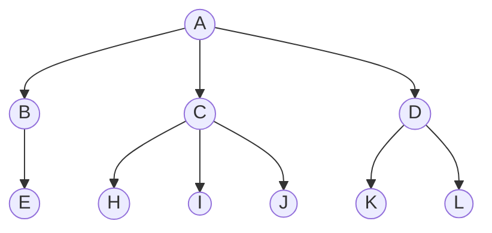
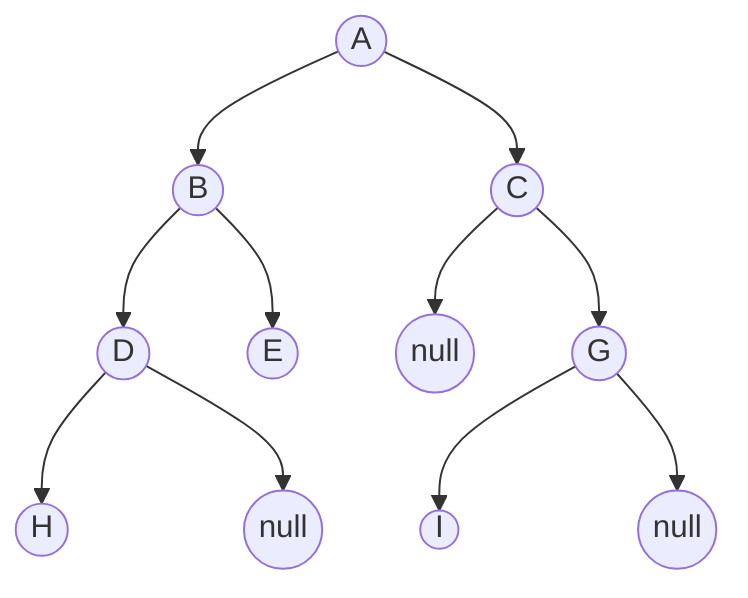

---
tags:
  - 数据结构与算法
cssclasses:
  - mermaid-circle
---

# 树与二叉树



树是 $n(n\geqslant)$ 个结点的有限集，当 $n=0$ 时，称为空树。在任意一棵非空树中应满足：
1. 有且仅有一个特定的称为根的结点。
2. 当 $n>1$ 时，其余结点可分为 $m(m>0)$ 个互不相交的有限集 $T_{1},T_{2},\cdots,T_{m}$，其中每个集合本身又是一棵树，并且称为根的子树。

显然，树的定义是递归的，即在树的定义中又用到了其自身。**树是一种递归的数据结构**。树作为逻辑结构，同时也是一种分层结构，具有以下两个特点：
1. 树的根结点没有前驱。除根结点以外的结点只有一个前驱。
2. 树中所有结点都可以由零个或多个后继。

树适用于表示具有层次结构的数据。树中的某个结点最多和上一层的一个结点有直接关系。

> [!note] 关于树的基本术语
> 1. 祖先、子孙、双亲、孩子、兄弟和堂兄弟 (考虑结点 K)：
> 	- 祖先：从根结点 A 到结点 K 的唯一路径上的其他结点。
> 	- 子孙：以 K 为根结点的子树中的所有结点 (不包括 K)。
> 	- 双亲：K 结点的父结点。
> 	- 孩子：与 K 结点直接相连的子结点。
> 	- 堂兄弟：双亲在同一层的结点互为堂兄弟。
> 2. 结点的度和数的度：
> 	- 结点的度：结点的孩子的个数
> 	- 树的度：树中结点的最大度数
> 3. 分支结点和叶结点：
> 	- 分支结点：度大于 0 的结点 (有孩子的结点，又称为非终端结点)
> 	- 叶结点：度为 0 的结点(没有孩子的结点，又称为终端结点)
> 4. 结点的深度、高度和层次：
> 	- 结点的层次：从树根开始定义，根结点为第 1 层，它的孩子结点为第二层，以此类推。
> 	- 结点的深度：结点所在的层次。
> 	- 树的高度 (深度)：结点中的最大层次
> 	- 结点的高度：以该结点为根结点的子树的高度
> 5. 有序树和无序树：
> 	- 有序树：树中从左到右的结点是有顺序的，不能互换 (列表 list)
> 	- 无序树：树中的孩子结点没有顺序，可以互换 (集合 set)
> 6. 路径和路径长度：
> 	- 路径：树中两个结点之间经过的结点序列
> 	- 路径长度：路径经过的边的数量
> 7. 森林：森林是 $m(m\geqslant)$ 棵互不相交的数的集合。森林的概念与数的概念十分接近，只要把树的根结点去掉就成了森林。反之，只要给 $m$ 个根结点加上一个父结点，森林就变成了树。

## 树的性质

树具有如下最基本的性质：
1. 树的结点数 $n$ 等于所有结点的度数之和加 1。
2. 度为 $m$ 的树中第 $i$ 层上至多有 $m^{i-1}$ 个结点 $(i\geqslant 1)$。
3. 高度为 $h$ 的 $m$ 叉树至多有 $(m^{h}-1)/(m-1)$ 个结点。
4. 度为 $m$、具有 $n$ 个结点的树最小高度 $h$ 为 $\left[ \log_{m}(n(m-1)+1) \right]$。
5. 度为 $m$、具有 $n$ 个结点的树的最大高度 $h$ 为 $n-m+1$。

## 二叉树



二叉树是一种特殊的树型结构，其特点是每个结点至多只有两棵子树，并且二叉树有左右子树之分，其次序不能颠倒。

> [!note] 二叉树与度为 2 的有序树的区别
> 1. 度为 2 的有序树至少有 3 个结点，而二叉树可以为空
> 2. 度为 2 的有序树的孩子的左右次序是相对于另一个孩子而言的，若某个结点只有一个孩子，则这个孩子无需区分左右。但是二叉树必须确定其孩子的左右次序。

> [!example] 几种特殊的二叉树
> 1. 满二叉树。一棵高度为 $h$，且有 $2^h-1$ 个结点的二叉树称为满二叉树，即二叉树中的每一层都还有最多的结点。满二叉树的结点都集中在二叉树的最下层，并且除了叶结点之外，度都为 2。
> 	- 可以对满二叉树按层编号，约定编号从根结点 (1) 起，自上而下，自左向右。这样，每个结点对应一个编号，对于编号为 $i$ 的结点，若有双亲，则双亲的编号为 $\lfloor \dfrac{i}{2} \rfloor$，若有左孩子，则左孩子为 $2i$；若有右孩子，则右孩子为 $2i+1$
> 2. 完全二叉树。高度为 $h$，有 $n$ 个结点的二叉树，当且仅当其每个结点都与高度相同的满二叉树中编号为 $1\to n$ 的结点一一对应时，称为完全二叉树。
> 	- 若 $i\leqslant \lfloor \dfrac{n}{2} \rfloor$，则结点 $i$ 为分支结点，否则为叶结点。
> 	- 叶结点只可能在层次最大的两层上出现。对于最大层次中的叶结点，都依次排列在该层最左边的位置上。
> 	- 若有度为 1 的结点，最多只能有一个，且该结点只有左孩子而无右孩子。
> 	- 按层编号后，一旦出现某个结点 (编号为 i) 为叶结点或者之后左孩子，则编号大于 $i$ 的结点均为叶结点
> 	- 若 $n$ 为奇数，则每个分支结点都有左孩子和右孩子。若 $n$ 为偶数，则编号最大的分支结点 $\dfrac{n}{2}$ 只有左孩子而没有右孩子，其余分支结点左右孩子都有。
> 3. 二叉排序树。左子树上所有结点的关键字均小于根结点的关键字，右子树上所有结点的关键字均大于根结点的关键字。左子树和右子树又各是一棵二叉排序树。
> 4. 平衡二叉树。树中任意一个结点的左子树和右子树的高度之差的绝对值不超过 1。
> 5. 正则二叉树。树中每个分支结点都有 2 个孩子，即树中只有度为 0 或 2 的结点。

> [!note] 二叉树的性质
> 1. **非空二叉树上的叶结点数等于度为 2 的结点数加 1**，即 $n_{0}=n_{2}+1$。
> 2. 非空二叉树的第 $k$ 层最多右 $2^{k-1}$ 个结点 ($k\geqslant 1$)。
> 3. 高度为 $h$ 的二叉树至多有 $2^{h}-1$ 个结点 ($k\geqslant 1$)。
> 4. 对完全二叉树从上到下、从左到右顺序依次编号 $1,2,\cdots,n$，则有以下关系
> 	- 若 $i\leqslant \lfloor \dfrac{n}{2} \rfloor$，则结点 $i$ 为分支结点，否则为叶结点，即最后一个分支结点的编号为 $\lfloor \dfrac{n}{2} \rfloor$。
> 	- 叶结点只可能在层次最大的两层上出现。
> 	- 若有度为 1 的结点，则只可能有一个，且该结点有左孩子而无右孩子，其编号为 $\lfloor \dfrac{n}{2} \rfloor$。
> 	- 按层序编号后，一旦出现某结点(如结点 $i$)为叶结点或只有左孩子的情况，则编号大于 $i$ 的结点均为叶结点。
> 	- 若 $n$ 为奇数，则每个分支结点都有左、右孩子；若 $n$ 为偶数，则编号最大的分支结点只有左孩子，没有右孩子。其余分支结点都有左右孩子。
> 	- 当 $i>1$ 时，结点 $i$ 的双亲结点的编号为 $\lfloor \dfrac{i}{2} \rfloor$。
> 	- 结点 $i$ 所在的层次 (深度) 为 $\lfloor \log_{2}i \rfloor+1$。
> 5. 具有 $n$ 个结点的完全二叉树的高度为 $\lceil \log_{2}(n+1) \rceil$ 或 $\lfloor \log_{2}n \rfloor+1$。

### 二叉树的存储结构

> [!note] 树的顺序存储结构
> 二叉树的顺序存储结构是指用一组连续的存储单元依次自上而下、自左而右存储完全二叉树上的结点元素，即将完全二叉树编号为 $i$ 的元素存储到 $i-1$ 个分量上。
>
> 根据二叉树的性质，完全二叉树和满二叉树采用顺序存储比较合适，树中结点的编号可以唯一地反映结点之间的逻辑关系。这样既能最大的节省存储空间，又能利用数组元素的下标值确定结点在二叉树的位置，以及结点之间的关系。
>
> 但是对于一般的二叉树，使用顺序存储结构会导致数组中大量的元素为空，最坏的情况下，一个高度为 $h$ 的单结点二叉树需要占据 $2^{h}-1$ 个存储单元。

二叉树一般采用链式存储结构，用链表结点来存储二叉树中的每个结点。在二叉树中，结点结构包含数据域、指针域。
```cpp
typedef struct BiTNode{
	ElemType data;
	struct BiTNode *lchild, *rchild;
	// 对于需要频繁访问父节点的场景，添加指向父节点的指针可以极大的提高效率
	// struct BiTNode *parent; 
}BiTNode, *BiTree;
```
容易验证，在含有 $n$ 个结点的二叉链表中，含有 $n+1$ 个空链域。利用这些空链域，可以组成**线索链表**。

### 二叉树的遍历

二叉树的遍历指按某种搜索路径访问树中的每个结点，使得每个结点被访问一次，而且只访问一次。二叉树的遍历算法一般使用递归实现，根据递归调用的先后顺序，可以分为前序遍历、中序遍历、后序遍历三种顺序。

#### 先序遍历

按照下面的顺序访问二叉树：
1. 访问根结点
2. 先序遍历左子树
3. 先序遍历右子树

```cpp
void PreOrder(BiTree T){
	if(T!=NULL){
		visit(T); // 在继续遍历之前，先访问该结点的数据
		PreOrder(T->lchild);
		PreOrder(T->cchild);
	}
}
```

#### 中序遍历

按照下面的顺序访问二叉树：
1. 中序遍历左子树
2. 访问根结点
3. 中序遍历右子树

```cpp
void InOrder(BiTree T){
	if (T!=NULL){
		InOrder(T->lchild);
		visit(T); // 先遍历左子树，然后在访问根结点
		InOrder(T->rchild);
	}
}
```

#### 后序遍历

按照下面的顺序访问二叉树：
1. 后序遍历左子树
2. 后序遍历右子树
3. 访问根结点

```cpp
void PostOrder(BiTree T){
	if(T != NULL){
		PostOrder(T->lchild);
		PostOrder(T->rchild);
		visit(T);
	}
}
```

> [!note]
> 在二叉树的三种遍历方法，遍历左右子树的顺序都是相同的，差别只在于访问根结点的顺序。不管采用什么遍历方法，每个结点都只访问一次，因此时间复杂度为 $O(n)$。在递归遍历中，递归工作栈的栈深度恰好为树的深度，因此在最坏的情况下，$n$ 个结点的二叉树的空间复杂度为 $O(n)$。

#### 转换为非递归算法

上面介绍的算法非常直观的展示了不同二叉树遍历的区别，但是使用递归的实现方式对资源的消耗较大，这里介绍非递归的实现方式。

```cpp
void PreOrder(BiTree T){
	Stack S;
	BiTree p = T;
	while( p || !S.empty() ){
		if(p){
			visit(p);
			S.push(p);
			p = p->lchild;
		}else{
			p = S.pop();
			p = p->rchild;
		}
	}
}

void InOrder(BiTree T){
	Stack S;
	BiTree p = T;
	while( p || !S.empty() ){
		if(p){
			S.push(p);
			p = p->lchild;
		}else{
			p = S.pop();
			visit(p);
			p = p->rchild;
		}
	}
}

void PostOrder(BiTree T){
	Stack S;
	BiTree p = T;
	while( p || !S.empty() ){
		if(p){
			S.push(p);
		}else{
			p = S.top();
			if( p->rchild && p->rchild != r )
				p = p->rchild;
			else{
				pop(S, p);
				visit(p);
				r = p;
				p = NULL;
			}
		}
	}
}
```

#### 层次遍历

层次遍历即按层遍历，按照完全二叉树的排序的方向遍历二叉树。我们可以借助队列先进先出的特性，先遍历父节点，再遍历子节点。
```cpp
void LevelOrder(BiTree T){
	Queue Q;
	Q.enQueue(T);
	while( !Q.empty() ){
		BiTree p = Q.deQueue();
		visit(p);
		if(p->lchild) Q.enQueue(p->lchild);
		if(p->rchild) Q.enQueue(p->rchild);
	}
}
```

> [!note] 由遍历序列构造二叉树
> 对于一个给定的二叉树，其先序遍历、中序遍历、后序遍历和层次遍历的顺序都是确定的。
> - 只给出四种顺序中的任意一种，无法确定二叉树的结构
> - **给出中序遍历序列和其他的任何一种，可以唯一确定一棵二叉树**

### 线索二叉树

遍历二叉树是以一定的顺序将二叉树中的结点排列为一个线性序列，从而得到几种遍历序列，使得该序列中的每个结点 (第一个和最后一个结点除外) 都有一个直接前驱和一个直接后驱。

传统二叉链表存储只能体现一种父子关系，不能直接得到结点在遍历中的前驱或者后驱。在含 $n$ 个结点的二叉树中，有 $n+1$ 个指针。线索二叉树通过利用这些空指针来存放指向其前驱与后继结点的指针，来加快查找结点前驱和后继的速度。

> [!note]- 含有 $n$ 个结点的二叉树中，有 $n+1$ 个指针
> 这是因为每个叶节点都有 2 个空指针，每个度为 1 的结点有一个空指针，空指针的总数为 $2n_{0}+n_{1}$，又有 $n_{0}=n_{2}+1$，所以空指针的总数为 $n_{0}+n_{1}+n_{2}+1=n+1$。

> [!definition|规定] 若无左子树，令`lchild`指向其前驱结点；若无右子树，令`rchild`指向其后继结点。增加两个标志域`ltag`和`rtag`，表示指针域指向的是左右孩子还是前驱后继。

> [!note] 标志域的含义如下：
> - `ltag`:
> 	- 0: `lchild`域指示结点的左孩子
> 	- 1: `lchild`域指示结点的前驱
> - `rtag`:
> 	- 0: `rchild`域指示结点的右孩子
> 	- 1: `lchild`域指示结点的后继

```cpp
typedef struct ThreadNode{
	ElemType data;
	struct ThreadNode *lchild, *rchild;
	int ltag, rtag;
}ThreadNode, *ThreadTree;
```

这种结点构成的二叉链表作为二叉树的存储结构，称为**线索链表**，其中指向结点前驱和后继的指针称为**线索**。加上线索的二叉树称为**线索二叉树**。

#### 线索二叉树的构造

在现有的二叉树上构造线索的过程实际上就是遍历一次二叉树，然后根据遍历的顺序为值为空的左右孩子指针分配值。这里给出中序线索二叉树的构造算法。
```cpp
void InThread(ThreadTree &p, ThreadTree &pre){
	if(p != NULl){
		InThread(p->lchild, pre);

		// 这里原来是visit
		if(p->lchild == NULl){
			p->lchild = pre;
			p->ltag = 1;
		}
		if(pre != NULL && pre->rchild==NULL){
			pre->rchild = p;
			pre->rtag = 1;
		}
		pre = p;

		InThread(p->rchild, pre);
	}
}
void CreateInThread(ThreadTree T){
	ThreadTree pre = NULL;
	if(T != NULL){
		InThread(T, pre);
		// 遍历完毕，处理最后一个结点
		pre->rchild = NULL;
		pre->rtag = 1;
	}
}
```

> [!warning]
> 前序线索二叉树的构造过程中，由于在修改`lchild`后才调用`PreThread(p->lchild, pre)`，如果在修改`lchild`为前置结点后再调用该语句，就会出现死循环的情况。解决这种情况的方法是在调用该语句前判断`ltag`是否为`false`，只有在`lchild`原本不为空时才进行遍历。

#### 线索二叉树的遍历

线索二叉树的结点隐含了线索二叉树的前驱和后继信息。在对其进行遍历时，只要先找到序列中的第一个结点，然后一次找结点的后继，直至其后继为空。

以中序线索二叉树为例，其遍历顺序为：
- 若一个叶子结点的后继标志为 1，则右链为线索，指示其后继
- 若一个叶子结点的后继标志为 0，遍历右子树中第一个访问的结点为其后继。

不含头结点的线索二叉树的遍历算法如下：
```cpp
TreadNode *FirstNode(ThreadNode* p){
	while(p->ltag==0) p=p->lchild;
	return p;
}
ThreadNode *NextNode(ThreadNode* p){
	if(p->rtag==0) return FirstNode(p->rchild);
	else return p->rchild;
}
void Inorder(ThreadNode *T){
	for(ThreadNode* p=FirstNode(T); p != NULL; p=NextNode(p)){
		visit(p);
	}
}
```

> [!todo] 后序线索二叉树的遍历
> 后续线索二叉树的遍历需要用到父母结点的信息，因此需要使用三叉链表实现。

## 树

树的存储方式有多种，既可以采取顺序存储结构，又可以采取链式存储结构。这里介绍 3 中常用的存储结构。

> [!title|双亲表示法] 采用一组连续空间存储每个结点，同时在每个结点中增设一个伪指针，指示其在双亲结点在数组中的位置。
```cpp
#define MAX_TREE_SIZE 100
typedef struct{
	ElemType data;
	int parent;
}PTNode;
typedef struct{
	PTNode nodes[MAX_TREE_SIZE];
	int n;
}PTree;
```
双亲表示法利用了每个结点只有唯一双亲的性质，可以很快的得到每个结点的双亲结点，但是求结点的孩子时需要遍历整个结构。

> [!title|孩子表示法] 孩子表示法是将每个结点视为一个线性表，且以单链表作为存储结构，则 $n$ 个结点就有 $n$ 个孩子链表。而 $n$ 个头指针又组成了一个线性表，便于查找。

> [!note]
> 1. 孩子表示法实现的树结构，相当于可以嵌套的链表结构，即 python 中的 `list`
> 2. 与双亲表示法相反，孩子表示法寻找孩子的操作非常方便，而寻找双亲的操作则需要遍历 $n$ 个孩子链表中的 $n$ 个指向下一级孩子链表的指针。

> [!title|孩子兄弟表示法] 孩子兄弟表示法又称为二叉树表示法，即使用二叉树作为树的存储结构。每个结点包含三个部分：结点值，指向结点第一个孩子结点的指针，以及指向结点下一个兄弟结点的指针。
```cpp
typedef struct CSNode{
	ElemType data;
	struct CSNode *firstchild, *nextsibling;
}CSNode, *CSTree;
```
> [!note] 孩子兄弟表示法的特点
> 1. 可以方便的实现树转换为二叉树的操作
> 2. 易于查找孩子的结点
> 3. 查找双亲结点比较麻烦，但是可以增加`parent`结点，使得查找父节点也方便

### 树与二叉树的转换

二叉树和树都可以用二叉链表作为存储结构。从孩子兄弟表示法可以看出，可以用同一存储结构的不同解释将一棵树转换为二叉树。

#### 树转换为二叉树

规则：每个结点的左指针指向它的第一个孩子，右指针指向它在树中的相邻右兄弟。

> [!note]
> - 这个规则又称**左孩子右兄弟**。
> - 由于根结点没有兄弟，因此树转换为的二叉树没有右子树。

> [!example] 一个简单方法
> 1. 在兄弟结点之间加一条线。
> 2. 对每个结点，只保留它与第一个孩子的连线，与其他孩子的连线全部抹掉。
> 3. 以树根为轴心，顺时针旋转 45°。

#### 森林转换为二叉树

将森林转换为二叉树的规则与树类似。先将森林的每棵树转换为二叉树，由于每个树的右子树必是空，因此把森林的树根按照顺序连接到前一个树根上成为右子树。

> [!example] 一个简单方法
> 1. 将森林中的每棵树转换为对应的二叉树。
> 2. 每棵树的根也可视为兄弟关系，在每棵树的根之间加一根连线。
> 3. 以第一棵树的根为轴心顺时针旋转 45°。

#### 二叉树转换为森林

规则：若二叉树非空，则二叉树的根及其左子树为第一棵树的二叉树形式，所以将根的右链断开。接着，递归的对右子树构成的新二叉树做同样的操作，直到最后一棵没有右子树的二叉树为止。然后对所有的二叉树做还原操作。

> [!warning]
> 二叉树转换为树或者森林是唯一的。

### 树和森林的遍历

树的遍历是指用某种方式访问树中的每个结点，且仅访问一次。
1. 先根遍历 (先序遍历) 。若树非空，则递归的进行：
	1. 先访问根节点
	2. 再依次访问根节点的每棵子树 (递归操作)
2. 后根遍历 (中序遍历或者后序遍历) 。若树非空，则递归的进行：
	1. 先依次遍历根节点的每棵子树 (递归操作)
	2. 再访问根节点
3. 层次遍历。

> [!note]
> 森林的遍历与树的遍历完全相同，本质上就是按顺序遍历森林中的每棵树。

## 树与二叉树的应用

### 哈夫曼树与哈夫曼编码

#### 哈夫曼树

哈夫曼树涉及了树中的一些定义。
1. 路径：从树中一个结点到另一个结点的分支
2. 路径长度：路径上的分支数目
3. 权：为树中结点赋予的一个权值，一般使用树中存储的数据的值
4. 带权路径长度：从树的根到一个结点的路径长度与该结点上权值的乘积
5. 树的带权路径长度：树中所有叶节点的带权路径长度之和，记为 $\text{WPL}=\sum_{i=1}^nw_{i}l_{i}$，其中 $w_{i}$ 是第 $i$ 个结点所带的权值，$l_{i}$ 是该叶节点到根节点的路径长度

> [!definition|哈夫曼树] 在含有 $n$ 个带权叶结点的二叉树中，其中带权路径长度 $\text{WPL}$ 最小的二叉树称为哈夫曼树，也称最优二叉树。

> [!note] 哈夫曼树的构造算法
> 给定 $n$ 个权值为 $w_{1},w_{2},\cdots,w_{n}$ 的结点，构造哈夫曼树的算法描述如下：
> 1. 初始化这 $n$ 个结点为 $n$ 棵深度为 1 的二叉树，构成森林 $F$
> 2. 构造一个新结点，从 $F$ 中选取两个根节点权值最小的树作为新结点的左右子树，并将新结点的权值设置为左右子树之和
> 3. 从 $F$ 中删除刚才选出的两个树，将他们合成的新树加入 $F$ 中
> 4. 重复 2 和 3 直到最后只剩下一棵树为止

> [!example] 哈夫曼树的性质
> 从哈夫曼树的构造过程中可以看出哈夫曼树具有以下特点：
> 1. 每个初始化结点最终都将成为叶结点，且权值越小的结点到根节点的路径长度越大
> 2. 构造过程中一共新建了 $n-1$ 个结点，因此哈夫曼树的结点总数为 $2n-1$
> 3. 每次构造都选择两棵树作为新节点的孩子，因此哈夫曼树中不存在度为 1 的结点

#### 哈夫曼编码

哈夫曼编码是一种压缩算法，根据数据的字符的出现次数，将其编码为可变长度编码。其次，哈夫曼编码得到的码表是前缀编码，给定一个文本的哈夫曼编码和其对应的码表，可以翻译出唯一的结果。

> [!note]
> - 固定长度编码：每个字符使用相等长度的二进制位表示
> - 可变长度编码：对不同的字符使用不等长的二进制位表示
> - 前缀编码：没有一个编码是其他编码的前缀

我们可以将字符的出现次数作为结点的权值，构造哈夫曼树，从树中获得前缀码：
- 节点左孩子标为0，右孩子标为1，则从根节点到每个叶子节点的路径即为该叶子节点对应的前缀码

> [!note]
> 利用哈夫曼树可以设计出总长度最短的二进制前缀码。由于对于左右分支编码为 0 还是 1 没有要求，因此构造出的哈夫曼树并不唯一，但是各个哈夫曼树的 $\text{WPL}$ 一定是相同且最优的。
>
> 此外，如果有若干权值相同的结点，则构造出的哈夫曼树也不唯一。

> [!tip] 压缩算法
> 哈夫曼编码是一种效率较高的无损压缩算法，通过将高频字符编码短，低频字符编码长，哈夫曼编码能够在一定程度上逼近信息的编码长度，与信息熵的理论值接近。但是由于哈夫曼编码是从频数上进行计算的，因此无法达到理论值。**算术编码**通过将信息压缩到一个实数，可以实现更加充分的压缩。

### 并查集

并查集是一种简单的集合表示，它支持以下 3 种操作：
1. `Initial(S)`：将集合 $S$ 中的每个元素都初始化为只有单一元素的子集合。
2. `Union(S, Root1, Root2)`：把集合 $S$ 中的子集合 `Root2` 并入 `Root1`，要求 `Root1` 和 `Root2` 互不相交，否则不执行合并。
3. `Find(S, x)`：查找集合 $S$ 中单元素 `x` 所在的子集合，并返回该子集合的根节点。

通常使用树的双亲表示作为并查集的存储结构，每个子集合以一棵树表示。所有表示子集合的树构成表示全集的森林，存放在双亲表示数组中。通常用数组元素的下标代表元素名，用根节点的下标代表子集合名，根结点的双亲域为负数 (一般设置为该子集合元素数量的相反数)。

#### 并查集的实现

并查集定义：
```cpp
#define SIZE 100
int UFSets[SIZE];
```

并查集初始化：
```cpp
void Initial(int S[]){
	for(int i = 0; i < SIZE; i++){
		S[i] = -1;
	}
}
```

并查集的`Find`操作：
```cpp
int Find(int S[], int x){
	while(S[x] >= 0){
		x = S[x];
	}
	return x;
}
```

并查集的`Union`操作：
```cpp
void Union(int S[], int Root1, int Root2){
	if (Root1 == Root2) return;
	S[Root2] = Root1;
}
```

> [!note]
> **并查集**中：
> - `Find`操作的时间复杂度为 $O(d)$，其中 $d$ 为树的深度。
> - `Union`操作的时间复杂度为 $O(1)$。

#### 并查集实现的优化
