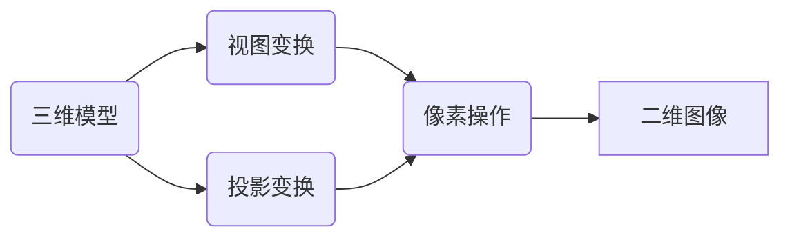
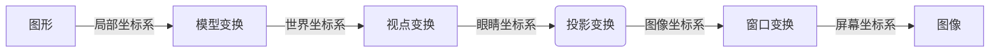
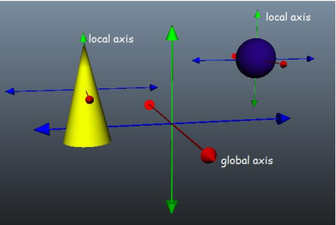
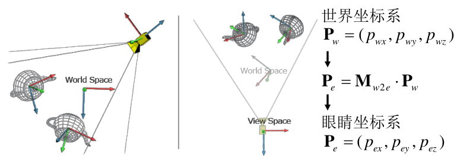
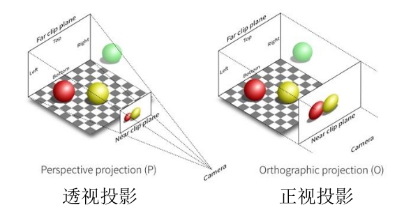

# 光栅化与可微渲染

## 从图形到屏幕图像

我们认知中的点、线、面等图形，是不能直接显示在计算机的屏幕上的。我们需要将其转换为图像，一种由像素构成的数据。

### 图形与图像

- **图形 (Graph)** 是由点、线、面等基本几何元素作为图元构成，可以通过建模、测量等方式获得。一般而说，图形是可以计算得到解析式的图形，在屏幕上显示的时候可以实时计算每个像素，因此图形是可以无限放大的。矢量图就是一种以图形构成的图片。这种图像不能直接在屏幕上显示出来，而是需要通过计算转换为图像后才能在屏幕上显示。
- **图像 (Image)** 是由像素构成，通过照相、扫描等方式获取。图像由像素点构成，在放大之后，会产生失真现象。

**光栅化 (Rasterization)** 指将二维和三维图形转换为二维图像，并在屏幕上显示的技术。下面是两个光栅化的例子：
- 绘制直线、圆的Bresenham算法
- 绘制面的扫描线算法 (Scan-line rasterization)

### 计算机图形学系统

光栅化的流程一般如下：

## 光栅化

光栅化是传统的图形绘制方式，是图像绘制最基本、也是最常用的方式。光栅化包括几何操作与像素操作。

### 几何操作

几何操作通过将图形进行几何变化，将图形所在的坐标系表示转换为屏幕坐标系的表示。几何操作的基本步骤包括：

#### 模型变换

模型变换通过平移、旋转、缩放等几何变换将局部坐标变换为世界坐标。

    

下面是一些常见的模型变换计算方式：
- 平移：将点沿着指定方向平移距离
$$
\begin{pmatrix}x'\\y'\\z'\\1\end{pmatrix}=\begin{bmatrix}
    1&0&0&d_x\\
    0&1&0&d_y\\
    0&0&1&d_z\\
    0&0&0&1
\end{bmatrix}\begin{pmatrix}
    x\\y\\z\\1
\end{pmatrix}
$$
- 旋转：保持至少一个点不变的刚体运动
  - 使用欧拉角作为度量，即使用三个角度$\alpha$($x$轴)、$\beta$($y$轴)、$\gamma$($z$轴)进行变化。这种方式直观，但是存在万向节死锁的问题。
    $$
    \begin{aligned}
        \begin{pmatrix}
            x'\\y'\\z'\\1
        \end{pmatrix}=&\begin{bmatrix}
            1&0&0&0\\
            0&\cos\alpha&-\sin\alpha&0\\
            0&\sin\alpha&\cos\alpha&0\\
            0&0&0&1
        \end{bmatrix}\begin{bmatrix}
            \cos\beta&0&\sin\beta&0\\
            0&1&0&0\\
            -\sin\beta&0&\cos\beta&0\\
            0&0&0&-1
        \end{bmatrix}\\&\begin{bmatrix}
            \cos\gamma&-\sin\gamma&0&0\\
            \sin\gamma&\cos\gamma&0&0\\
            0&0&1&0\\
            0&0&0&1
        \end{bmatrix}\begin{pmatrix}
            x\\y\\z\\1
        \end{pmatrix}
    \end{aligned}
    $$
  - 四元数是另一种实现旋转的方式，这种方式可以避免欧拉角遇到的问题，因此更加常用。
- 缩放：按照一定的比例放大或者缩小一个物体
$$
\begin{pmatrix}
    x'\\y'\\z'\\1
\end{pmatrix}=\begin{bmatrix}
    s_x&0&0&0\\
    0&s_y&0&0\\
    0&0&s_z&0\\
    0&0&0&1
\end{bmatrix}\begin{pmatrix}
    x\\y\\z\\1
\end{pmatrix}
$$
- 错切：保持轴上的点不动，其他点沿平行于此轴方向移动变形的变换。错切变换也称为剪切、错位或者错移变换。

#### 视点变换

视点变换主要是通过平移、旋转等几何变换将世界坐标变换为眼睛坐标。

    

#### 投影变换

投影变换将眼睛坐标系中的物体模型投影到成像平面上，形成二维图像。投影变换主要有透视投影、正视投影两种。

    

#### 窗口变化

窗口变换主要是将图像坐标系中的图形转换使其与窗口大小相符。

### 像素操作

将几何图元转换成了一个光栅图像并在屏幕上输出，从而实现图形变为二维图像。像素操作中常用的操作包括剔除、填充、可见性判断。

#### 剔除

剔除的目标是丢弃不需要绘制的几何图形以加速渲染。剔除的类型包括
- 视域剔除：视域以外的形状都是在屏幕之外的，只处理位于视域之内的图形的光栅化。
  - 包围盒：包围盒指平行于物体空间平面且包围整个物体的最小框。引入包围盒之后，视域剔除只需要判断包围盒与视域的关系。
- 遮蔽剔除：明显隐蔽在后面的几何形状不可见。
- 小物体剔除：小于特定尺寸的物体被剔除，即剔除那些屏幕空间中包围盒比一个像素阈值数小的物体。
- 背面剔除：形状是单面的，即只有从前面才可见，因此背面不需要绘制。在绘制3D物体时，如果一个三角形背对相机，那么它是不可见的，可以通过避免绘制它来提高效率。在一个场景中，大约50%的三角形是背面的。
  - 背面剔除中，我们设定三角形的顶点递增方向为逆时针方向为可见，反之为不可见。
- 简并剔除：退化三角形的面积为0，因此不需要绘制。退化三角形包括：顶点位于直线上、顶点在同一个点、法向量$\vec{n}=0$

#### 填充

在屏幕上绘制形状，并确定要填充的像素。该步骤为图形转换为图像的关键步骤，决定图形在屏幕上的显示。

现在常用的可见性判断的方法为Z-buffer算法：
- 对每一个像素点储存其z值
- 比较新的z值和已储存的z值
- 如果新的z值更小则更新像素的z值

#### 其他因素

在像素操作中，处理剔除、填充之外，还有很多其他需要考虑的地方，包括纹理、透明度、雾等。

## 可微绘制

可微绘制是一种端到端、借助可微分梯度优化将图形输出为图像的绘制过程。可微绘制是渲染的一种基本手段。

### 可微绘制流程

可微绘制的基本流程是将绘制看做训练神经网络的过程。

OpenDR (Open Differentiable Render) 是德国MPI研究所开发的可微渲染系统。通过对流水线中不可微函数的近似求导，实现微分运算。

Mitsuba是瑞士EPFL的Realistic Graphics实验室开发的渲染系统。

## 图形硬件

与图形学最相关的硬件就是GPU (Graphics Processing Unit)。在最初的时候，GPU就是为了绘制操作被发明的。