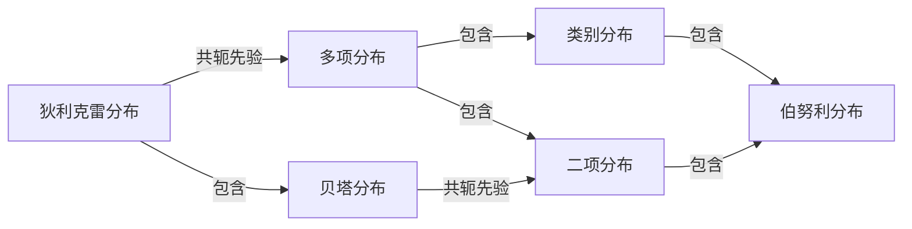

---
aliases:
  - 主题模型
  - LDA
  - latent Dirichlet allocation
  - 潜在狄利克雷分布
tags:
  - 机器学习
  - 聚类
  - 监督学习
---

# 主题模型

潜在狄利克雷分配 (latent Dirichlet allocation, LDA) 是基于贝叶斯学习的话题模型，是潜在语义分析、概率潜在语义分析法拓展，在文本数据挖掘、图像处理、生物信息处理等领域被广泛使用。

LDA 模型是文本集合的生成概率模型，假设每个文本由话题的一个多项分布表示，每个话题由单词的一个多项分布表示，特别假设文本的话题分布的先验分布是狄利克雷分布，话题的单词分布也是狄利克雷分布。先验分布的导入使 LDA 能够更好的应对话题模型学习中的过拟合现象。

LDA 模型生成文本集合的过程如下：首先随机生成一个文本的话题分布，之后在文本的每个位置依据该文本的话题分布随机生成一个话题，然后在该位置依据该话题的单词分布随机生成一个单词，直至文本的最后一个位置，生成整个文本。重复以上过程生成所有文本。

## 狄利克雷分布

首先介绍作为 LDA 模型基础的多项分布和狄利克雷分布。

### 多项分布

多项分布 (multinomial distribution) 是一种多元离散[[概率论与数理统计/一维随机变量及其分布|随机变量]]的概率分布，是二项分布 (binomial distribution) 的扩展。其定义如下：若多元离散随机变量 $X=(X_1,X_2,\cdots,X_k)$ 的概率质量函数为
$$
\begin{aligned}
P(X_1=n_1,X_2=n_2,\cdots,X_k=n_k)&=\frac{n!}{n_1!n_2!\cdots n_k!}p_1^{n_1}p_2^{n_2}\cdots p_1^{n_k}\\
&=\frac{n!}{\prod_{i=1}^kn_i!}\prod_{i=1}^kp_i^{n_i}
\end{aligned}
$$
其中 $p=(p_1,p_2,\cdots,p_k),p_i\geqslant 0,i=1,2,\cdots,k,\sum_{i=1}^kp_i=1,\sum_{i=1}^kn_i=n$，则称随机变量 $X$ 服从参数为 $(n,p)$ 的多项分布，记为 $X\sim\text{Mult}(n,p)$。

当实验的次数 $n$ 为 1 时，多项分布变为类比分布 (categorical distribution)，类别分布表示实验可能出现的 $k$ 中结果的概率。

### 狄利克雷分布

狄利克雷分布 (Dirichlet distribution) 是一种多元连续随机变量的概率分布，是贝塔分布 (beta distribution) 的扩展，在贝叶斯学习中，狄利克雷分布常作为多项分布的先验分布使用。其定义如下：若多元随机变量 $\theta=(\theta_1,\theta_2,\cdots,\theta_k)$ 的概率密度函数为
$$
p(\theta|\alpha)=\frac{\Gamma(\sum_{i=1}^k\alpha_i)}{\prod_{i=1}^k\Gamma(\alpha_i)}\prod_{i=1}^k\theta_i^{\alpha_i-1}
$$
其中 $\sum_{i=1}^k\theta_i=1,\theta_i\geqslant0,\alpha=(\alpha_1,\alpha_2,\cdots,\alpha_k),\alpha_i>0,i=1,2,\cdots,k$ 则称随机变量 $\theta$ 服从参数为 $\alpha$ 的狄利克雷分布，记为 $\theta\sim\text{Dir}(\alpha)$。式中 $\Gamma$ 为伽马函数，定义为
$$
\Gamma(s)=\int_0^\infty x^{s-1}e^{-x}\mathrm dx\quad s>0
$$
具有性质
$$
\Gamma(s+1)=s\Gamma(s)
$$
当 $s$ 是自然数时，有
$$
\gamma(s+1)=s!
$$

由于狄利克雷分布 $\theta$ 满足
$$
\theta_i\geqslant0,\quad \sum_{i=1}^k\theta_i=1
$$
所以狄利克雷分布存在于 $(k-1)$ 维的单纯形上。

### 二项分布与贝塔分布

二项分布是多项分布的特殊情况，贝塔分布是狄利克雷分布的特殊情况，二项分布的定义如下：设 $X$ 为离散随机变量，取值为 $m$，其概率质量函数为
$$
P(X=m)=\binom{n}{m}p^m(1-p)^{n-m},\quad m=0,1,\cdots,n
$$
其中 $n$ 和 $p$ 为参数。

贝塔分布是指如下概率分布，设 $X$ 为连续随机变量，取值范围 $[0,1]$，概率密度函数为
$$
p(x)=\begin{cases}\dfrac{1}{B(s,t)}x^{s-1}(1-x)^{t-1}&0\leqslant x\leqslant 1\\0,&\text{\small其他}\end{cases}
$$
其中 $s>0$ 和 $t>0$ 是参数，$B(s,t)=\dfrac{\Gamma(s)\Gamma(t)}{\Gamma(s+t)}$ 是贝塔函数，定义为
$$
B(s,t)=\int_0^1x^{s-1}(1-x)^{t-1}\mathrm dx
$$
当 $s,t$ 为自然数时，
$$
B(s,t)=\frac{(s-1)!(t-1)!}{(s+t-1)!}
$$

下面给出几种分布的关系图：

### 共轭先验

狄利克雷分布有一些重要的性质：
1. 狄利克雷分布属于指数分布族
2. 狄利克雷分布是多项分布的共轭先验 (conjugate prior)

贝叶斯学习中经常使用共轭分布，即如果后验分布与先验分布属于同类，则先验分布与后验分布称为共轭分布 (conjugate distributions)，先验分布称为共轭先验 (conjugate prior)。如果多项分布的先验分布是狄利克雷分布，则其后验分布也为狄利克雷分布，两者构成共轭分布。作为先验分布的狄利克雷分布的参数又称为超参数。使用共轭分布的好处是便于从先验分布计算后验分布。

下面给出证明：

## 潜在狄利克雷分配模型

潜在狄利克雷分配模型 (LDA) 是文本集合的生成概率模型，模型假设话题由单词的多项分布表示，文本由话题的多项分布表示，单词分布和话题分布的先验分布都是狄利克雷分布，文本内容的不同是由于他们的话题不同。

LDA 模型表示文本集合的自动生成过程，首先，基于单词分布的先验分布 (狄利克雷分布) 生成多个单词分布，即决定多个话题内容。之后，基于话题分布的先验分布 (狄利克雷分布) 生成多个话题分布，即决定多个文本内容。最后，基于每个话题分布生成话题序列，针对每个话题，基于话题的单词分布生成单词，整体构成一个单词序列，即生成文本，重复这个过程生成所有文本，文本的单词序列是观测变量，文本的话题序列是隐变量，文本的话题分布和话题的单词分布也是隐变量。

### 模型定义

LDA 模型使用三个集合：
1. 单词集合 $W=\{w_1,\cdots,w_v,\cdots,w_V\}$，其中 $w_v$ 是第 $v$ 个单词，$v=1,2,\cdots,V$，$V$ 是单词的个数。
2. 文本集合 $D=\{\textbf{w}_1,\cdots,\textbf{w}_m,\cdots,\textbf{w}_M\}$，其中 $\textbf{w}_m$ 是第 $m$ 个文本，$m=1,2,\cdots,M$，$M$ 是文本的个数。文本 $\textbf{w}_m$ 是一个单词序列 $\textbf{w}_m=(w_{m1},\cdots,w_{mn},\cdots,w_{mN_m})$，其中 $w_{mn}$ 是文本 $\textbf{w}_m$ 的第 $n$ 个单词，$n=1,2,\cdots,N_m$，$N_m$ 是文本 $\textbf{w}_m$ 中单词的个数。
3. 话题集合 $Z=\{z_1,\cdots,z_k,\cdots,z_K\}$，其中 $z_k$ 是第 $k$ 个话题，$k=1,2,\cdots,K$，$K$ 是话题的个数。

每个话题 $z_k$ 都由一个单词的条件概率分布 $p(w|z_k)$ 决定，$w\in W$，分布 $p(w|z_k)$ 服从多项分布，其参数为 $\varphi_k$，参数 $\varphi_k$ 服从狄利克雷分布，其超参数为 $\beta$。参数 $\varphi_k$ 是一个 $V$ 维向量 $\varphi_k=(\varphi_{k2},\varphi_{k1},\cdots,\varphi_{kV})$，其中 $\varphi_{kv}$ 表示话题 $z_k$ 生成单词 $w_v$ 的概率，所有话题的参数向量构成了一个 $K\times V$ 矩阵 $\varphi=\{\varphi_k\}_{k=1}^K$，超参数 $\beta$ 也是一个 $V$ 维的向量 $\beta=(\beta_1,\beta_2,\cdots,\beta_V)$。

每个文本 $\textbf{w}_m$ 由一个话题的条件概率分布 $p(z|\textbf{w}_m)$ 决定，$z\in Z$。分布 $p(z|\textbf{w}_m)$ 服从多项分布，其参数为 $\theta_m$。参数 $\theta_m$ 服从狄利克雷分布，其超参数为 $\alpha$。参数 $\theta_m$ 是一个 $K$ 维向量 $\theta_m=(\theta_{m1},\theta_{m2},\cdots,\theta_{mK})$，其中 $\theta_{mk}$ 表示文本 $\textbf{w}_m$ 生成话题 $z_k$ 的概率。所有文本的参数向量构成了一个 $M\times K$ 的矩阵 $\theta=\{\theta_m\}^M_{m=1}$。超参数 $\alpha$ 也是一个 $K$ 维的向量 $\alpha=(\alpha_1,\alpha_2,\cdots,\alpha_K)$。

每个文本 $\textbf{w}_m$ 中的每个单词 $w_{mn}$ 由该文本的话题分布 $p(z|\textbf{w}_m)$ 以及所有话题的单词分布 $p(w|z_k)$ 决定。

### 生成过程

LDA 文本集合的生成过程如下：给定单词集合 $W$，文本集合 $D$，话题集合 $Z$，狄利克雷分布的超参数 $\alpha$ 和 $\beta$。
1. 生成话题的单词分布
   随机生成 $K$ 个话题的单词分布。具体过程为：按照狄利克雷分布 $\text{Dir}(\beta)$ 随机生成一个参数向量 $\varphi_k$, $\varphi\sim\text{Dir}(\beta)$，作为话题 $z_k$ 的单词分布 $p(w|z_k)$，$w\in W,$ $k=1,2,\cdots,K$。
2. 生成文本的话题分布
   随机生成 $M$ 个文本的话题分布。具体过程为：按照狄利克雷分布 $\text{Dir}(\alpha)$ 随机生成一个参数向量 $\theta_m$, $\theta_m\sim\text{Dir}(\alpha)$，作为文本 $\textbf{w}_m$ 的话题分布 $p(z|\textbf{w}_m)$，$m=1,2,\cdots,M$。
3. 生成文本的单词序列
   随机生成 $M$ 个文本的 $N_m$ 个单词。文本 $\textbf{w}_m$ 的单词 $w_{mn}$ 的生成过程如下：
   1. 首先按照多项分布 $\text{Mult}(\theta_m)$ 随机生成一个话题 $z_{mn}$，$z_{mn}\sim\text{Mult}(\theta_m)$。
   2. 然后按照多项分布 $\text{Mult}(\varphi_{z_{mn}})$ 随机生成一个单词 $w_{mn}$，$w_{mn}\sim\text{Mult}(\varphi_{z_{mn}})$ 文本 $\textbf{w}_m$ 本身是单词序列 $\textbf{w}_m=(w_{m1},w_{m2},\cdots,w_{mN_m})$，对应着隐式话题序列 $z_m=(z_{m1},z_{m2},\cdots,z_{mN_m})$。

LDA 的文本生成过程中，话题个数 $K$ 给定，一般通过实验选定。狄利克雷分布的超参数 $\alpha$ 和 $\beta$ 通常也是实现给定的，在没有其他先验知识的情况下，可以假设向量 $\alpha$ 和 $\beta$ 的所有分类都是 1，这时的文本话题分布 $\theta_m$ 是对称的，话题的单词分布 $\varphi_k$ 也是对称的。

LDA 本质上是一种概率图模型，一般使用板块表示。图中的节点代表随机变量，双线节点是观测变量，单线节点是隐变量。有向边表示概率依存关系，矩形表示重复，板块内的数字表示重复次数。
![[Pasted image 20230614214335.png]]

### 随机变量的可交换性

一个有限的随机变量序列是可交换的 (exchangeable) 是指随机变量的[[概率论与数理统计/多维随机变量及其分布|联合概率分布]]对随机变量的排列不变，即
$$
P(x_1,x_2,\cdots,x_N)=P(x_{\pi(1)},x_{\pi(2)},\cdots,x_{\pi(N)})
$$
这里的 $\pi$ 表示一个任意的排列。一个无限的随机变量序列是无限可交换的，是指它的任意一个有限子序列都是可交换的。

如果一个随机变量序列是独立同分布的，那么他们是无限可交换的，反之不然。随机变量可交换性的假设在贝叶斯学习中经常使用，根据 De Finetti 定理，任意一个无限可交换的随机变量序列对一个随机参数是独立同分布的。即任意一个无限可交换的随机变量序列 $X_1,X_2,\cdots,X_i,\cdots$ 的基于一个随机参数 $Y$ 的条件概率，等于基于这个随机参数 $Y$ 的各个随机变量 $X_1,X_2,\cdots,X_i,\cdots$ 的条件概率乘积
$$
P(X_1,X_2,\cdots,X_i,\cdots|Y)=P(X_1|Y)P(X_2|Y)\cdots P(X_i|Y)\cdots
$$

LDA 假设文本由无限可交换的话题序列组成，实际上这是假设每个话题对一个随机参数是条件独立同分布的，所以在给定的条件下，文本中话题的顺序可以忽略。

### 概率公式

先略过，后面补充

## LDA 学习算法

LDA 的学习是一个复杂的最优化问题，很难精确求解，只能近似求解。常用的求解方法有吉布斯抽样 (Gibbs sampling) 和变分推理 (variational inference)。

LDA 模型的学习，给定文本 (单词序列) 的集合 $D=\{\textbf{w}_1,\cdots,\textbf{w}_m,\cdots,\textbf{w}_M\}$，其中 $\textbf{w}_m$ 是第 $m$ 个文本 (单词序列)，$\textbf{w}_m=(w_{m1},\cdots,w_{mn},\cdots,w_{mN_m})$，以 $\textbf{w}$ 表示文本集合的单词序列，即 $\textbf{w}=(w_{11},w_{12},\cdots,w_{1N_1},w_{22},\cdots,w_{2N_2},\cdots,w_{M1},w_{M2}$ $,\cdots,w_{MN_M})$,超参数 $\alpha$ 与 $\beta$ 已知。目标是要推断：
1. 话题序列的集合 $z=\{z_1,z_2,\cdots,z_M\}$ 的后验概率分布，其中 $z_m$ 是第 $m$ 个文本的话题序列，$z_m=(z_{m1},\cdots,z_{mn},\cdots,z_{mN_m})$。
2. 参数 $\theta=\{\theta_1,\cdots,\theta_m,\cdots,\theta_M\}$,其中 $\theta_m$ 是文本 $\textbf{w}_m$ 的话题分布的参数
3. 参数 $\varphi=\{\varphi_1,\cdots,\varphi_k,\cdots,\varphi_K\}$，其中话题 $\varphi_k$ 是话题 $z_k$ 的单词分布参数

也就是说，要对联合概率分布 $p(\textbf{w,z},\theta,\varphi|\alpha,\beta)$ 进行估计，其中 $\textbf{w}$ 是观测变量，$\textbf{z},\theta,\varphi$ 是隐变量。

### 吉布斯抽样

LDA 模型的学习通常采用收缩的吉布斯抽样 (collapsed Gibbs sampling) 方法，基本思想是：通过对隐变量 $\theta$ 和 $\varphi$ 积分，得到边缘概率分布 $p(\textbf{w,z}|\alpha,\beta)$，其中变量 $\textbf{w}$ 是可观测的，变量 $\textbf{z}$ 是不可观测的。对后验概率分布 $p(\textbf{z}|\textbf{w},\alpha,\beta)$ 进行吉布斯抽样，得到分布 $p(\textbf{z}|\textbf{w},\alpha,\beta)$ 的样本集合，在利用这个样本集合对参数 $\theta$ 和 $\varphi$ 进行估计，最终得到 LDA 模型 $p(\textbf{w,z},\theta,\varphi|\alpha,\beta)$ 的所有参数估计。

证明后面补充...

LDA 模型的吉布斯抽样算法如下所示：
输入：文本的单词序列 $\textbf{w}=\{\textbf{w}_1,\cdots,\textbf{w}_m,\cdots,\textbf{w}_M\}$，$\textbf{w}_m=\{w_{m1},\cdots,w_{mn},\cdots$$,w_{mN_m}\}$
输出：文本的话题序列 $\textbf{z}=\{\textbf{z}_1,\cdots,\textbf{z}_m,\cdots,\textbf{z}_M\}$，$\textbf{z}_m=(z_{m1},\cdots,z_{mn},\cdots,z_{mN_m})$ 的后验概率分布 $p(\textbf{z}|\textbf{w},\alpha,\beta)$ 的样本计数，模型的参数 $\varphi$ 和 $\theta$ 的估计值
参数：超参数 $\alpha$ 和 $\beta$，话题个数 $K$
1. 设所有的计数矩阵的元素 $n_{mk},n_{kv}$，计数向量的元素 $n_{m},n_k$ 的初始值为 0
2. 对所有的文本 $\textbf{w}_m,m=1,2,\cdots,M$
   对第 $m$ 个文本中的所有单词 $w_{mn},n=1,2,\cdots,N_m$
   1. 抽样话题 $z_{mn}=z_k\sim \text{Mult}(\frac{1}{K})$
   2. 增加文本-话题计数 $n_{mk}=n_{mk}+1$，增加文本-话题和计数 $n_m=n_m+1$，增加话题-单词计数 $n_{kv}=n_{kv}+1$，增加话题-单词计数 $n_k=n_k+1$
3. 循环执行如下操作，直到进入燃烧期
   对所有的文本 $\textbf{w}_m,m=1,2,\cdots,M$，
   对第 $m$ 个文本中的所有单词 $w_{mn},n=1,2,\cdots,N_m$
   1. 当前的单词 $w_{mn}$ 是第 $v$ 个单词，话题指派 $z_{mn}$ 是第 $k$ 个话题
   2. 减少计数 $n_{mk}=n_{mk}-1,n_m=n_m-1,n_{kv}=n_{kv}-1,n_k=n_k-1$
   3. 按照满条件分布进行抽样
		$$
p(z_i|\textbf{z}_{i-1},\textbf{w},\alpha,\beta)\varpropto \frac{n_{kv}+\beta_v}{\sum_{v=1}^V(n_{kv}+\beta_v)}\cdot\frac{n_{mk}+\alpha_k}{\sum_{k=1}^K(n_{mk}+\alpha_k)}
		$$
		得到新的第 $k'$ 话题，分配给 $z_{mn}$
	4. 增加计数 $n_{mk'}=n_{mk'}+1,n_m=n_m+1,n_{k'v}=n_{k'v}+1,n_{k'}=n_{k'}+1$
	5. 得到更新的两个计数矩阵 $N_{K\times V}=[n_{kv}]$ 和 $N_{M\times K}=[n_{mk}]$，表示后验概率分布 $p(\textbf{z}|\textbf{w},\alpha,\beta)$ 的样本计数
4. 利用得到的计数样本，计算模型参数
   $$
\begin{aligned}
\theta_{mk}&=\frac{n_{mk}+\alpha_k}{\sum_{k=1}^K(n_{mk}+\alpha_k)}\\
\varphi_{kv}&=\frac{n_{kv}+\beta_v}{\sum_{v=1}^V(n_{kv}+\beta_v)}
\end{aligned}
$$

