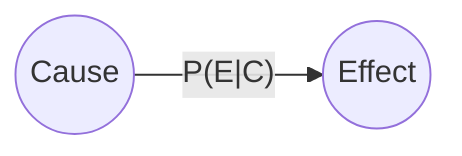
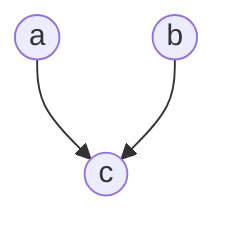
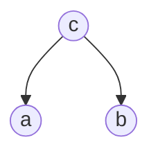
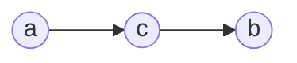

---
aliases:
  - 贝叶斯信念网
  - 信念网
  - Bayesian network
  - belief network
tags:
  - 机器学习
  - 概率有向图
  - 监督学习
---

# 贝叶斯网络

贝叶斯网络是一种概率有向图，在 [[朴素贝叶斯]] 的基础上引入条件依赖的性质，可以得到贝叶斯网络。贝叶斯网络 (Bayesian network) 亦成为信念网 (belief network)，它借助有向无环图 (Director Acyclic Graph) 来刻画属性之间的以依赖关系，用条件概率表 (Condittional Probability Table) 来描述属性的[[概率论与数理统计/多维随机变量及其分布|联合概率分布]]。

## 贝叶斯网络结构

在贝叶斯网络中，节点表示[[概率论与数理统计/一维随机变量及其分布|随机变量]]，有向边表示之间有因果关系，两个节点间有边相连表示了一个条件概率，其中起点是条件。即

贝叶斯网络有效的表达了属性间的条件独立性，给定父节点集，贝叶斯网络假设每个属性与它的给后裔属性独立。使用 $B=\langle I,E\rangle$ 表示一个贝叶斯网络，$I$ 是节点集，$E$ 是边集，令 $x_i$ 为节点代表的随机变量，可以得到贝叶斯网络中随机变量的概率分布为
$$
P(x_i)=\prod_{i\in I}P(x_i|x_{pa(i)})
$$
贝叶斯网络有一个重要性质，即在一个节点的前去节点值确定后，该节点条件独立与所有非直接前驱节点。贝叶斯网络中有三种典型的条件独立结构，即
1. 同父结构：
   根据链式法则，当 $c$ 未知时 $P(a,b,c)=P(a)P(b)P(c|a,b)=P(c|a,b)P(a,b)$ 消去 $P(c|a,b)$ 得到 $a$ 与 $b$ 条件独立。当 $c$ 已知时, 不能通过上述方式消去，所有 $a$ 和 $b$ 不独立。

2. V 型结构
   根据链式法则，可以得到 $P(a,b,c)=P(a|c)P(b|c)P(c)$，当 $c$ 已知时，有 $P(a,b|c)P(c)=P(a|c)P(b|c)P(c)$ 于是有 $P(a,b|c)=P(a|c)P(b|c)$，即 $a$ 与 $c$ 条件独立。当 $c$ 未知时，我们无法得到条件独立性。

3. 顺序结构
   根据链式法则，有 $P(a,b,c)=P(a)P(c|a)P(b|a,c)$，当 $c$ 已知时，根据 $P(a,b,c)=P(a,b|c)P(c)$ 与 $P(a,c)=P(c|a)P(a)$ 可以得到 $P(a|c)P(b|c)=P(a,b|c)$，即 $a$ 与 $b$ 条件独立，当 $c$ 未知时，我们无法得到结论。

上面所述的几种独立性称为边际独立性，记为 $x_1\perp \!\!\! \perp x_2$。

### 有向分离

为了更好的分析有向图中的条件独立性，引入了**有向分离** (D-separation) 的概念。要高效的判断一个图中的条件独立性，我们先将一个图转变为无向图：
- 找出有向图中所有的 V 型结构，在 V 型结构的两个父节点之间加上一条无向边
- 将所有的有向边改为无向边

由此产生的图称为道德图 (moral graph)，将父节点相连接的操作称为道德化。基于道德图可以直观、快速的找到变量间的条件独立性。假设道德图中有变量 $x,y$ 与变量集合 $z=\{z_i\}$，若 $x$ 在 $y$ 上能在图上被 $z$ 分开，即从道德图上将 $z$ 集合去除后，$x$ 与 $y$ 在两个连通分支上，则称变量 $x$ 与变量 $y$ 被 $z$ **有向分离**，即 $x\perp y|z$ 成立。

判断贝叶斯网络节点的条件独立性，方法如下：
1. 判断两个节点间是否存在路径，则可以使用有向无环图(DAG)进行判断。如果两个节点之间没有路径，则它们是条件独立的；如果它们之间存在路径，就需要进一步检测这些路径，如果路径都只包含头对头节点和头对尾节点，则这两个节点是条件独立的。
2. 使用道德图可以判断一个节点是否与其他节点条件独立。如果删去了其他节点，这两个节点的道德图仍然连接，则这两个节点不是条件独立的，否则它们是条件独立的。

### 贝叶斯网络的学习

若网络的结构已知，即属性间的依赖关系已知，则贝叶斯网络的学习过程相简单，只需要对训练样本计数，估算出每个节点的条件概率表即可。但在现实中我们往往不知道网络的结构，于是贝叶斯网络学习首要任务是根据训练数据集来找出结构最恰当的贝叶斯网络。