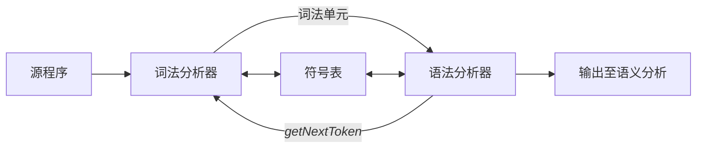

# 词法分析

词法分析是编译的第一阶段。词法分析器的主要任务是读入源程序的输入字符、将他们组成词素，生成并输出一个词法单元序列，其中每个词法单元对应一个词素。

词法分析器通常要和符号表进行交互，当词法分析器发现了一个标识符的词素时，它要将这个词素添加到符号表中。在某些情况下，词法分析器会从符号表中读取有关标识符的种类信息，以确定向语法分析器中传输哪些单元。

词法分析器与语法分析器的交互过程如下：

词法分析器在编译器中负责读取源程序，因此它还会完成一些额外的任务，包括：
- 过滤掉源程序中的注释和空白 (空格、换行符、制表符以及用于分隔词法单元的其他字符)
- 将编译器生成的错误消息和源程序的位置联系起来
- 宏处理

有时，词法分析器可以分为两个级联的处理阶段：
1. *扫描阶段*主要负责完成一些不需要生成词法单元的简单处理，例如删除注释、将多个连续的空白字符压缩成一个字符
2. *词法分析阶段*是较为复杂的部分，它处理扫描阶段的输出并生成词法单元

## 词法单元、模型和词素

在讨论词法分析时，我们使用三个相关但是有区别的术语：
- *词法单元*由一个词法单元名和一个可选的属性值组成。
	- 词法单元名是一个表示某种词法单位的抽象符号，例如字符序列
- *模式*描述了一个词法单元的词素可能的形式。
	- 当词法是一个关键词时，它的模式就是组成这个关键词的字符序列。对于标识符和其他词法单元，模式是一个更加复杂的结果。
- *词素*是源程序中的一个字符序列，它和某个词法单元的模式匹配，并被词法分析器识别为该词法单元的一个实例。

在程序设计语言中，词法单元一般为：
1. 每个关键词有一个词法单元。一个关键词的模式是该关键词本身
2. 表示运算符的词法单元。可以表示单个运算符，也可以表示一类运算符
3. 一个表示所有标识符的词法单元
4. 一个或者多个表示常量的词法单元。如数字、字面值字符串。
5. 每一个标点符号有一个词法单元。如左右括号、逗号。

### 词法单元的属性

如果多个词素可以和一个模式匹配，那么词法分析器必须向编译器的后续阶段提供有关被匹配词素的附件信息。下面使用两个例子说明：
- 1 和 0 都可以被词法单元**number**匹配，但是对于代码生成器而言，重要的他们的值，即返回的词法单元应该包含值，例如返回\<number, 1\>和\<number, 0\>。
- 对于词法单元 **id** 来说，我们通常会有很多的信息与之关联，这个时候和该标识符的很多信息都会保存在符号表中。此时，该标识符的属性值是一个指向符号表中该标识符对应条目的指针。

## 输入缓冲

在讨论如何识别输入流中的词素之前，我们需要首先讨论几种可以加快源程序读入速度的方法。源程序读入虽然简单，但是很重要。由于我们常常需要查看一个词素之后的若干字符，才能确定是否找到正确的词素，因此这个任务变得有些困难。

// 这部分先略过

## 词法单元的归约

正则表达式是一种用来描述词素模式的重要表示方法。虽然正则表达式不能表示出所有可能的模式，但是他们可以高效地描述在处理词法单元时需要用到的模式类型。

### 串和语言

*字母表 (alphabet)* 是一个有限的符号集合。符号可以是字符、数位和标点符号等等。这里有一些现实中的例子：
- 集合\{0,1\}称为二进制字母表。
- ASCII 是字母表的一个重要例子。
- Unicode 包含了大约 100000 个来自世界各地的字符。

某个字母表上的一个*串 (string)* 是该字母表中符号的一个有穷序列。串 s 的长度通常记为|s|，指 s 中符号出现的次数。例如，banana 是一个长度为 6 的串。*空串 (empty string)* 是长度为 0 的串，使用 $\in$ 表示。

*语言 (language)* 是某个给定字母表上一个任意的可数的串的集合。根据这个定义，下面的也是语言：
- 空集、只包含空串的集合
- 所有语法正确的 C 程序的集合
- 所有语法正确的英语句子的集合

> 这里是一个与串相关的常用术语：
> 1. 串 s 的前缀 (prefix) 是从 s 的尾部删除 0 个或者多个符号得到的串。
> 2. 串 s 的后缀 (suffix) 是从 s 的开始删除 0 个或者多个符号得到的串。
> 3. 串 s 的子串 (substring) 是删除 s 的某个前缀和某个后缀得到的串。
> 4. 串 s 的真 (true) 前缀、真后缀、真子串分别是 s 的既不等于 $\in$ 也不等于 s 本身的前缀、后缀、子串。
> 5. 串 s 的子序列 (subsequence) 是从 s 中删除 0 个或者多个符合后得到的串。

如果 x 和 y 是串，那么 x 和 y 的连接 (concatenation) xy 是把 y 附加到 x 后面而形成的串。如果把串的连接视为串的“乘积”，那么我们可以定义串的“指数”运算为：
$$
s^1=s,\, s^2=ss,\,s^3=sss
$$

### 语言上的运算

在词法分析中，最重要的语言上的运算是并、连接和闭包运算。下面给出了这几种运算的定义：
- 并：$L\cup M=\{s|s\in L \vee s\in M\}$
- 连接：$LM=\{st|s\in L \wedge t\in M\}$
- Kleene 闭包：$L^*=\bigcup_{i=0}^\infty L^i$
- 正闭包：$L^+=\bigcup_{i=1}^\infty L^i$

### 正则表达式

在处理标识符时，我们可以通过事先给出字母和数位集合的名字，然后使用并、连接和闭包这些运算符来描述标识符。这种处理方式非常有用。

人类常使用一种称为正则表达式的表示方式来描述语言。正则表达式可以描述所有通过对某个字母表上的符号应用这些运算符而得到的语言。在这种表示法中，如果使用 letter_ 来表示任意字母或者下划线，使用 digit_ 来表示数位，那么可以使用下面的正则表达式来描述对应于 C 语言标识符的语言：

letter_ (letter_ | digit)*

上面的竖线表示并运算，括号用于把子表达式组合在一起，星号表示零个或者多个括号中的表达式连接。

正则表达式可以由较小的正则表达式按照如下规则递归的构建：
1. $\in$ 是一个正则表达式，$L(\in)=\{\in\}$，即该语言只包含空串
2. 如果 a 是 $\Sigma$ 上的一个符号，那么 **a** 是一个正则表达式，并且 $L(\mathbf{a})=\{a\}$。也就是说，这个语言仅包含一个长度为 1 的符号串 a。

由小的正则表达式构建较大的正则表达式的步骤有四个部分。假设 r 和 s 都是正则表达式，分别表示语言 $L(r)$ 和 $L(s)$，那么：
1. $(r)|(s)$ 是一个正则表达式，表示语言 $L(r)\cup L(s)$
2. $(r)(s)$ 是一个正则表达式，表示语言 $L(r)L(s)$
3. $(r)^*$ 是一个正则表达式，表示语言 $\left(L(r)\right)^*$
4. $(r)$ 是一个正则表达式，表示语言 $L(r)$

按照上面的定义，正则表达式通常会包含一些不必要的括号。我们采用如下约定：
1. 一元运算符\*具有最高的优先级，并且是左结合的
2. 连接具有次高的优先级，它也是左结合的
3. |的优先级最低，并且也是左结合的

可以用一个正则表达式定义的语言叫做*正则集合 (regular set)*。如果两个正则表达式 $r$ 和 $s$ 表示同样的语言，则称 $r$ 和 $s$ *等价 (equivalent)*，记为 $r=s$。正则表达式遵守一些代数定律，每个定律都断言两个不同形式的表达式等价。下面给出对于任意 $r$、$s$ 和 $t$ 都成立的代数定律。

|                         定律                         | 描述                 |
| :------------------------------------------------: | ------------------ |
|                $r\vert s=s \vert r$                | \|是可以交换的           |
|       $r\vert (s\vert t)=(r\vert s)\vert t$        | \|是可结合的            |
|                   $r(st)=(rs)t$                    | 连接是可结合的            |
| $r(s\vert t)=rs\vert rt\,\,(s\vert t)r=sr\vert tr$ | 连接对\|是可分配的         |
|              $\epsilon r=r\epsilon=r$              | $\epsilon$ 是连接的单位元 |
|             $r^*=(r\vert \epsilon)^*$              | 闭包中一定包含 $\epsilon$ |
|                    $r^{**}=r^*$                    | 闭包的幂等性             |
### 正则定义

为了方便表示，我们对一些正则表达式命名，并在之后的正则表达式中像使用符号一样使用它们。如果 $\Sigma$ 是