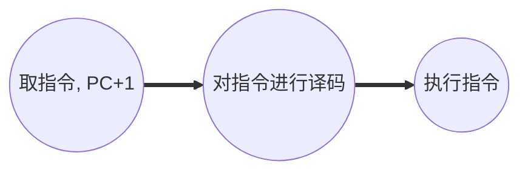

---
aliases:
  - CPU
tag:
  - 计算机组成原理
---

# 中央处理器

中央处理器 CPU 由运算器和控制器组成。
- 运算器用于实现算术运算、逻辑运算。其组成包括 ACC、MQ、X、ALU。![[Pasted image 20231108190907.png]]
	- ACC：累加器，用于存放操作数或运算结果
	- MQ：乘商寄存器，在乘、除运算时，用于存放操作数或运算结果。
	- X：通用的操作数寄存器，用于存放操作数。
	- ALU：算术逻辑单元，通过复杂的内部电路实现算术运算、逻辑运算。
- 控制器组成包括 CU、IR、PC。![[Pasted image 20231108191046.png]]
	- CU：控制单元，分析指令、给出控制信号
	- IR：指令寄存器，存放当前执行的指令。
	- PC：程序计数器，存放下一条指令地址，有自动加 1 的功能。

CPU 的工作过程就是执行一条条指令的过程。

## CPU 的功能与结构

CPU 有五大功能如下：
1. 指令控制：完成取指令、分析指令和执行指令的操作，即程序的顺序控制。
2. 操作控制：一条指令的功能往往是由若干操作信号的组合来实现的。CPU 管理并产生由内存取出的每条指令的操作信号，把各种操作信号送往相应的部件，从而控制这些部件按指令的要求进行动作。
3. 时间控制：对各种操作加以时间上的控制。时间控制要为每条指令按时间顺序提供应有的控制信号。
4. 数据加工：对数据进行算术和逻辑运算。
5. 中断处理：对计算机运行过程中出现的异常情况和特殊请求进行处理。

CPU 由运算器与控制器两大部分组成。
- 运算器：对数据进行加工。
- 控制器：协调并控制计算机各部件执行程序的指令序列。基本功能包括取指令、分析指令、执行指令。
	- 取指令：自动形成指令地址，自动发出取指令的命令。
	- 分析指令：操作码译码 (分析本条指令要完成什么操作，产生操作数的有效地址)
	- 执行指令：根据分析指令得到的操作命令和操作数地址，形成操作信号控制序列，控制运算器、存储器已经 IO 设备完成相应的操作
	- 中断处理：管理总线及输入输出；处理异常情况和特殊请求。

### 运算器

运算器的组成如下：
1. 算术逻辑单元 (ALU)：主要功能是进行算术逻辑运算。
2. 通用寄存器组：如 AX、BX、CX、SP 等，用于存放操作数和各种地址信息。
3. 暂存寄存器：用于暂存从主存读来的数据，这个数据不能放在通用寄存器中，否则会破环器原有内容。
4. 累加寄存器：用于暂时存放 ALU 运算的结果信息，用于实现加法运算。
5. 程序状态字寄存器 (PSW)：保留由算术逻辑运算指令或测试指令的结果而建立的各种状态信息。
6. 移位器：对运算结构进行移位运算。
7. 计数器：控制乘除运算的操作步数。

算术逻辑单元与寄存器的连接方式包括：
- 专用数据通路方式：根据指令执行过程中的数据和地址的流动方向安排连接线路。
	- 优点: 性能较高，基本不存在数据冲突现象。
	- 缺点：结构复杂，硬件量大，不易实现。
- CPU 内部单总线方式：将所有寄存器的输入段和输出端都连接到一条公共通路上。
	- 优点：结构简单，容易实现。
	- 缺点：数据传输存在较多冲突的现象，性能较低。

### 控制器

控制器 (CU) 的基本结构为：
1. 程序计数器 (PC)：用于指出下一条指令在主存中的存放地址。程序计数器有自增功能。
2. 指令寄存器：用于保存当前正在执行的那条指令。
3. 指令译码器：仅对操作码字段进行译码，向控制器提供特定的操作信号。
4. 微操作信号发生器：根据 IR 的内容、PSW 的内容 (状态信息) 及时序信号，产生控制整个计算机系统所需的各种控制信号，其结构有组合逻辑型和存储逻辑型两种。
5. 时序系统：用于产生各种时序信号，它们都是由统一时钟 (CLOCK) 分频得到的。
6. 存储器地址寄存器：用于存放所要访问的主存单元的地址。

> - CPU 中对用户可见的寄存器：通用寄存器组、程序状态寄存器 PSW、程序计数器 PC
> - CPU 中对用户不可见的寄存器：MAR、MDR、IR、暂存寄存器

## 指令执行过程

### 指令周期的概念

指令周期指 CPU 从主存中取出并执行一条指令所需的全部时间。指令的执行可以分为下面的几个步骤：

指令周期常常用若干机器周期来表示，机器周期又叫 CPU 周期。一个机器周期又包含若干时钟周期 (时钟周期又称为节拍、T 周期或者 CPU 周期，它是 CPU 操作的最基本单位)。
- 机器周期表示 CPU 进行一个操作需要的时间。
- 每个指令周期内机器周期可以不等，每个机器周期内的节拍数也可以不等。

一些常见的指令包含的机器周期：
- 空指令 NOP：一个指令周期包含一个取指周期
- 加法指令 ADD：一个指令周期包含一个取指周期和一个执行周期
- 乘法指令 MUL：一个指令周期包含一个取指周期和一个执行周期，但是执行周期更长
- 具有间接寻址的指令：一个指令周期包含一个取指周期、一个间址周期和一个执行周期。
- 带有中断周期的指令：一个指令周期包含一个取指周期、一个间址周期、一个执行周期、一个中断周期。

可以看到，一个指令周期的流程为：
![[Pasted image 20231108205631.png]]

### 指令周期的数据流

#### 取指周期

1. 当前指令地址送至存储器地址寄存器，记为 $(PC)\to MAR$
2. CU 发出控制信号，经控制总线传导主存
3. 将 MAR 所指主存中的内容经数据总线送入 MDR，记为 $M(MAR)\to MDR$。
4. 将 MDR 中的内容 (此时是指令) 送入 IR，记为 $(MDR)\to IR$。
5. CU 发出控制信号，形成下一条指令地址，记作 $(PC)+1\to PC$。

#### 间址周期

1. 将指令的地址码送入 MAR，记为 $Ad(IR)\to MAR$ 或者 $Ad(MDR)\to MAR$
2. CU 发出控制信号，启动主存做读操作，记为 $1\to R$
3. 将 MAR 所指主存中的内容经数据总线送入 MDR，记为 $M(MAR)\to MDR$
4. 将有效地址送至指令的地址码字段，记为 $(MDR)\to Ad(IR)$

#### 执行周期

执行周期的任务是根据 IR 中的指令字的操作码和操作数通过 ALU 操作产生执行结果。不同指令的执行周期操作不同，因此没有统一的数据流向。

#### 中断周期

中断：暂停当前任务去完成其他任务。为了能够恢复当前任务，需要保存断点。一般使用堆栈来保存断点，这里用 SP 表示栈顶地址，假设 SP 指向栈顶元素，进栈操作是先修改指针，后存入数据。
1. CU 控制将 SP 减 1，修改后的地址送入 MAR，记为 $(SP)-1\to SP$, $(SP)\to MAR$。
2. CU 发出控制信号，启动主存做写操作，记作 $1\to W$。
3. 将断点送入 MDR，记为 $(PC)\to MDR$。
4. CU 控制将中断服务程序的入口地址，(由向量地址形成部件产生) 送入 PC，记为 $向量地址\to PC$

### 指令执行方案

一个指令周期通常要包括几个时间段，每个步骤完成指令的一部分功能，几个依次执行的步骤完成这条指令的全部功能。
1. 单指令周期：对所有指令都选用相同的执行时间来完成。
	- 指令之间串行执行。
	- 指令周期取决于执行时间最长的指令的执行时间。
	- 对于那些本来可以在更短时间内完成的指令，要使用这个较长的周期来完成，会降低整个系统的运行速度。
2. 多指令周期：对不同类型的指令选用不同的执行步骤来完成。
	- 指令之间串行执行。
	- 可选用不同个数的时钟周期来完成不同指令的执行过程。
	- 需要更加复杂的硬件设计。
3. 流水线方案：在每个时钟周期启动一条指令，尽量让多条指令同时运行，当各自处在不同的执行步骤中，指令之间并行执行。

## 数据通路的功能和基本结构

## 控制器的功能与工作原理

### 硬布线控制器

使用硬布线的控制器：微操作控制信号由组合逻辑电路根据当前的指令码、状态和时序，即时产生。

### 微程序控制器

微程序：使用微操作序列来完成一个指令的功能。微程序指由微指令序列组成，每一种指令对应一种微程序。
- 指令是对程序指令步骤的描述。
- 微指令是对指令执行步骤的描述。
- 一个微指令的执行有可能包含多个微命令。
- 指令实际上是对微指令功能的封装。

微指令的基本格式为：操作控制+顺序控制
- 操作控制：该微指令的指令地址
- 顺序控制：下一条微指令的地址

#### 微指令控制器的基本结构

- 控制存储器 CM：用于存放各指令对应的微程序，控制器可用只读存储器 ROM 构成。
- 微地址寄存器 CMAR：别名μPC。接受微地址形成部件送来的微地址，为在 CM 中读取微指令作准备。
- 微指令寄存器 CMDR：别名 μIR，用于存放从 CM 取出的微指令，它的位数同微指令字长。
- 地址译码：将地址码转换为存储单元控制信号。
- 微指令形成部件：产生初始微指令地址和后续微指令，以保证微指令的连续执行。
- 顺序逻辑：根据指令地址码的寻址特征判断是否要跳过间址周期。根据中断信号判断是否进入中断周期。

> 由于所有的程序的取指周期、间址周期、中断周期的微程序都是一样的，因此在计算机中只保存一份微程序。

- 取指周期微程序：通常是共用的，如果某指令系统中有 n 条机器指令，则 CM 中微程序的个数至少是 n+1 个。
- 一些早期的 CPU、物理网设备的 CPU 可以不提供间接寻址和中断功能。
- 物理上、取指周期和执行周期看起来像是两个微程序，但逻辑上应该把他们看作一个整体。因此，**一条指令对应一个微程序**的说法是正确的。

### 微指令的设计

微命令与微操作一一对应，一个微命令对应一个输出线。有的微命令可以并行执行，因此一条微指令可以包含多个微命令。
1. 水平型微指令：一条微指令能定义多个可并行的微命令，基本格式为操作控制+顺序控制，比较长
   - 优点：微程序短，执行速度快
   - 缺点：微指令长，编写微程序较麻烦
2. 垂直型微指令：一条微指令只能定义一个微命令，由微操作码字段规定具体功能，基本格式微操作码+目的地址+源地址
   - 优点：微指令短，简单、规整，便于编写微程序
   - 缺点：微程序长，执行速度慢，工作效率低
3. 混合型微指令：在垂直型的基础上增加一些不太复杂的并行操作。微指令较短，仍便于编写。微程序也不长，执行速度加快。

#### 微指令的编码方式

微指令的编码方式又称为微指令的控制方式，它指如何对微指令的控制字段进行编码，以形成控制信号。编码的目标是在保证速度的情况下，尽量缩短微指令字长。
1. 直接编码方式：在微指令的操作控制字段中，每一位代表一个微操作命令。某位为"1"表示该控制信号有效 (one-hot)。
   - 优点：简单直观，执行速度快，操作并行性好。
   - 缺点：微指令字长过长，n 个微命令需要 n 位操作字段，造成控存容量极大。
2. 字段直接编码方式：将伪指令的控制字段分为若干个段，每段经译码后发出控制信号，微命令字段分段的原则：
   - 互斥性微命令分在同一段内，相容性微命令分在不同段内。
   - 每个小段中包含的信息位不能太多，否则将增加译码线路的复杂性和译码时间。
   - 一般每个小段还要留出一个状态，表示本字段不发出任何微操作命令。因此当某字段的长度为 3 位时，最多只能表示 7 个互斥的微命令。通常 000 表示不操作。
   - 优点：可以缩短微指令字长。
   - 缺点：要通过译码电路后再发出微命令，因此比直接编码方式慢。
3. 字段间接编码：一个字段的某些微命令需要另一个字段中的某些微命令来解释。
	- 优点：可进一步缩短微指令字长。
	- 缺点：削弱了微指令的并行控制能力，故通常作为字段直接编码方式的一种辅助手段。

#### 微指令的地址形成方式

1. 微指令的下地址字段指出：微指令格式中设置一个下地址字段，由微指令的下地址字段直接指出后继微指令的地址，这种方式又称为**断定**方式。
2. 根据机器指令的操作码形成：当机器指令取至指令寄存器后，微指令的地址由操作码经微指令形成部件形成。
3. 增量计数器法：$(CMAR)+1\to CMAR$。
4. 分支转移
5. 通过测试网络
6. 由硬件产生微程序入口地址：第一条微指令地址由专门的硬件产生。中断周期由硬件产生中断周期微程序首地址。

### 微程序控制单元设计

设计步骤：
1. 分析每个阶段的微操作序列
2. 写出对应机器指令的微操作命令及节拍安排
3. 确定微指令格式
4. 编写微指令码点

## 指令流水线

一条指令的执行过程可以分为多个阶段，根据计算机的不同，具体的分法也不同。
- 取指：根据 PC 内容访问主存储器，取出一条指令送到 IR 中。
- 分析：对指令操作码进行译码，按照给定的寻址方式和地址字段中的内容形成操作数的有效地址 EA，并从有效地址 EA 中取出操作数。
- 执行：根据操作码字段，完成指令规定的功能，即把运算结果写到通用寄存器或主存中。

由于每个阶段执行的硬件不同，因此执行有下面的几种策略：
1. 顺序执行方式：串行执行方式
   - 优点：控制简单，硬件代价小
   - 缺点：执行指令的速度慢，在任何时刻，处理机中只有一条指令在执行，各功能部件的利用率很低。![[Pasted image 20231109121658.png]]
2. 一次重叠执行方式
   - 优点：程序的执行时间缩短了 1/3，各功能部件的利用率明显提高
   - 缺点：需要付出硬件上较大开销的代价，控制过程也比顺序执行复杂了 ![[Pasted image 20231109121811.png]]
3. 二次重叠执行方式
   - 优点：指令的执行时间缩短了近 2/3，这是一种理想的指令执行方式，在正常情况下，处理机中同时有 3 条指令正在执行。![[Pasted image 20231109121952.png]]

1. 指令执行过程图：主要用于分析指令执行过程以及影响流水线的因素。
2. 时空图：主要用于分析流水线的性能

### 指令流水线的性能

1. 吞吐率：单位时间内流水线所完成的任务数量，或是输出结果的数量。
   - 设任务数为 n，处理完成 n 个任务所用的时间为 $T_k$，则计算流水吞吐率的基本公式为 $TP=\dfrac{n}{T_k}$。
2. 加速比：完成同样一批任务，不使用流水线所用的时间与使用流水线所用的时间之比。
   - 设 $T_0$ 表示不使用流水线时的执行时间，即顺序执行所用的时间，$T_k$ 表示使用流水线时的执行时间。则计算流水线加速比的基本公式为 $S=\dfrac{T_0}{T_k}$。
3. 效率：流水线的设备的利用率称为流水线的效率。
   - 在时空图上，流水线的效率定义为完成 n 个任务占用时空区有效面积与 n 各任务所用时间与 k 个流水段所围成的时空区面积之比。![[Pasted image 20231109122901.png]]

### 指令流水线的影响因素

五段式指令流水线将一条指令的执行划分为下面的五个阶段：
1. IF (Fetch)：取指令阶段
2. ID (Decode)：指令译码阶段
3. EX (Execute)：指令执行阶段
4. M (Memory)：访存阶段
5. WB (Writeback)：写回结果阶段

此外，由于每个阶段都在不同的机器上运行，因此每个阶段的耗时不同。为了方便流水线的设计，将每个阶段的耗时取成一样，以**最长耗时**为准。

流水线的每一个功能段部件后面都要有一个缓冲寄存器，或者称为**锁存器**，其作用是保存流水段的执行结果，提供给下一流水段使用。

#### 结构相关 (资源冲突)

由于多条指令在同一时刻争用同一资源而形成的冲突称为结构相关。

解决方法：
1. 后一相关指令暂停一周期
2. 资源重复配置：数据存储器+指令存储器

#### 数据相关 (数据冲突)

数据相关指在同一个程序中，存在必须等齐纳一条执行执行完才能执行后一条指令的情况。则这两条指令即为数据相关。

解决办法：
1. 把遇到数据相关的指令及其后续指令都暂停一至几个时钟周期，直到数据相关问题消失后再继续执行。可分为硬件阻塞和软件插入 NOP 两种方法。
2. 数据旁路技术 (转发机制)。
3. 编译优化：通过编译器调整指令顺序来解决数据相关。

#### 控制相关 (控制冲突)

当流水线遇到转移指令和其他改变 PC 值的指令而造成断流时，会引起控制相关。

解决办法：
1. 转移指令分支预测。简单预测、动态预测 (根据历史情况动态调整)。
2. 预取转移成功和不成功两个控制流方向上的目标指令。
3. 加快和提前形成条件码。
4. 提高转移方向的准确率。

### 流水线的分类

1. 部件功能级、处理机级和处理机间级流水线。即根据流水线使用的级别不同来划分。
   - 部件功能级流水线：将复杂的算术逻辑运算组成流水工作方式。
   - 处理机级流水线：把一条指令解释过程分为多个子进程。
   - 处理机间级流水线：一种宏流水，其中每一个处理机完成某一专门任务。
2. 单功能流水线和多功能流水线
   - 单功能流水线：只能实现一种固定的专门功能的流水线
   - 多功能流水线：通过各段间的不同连接方式可以同时或不同时地实现多种功能的流水线
3. 动态流水线和静态流水线
   - 静态流水线：在同一时间内，流水线的各段只能按同一种功能的连接方式工作
   - 动态流水线：在同一时间内，当某些段正在实现某种运算时，另一些段却正在进行同一种运算。这样对提高流水线的效率很有好处，但会使流水线控制变得很复杂。
4. 线性流水线和非线性流水线
	- 线性流水线：从输入到输出，每个功能只允许经过一次，不存在反馈回路
	- 非线性流水线：存在反馈回路，从输入到输出的过程中，某些功能段将数次通过流水线，这种流水线适合进行线性递归运算。

### 流水线的多发技术

1. 超标量技术：空分复用技术
	- 每个时钟周期内可并发多条独立指令
	- 要配置多个功能部件
	- 不能调整指令的执行顺序
	- 通过编译优化技术，把可并行执行的指令搭配起来
2. 超流水技术：时分复用技术
	- 在一个时钟周期内再分段
	- 在一个时钟周期内一个功能部件使用多次
	- 不能调整指令的执行顺序
	- 靠编译程序解决优化问题
3. 超长指令字
   - 由编译程序挖掘出指令间潜在的并行性
   - 将多条能并行操作的指令组合成一条
   - 具有多个操作码字段的超长指令字 (可达几百位)
   - 采用多个处理部件