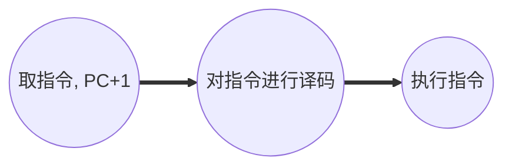

# 中央处理器

中央处理器 CPU 由运算器和控制器组成。
- 运算器用于实现算术运算、逻辑运算。其组成包括 ACC、MQ、X、ALU。![[Pasted image 20231108190907.png]]
	- ACC：累加器，用于存放操作数或运算结果
	- MQ：乘商寄存器，在乘、除运算时，用于存放操作数或运算结果。
	- X：通用的操作数寄存器，用于存放操作数。
	- ALU：算术逻辑单元，通过复杂的内部电路实现算术运算、逻辑运算。
- 控制器组成包括 CU、IR、PC。![[Pasted image 20231108191046.png]]
	- CU：控制单元，分析指令、给出控制信号
	- IR：指令寄存器，存放当前执行的指令。
	- PC：程序计数器，存放下一条指令地址，有自动加 1 的功能。

CPU 的工作过程就是执行一条条指令的过程。

## CPU 的功能与结构

CPU 有五大功能如下：
1. 指令控制：完成取指令、分析指令和执行指令的操作，即程序的顺序控制。
2. 操作控制：一条指令的功能往往是由若干操作信号的组合来实现的。CPU 管理并产生由内存取出的每条指令的操作信号，把各种操作信号送往相应的部件，从而控制这些部件按指令的要求进行动作。
3. 时间控制：对各种操作加以时间上的控制。时间控制要为每条指令按时间顺序提供应有的控制信号。
4. 数据加工：对数据进行算术和逻辑运算。
5. 中断处理：对计算机运行过程中出现的异常情况和特殊请求进行处理。

CPU 由运算器与控制器两大部分组成。
- 运算器：对数据进行加工。
- 控制器：协调并控制计算机各部件执行程序的指令序列。基本功能包括取指令、分析指令、执行指令。
	- 取指令：自动形成指令地址，自动发出取指令的命令。
	- 分析指令：操作码译码 (分析本条指令要完成什么操作，产生操作数的有效地址)
	- 执行指令：根据分析指令得到的操作命令和操作数地址，形成操作信号控制序列，控制运算器、存储器已经 IO 设备完成相应的操作
	- 中断处理：管理总线及输入输出；处理异常情况和特殊请求。

### 运算器

运算器的组成如下：
1. 算术逻辑单元 (ALU)：主要功能是进行算术逻辑运算。
2. 通用寄存器组：如 AX、BX、CX、SP 等，用于存放操作数和各种地址信息。
3. 暂存寄存器：用于暂存从主存读来的数据，这个数据不能放在通用寄存器中，否则会破环器原有内容。
4. 累加寄存器：用于暂时存放 ALU 运算的结果信息，用于实现加法运算。
5. 程序状态字寄存器 (PSW)：保留由算术逻辑运算指令或测试指令的结果而建立的各种状态信息。
6. 移位器：对运算结构进行移位运算。
7. 计数器：控制乘除运算的操作步数。

算术逻辑单元与寄存器的连接方式包括：
- 专用数据通路方式：根据指令执行过程中的数据和地址的流动方向安排连接线路。
	- 优点: 性能较高，基本不存在数据冲突现象。
	- 缺点：结构复杂，硬件量大，不易实现。
- CPU 内部单总线方式：将所有寄存器的输入段和输出端都连接到一条公共通路上。
	- 优点：结构简单，容易实现。
	- 缺点：数据传输存在较多冲突的现象，性能较低。

### 控制器

控制器 (CU) 的基本结构为：
1. 程序计数器 (PC)：用于指出下一条指令在主存中的存放地址。程序计数器有自增功能。
2. 指令寄存器：用于保存当前正在执行的那条指令。
3. 指令译码器：仅对操作码字段进行译码，向控制器提供特定的操作信号。
4. 微操作信号发生器：根据 IR 的内容、PSW 的内容 (状态信息) 及时序信号，产生控制整个计算机系统所需的各种控制信号，其结构有组合逻辑型和存储逻辑型两种。
5. 时序系统：用于产生各种时序信号，它们都是由统一时钟 (CLOCK) 分频得到的。
6. 存储器地址寄存器：用于存放所要访问的主存单元的地址。

> - CPU 中对用户可见的寄存器：通用寄存器组、程序状态寄存器 PSW、程序计数器 PC
> - CPU 中对用户不可见的寄存器：MAR、MDR、IR、暂存寄存器

## 指令执行过程

### 指令周期的概念

指令周期指 CPU 从主存中取出并执行一条指令所需的全部时间。指令的执行可以分为下面的几个步骤：

```mermaid
graph LR
A(("取指令, PC+1"))==>B((对指令进行译码))==>C((执行指令))
```

指令周期常常用若干机器周期来表示，机器周期又叫 CPU 周期。一个机器周期又包含若干时钟周期 (时钟周期又称为节拍、T 周期或者 CPU 周期，它是 CPU 操作的最基本单位)。
- 机器周期表示 CPU 进行一个操作需要的时间。
- 每个指令周期内机器周期可以不等，每个机器周期内的节拍数也可以不等。

一些常见的指令包含的机器周期：
- 空指令 NOP：一个指令周期包含一个取指周期
- 加法指令 ADD：一个指令周期包含一个取指周期和一个执行周期
- 乘法指令 MUL：一个指令周期包含一个取指周期和一个执行周期，但是执行周期更长
- 具有间接寻址的指令：一个指令周期包含一个取指周期、一个间址周期和一个执行周期。
- 带有中断周期的指令：一个指令周期包含一个取指周期、一个间址周期、一个执行周期、一个中断周期。

可以看到，一个指令周期的流程为：
![[Pasted image 20231108205631.png]]

### 指令周期的数据流

#### 取指周期

1. 当前指令地址送至存储器地址寄存器，记为 $(PC)\to MAR$
2. CU 发出控制信号，经控制总线传导主存
3. 将 MAR 所指主存中的内容经数据总线送入 MDR，记为 $M(MAR)\to MDR$。
4. 将 MDR 中的内容 (此时是指令) 送入 IR，记为 $(MDR)\to IR$。
5. CU 发出控制信号，形成下一条指令地址，记作 $(PC)+1\to PC$。

#### 间址周期

1. 将指令的地址码送入 MAR，记为 $Ad(IR)\to MAR$ 或者 $Ad(MDR)\to MAR$
2. CU 发出控制信号，启动主存做读操作，记为 $1\to R$
3. 将 MAR 所指主存中的内容经数据总线送入 MDR，记为 $M(MAR)\to MDR$
4. 将有效地址送至指令的地址码字段，记为 $(MDR)\to Ad(IR)$

#### 执行周期

执行周期的任务是根据 IR 中的指令字的操作码和操作数通过 ALU 操作产生执行结果。不同指令的执行周期操作不同，因此没有统一的数据流向。

#### 中断周期

中断：暂停当前任务去完成其他任务。为了能够恢复当前任务，需要保存断点。一般使用堆栈来保存断点，这里用 SP 表示栈顶地址，假设 SP 指向栈顶元素，进栈操作是先修改指针，后存入数据。
1. CU 控制将 SP 减 1，修改后的地址送入 MAR，记为 $(SP)-1\to SP$, $(SP)\to MAR$。
2. CU 发出控制信号，启动主存做写操作，记作 $1\to W$。
3. 将断点送入 MDR，记为 $(PC)\to MDR$。
4. CU 控制将中断服务程序的入口地址，(由向量地址形成部件产生) 送入 PC，记为 $向量地址\to PC$

### 指令执行方案

一个指令周期通常要包括几个时间段，每个步骤完成指令的一部分功能，几个依次执行的步骤完成这条指令的全部功能。
1. 单指令周期：对所有指令都选用相同的执行时间来完成。
	- 指令之间串行执行。
	- 指令周期取决于执行时间最长的指令的执行时间。
	- 对于那些本来可以在更短时间内完成的指令，要使用这个较长的周期来完成，会降低整个系统的运行速度。
2. 多指令周期：对不同类型的指令选用不同的执行步骤来完成。
	- 指令之间串行执行。
	- 可选用不同个数的时钟周期来完成不同指令的执行过程。
	- 需要更加复杂的硬件设计。
3. 流水线方案：在每个时钟周期启动一条指令，尽量让多条指令同时运行，当各自处在不同的执行步骤中，指令之间并行执行。

## 数据通路的功能和基本结构

## 控制器的功能与工作原理

## 指令流水线