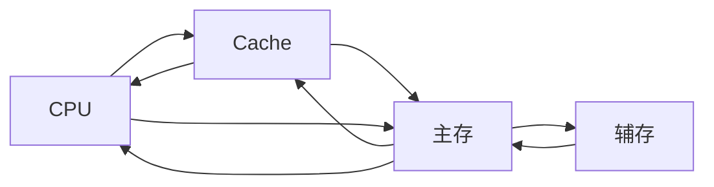

# 存储系统

## 存储系统的基本概念

### 存储器的层次化结构

存储器包含 CPU 中的寄存器、Cachae、主存、辅存。存储器的层次结构，从速度快到速度慢，从容量小到容量大，从价格高到价格低可以划分为：
- 寄存器：CPU 在进行计算时会将变量保存到寄存器中
- Cache：高速缓冲存储器，用于缓冲主存和 CPU 速度不匹配的问题
- 内存：可以直接被 CPU 读写的最大单位，后面的都不可以被 CPU 直接读写。
- 辅存：一般将磁盘称为辅存，包括机械硬盘和固态硬盘
- 外存：光盘、U 盘等，辅存和外存一般看作一个东西，很少区分开

他们的关系一般如下：

### 存储器的分类方式

1. 按层次结构分类：
	1. 
2. 按存储介质分类：
	1. 半导体存储器，以半导体介质存储信息
	2. 磁性表面存储器：以磁性材料存储信息
	3. 光存储器：以光介质存储信息
3. 按存取方式分类：
	1. 随机存储器 (random Access Memory, ROM)：读写任何一个存储单元所需的时间都相同
	2. 顺序存取存储器 (Sequential Access Memory, SAM)：读写一个存储单元所需的时间取决于存储单元所在的物理位置
	3. 直接存取存储器 (Direct Access Memory, DAM)：既有随机存取性也有顺序存储性。先直接选取信息所在的区域，然后按顺序方式存取。
	4. 相联存储器 (Associative Memory)，既可以按内容访问的存储器 (Content Addressed Memory, CAM)，可以按照内容检索到存储位置进行读写。"快表"就是一种相联存储器。
4. 按信息的可更改性：
	1. 读写存储器：既可以读也可以写。
	2. 只读存储器 (Read Only Memory)：只能读，不能写。
5. 按照信息的可保存性：
	1. 断掉后，存储信息消失的存储器：易失性存存储器 (主存，Cache)
	2. 断电后，存储信息依然保持的存储器：非易失性存储器 (磁盘，光盘)
	3. 信息读出后，原存储信息被破坏：破坏性读出
	4. 信息读出后，原存储信息不被破坏：非破坏性读出

### 存储器的性能指标

1. 存储容量：存储字数×存储字长
2. 单位成本：每位价格=总成本/总容量
3. 存储速度：数据传输率=数据的宽度/存储周期 (数据的宽度即存储字长)
	1. 存取时间：存取时间是指从启动一次存储器操作到完成该操作所经历的时间，分为读出时间和写入时间
	2. 存取周期：存取周期又称为读写周期或者访问周期，指存储器进行一次完整的读写操作所需的全部时间，即连续两次独立的访问存储器操作之间所需的最小时间间隔
4. 存取带宽：主存带宽又称为数据传输率，表示每秒从主存进出信息的最大数量，单位为字/秒、字节/秒或者位/秒。

## 主存储器的基本组成

### 基本半导体元件及原理

一个基本存储元有下面的两个部分组成：
1. MOS 管：半导体元件，输入电压到达某个阈值时，MOS 管就可以接通。
2. 电容：使用电容的充电与放电状态表示二进制的 01。

将多个存储元以合理的方式连接，可以构成一个存储体。一般存储一个字节的存储元集合称为一个存储单元。使用译码器可以从多个存储单元中选择一条读出一个字的数据。然后 CPU 可以从数据总线中得到的数据。

为了控制地址的输入，需要一个控制电路来控制译码器的使用与数据的读写。逻辑上可以将一个存储芯片分为下面的几个部分：
1. 片选线：表示该芯片目前是否可用，一般的内存条不止一块存储芯片
2. 地址线：表示需要读取的地址，将会被输入给译码器
3. 数据线：地址线表示的地址所在的数据单元的数据
4. 读写控制线：有时被分为两根线，表示数据的读取与写入
5. 译码驱动：译码器与驱动器电路
6. 存储矩阵：将多个存储元以合理的方式连接得到的存储体
7. 读写电路：控制电路中控制读与写的部分
8. 其他部分：包括供电、接地等功能

![[Pasted image 20231107160806.png]]

根据上面的原理，可以得到一个存储体的总容量的计算方式为：
$$
\tiny 总容量=存储单元个数\times 存储字长
$$
常见的描述 (存储单元×存储字长)：
- $8k\times 8$ 位，即 $2^{13}\times 8bit$
- $8k\times 1$ 位，即 $2^13\times 1bit$
- $64k\times 16$ 位，即 $2^16\times 16bit$

#### 寻址

现在计算机一般是按字节编址的。假设总容量为 $1k$，那么
1. 按字节寻址：$1 k$ 个单元，每个单元 $1B$
2. 按字寻址：$256$ 个单元，每个单元 $4B$
3. 按半字寻址：$512$ 个单元，每个单元 $2B$
4. 按双字寻址：$128$ 个单元，每个单元 $8B$

## SRAM 和 DRAM

RAM 这里指随机存储器。DRAM 与 SRAM 分别指动态 RAM 与静态 RAM。二者的区别为：
1. 存储元不一样 (核心区别)：
	1. 使用栅极电容存储信息：破坏性读出，读写后应该有重写的操作，称为再生。
	2. 使用双稳态触发器存储信息：读出数据，触发器