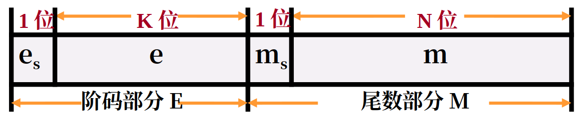

# 数值的表示

## 数值数据的表示

### 进位计数法

进位计数法是我们较为熟悉的数值表示方式。在r进制表示中，有如下的概念：

- 位权：每个符号所在的位置表示权重不同
- 基数：每个数码位所用到的不同符号的个数，r进制的基数为r

一个r进制数可以表示为

$$
\small
\begin{aligned}
    &K_nK_{n-1}\dots K_2K_1K_0K_{-1}K_{-2}\dots K_{-m}\\
    =&K_n\times r^n + K_{n-1}\times r^{n-1} + \cdots + K_2\times r^2 + K_1\times r_1 + K_0 \times r^0 + K_{-1}\times r^{-1} + \cdots + K_{-m}\times r^{-m}
\end{aligned}
$$

将其转换为十进制数可以得到

常用的r进制数有十进制(D)、二进制(B)、十六进制(Q)、八进制数(H)。在C语言中，八进制常数以前缀0开始，十六进制常数以前缀0x开始。在我们的日常表达中，也可以使用下标表示法，例如使用$(100)_2$表示二进制数。

### 计算机中的数值表示与计算

#### 定点数

定点数指小数点固定的数字，一般而言，纯整数的小数点固定在最后一位之后，纯小数的小数点固定在符号位之后。

- 纯整数：
  - 无符号整数：整个机器字长的全部二进制位均表示数值位，相当于数的绝对值。对于字长为$n+1$位的无符号数的表示范围是$0\sim(2^{n+1}-1)$。可以表示的最小的数为全0，可以表示的最大的数为全1。
  - 带符号整数：
    - 原码：第一位为符号位，0/1表示正/负，剩余数位表示真值的绝对值。对于字长为$n+1$位的原码表示的的带符号整数的范围是$-(2^{n}-1)\leqslant x\leqslant 2^n-1$。在原码中，0的表示方式可以是-0也可以是+0。
    - 反码：第一位为符号为，0/1表示正负。原码符号位保持不变，数值位按位取反得到反码。对于字长为$n+1$位的反码表示的带符号整数的范围是$-(2^{n}-1)\leqslant x\leqslant 2^n-1$。
    - 补码：第一位为符号位，0/1表示正负。原码符号位保持不变，数值位按位取反后加1得到补码。对于字长为$n+1$位的补码表示的带符号整数的范围是$-2^n\leqslant x\leqslant 2^n-1$。
      - 原码转补码：正数保持不变，负数从右往左找到第一个1，这个1左边的所有数值位全部按位取反。
    - 移码：在补码的基础上，将符号取反。需要注意的是，移码只能用于表示整数。对于字长为$n+1$位的移码表示的带符号整数的范围是$-2^n\leqslant x\leqslant2^n-1$，移码的表示范围与补码相同。
- 小数
  - 定点小数：定点小数可以使用原码、反码、补码表示，且表示方式与整数相同。定点小数与整数的唯一区别就是各个bit位位权不同，且隐含的小数点的位置不同。

对于三种机器数，它们有以下特性：

1. 对于正数，它们都等于真值本身，而对于负数有着不同的表示。
2. 最高位都表示符号位，补码和反码的符号位可以和数值位一起参与运算，但是原码的符号位必须分开运算。
3. 对于真值0，原码和反码各有两种不同的表示形式，而补码只有唯一一种表示形式。
4. 原码、反码表示的正、负数范围是对称的，但是补码负数能多表示一个最负的数，其中等于$-2^n$纯整数或者$-1$纯小数。

#### 浮点数

在科学计算中，计算机处理的往往是混合数，即既有小数部分又有整数部分的数。为了同时满足数值范围与精度要求，计算机中引入了浮点数的表示方式，让小数点根据需要而浮动，这就是浮点数。浮点数的表示如下：
$$
N = M\times r^E
$$
其中$r$为浮点数阶码的底，与位数的基数相同，通常而言$r=2$，$E$和$M$都是带符号的定点数，$E$称为阶码(Exponent)，$M$称为尾数(Mantissa)。
在大多数计算机中，尾数为纯小数，使用原码或者补码表示，而阶码为纯整数，使用移码或者补码表示。
浮点数的表示范围主要由阶码的位数来决定，有效数字的精度主要由尾数的位数决定。一个浮点数的一般格式如下

##### 规范化浮点数

为了提高运算的精度，需要充分利用位数的有效数位，通常采用浮点数规格化形式，即规定尾数的最高数位必须是一个有效值。换句话说，如同科学计数法一样，在众多的表示中，只有形如$0.1101\times 2^{-11}$是规格化数。

规格化数的尾数$M$的绝对值一定在下面的范围中
$$
\frac{1}{r} \leqslant |M|\leqslant 1
$$
由于规格化的这个限制，规格化的最小正数小于非规格化的最小正数。当运算结果大于最大正数时，称为正上溢，小于绝对值最大负数的称为负上溢，正上溢和负上溢统称为上溢，数据一旦产生上溢，计算机必须终止操作，进行溢出处理。
当计算结果在0至规格化最小正数之间称为正下溢，在0至规格话最大负数之间称为负下溢。正下溢和负下溢统称为下溢，数据一旦出现下溢，计算机只需要将其转换为机器0即可。

同时，只要浮点数的尾数为0，不论阶码为何值，一般就当做机器零处理。为了保证浮点数形式的唯一性，机器零的标准形式规定为位数为0，界面为最小值（绝对值最大的负数）。

##### 浮点数的移码表示法

浮点数的阶码是带符号的定点整数，理论上可以使用之前的任何方法表示，但是为了计算方便，在多数计算机中使用移码表示法来表示浮点数。使用移码表示浮点数的阶码有以下几种好处：

1. 便于表示浮点数的大小。阶码大的，其对应的真值就大；阶码小的，其对应的真值就小。
2. 简化机器中的判零电路。

## 数值的运算

运算器是计算机进行算术运算和逻辑运算的主要部件，运算器的逻辑结构取决于机器的指令系统、数据表示方法和运算方法等。下面讨论数值数据在计算机中实现算术运算和逻辑运算的方法，以及运算部件的基本结构和工作原理。

### 加法器

加法器由全加器再配以其他必要的逻辑电路组成。

1. 全加器（FA）：全加器是最基本的加法单元，有三个输入：操作数 $A$ 和 $B$，低位传来的进位 $C_{i-1}$，两个输出量：本位和 $S_i$ 与向高位的进位 $C_i$。
2. 串行加法器：串行加法器中，只有一个全加器，数据逐位串行送入加法器中进行运算。串行加法器具有器件少，成本低的优点，但是运算速度太慢，因此除了某些低速的专用运算器以外很少使用。
3. 并行加法器：由多个全加器组成，其位数的多少取决于机器的字长，数据的各个位同时进行运算。并行加法器可以同时对数据的各个位数相加，但是存在一个加法的最长运算时间的问题。即最低位的进位将会逐位的影响高位的运算，因此并行加法器的最长运算时间主要是由进位是信号的传递时间决定的。**提高并行加法器速度的关键是尽量的加快进位的产生和传递的速度**。

下面介绍并行加法器的快速进位方法。