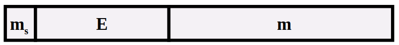
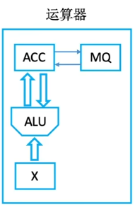
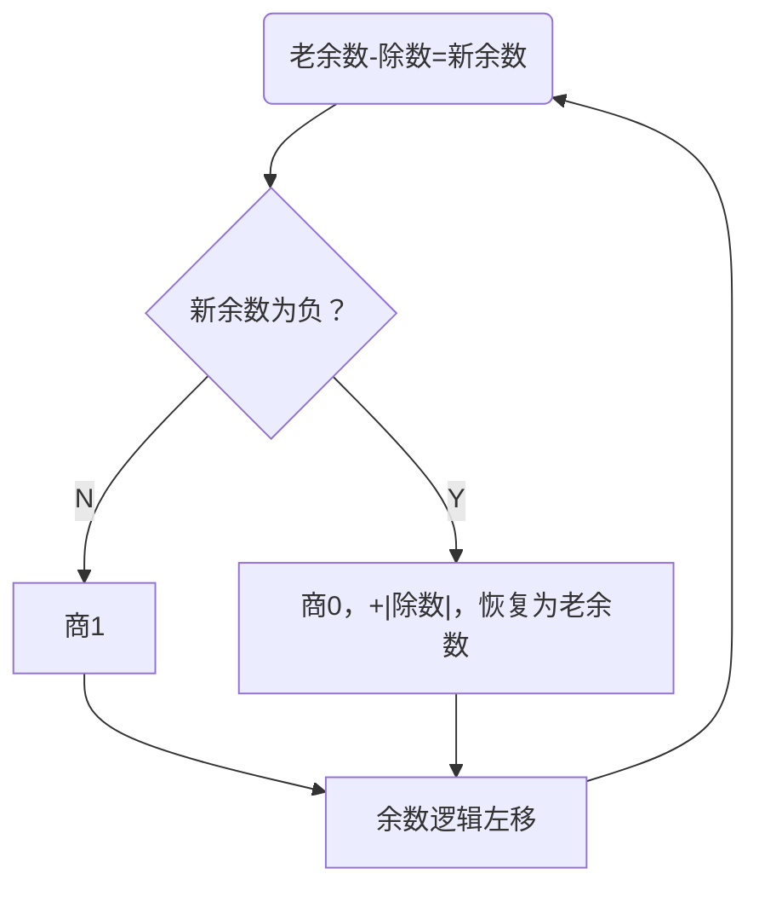
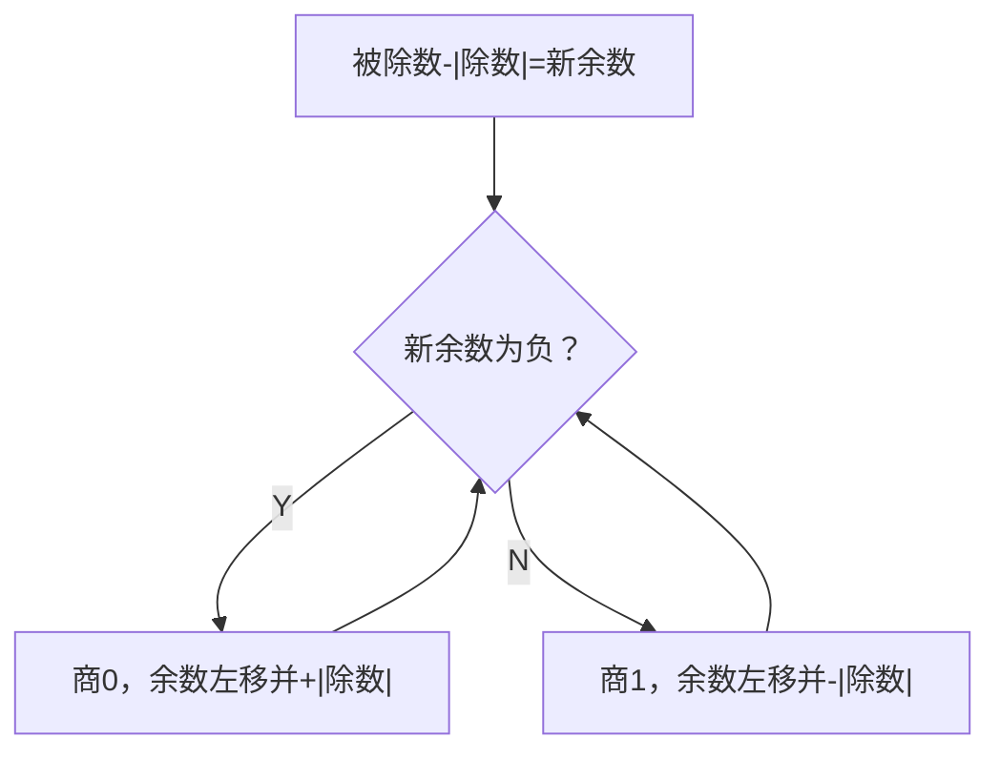
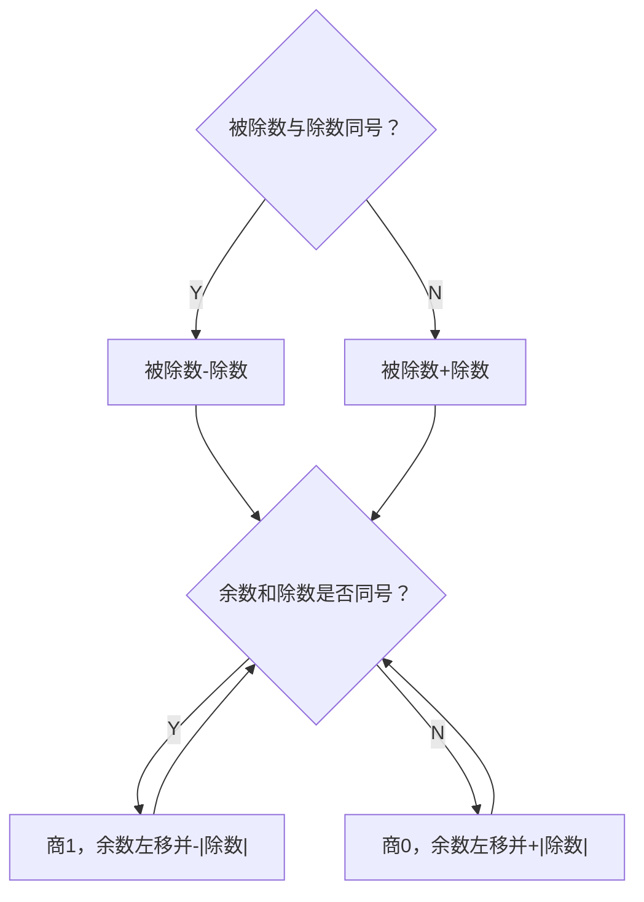

---
tag:
  - 计算机组成原理
---

# 数据的表示和运算

## 数值数据的表示

### 进位计数法

进位计数法是我们较为熟悉的数值表示方式。在r进制表示中，有如下的概念：

- 位权：每个符号所在的位置表示权重不同
- 基数：每个数码位所用到的不同符号的个数，r进制的基数为r

一个r进制数可以表示为

$$
\small
\begin{aligned}
    &K_nK_{n-1}\dots K_2K_1K_0K_{-1}K_{-2}\dots K_{-m}\\
    =&K_n\times r^n + K_{n-1}\times r^{n-1} + \cdots + K_2\times r^2 + K_1\times r_1 + K_0 \times r^0 + K_{-1}\times r^{-1} + \cdots + K_{-m}\times r^{-m}
\end{aligned}
$$

将其转换为十进制数可以得到

常用的r进制数有十进制(D)、二进制(B)、十六进制(Q)、八进制数(H)。在C语言中，八进制常数以前缀0开始，十六进制常数以前缀0x开始。在我们的日常表达中，也可以使用下标表示法，例如使用$(100)_2$表示二进制数。

### 计算机中的数值表示与计算

#### 定点数

定点数指小数点固定的数字，一般而言，纯整数的小数点固定在最后一位之后，纯小数的小数点固定在符号位之后。

- 纯整数：
  - 无符号整数：整个机器字长的全部二进制位均表示数值位，相当于数的绝对值。对于字长为$n+1$位的无符号数的表示范围是$0\sim(2^{n+1}-1)$。可以表示的最小的数为全0，可以表示的最大的数为全1。
  - 带符号整数：
    - 原码：第一位为符号位，0/1表示正/负，剩余数位表示真值的绝对值。对于字长为$n+1$位的原码表示的的带符号整数的范围是$-(2^{n}-1)\leqslant x\leqslant 2^n-1$。在原码中，0的表示方式可以是-0也可以是+0。
    - 反码：第一位为符号为，0/1表示正负。原码符号位保持不变，数值位按位取反得到反码。对于字长为$n+1$位的反码表示的带符号整数的范围是$-(2^{n}-1)\leqslant x\leqslant 2^n-1$。
    - 补码：第一位为符号位，0/1表示正负。原码符号位保持不变，数值位按位取反后加1得到补码。对于字长为$n+1$位的补码表示的带符号整数的范围是$-2^n\leqslant x\leqslant 2^n-1$。
      - 原码转补码：正数保持不变，负数从右往左找到第一个1，这个1左边的所有数值位全部按位取反。
    - 移码：在补码的基础上，将符号取反。需要注意的是，移码只能用于表示整数。对于字长为$n+1$位的移码表示的带符号整数的范围是$-2^n\leqslant x\leqslant2^n-1$，移码的表示范围与补码相同。
- 小数
  - 定点小数：定点小数可以使用原码、反码、补码表示，且表示方式与整数相同。定点小数与整数的唯一区别就是各个bit位位权不同，且隐含的小数点的位置不同。

对于三种机器数，它们有以下特性：

1. 对于正数，它们都等于真值本身，而对于负数有着不同的表示。
2. 最高位都表示符号位，补码和反码的符号位可以和数值位一起参与运算，但是原码的符号位必须分开运算。
3. 对于真值0，原码和反码各有两种不同的表示形式，而补码只有唯一一种表示形式。
4. 原码、反码表示的正、负数范围是对称的，但是补码负数能多表示一个最负的数，其中等于$-2^n$纯整数或者$-1$纯小数。

#### 浮点数

在科学计算中，计算机处理的往往是混合数，即既有小数部分又有整数部分的数。为了同时满足数值范围与精度要求，计算机中引入了浮点数的表示方式，让小数点根据需要而浮动，这就是浮点数。浮点数的表示如下：
$$
N = M\times r^E
$$
其中$r$为浮点数阶码的底，与位数的基数相同，通常而言$r=2$，$E$和$M$都是带符号的定点数，$E$称为阶码(Exponent)，$M$称为尾数(Mantissa)。
在大多数计算机中，尾数为纯小数，使用原码或者补码表示，而阶码为纯整数，使用移码或者补码表示。
浮点数的表示范围主要由阶码的位数来决定，有效数字的精度主要由尾数的位数决定。一个浮点数的一般格式如下
![[float.png]]

##### 规范化浮点数

为了提高运算的精度，需要充分利用位数的有效数位，通常采用浮点数规格化形式，即规定尾数的最高数位必须是一个有效值。换句话说，如同科学计数法一样，在众多的表示中，只有形如$0.1101\times 2^{-11}$是规格化数。

规格化数的尾数$M$的绝对值一定在下面的范围中
$$
\frac{1}{r} \leqslant |M|\leqslant 1
$$
由于规格化的这个限制，规格化的最小正数小于非规格化的最小正数。当运算结果大于最大正数时，称为正上溢，小于绝对值最大负数的称为负上溢，正上溢和负上溢统称为上溢，数据一旦产生上溢，计算机必须终止操作，进行溢出处理。
当计算结果在0至规格化最小正数之间称为正下溢，在0至规格话最大负数之间称为负下溢。正下溢和负下溢统称为下溢，数据一旦出现下溢，计算机只需要将其转换为机器0即可。

同时，只要浮点数的尾数为0，不论阶码为何值，一般就当做机器零处理。为了保证浮点数形式的唯一性，机器零的标准形式规定为位数为0，界面为最小值（绝对值最大的负数）。

##### 浮点数的移码表示法

浮点数的阶码是带符号的定点整数，理论上可以使用之前的任何方法表示，但是为了计算方便，在多数计算机中使用移码表示法来表示浮点数。使用移码表示浮点数的阶码有以下几种好处：

1. 便于表示浮点数的大小。阶码大的，其对应的真值就大；阶码小的，其对应的真值就小。
2. 简化机器中的判零电路。

##### IEEE 标准浮点数

在目前常用的$80\times 86$系列微型计算机中，通常设有支持浮点运算的部件。这些机器中的浮点数采用IEEE 754标准，其表示方式与前的有一些区别，其表示如下：

其中$m_s$为数符，$E$为阶码，采用移码表示，$m$为尾数数值，数符与尾数数值组成了尾数，采用原码表示。在IEEE标准中定义了三种浮点数：

|类型|数符|阶码|尾数数值|总位数|偏置值|
|:---:|:---:|:---:|:---:|:---:|:---:|
|短浮点数|1|8|23|32|127|
|长浮点数|1|11|52|64|1023|
|临时浮点数|1|15|64|80|16383|

其中短浮点数又称为单精度浮点数，长浮点数又称为双精度浮点数，临时浮点数又称为拓展精度浮点数。

## 数值的运算

运算器是计算机进行算术运算和逻辑运算的主要部件，运算器的逻辑结构取决于机器的指令系统、数据表示方法和运算方法等。下面讨论数值数据在计算机中实现算术运算和逻辑运算的方法，以及运算部件的基本结构和工作原理。

在大多数计算机中，通常只设置加法器而不设置减法器，因此这里先介绍计算机中加法器的设计。

### 加法器

加法器由全加器再配以其他必要的逻辑电路组成。

1. 全加器（FA）：全加器是最基本的加法单元，有三个输入：操作数 $A$ 和 $B$，低位传来的进位 $C_{i-1}$，两个输出量：本位和 $S_i$ 与向高位的进位 $C_i$。
2. 串行加法器：串行加法器中，只有一个全加器，数据逐位串行送入加法器中进行运算。串行加法器具有器件少，成本低的优点，但是运算速度太慢，因此除了某些低速的专用运算器以外很少使用。
3. 并行加法器：由多个全加器组成，其位数的多少取决于机器的字长，数据的各个位同时进行运算。并行加法器可以同时对数据的各个位数相加，但是存在一个加法的最长运算时间的问题。即最低位的进位将会逐位的影响高位的运算，因此并行加法器的最长运算时间主要是由进位是信号的传递时间决定的。**提高并行加法器速度的关键是尽量的加快进位的产生和传递的速度**。

在现实中，我们主要使用的是并行加法器。为了满足计算机的需要，就必须研究快速的并行加法器。

#### 并行加法器的快速进位

显然，使用串行进位方式的进位延迟时间太长了。需要提高并行加法器的运算速度，就必须改变进位方式。

**并行进位**又称为先行进位、同时进位，特点为各级的进位同时进行。实际上，我们可以直接通过输入计算出每一个的进位，根据
$$
\begin{aligned}
C_1&=G_1+P_1C_0\\
C_2&=G_2+P_2C_1=G_2+P_2G_1+P_2P_1C_0\\
C_3&=G_2+P_3C_2=G_3+P_3G_2+P_3P_2G_1+P_3P_2P_1G_0\\
\vdots
\end{aligned}
$$

根据上面的推导，我们可以直接计算每一位的进位，但是随着加法器位数的增加，输入变量会变得原来越复杂，这会使电路的结构变得越来越复杂。因此，完全使用并行进位是不现实的。

实际上通常采用**分组并行进位**方式。这种进位方式把 $n$ 位字长分为若干个小组，在小组内各位间使用并行快速进位，在组间即可使用串行进位方式，也可以再使用并行进位方式。由此又分为两种分组并行进位方式：

1. 单级先行进位方式（组内并行、组间串行）
2. 多级线性进位方式（组内并行、组间并行）

### 定点加减运算

定点数的加减运算包括原码、补码和反码三种带符号数的加减运算，其中补码加减运算实现起来最方便。

#### 原码加减运算

原码中，符号位不能直接参与运算。原码的加减运算规则如下：

1. 参加运算的操作数取其绝对值。
2. 若做加法运算，则两数直接相加；若做减法运算，则将减数先变一次补，再进行加法。
3. 运算之后，可能有两种情况：
   - 有进位，结果为正，即得到正确的结果
   - 无进位，结果为负，应当再变一次补，才能得到正确的结果
4. 结果加上符号位。

实际上，我们在进行原码的加减运算时，一般是转换为补码进行的。

> 变补运算：将所有的二进制数各位取反后最低位加 1。需要注意的是，与原码变为补码不同，变补运算需要将符号位也取反，原码变为补码时，不需要将符号位取反。

#### 补码加减运算

补码加减运算要比原码加减运算简单得多。

- 补码加法：两个补码表示的数相加，符号位参与运算，即
$$
[X+Y]_{补}=[X]_补+[Y]_补
$$
- 补码减法：可以借用加法器来实现补码的减法运算，根据补码的加法公式可以得到减法公式为
$$
[X-Y]_补 = [X + (-Y)]_补 = [X]_补 + [-Y]_补
$$
其中
$$
[-Y]_补=[[Y]_{补}]_{变补}
$$

于是可以得到补码的运算规则：

1. 参与运算的两个操作数均使用补码表示
2. 符号位作为数的一部分参与运算
3. 若做加法运算，则两数直接相加；若做减法运算，则将被减数与减数的机器负数相加
4. 运算结果仍用补码表示

此外，当两个位数不同的定点数进行计算时，我们需要将位数少的拓展，方法较为简单，即在符号位之后填充附加位，正数使用 0 填充，负数使用 1 填充。

#### 补码的溢出判断与检测方法

在补码加减运算中，有时会因为两数相加之和的数值超过了机器允许的表示范围，使得进位加到了符号位上，此时就产生了溢出。对于两个数 $X$ 和 $Y$，做加法运算：

- $X$ 与 $Y$ 异号，不会溢出
- $X$ 与 $Y$ 同号，运算结果为正且大于所能表示的最大正数，或者运算结果为负且小于所能表示的最小负数时，产生溢出。这两种溢出方式分别称为正溢和负溢。

要检测这种溢出，有三种方式。设被操作数为 $[X]_补=X_sX_1X_2\cdots X_n$，操作数为 $[Y]_补=Y_sY_1Y_2\cdots Y_n$，结果为 $[S]_补=S_sS_1S_2\cdots S_n$。

- 硬件检测法：采用一个符号位检测溢出时，可以使用下面的式子判断溢出
$$
溢出=\bar X_s\bar Y_s S_n +X_s Y_s \bar S_n
$$
- 硬件检测法：采用进位为：当两数运算时，产生的进位为 $C_sC_1C_2\cdot C_n$，其中 $C_s$ 表示符号位产生的进位，$C_1$ 为最高数值位产生的进位。于是溢出条件为
$$
溢出=\bar C_sC_1 +C_s\bar C_1 = C_s\oplus C_1
$$
- 采用变形补码（双符号位补码）：一个符号位只能表示正负两种情况，当产生溢出是，符号位的含义就会发生混乱，如果将符号位扩充至两位，其所能表示的信息量将随之增大。在双符号位的情况下，把左边的符号位 $S_{s1}$ 称为真符，因为它代表了该书真正的符号，两个符号位都作为数的一部分进行运算。这种编码方式又称为变形补码，在这种情况下，每个组合都有确切的含义：
  - $S_{s1}S_{s2}=00$，结果为正数，无溢出
  - $S_{s1}S_{s2}=01$，结果正溢
  - $S_{s1}S_{s2}=10$，结果负溢
  - $S_{s1}S_{s2}=11$，结果为负数，无溢出

采用变形补码时，如果两个符号位不一致，就说明产生了溢出，溢出条件为
$$
溢出=S_{s1}\oplus S_{s2}
$$
为了尽可能的减小代价，在采用双符号位方案时，操作数和结果在寄存器和主存中仍然使用单符号位，仅在参与运算时扩充为双符号位。

### 移位运算

在计算机中，实现乘除法的方案通常有以下3种：

- 软件实现：使用乘法和除法子程序实现。
- 在原有实现加减运算器的基础上增加一些逻辑线路，使乘除运算变换成加减运算来实现移位操作。在机器中设有乘除命令。
- 设置专用的乘、除法器，机器中设有相应的乘除指令。

但是不管使用什么方案实现乘除法，基本原理都是相同的。如果采用方案二，必然会使用到移位操作。下面介绍移位操作的实现。

#### 带符号数的移位操作

算术移位时应当保持数的符号位不变，而数值的大小则要发生变化。左移一位相当于该数乘以2，而右移一位相当于该数除以2。

- 原码的移位规则：不论正数还是负数，在往左移或者往右移时，符号位不变，空出的以0填补。
- 补码的移位规则：
  - 正数：符号位不变，无论左移还是右移，空出位以0填补。
  - 负数：符号位不变，左移后空出位补0，右移后空出位补1。

### 定点乘法运算

#### 原码一位乘法运算

原码一位乘法是从手算演变而来，即两个操作数的绝对值相乘，乘积的符号为两个操作数符号值的异或。根据手算乘法的原理，可以将乘法概括为移位与相加两种操作，具体如下：

1. 参与运算的操作数取绝对值
2. 令乘数的最低位为判断位，若为1，加被加数，若为0，什么都不做
3. 累加后的部分积以及乘数右移一位
4. 重复n次2和3
5. 符号位单独处理，使用异或运算，同号为正，异号为负

在计算机中，通常实现乘法使用的原件为下面的几个：

计算过程如下：

- 开始时，寄存器$X$储存乘数，寄存器$MQ$储存被乘数，寄存器$ACC$存放结果，初始化为0。
- 在计算时，每次都使用$MQ$中的最低位进行判断，如果为1，则将$X$中的内容与$ACC$中内容相加存入$ACC$中；如果为0，则不做任何操作。
- 将$ACC$与$MQ$中的内容右移一位，重复上一步直到遇到符号位，即重复$n$次，$n$为操作位数。
- 将符号位进行异或操作，运算结果即$ACC$与$MQ$中除了最后一位的内容。

#### 补码一位乘法

虽然原码比补码乘法容易实现，但因为补码加减法简单，在以加减运算为主的通用机器中操作数都以补码表示，因此这类计算机在做乘法时使用补码乘法。

##### 校正法

补码乘法不能简单的套用原码乘法的算法，因为补码的符号位是参与运的。校正法是将$[X]_补$与$[Y]_补$按照原码的规则运算，所得结果根据情况再加以校正，从而得到正确的$[X\times Y]_补$。具体来说，其运算规则为

1. 乘数$Y>0$时，不管被乘数$X$的正负都直接按照原码乘法运算，只是移位时按照补码规则进行。
2. 当乘数$Y<0$时，可以先把$[Y]_补$的符号位丢掉不管，仍按照原码乘法运算，最后再加上$[-X]_补$进行校正。

将上面两种算法综合起来，可以得到一位补码乘法的统一表达式
$$
[X\times Y]_补=[X]_补\times (0.Y_1Y_2\cdots Y_n) + [-X]_补\times Y_s
$$

##### 比较法——Booth乘法

Booth乘法是一个对于正数与负数都一致的算法，由英国的Booth夫妇提出来的，因此被称为Booth法。Booth乘法的规则如下：

1. 参与运算的数用补码表示。
2. 符号位参与运算
3. 乘数的最低位后面增加一位附加位$Y_{n+1}$，其初值为0。
4. 由于每求一次部分积要右移一位，所以乘数的最低两位$Y_n$、$Y_{n+1}$的值决定了每次执行的操作。操作如下：

| 判断位 |            操作             | 判断位 |             操作             |
|:------:|:---------------------------:|:------:|:----------------------------:|
|  0 0   |   原部分积$+0$，右移一位    |  1 0   | 原部分积$+[-X]_补$，右移一位 |
|  0 1   | 原部分积$+[X]_补$，右移一位 |  1 1   |    原部分积$+0$，右移一位    |

换句话说，可以使用下面的方法判断：
- 最后一位-倒数第二位 = 1时，乘数加上$[X]_补$
- 最后一位-倒数第二位 = 0时，什么都不做
- 最后一位-倒数第二位 = -1时，乘数加上$[-X]_补$

5. 移位按补码右移规则进行
6. 共需做$n+1$次累加，$n$次位移，第$n+1$次不移位。

### 定点除法运算

除法是乘法的逆运算，与乘法运算的处理思想相似，可以将$n$位除转换为若干次"减法-移位"。

#### 原码除法运算

##### 恢复余数法

根据手算除法原理，计算每一位的商都是通过判断当前余数与除数的大小来判断的。但是由于计算机不能直接判断除数与被除数的大小关系，所以恢复余数法中，每次都假定商为一，然后判断结果的正负来得到正确的结果，如果为正，则结果正确；如果为负，则在此加上除数得到的正确的结果。恢复余数法的步骤如下：

恢复余数法符合人类的思考逻辑，但是在实际中因为每次运算都可能额外进行一次加法，所以在实际使用中运算速度较低，使用较少。

##### 不恢复余数法

不恢复余数法是优化自恢复余数法，又称为加减交替法。其做法是在恢复余数法中，若余数为负，可以直接商$0$，并让余数左移$1$位再加上除数得到结果。这样做的好处是可以直接通过判断余数的正负来直接判断下一位。此外，在最后一步中，若得到的余数的负，则需要恢复余数来得到正确的结果。

加/减$n+1$次，每次加减确定一位商，左移$n$次(最后一次加减完不位移)，最终可能还要多一次加。符号位不参与运算，符号位需要通过异或运算来判断。

#### 补码除法运算

补码运算也通过加减交替法来实现，但是符号位参与运算，且使用双符号位。与原码的加减交替法加以区别，其过程为：

加减$n+1$次，每一次加减确定一位商。对于最后一位，规定恒置为1。这种方法简单，易于实现。由于符号位参与运算，因此不需要使用异或门来处理符号。

### 规格化浮点数运算

浮点数的加减运算可以使用前述的几种定点数计算方法实现，设两个非零的规范化浮点数分别为：
$$
\begin{cases}
A=M_A\times 2^{E_A}\\
B=M_B\times 2^{E_B}
\end{cases}
$$

浮点数加减运算步骤：

1. 对阶：将阶数小的浮点数与阶数大的浮点数对齐。
2. 尾数加减：对阶后，可以直接将尾数进行加减法。
3. 尾数结果规格化：尾数加减后得到的可能不是规格化数，为了增加有效数字的位数，提高运算精度，必须进行结果规格化操作。
4. 舍入：由于受到硬件的限制，在对阶和右规处理后，可以将尾数的低位丢失，这会引起一些误差。舍入有多种方法：
   1. 恒舍法：无条件丢掉正常位数最低位之后的全部数值

5. 判断溢出：规定阶码不能超过$n$位，若运算后阶码超过范围$n$，则溢出。

浮点数乘除运算步骤：

1. 阶码相加：
   - 补码：阶码相加后无需矫正
   - 移码：阶码相加后需要减去一个偏执值$2^n$
   阶码可能产生溢出，因此需要进行溢出判断。
2. 尾数相加：若$M_A$和$M_B$都不为0，则可以进行尾数乘法，与前述定点数乘法运算相同。
3. 尾数结果规范化：结果浮点数规范化

浮点数除法运算步骤：

1. 尾数调整：保证商的尾数是一个定点小数，首先检测$|M_A|<|M_B|$，如果不小于，则$M_A$右移一位，$E_A+1\to E_A$，称为尾数调整。因为$A$与$B$均为规格化数，因此最多调整一次。
2. 阶码相减：
   - 补码表示：阶码相减后无需校正。
   - 移码表示：阶码相减后加上一个偏置值$2^n$。
   阶码相减后可能出现溢出现象，需要进行处理。
3. 尾数相除：若$M_A$与$M_B$都不为0，则可以进行尾数除法。尾数除法与前述的定点数除法相同。同时由于开始时进行了尾数调整，因此运算结果一定落在规格化范围内。

#### 强制类型转换

由于各种数表示的范围不同，编码方式不同，因此不同的数值类型进行运算前需要进行强制类型转换。在c语言中，强制类型转换的方向为

- char -> int -> long -> double
- float -> double

这是按照表示范围从小到大的顺序进行的强制类型转换。如果反过来，就可以能会因为范围问题导致溢出。特别的，int->double会由于表示方式的问题导致精度丢失。而double->int不仅会存在精度丢失的风险，也存在溢出的风险。

## 运算器的基本组成

运算器是在控制器的控制下实现其功能的。运算器不仅可以完成数据信息的算术逻辑运算，还可以作为数据信息的传送通路。

基本的运算器包含以下几个部分：

- ALU：实现基本算术、逻辑功能
- 寄存器组：提供操作数与暂存结果
- 有关的判别逻辑和控制电路

运算器的内部总线大体上有3中结构形式：

1. 单总线结构运算器：实现一次双操作数的运算需要分成3步，操作速度慢
2. 双总线结构运算器：两个操作可以分别通过两条总线同时交给ALU进行运算，并且可以立即得到运算的结果，但是ALU的输出不能直接送到总线上，因为总线被操作数所占据。因此需要先将运算结果送入缓冲器中，下一步再送至目的寄存器。
3. 三总线结构运算器：ALU与第三个总线相连，计算结果可以直接送入目标寄存器。这种结构操作速度最快，但是控制较前两种复杂。
