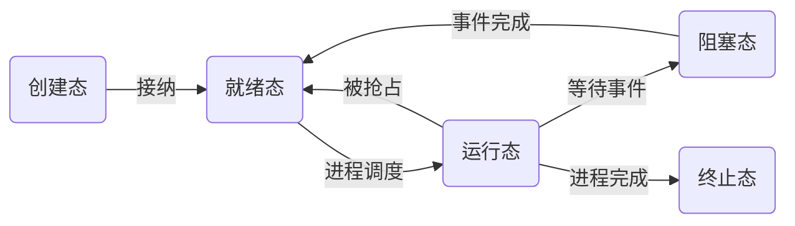

# 进程管理

## 进程的概念与引入

## 进程的描述

### 进程控制块

### 进程的状态

进程在生命周期内一直处于一个状态不断变化的过程中。为了刻画这种变化过程，操作系统将进程分为了若干状态，使用状态机来表述。这些状态信息记录在进程的 PCB 结构中。

### 进程的组织

为了便于进程的管理，通常对系统中的进程采用两种组织方式。
- 线性表组织方式：把所有进程的 PCB 存放在一个数组中，系统通过数组下标访问每一个 PCB。系统根据进程的状态，建立了多张索引表，并把索引表的内存首地址记录在内存中的一些专用单元中以完成索引。
- 链表组织方式：把具有相同状态的 PCB 组织成一个队列。
	- 处理就绪态的进程可按照某种策略排成多个就绪队列。
	- 处于阻塞态的进程又可以根据阻塞的原因组织成多个阻塞队列。

在单 CPU 系统中，任何时间都只有一个进程处于运行状态，因此系统专门设定了一个指针指向当前运行进程的 PCB。

## 进程控制

进程控制：是指系统使用一些具有特定功能的程序段来创建、撤销进程，以及完成进程各状态之间的转换。进程控制是由操作系统内核实现的，属于原语一级操作，不能被中断。

### 创建原语

系统一般通过下面的步骤创建进程
1. 扫描进程表，找到一个空闲的 PCB。
2. 为新进程的程序、数据、用户栈分配内存。
3. 初始化 PCB。把调用者提供的参数（进程名、进程优先级、实体所在主存的起始地址、所需的资源清单、记账信息及进程家族关系等）填入 PCB 中。
4. 将新的进程插入就绪队列。

### 撤销原语

如果一个进程已经完成任务或者由于故障不能继续运行时，应当被撤离系统而消亡。撤销原语的功能是在 PCB 集合中寻找要撤销的进程，若有子孙进程，也需要终止，以防称为不可控的；将其全部资源或者归还其父进程或者归还系统。撤销其 PCB。

### 阻塞原语

处于运行状态的进程，在其运行过程中期待某一事件发生，将会自己执行阻塞原语，由运行态变为阻塞态。（如等待键盘输入、等待磁盘数据传输完成）

阻塞原语的功能是中断 CPU，将其运行现场保存在其 PCB 中，置状态为阻塞态，插入相应事件的阻塞队列中。之后，由处理机调度，重选一个进程投入运行。

### 唤醒原语

 当某进程等待的事件为 I/O 事件完成时，I/O 处理完成后，CPU 响应中断，在中断处理中，将等待 I/O 完成而阻塞的进程唤醒，并置于就绪态。

另一种情况，若等待的事件是某一进程发出信息，由发送进程将等待者唤醒，置为就绪态，并插入就绪队列。

### 挂起原语

- 在实时系统中，根据实时现场的需要，会将正在执行或者没有执行的进程挂起一段时间。被挂起的进程由活动状态转换为静止状态。
- 在分时系统中，将进程从内存换到外存中，进程就处于了进制状态，不被调度。

### 解挂原因

## 处理机调度

无论是多道批处理系统还是多用户分时系统，系统中的用户进程数都远远超过了处理机数。这么多的进程竞争处理机，就要求系统采用一些策略将处理机动态的分配给系统中的各个就绪进程。